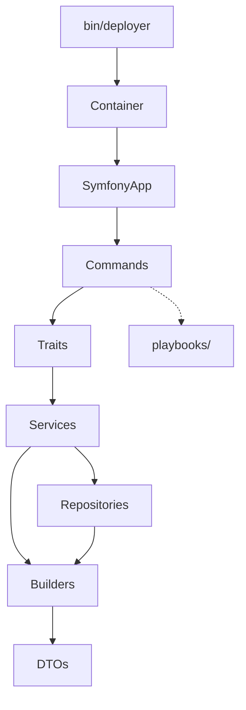
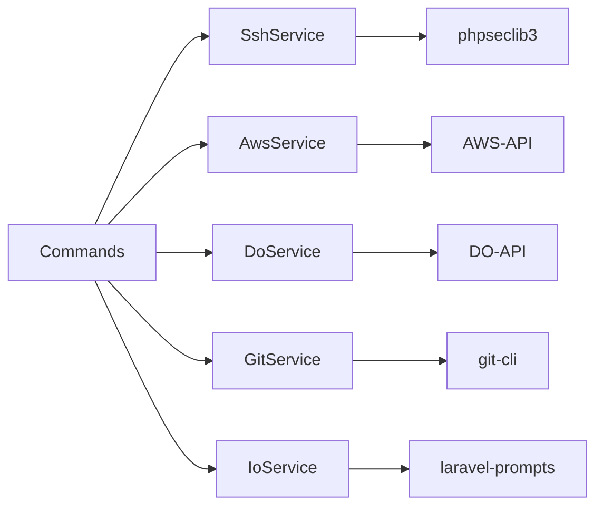

# DeployerPHP

We're building DeployerPHP, a set of command-line interface (CLI) tools for provisioning, installing, and deploying servers and sites in PHP. It's an open-source alternative to services like Laravel Forge and Ploi. These tools are bundled as a Composer package built on Symfony Console. The name of the Composer package is `loadinglucian/deployer-php`.

> **IMPORTANT**
>
> - All object creation goes through `Container` (except DTOs/Builders)
> - DTOs are ALWAYS created via Builders, never directly with `new *DTO()`
> - Services throw complete, user-facing exceptions; Commands display them without prefixes

## Context

### Architecture



```text
app/
├── Builders/          # DTO factory classes (centralized instantiation)
├── Console/           # Commands
│   ├── Nginx/         # Nginx web server control
│   ├── Cron/          # Cron job management
│   ├── Mariadb/       # MariaDB service control
│   ├── Memcached/     # Memcached service control
│   ├── Cloud/         # Cloud provider integrations
│   │   ├── Aws/       # AWS EC2 + Route53 integration
│   │   ├── Cf/        # Cloudflare DNS integration
│   │   └── Do/        # DigitalOcean integration
│   ├── Mysql/         # MySQL service control
│   ├── Php/           # PHP-FPM service control
│   ├── Postgresql/    # PostgreSQL service control
│   ├── Redis/         # Redis service control
│   ├── Scaffold/      # Project scaffolding generators
│   ├── Server/        # Server management
│   ├── Site/          # Site management
│   ├── Supervisor/    # Process management
│   └── Valkey/        # Valkey service control
├── Services/          # Business logic
│   ├── Aws/           # AWS API wrapper
│   └── Do/            # DigitalOcean API wrapper
├── Repositories/      # Inventory access
├── DTOs/              # Readonly data objects
├── Traits/            # Shared command behavior
├── Contracts/         # BaseCommand
├── Enums/             # Distribution enums
├── Exceptions/        # Custom exceptions
├── Docs/              # Documentation website
│   ├── DocsController.php     # Request handling, template rendering
│   ├── MarkdownParser.php     # Markdown → HTML with GFM, callouts
│   ├── NavigationBuilder.php  # Sidebar nav from README TOC
│   └── TocExtractor.php       # "On This Page" heading extraction
├── Container.php      # DI auto-wiring
└── SymfonyApp.php     # CLI registration
playbooks/             # Remote bash scripts
public/                # Documentation website (self-contained)
├── index.php          # Router and entry point
└── css/
    └── app.css        # Prose, callouts, dark mode styles
```

| Layer        | Purpose                         | I/O         |
| ------------ | ------------------------------- | ----------- |
| Commands     | Orchestrate user interaction    | Yes         |
| Traits       | Shared command operations       | Via Command |
| Services     | Business logic, external APIs   | No          |
| Repositories | Inventory CRUD                  | No          |
| Builders     | Centralized DTO instantiation   | No          |
| DTOs         | Immutable readonly data objects | No          |
| playbooks/   | Remote server provisioning      | Via SSH     |
| Docs/        | Documentation website rendering | Yes (HTTP)  |

**Key Classes:**

- `Container` - DI auto-wiring via reflection
- `SymfonyApp` - Command registration, CLI entry
- `BaseCommand` - Command infrastructure (injected services)
- `*Builder` - Centralized DTO creation (`SiteBuilder`, `ServerBuilder`, etc.)
- `*DTO` - Immutable data objects (`SiteDTO`, `ServerDTO`, etc.)
- `*Repository` - Inventory access (`ServerRepository`, `SiteRepository`)

**Command Domains:**

- Cloud (17): aws:dns:_, aws:key:_, aws:provision, cf:dns:_, do:dns:_, do:key:\*, do:provision
- Cron (3): create, delete, sync
- Mariadb (4): install, restart, start, stop
- Memcached (4): install, restart, start, stop
- Mysql (4): install, restart, start, stop
- Nginx (3): restart, start, stop
- Php (3): restart, start, stop
- Postgresql (4): install, restart, start, stop
- Redis (4): install, restart, start, stop
- Scaffold (4): ai, crons, hooks, supervisors
- Server (8): add, delete, firewall, info, install, logs, run, ssh
- Site (8): create, delete, deploy, https, rollback, shared:pull, shared:push, ssh
- Supervisor (6): create, delete, restart, start, stop, sync
- Valkey (4): install, restart, start, stop

**External Integrations:**



**Docs Website:**

Self-contained documentation site that parses `README.md` and `docs/*.md` files. Run locally with `php -S localhost:8000 -t public/`. Built with league/commonmark for Markdown parsing, Tailwind CSS (CDN) for styling, Alpine.js for interactivity, and Prism.js for syntax highlighting. Supports dark mode, responsive layout, and GitHub-style callouts (`[!NOTE]`, `[!TIP]`, etc.).

### Maintain

Keep architecture updated when making changes.

## Examples

### Example: DI Production

```php
// Production - use container for all object creation except DTOs/Builders
$service = $this->container->build(MyService::class);
```

### Example: DI Testing

```php
// Tests - container supports bind() for mocks
$container = new Container();
$container->bind(SshService::class, $mockSSH);
$command = $container->build(ServerAddCommand::class);
```

### Example: Exception Service

```php
// Service - complete message with context
throw new \RuntimeException("SSH key does not exist: {$privateKeyPath}");
throw new \RuntimeException("Server '{$name}' already exists");

// Preserve exception chain when wrapping
} catch (\Throwable $e) {
    throw new \RuntimeException(
        "SSH authentication failed for {$username}@{$host}. Check username and key permissions",
        previous: $e
    );
}
```

### Example: Exception Command

```php
// Command - display directly, no prefix
try {
    $this->servers->create($server);
} catch (\RuntimeException $e) {
    $this->nay($e->getMessage());  // Already complete
    return Command::FAILURE;
}
```

### Example: Exception Wrong

```php
// WRONG - redundant prefix
$this->nay('Failed to add server: ' . $e->getMessage());
```

### Example: Builder Fresh Creation

```php
// Create new DTO - only specify needed fields, others use defaults
$site = SiteBuilder::new()
    ->domain($domain)
    ->server($server->name)
    ->phpVersion($phpVersion)
    ->build();
```

### Example: Builder Copy-Modify

```php
// Copy existing DTO, change specific fields - other fields preserved automatically
$site = SiteBuilder::from($site)
    ->repo($repo)
    ->branch($branch)
    ->build();
```

### Example: Builder Hydration

```php
// Hydrate from storage array - validation and type-safety handled by builder
$site = SiteBuilder::fromStorage($data)->build();
```

### Example: Builder Wrong

```php
// WRONG - direct DTO instantiation (bypasses centralized creation)
$site = new SiteDTO(domain: $d, repo: $r, branch: $b, server: $s, ...);

// RIGHT - use builder
$site = SiteBuilder::new()->domain($d)->server($s)->...->build();
```

## Standards

- Use `$container->build(ClassName::class)` for all object creation except DTOs/Builders
- Use Builders for all DTO instantiation (`SiteBuilder::new()`, `::from()`, `::fromStorage()`)
- Services throw complete, user-facing exceptions with context
- Commands display exception messages directly without adding prefixes
- Preserve exception chain with `previous: $e` when wrapping exceptions

## Constraints

- Never instantiate DTOs directly with `new *DTO()`—use the corresponding Builder
- Never add prefixes when displaying exception messages in Commands
- Never wrap exceptions without `previous: $e` to preserve the chain
- Never bypass Container for object creation (except DTOs/Builders)
