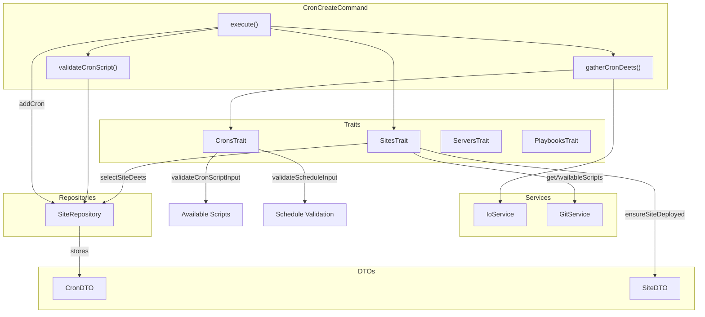

# Schematic: CronCreateCommand.php

> Auto-generated schematic. Last updated: 2025-12-19

## Overview

CronCreateCommand creates a cron job entry for a site in the local inventory. It validates that the site has been deployed, scans for available cron scripts in the repository's `.deployer/crons/` directory, gathers schedule details, and stores the cron configuration locally. Actual server synchronization requires running `cron:sync` separately.

## Logic Flow

### Entry Points

| Method | Description |
|--------|-------------|
| `execute()` | Main command execution via Symfony Console |

### Execution Flow

1. **Display heading** - Show "Create Cron Job" header
2. **Select site** - Use `selectSiteDeets()` trait method to choose target site
3. **Display site details** - Show selected site information
4. **Ensure site deployed** - Verify site has repo/branch configured via `ensureSiteDeployed()`
5. **Get available scripts** - Scan remote repository for scripts in `.deployer/crons/` directory
6. **Gather cron details** - Prompt for script selection and schedule expression
7. **Create CronDTO** - Instantiate data transfer object with script and schedule
8. **Add to inventory** - Persist cron to site via `SiteRepository::addCron()`
9. **Display success** - Show confirmation and hint to run `cron:sync`
10. **Command replay** - Output equivalent non-interactive command

### Decision Points

| Location | Condition | Outcome |
|----------|-----------|---------|
| Line 60-63 | `is_int($site)` | Early return if site selection failed |
| Line 67-71 | `is_int($deployedResult)` | Return FAILURE if site not deployed |
| Line 80-82 | `is_int($availableScripts)` | Return FAILURE if no scripts found |
| Line 92-94 | `is_int($cronDeets)` | Return FAILURE if validation failed |
| Line 107-113 | Exception from `addCron()` | Display error and return FAILURE |

### Exit Conditions

| Condition | Return Code |
|-----------|-------------|
| Site selection fails or cancelled | `Command::FAILURE` or `Command::SUCCESS` |
| Site not deployed (no repo/branch) | `Command::FAILURE` |
| No cron scripts in repository | `Command::FAILURE` |
| Validation fails (script/schedule) | `Command::FAILURE` |
| Duplicate cron already exists | `Command::FAILURE` |
| Cron added successfully | `Command::SUCCESS` |

## Interaction Diagram

## Dependencies

### Direct Imports

| File/Class | Usage |
|------------|-------|
| `Deployer\Contracts\BaseCommand` | Parent class providing DI, output methods, and command infrastructure |
| `Deployer\DTOs\CronDTO` | Immutable data object for cron configuration |
| `Deployer\Exceptions\ValidationException` | Thrown when CLI option validation fails |
| `Deployer\Traits\CronsTrait` | Cron validation and display methods |
| `Deployer\Traits\PlaybooksTrait` | Remote playbook execution (via ServersTrait) |
| `Deployer\Traits\ServersTrait` | Server selection and info retrieval |
| `Deployer\Traits\SitesTrait` | Site selection, deployment checks, script discovery |
| `Symfony\Component\Console\Attribute\AsCommand` | Command metadata annotation |
| `Symfony\Component\Console\Command\Command` | Return code constants |
| `Symfony\Component\Console\Input\InputInterface` | CLI input handling |
| `Symfony\Component\Console\Input\InputOption` | Option definition constants |
| `Symfony\Component\Console\Output\OutputInterface` | CLI output handling |

### Coupled Files

| File | Coupling Type | Description |
|------|---------------|-------------|
| `app/Repositories/SiteRepository.php` | Data | Reads site list, writes cron entries via `addCron()` |
| `app/DTOs/SiteDTO.php` | Data | Contains crons array that gets modified |
| `app/Services/GitService.php` | API | Scans remote repo for available cron scripts |
| `app/Services/IoService.php` | State | Handles validated input prompts and output |
| `.deployer/crons/*` (in user repo) | Config | Source directory for available cron scripts |
| `inventory.yml` | Data | Persistent storage for site and cron configurations |

## Data Flow

### Inputs

| Source | Data | Method |
|--------|------|--------|
| CLI Option `--domain` | Site domain | `getValidatedOptionOrPrompt()` via SitesTrait |
| CLI Option `--script` | Cron script path | `getValidatedOptionOrPrompt()` in `gatherCronDeets()` |
| CLI Option `--schedule` | Cron schedule expression | `getValidatedOptionOrPrompt()` in `gatherCronDeets()` |
| Interactive Prompt | Site selection | `promptSelect()` via SitesTrait |
| Interactive Prompt | Script selection | `promptSelect()` in `gatherCronDeets()` |
| Interactive Prompt | Schedule input | `promptText()` in `gatherCronDeets()` |
| GitService | Available scripts list | `listRemoteDirectoryFiles()` via SitesTrait |
| SiteRepository | Site data with existing crons | `findByDomain()` |

### Outputs

| Destination | Data | Method |
|-------------|------|--------|
| Console | Site details display | `displaySiteDeets()` via SitesTrait |
| Console | Cron details display | `displayCronDeets()` via CronsTrait |
| Console | Success message | `yay()` |
| Console | Sync hint | `info()` |
| Console | Command replay | `commandReplay()` |
| SiteRepository | New CronDTO | `addCron()` |
| `inventory.yml` | Updated site with cron | Via SiteRepository persistence |

### Side Effects

| Effect | Description |
|--------|-------------|
| Inventory modification | Adds cron entry to site's crons array in `inventory.yml` |

## Notes

- This command only modifies local inventory; actual crontab changes require running `cron:sync`
- Script validation checks that selected script exists in repository's `.deployer/crons/` directory
- Schedule validation follows standard 5-field cron format with support for ranges, lists, and step values
- Duplicate cron detection prevents adding the same script twice to a site
- The command supports both interactive and non-interactive modes via CLI options
