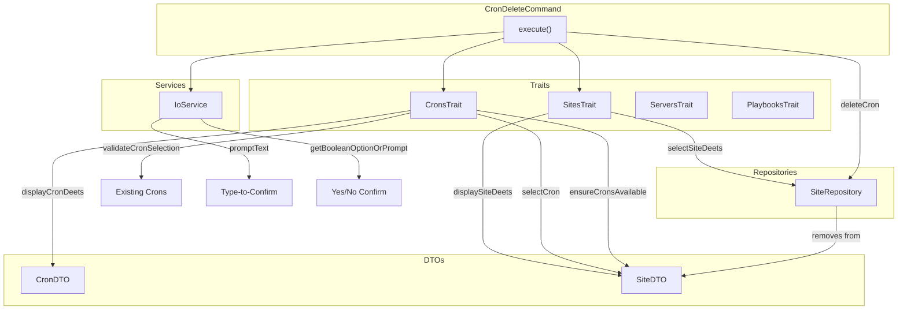

# Schematic: CronDeleteCommand.php

> Auto-generated schematic. Last updated: 2025-12-19

## Overview

CronDeleteCommand removes a cron job entry from a site in the local inventory. It requires type-to-confirm safety and explicit confirmation before deletion. Like `cron:create`, this only modifies local inventory; running `cron:sync` is required to apply changes to the server's crontab.

## Logic Flow

### Entry Points

| Method | Description |
|--------|-------------|
| `execute()` | Main command execution via Symfony Console |

### Execution Flow

1. **Display heading** - Show "Delete Cron Job" header
2. **Select site** - Use `selectSiteDeets()` trait method to choose target site
3. **Display site details** - Show selected site information
4. **Select cron** - Use `selectCron()` trait method to choose cron to delete
5. **Display cron details** - Show selected cron's script and schedule
6. **Type-to-confirm** - Unless `--force`, require typing exact script name
7. **Confirm deletion** - Unless `--yes`, require explicit yes/no confirmation
8. **Delete from inventory** - Remove cron via `SiteRepository::deleteCron()`
9. **Display success** - Show confirmation and hint to run `cron:sync`
10. **Command replay** - Output equivalent non-interactive command

### Decision Points

| Location | Condition | Outcome |
|----------|-----------|---------|
| Line 60-62 | `is_int($site)` | Early return if site selection failed |
| Line 70-72 | `is_int($cron)` | Early return if cron selection failed or no crons exist |
| Line 85-98 | `!$forceSkip` | Require type-to-confirm if `--force` not provided |
| Line 93-97 | `$typedScript !== $cron->script` | Return FAILURE if typed name doesn't match |
| Line 108-112 | `!$confirmed` | Return SUCCESS (cancelled) if user declines |
| Line 118-124 | Exception from `deleteCron()` | Display error and return FAILURE |

### Exit Conditions

| Condition | Return Code |
|-----------|-------------|
| Site selection fails or cancelled | `Command::FAILURE` or `Command::SUCCESS` |
| No crons exist for site | `Command::SUCCESS` (with info message) |
| Cron selection fails | `Command::FAILURE` |
| Type-to-confirm mismatch | `Command::FAILURE` |
| User cancels at confirmation | `Command::SUCCESS` |
| Repository throws exception | `Command::FAILURE` |
| Cron deleted successfully | `Command::SUCCESS` |

## Interaction Diagram

## Dependencies

### Direct Imports

| File/Class | Usage |
|------------|-------|
| `Deployer\Contracts\BaseCommand` | Parent class providing DI, output methods, and command infrastructure |
| `Deployer\Traits\CronsTrait` | Cron selection, validation, and display methods |
| `Deployer\Traits\PlaybooksTrait` | Remote playbook execution (via ServersTrait) |
| `Deployer\Traits\ServersTrait` | Server selection and info retrieval |
| `Deployer\Traits\SitesTrait` | Site selection and display |
| `Symfony\Component\Console\Attribute\AsCommand` | Command metadata annotation |
| `Symfony\Component\Console\Command\Command` | Return code constants |
| `Symfony\Component\Console\Input\InputInterface` | CLI input handling |
| `Symfony\Component\Console\Input\InputOption` | Option definition constants |
| `Symfony\Component\Console\Output\OutputInterface` | CLI output handling |

### Coupled Files

| File | Coupling Type | Description |
|------|---------------|-------------|
| `app/Repositories/SiteRepository.php` | Data | Reads site/cron list, removes cron via `deleteCron()` |
| `app/DTOs/SiteDTO.php` | Data | Contains crons array that gets modified |
| `app/DTOs/CronDTO.php` | Data | Cron configuration being deleted |
| `app/Services/IoService.php` | State | Handles prompts and boolean option resolution |
| `inventory.yml` | Data | Persistent storage for site and cron configurations |

## Data Flow

### Inputs

| Source | Data | Method |
|--------|------|--------|
| CLI Option `--domain` | Site domain | `getValidatedOptionOrPrompt()` via SitesTrait |
| CLI Option `--script` | Cron script to delete | `getValidatedOptionOrPrompt()` via CronsTrait |
| CLI Option `--force` | Skip type-to-confirm | `getOption()` |
| CLI Option `--yes` | Skip confirmation prompt | `getBooleanOptionOrPrompt()` |
| Interactive Prompt | Site selection | `promptSelect()` via SitesTrait |
| Interactive Prompt | Cron selection | `promptSelect()` via CronsTrait |
| Interactive Prompt | Script name confirmation | `promptText()` |
| Interactive Prompt | Yes/No confirmation | `promptConfirm()` |
| SiteRepository | Site with crons list | `findByDomain()` |

### Outputs

| Destination | Data | Method |
|-------------|------|--------|
| Console | Site details display | `displaySiteDeets()` via SitesTrait |
| Console | Cron details display | `displayCronDeets()` via CronsTrait |
| Console | Error messages | `nay()` |
| Console | Warning (cancelled) | `warn()` |
| Console | Success message | `yay()` |
| Console | Sync hint | `info()` |
| Console | Command replay | `commandReplay()` |
| SiteRepository | Cron removal | `deleteCron()` |
| `inventory.yml` | Updated site without cron | Via SiteRepository persistence |

### Side Effects

| Effect | Description |
|--------|-------------|
| Inventory modification | Removes cron entry from site's crons array in `inventory.yml` |

## Notes

- This command uses a two-step confirmation pattern: type-to-confirm (`--force` to skip) + yes/no (`--yes` to skip)
- The type-to-confirm requires exact match of the cron script name to prevent accidental deletion
- Cancelling at confirmation returns SUCCESS (not FAILURE) as it's a user choice, not an error
- The command replay includes both `--force` and `--yes` flags for fully automated deletion
- If a site has no crons, the command exits early with SUCCESS and an informational message
