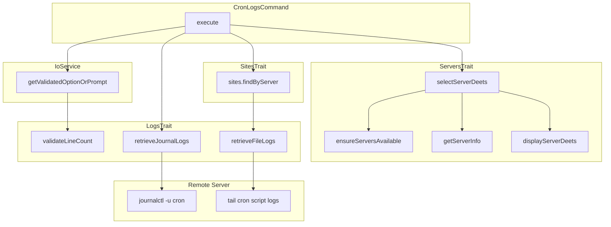

# Schematic: CronLogsCommand.php

> Auto-generated schematic. Last updated: 2025-12-20

## Overview

Displays cron service logs (via journalctl) and per-site cron script logs from a selected server. Uses LogsTrait methods for journal and file log retrieval with configurable line count and error highlighting.

## Logic Flow

### Entry Points

| Method | Description |
|--------|-------------|
| `execute()` | Main command execution entry point |
| `configure()` | Defines CLI options |

### Execution Flow

1. **Display heading** - Show "Cron Logs" header via `h1()`
2. **Select server** - Use `selectServerDeets()` from ServersTrait to choose target server
3. **Validate server info** - Ensure server has info (SSH connection verified)
4. **Get line count** - Validate and retrieve `--lines` option (default: 50) via `getValidatedOptionOrPrompt()`
5. **Retrieve service logs** - Call `retrieveJournalLogs()` for cron systemd unit
6. **Retrieve script logs** - Iterate sites on server via `$this->sites->findByServer()`, call `retrieveFileLogs()` for each cron script
7. **Command replay** - Output equivalent non-interactive command

### Decision Points

| Condition | Branch |
|-----------|--------|
| No servers in inventory | Show info, return failure (via `ensureServersAvailable()`) |
| Server selection fails | Return failure code |
| Server info is null | Return failure (SSH/detection failed) |
| Line count validation fails | Show error via `nay()`, return failure |

### Exit Conditions

| Condition | Return |
|-----------|--------|
| No servers available | `Command::FAILURE` |
| Server selection fails | `Command::FAILURE` |
| Server info missing | `Command::FAILURE` |
| Line count validation fails | `Command::FAILURE` |
| Success | `Command::SUCCESS` |

## Interaction Diagram

## Dependencies

### Direct Imports

| File/Class | Usage |
|------------|-------|
| `Deployer\Contracts\BaseCommand` | Base class providing DI, output methods |
| `Deployer\Exceptions\ValidationException` | Thrown on CLI validation failure |
| `Deployer\Traits\LogsTrait` | Provides `validateLineCount()`, `retrieveJournalLogs()`, `retrieveFileLogs()` |
| `Deployer\Traits\ServersTrait` | Server selection via `selectServerDeets()` |
| `Deployer\Traits\SitesTrait` | Site inventory access via `$this->sites` |
| `Symfony\Component\Console\Attribute\AsCommand` | Command registration attribute |
| `Symfony\Component\Console\Command\Command` | Return code constants |
| `Symfony\Component\Console\Input\InputInterface` | CLI input handling |
| `Symfony\Component\Console\Input\InputOption` | Option definition |
| `Symfony\Component\Console\Output\OutputInterface` | CLI output handling |

### Coupled Files

| File | Coupling Type | Description |
|------|---------------|-------------|
| `app/Repositories/ServerRepository.php` | Data | Server inventory access via BaseCommand |
| `app/Repositories/SiteRepository.php` | Data | Site inventory access for cron script log iteration |
| `app/DTOs/ServerDTO.php` | Data | Server connection details |
| `app/DTOs/SiteDTO.php` | Data | Site domain and cron configurations |
| `app/DTOs/CronDTO.php` | Data | Cron script name for log path construction |
| `app/Services/SshService.php` | API | Remote command execution (via LogsTrait) |
| `app/Services/IoService.php` | State | Manages validated input collection |
| `/var/log/journal/` | Log | Systemd journal on remote server |
| `/var/log/cron/` | Log | Cron script logs on remote server |

## Data Flow

### Inputs

| Source | Data | Type |
|--------|------|------|
| CLI `--server` | Server name to target | string |
| CLI `--lines` / `-n` | Number of log lines to retrieve (default: 50) | string |
| Interactive prompts | Same data when CLI options omitted | mixed |

### Outputs

| Destination | Data | Type |
|-------------|------|------|
| Console | Env/Inventory status | formatted text |
| Console | "Cron Logs" heading | formatted text |
| Console | Server details display | formatted text |
| Console | Cron service logs (journalctl) | formatted text |
| Console | Per-site cron script logs (tail) | formatted text |
| Console | Command replay | string |

### Side Effects

None - this is a read-only command.

## Notes

- Uses LogsTrait's `retrieveJournalLogs()` for cron systemd service logs
- Uses LogsTrait's `retrieveFileLogs()` to show per-site cron script logs at `/var/log/cron/{domain}-{script_basename}.log`
- Log path construction uses `pathinfo($cron->script, PATHINFO_FILENAME)` to get script basename without extension
- Iterates all sites on server via `$this->sites->findByServer()`, then all crons per site via `$site->crons`
- Error highlighting applied by LogsTrait methods (error, exception, fail, failed, fatal, panic, 5xx codes)
- Line count has a default of 50 in the option definition and max of 1000 (validated by `validateLineCount()`)
- Delegates SSH execution to LogsTrait methods rather than direct SshService calls
- `selectServerDeets()` combines server selection, display, and SSH/info validation in one call
- Structurally mirrors `SupervisorLogsCommand` pattern for consistency
