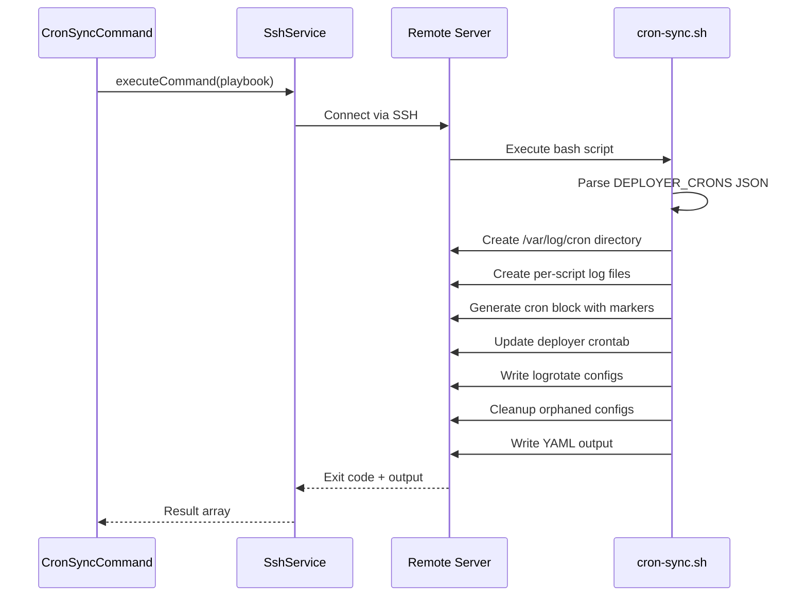

# Schematic: CronSyncCommand.php

> Auto-generated schematic. Last updated: 2025-12-19

## Overview

CronSyncCommand synchronizes cron jobs from the local inventory to the server's crontab. It executes the `cron-sync.sh` playbook which updates the deployer user's crontab with entries from the inventory, sets up logging, and cleans up orphaned configurations. This is the command that applies local cron changes to the actual server.

## Logic Flow

### Entry Points

| Method | Description |
|--------|-------------|
| `execute()` | Main command execution via Symfony Console |

### Execution Flow

1. **Display heading** - Show "Sync Cron Jobs" header
2. **Select site with server** - Use `selectSiteDeetsWithServer()` to get site and resolved server with system info
3. **Execute playbook** - Run `cron-sync.sh` playbook via SSH
4. **Handle result** - Check playbook success/failure
5. **Display result** - Show success or failure message
6. **Command replay** - Output equivalent non-interactive command

### Decision Points

| Location | Condition | Outcome |
|----------|-----------|---------|
| Line 55-57 | `is_int($siteServer)` | Early return if site/server selection failed |
| Line 69-73 | `is_int($result)` | Display error and return FAILURE if playbook failed |

### Exit Conditions

| Condition | Return Code |
|-----------|-------------|
| Site selection fails or cancelled | `Command::FAILURE` or `Command::SUCCESS` |
| Server not found for site | `Command::FAILURE` |
| Server info retrieval fails | `Command::FAILURE` |
| Playbook execution fails | `Command::FAILURE` |
| Crons synced successfully | `Command::SUCCESS` |

## Interaction Diagram

```mermaid
flowchart TD
    subgraph Command["CronSyncCommand"]
        execute["execute()"]
    end

    subgraph Traits["Traits"]
        SitesTrait["SitesTrait"]
        ServersTrait["ServersTrait"]
        PlaybooksTrait["PlaybooksTrait"]
    end

    subgraph Services["Services"]
        SshService["SshService"]
        FilesystemService["FilesystemService"]
    end

    subgraph Repositories["Repositories"]
        SiteRepository["SiteRepository"]
        ServerRepository["ServerRepository"]
    end

    subgraph DTOs["DTOs"]
        SiteServerDTO["SiteServerDTO"]
        SiteDTO["SiteDTO"]
        ServerDTO["ServerDTO"]
    end

    subgraph Playbooks["Playbooks"]
        siteCronSync["cron-sync.sh"]
    end

    execute --> SitesTrait
    SitesTrait --> |selectSiteDeetsWithServer| SiteRepository
    SitesTrait --> |selectSiteDeetsWithServer| ServerRepository
    SitesTrait --> SiteServerDTO

    execute --> PlaybooksTrait
    PlaybooksTrait --> |executePlaybookSilently| SshService
    PlaybooksTrait --> |read playbook| FilesystemService
    PlaybooksTrait --> siteCronSync

    siteCronSync --> |updates| crontab[Deployer Crontab]
    siteCronSync --> |creates| cronLogs[/var/log/cron/*.log]
    siteCronSync --> |configures| logrotate[/etc/logrotate.d/cron-*.conf]
```

## Playbook Sequence



## Dependencies

### Direct Imports

| File/Class | Usage |
|------------|-------|
| `Deployer\Contracts\BaseCommand` | Parent class providing DI, output methods, and command infrastructure |
| `Deployer\Traits\PlaybooksTrait` | Playbook execution via SSH |
| `Deployer\Traits\ServersTrait` | Server selection and info retrieval |
| `Deployer\Traits\SitesTrait` | Site selection with server resolution |
| `Symfony\Component\Console\Attribute\AsCommand` | Command metadata annotation |
| `Symfony\Component\Console\Command\Command` | Return code constants |
| `Symfony\Component\Console\Input\InputInterface` | CLI input handling |
| `Symfony\Component\Console\Input\InputOption` | Option definition constants |
| `Symfony\Component\Console\Output\OutputInterface` | CLI output handling |

### Coupled Files

| File | Coupling Type | Description |
|------|---------------|-------------|
| `app/Repositories/SiteRepository.php` | Data | Reads site with crons array |
| `app/Repositories/ServerRepository.php` | Data | Reads server connection details |
| `app/DTOs/SiteServerDTO.php` | Data | Combined site and server context |
| `app/Services/SshService.php` | API | Executes playbook on remote server |
| `app/Services/FilesystemService.php` | API | Reads playbook script content |
| `playbooks/cron-sync.sh` | Config | Bash script executed on server |
| `playbooks/helpers.sh` | Config | Helper functions inlined into playbook |
| `/home/deployer/sites/{domain}/runner.sh` | Remote | Script wrapper for cron execution |
| `/var/log/cron/{domain}-{script}.log` | Log | Per-cron log files created by playbook |
| `/etc/logrotate.d/cron-{domain}-{script}.conf` | Config | Logrotate configs created by playbook |
| `inventory.yml` | Data | Source of cron configurations |

## Data Flow

### Inputs

| Source | Data | Method |
|--------|------|--------|
| CLI Option `--domain` | Site domain | `getValidatedOptionOrPrompt()` via SitesTrait |
| Interactive Prompt | Site selection | `promptSelect()` via SitesTrait |
| SiteRepository | Site with crons array | `findByDomain()` |
| ServerRepository | Server connection details | `findByName()` |
| Server | System info (distro, permissions) | `server-info.sh` playbook |

### Outputs

| Destination | Data | Method |
|-------------|------|--------|
| Console | Success/failure message | `yay()` / `nay()` |
| Console | Command replay | `commandReplay()` |
| Remote Server | Updated crontab | Via `cron-sync.sh` |
| Remote Server | Log files in `/var/log/cron/` | Via `cron-sync.sh` |
| Remote Server | Logrotate configs | Via `cron-sync.sh` |

### Side Effects

| Effect | Description |
|--------|-------------|
| Crontab update | Replaces site's cron section in deployer user's crontab |
| Log file creation | Creates/updates per-script log files in `/var/log/cron/` |
| Logrotate setup | Creates/updates logrotate configs for each cron script |
| Orphan cleanup | Removes logrotate configs for scripts no longer in inventory |

## Playbook Environment Variables

The `cron-sync.sh` playbook receives these variables via `PlaybooksTrait`:

| Variable | Source | Description |
|----------|--------|-------------|
| `DEPLOYER_OUTPUT_FILE` | Auto-generated | Path for YAML output |
| `DEPLOYER_DISTRO` | Server info | Distribution (ubuntu/debian) |
| `DEPLOYER_PERMS` | Server info | Permission level (root/sudo) |
| `DEPLOYER_SITE_DOMAIN` | SiteDTO | Site's domain name |
| `DEPLOYER_CRONS` | SiteDTO.crons | JSON array of cron configurations |

## Playbook Output (YAML)

```yaml
status: success
crons_synced: 2
```

## Notes

- This command applies all cron changes atomically; partial syncs are not possible
- Cron entries use domain-specific markers (`# DEPLOYER-CRON-START/END {domain}`) for isolation
- Each cron runs via `runner.sh` which sets up the proper environment for the site
- Log files are owned by deployer user and rotated daily with 5-day retention
- Empty cron list results in removal of site's cron section from crontab
- Orphaned logrotate configs (from deleted crons) are automatically cleaned up
