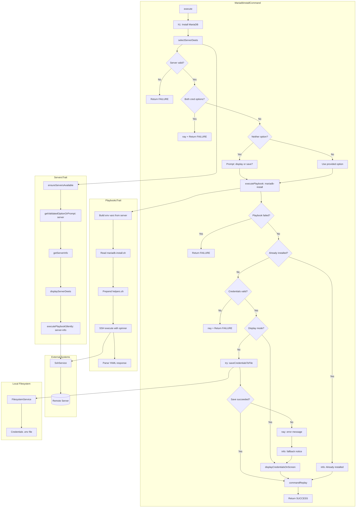
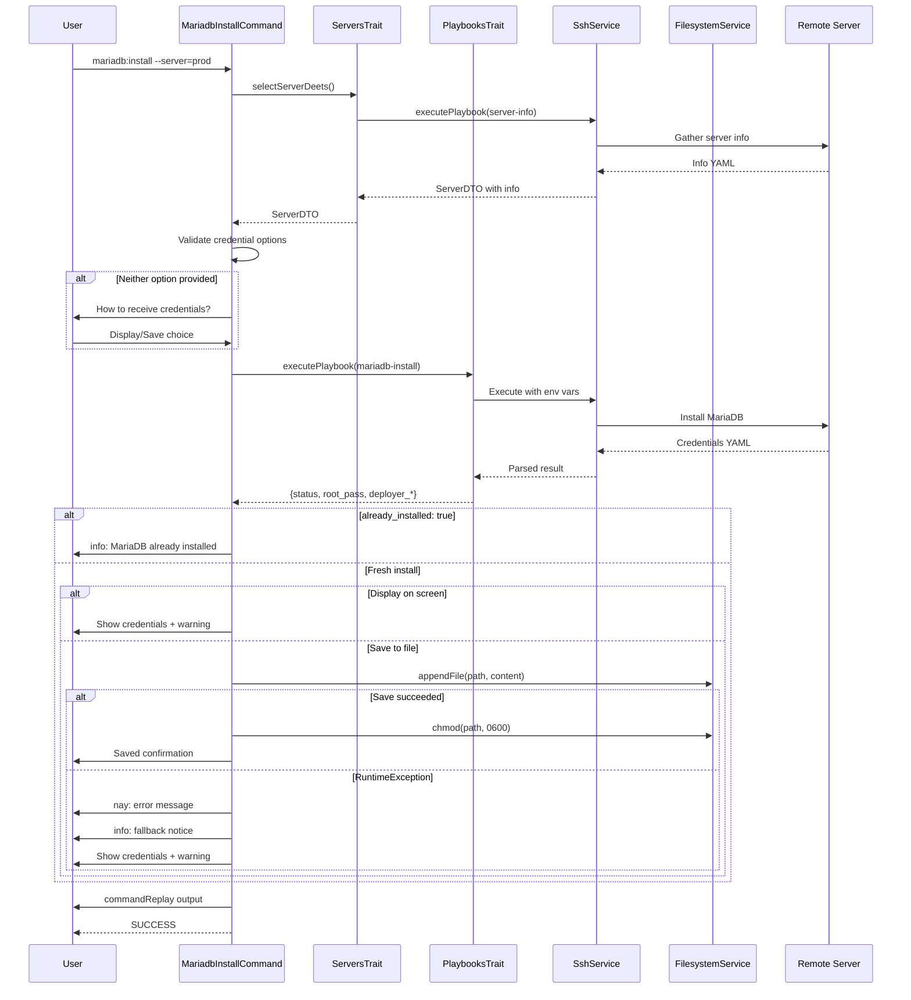

# Schematic: MariadbInstallCommand.php

> Auto-generated schematic. Last updated: 2025-12-19
>
> Recent changes: Removed unused SitesTrait. Added graceful fallback for credential file save failures.

## Overview

CLI command that installs MariaDB server on a remote server, generates secure credentials, and provides credential output options (display on screen or save to file). Uses `PlaybooksTrait::executePlaybook()` for remote installation and `ServersTrait::selectServerDeets()` for server selection with SSH validation.

## Logic Flow

### Entry Points

| Method | Visibility | Description |
|--------|------------|-------------|
| `execute()` | protected | Main command entry point via Symfony Console |

### Execution Flow

1. **Display heading** - Output "Install MariaDB" heading via `h1()`
2. **Server selection** - Call `selectServerDeets()` (ServersTrait) which:
   - Validates servers exist in inventory
   - Prompts for server selection (CLI option or interactive)
   - Displays server details
   - Executes `server-info` playbook to gather system info
   - Validates distribution (Debian/Ubuntu) and permissions (root/sudo)
   - Returns `ServerDTO` with populated `info` array
3. **Early exit check** - Return `FAILURE` if server selection failed or `info` is null
4. **Credential output preference** - Collect upfront before installation:
   - Check for mutually exclusive options: `--display-credentials` and `--save-credentials`
   - If conflict detected, display error and return `FAILURE`
   - If neither provided, prompt user to choose between "Display on screen" or "Save to file"
   - If "save" chosen, prompt for file path
5. **Execute playbook** - Call `executePlaybook()` with:
   - Server context for SSH connection
   - Playbook name "mariadb-install"
   - Status message "Installing MariaDB..."
6. **Handle already installed** - If `already_installed: true` in response, display info message and skip credential output
7. **Process credentials** - Extract from playbook result:
   - `root_pass`, `deployer_pass` (required)
   - `deployer_user`, `deployer_database` (with defaults)
   - Validate credentials were returned (fail if missing)
8. **Output credentials** - Based on collected preference:
   - Display: `displayCredentialsOnScreen()` - formatted console output with warning
   - Save: `saveCredentialsToFile()` wrapped in try-catch:
     - On success: .env format with 0600 permissions
     - On `RuntimeException`: Display error, fallback to `displayCredentialsOnScreen()`
9. **Command replay** - Build options for replay, include credential option only for fresh install
10. **Return success** - Return `Command::SUCCESS`

### Decision Points

| Location | Condition | Branch |
|----------|-----------|--------|
| Line 54 | `is_int($server) \|\| null === $server->info` | Return `FAILURE` (server selection or info retrieval failed) |
| Line 67 | Both `--display-credentials` and `--save-credentials` provided | Display error, return `FAILURE` |
| Line 73 | Neither credential option provided | Show interactive prompt to choose |
| Line 105 | `is_int($result)` | Return result (playbook failure propagated) |
| Line 113-152 | `$result['already_installed'] ?? false` | Display info "MariaDB is already installed", skip credential output |
| Line 117 | `null === $rootPass \|\| '' === $rootPass \|\| null === $deployerPass \|\| '' === $deployerPass` | Display error, return `FAILURE` |
| Line 132 | `$displayCredentials` | Display credentials on screen |
| Line 134-148 | `!$displayCredentials` | Try save to file, catch RuntimeException and fallback to display |

### Exit Conditions

| Condition | Return Value |
|-----------|--------------|
| No servers in inventory | `Command::FAILURE` |
| Invalid server selection | `Command::FAILURE` |
| SSH connection failure | `Command::FAILURE` |
| Unsupported distribution | `Command::FAILURE` |
| Insufficient permissions | `Command::FAILURE` |
| Both credential options provided | `Command::FAILURE` |
| Playbook execution failure | `Command::FAILURE` |
| Missing credentials in response | `Command::FAILURE` |
| MariaDB already installed | `Command::SUCCESS` (info message, no credentials shown) |
| Fresh installation successful | `Command::SUCCESS` |

## Interaction Diagram



## Sequence Diagram



## Dependencies

### Direct Imports

| File/Class | Usage |
|------------|-------|
| `Deployer\Contracts\BaseCommand` | Parent class providing DI, output methods, command infrastructure |
| `Deployer\Traits\PlaybooksTrait` | Provides `executePlaybook()` for remote MariaDB installation |
| `Deployer\Traits\ServersTrait` | Provides `selectServerDeets()` for server selection flow |
| `Symfony\Component\Console\Attribute\AsCommand` | Command registration attribute |
| `Symfony\Component\Console\Command\Command` | Return code constants |
| `Symfony\Component\Console\Input\InputInterface` | Command input handling |
| `Symfony\Component\Console\Input\InputOption` | CLI option definitions |
| `Symfony\Component\Console\Output\OutputInterface` | Command output handling |

### Coupled Files

| File | Coupling Type | Description |
|------|---------------|-------------|
| `playbooks/mariadb-install.sh` | Playbook | Remote installation script executed via SSH |
| `playbooks/server-info.sh` | Playbook | Executed via ServersTrait to gather server info |
| `playbooks/helpers.sh` | Playbook | Helper functions inlined into playbook |
| `app/Services/SshService.php` | Service | Executes playbooks and commands via SSH |
| `app/Services/IoService.php` | Service | Prompts and console output |
| `app/Services/FilesystemService.php` | Service | Local file operations for credential saving |
| `app/Repositories/ServerRepository.php` | Data | Server inventory access |
| `app/DTOs/ServerDTO.php` | Data | Server connection details and info |
| `deployer.yml` | Config | Server inventory source |

## Data Flow

### Inputs

| Source | Data | Type |
|--------|------|------|
| CLI option `--server` | Server name | `string` (optional) |
| CLI option `--display-credentials` | Show on screen flag | `bool` |
| CLI option `--save-credentials` | File path for saving | `string` (optional) |
| Interactive prompt | Server selection | `string` |
| Interactive prompt | Credential output choice | `string` ("display" or "save") |
| Interactive prompt | File path for saving | `string` |
| Server inventory | Available servers | `ServerDTO[]` |
| Remote playbook | MariaDB installation result | YAML parsed to array |

### Outputs

| Destination | Data | Type |
|-------------|------|------|
| Console | Install MariaDB heading | Formatted text |
| Console | Server details | Formatted key-value pairs |
| Console | Installation spinner | Progress indicator |
| Console | Credentials (display mode) | Formatted text with connection string |
| Console | Warning about credential security | Yellow warning text |
| Console | Save confirmation | Green success text |
| Console | Command replay hint | Formatted command string |
| Local file | Credentials in .env format | Text file with 0600 permissions |

### Side Effects

| Effect | Description |
|--------|-------------|
| SSH connection | Establishes SSH connection to remote server |
| Remote playbook | Executes `server-info.sh` playbook for server validation |
| Remote playbook | Executes `mariadb-install.sh` playbook for installation |
| MariaDB installed | Installs MariaDB server packages on remote |
| Database created | Creates `deployer` database with utf8mb4 |
| User created | Creates `deployer` database user |
| Root password set | Sets MariaDB root password |
| Local file created | Creates credentials file with secure permissions (save mode) |

## Credential Output Formats

### Display on Screen

```text
Root Credentials (admin access):
  Password: <base64-generated-password>

Application Credentials:
  Database: deployer
  Username: deployer
  Password: <base64-generated-password>

Connection string:
  mysql://deployer:<password>@localhost/deployer
```

### Save to File (.env format)

```env
# MariaDB Credentials for {serverName}
# Generated: {timestamp}
# WARNING: Keep this file secure!

## Root Credentials (admin access)
MARIADB_ROOT_PASSWORD=<password>

## Application Credentials
MARIADB_DATABASE=deployer
MARIADB_USER=deployer
MARIADB_PASSWORD=<password>

## Connection String
DATABASE_URL=mysql://deployer:<password>@localhost/deployer
```

## Helper Methods

| Method | Purpose |
|--------|---------|
| `displayCredentialsOnScreen()` | Formats and displays credentials with warning |
| `saveCredentialsToFile()` | Writes .env format file with 0600 permissions, appends if exists |
| `now()` | Returns timestamp for credential file header |

## Notes

### Credential Option Conflict

The command enforces mutual exclusivity between `--display-credentials` and `--save-credentials`. Users must choose one method or let the interactive prompt decide.

### Idempotent Installation

The playbook returns `already_installed: true` if MariaDB is already running. In this case:

- Info message displayed: "MariaDB is already installed on this server"
- Credentials are NOT displayed (they're not regenerated)
- Command replay excludes credential options

### File Security

When saving credentials:

- `umask(0077)` is set before writing
- `chmod(0600)` is applied after writing
- File is appended to if it exists (for multiple server credentials)

### Trait Composition

Uses two traits:

- `ServersTrait`: Server selection and validation
- `PlaybooksTrait`: Remote playbook execution

### Graceful Credential Save Fallback

When saving credentials to file fails (filesystem permission issues, disk full, etc.), the command:

1. Displays the error message via `nay()`
2. Shows info notice about fallback behavior
3. Falls back to `displayCredentialsOnScreen()` to ensure user receives credentials
4. Continues to SUCCESS (credentials are not lost)

### Related Commands

- `mysql:install` - Identical structure for MySQL server
- `mariadb:start`, `mariadb:stop`, `mariadb:restart`, `mariadb:logs` - Related MariaDB service commands
