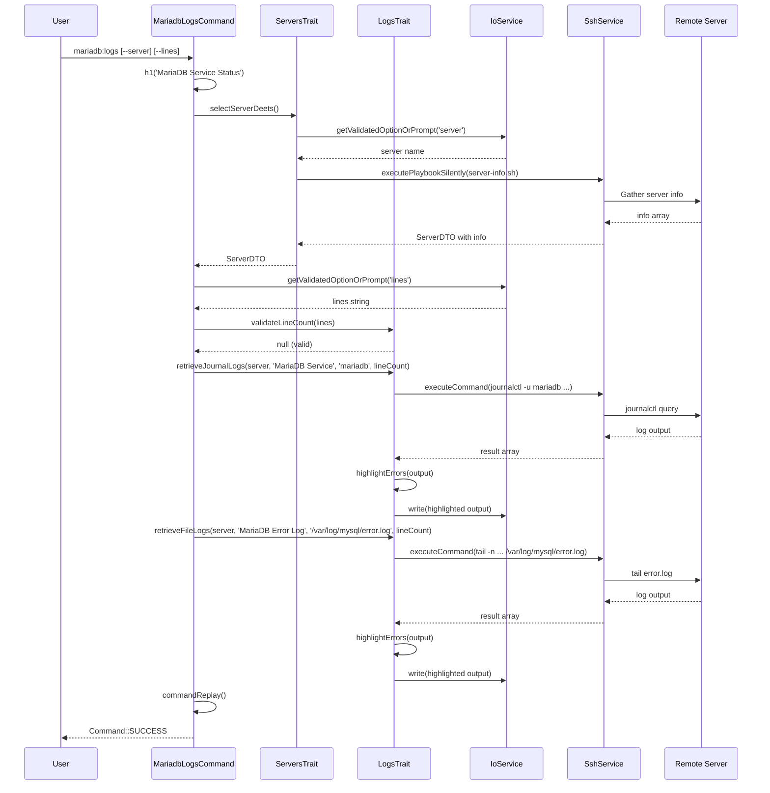

# Schematic: MariadbLogsCommand.php

> Auto-generated schematic. Last updated: 2025-12-19

## Overview

`MariadbLogsCommand` displays MariaDB service status and logs from a remote server. It prompts for server selection, validates line count input, then retrieves two log sources: systemd journal logs via `retrieveJournalLogs()` and error logs via `retrieveFileLogs()`. The command follows the same pattern as `MysqlLogsCommand`.

## Logic Flow

### Entry Points

| Method | Visibility | Purpose |
|--------|------------|---------|
| `configure()` | protected | Registers `--server` and `--lines` options |
| `execute()` | protected | Main execution flow |

### Execution Flow

```
1. Call parent::execute() for base initialization display

2. Display heading via h1('MariaDB Service Status')

3. Select server via selectServerDeets() [ServersTrait]
   |-- Validates --server option or prompts interactively
   |-- Retrieves server info via SSH
   |-- Returns ServerDTO with info populated OR Command::FAILURE

4. Early exit check: is_int($server) || null === $server->info
   |-- Return FAILURE if server selection or info retrieval failed

5. Get line count via getValidatedOptionOrPrompt()
   |-- Uses --lines option if provided, otherwise prompts (prompt default: '50')
   |-- Validates via validateLineCount() [LogsTrait]
   |-- Catches ValidationException, displays error, returns FAILURE

6. Convert lines string to integer

7. Retrieve MariaDB service logs via retrieveJournalLogs() [LogsTrait]
   |-- Executes: journalctl -u 'mariadb' -n {lines} --no-pager 2>&1
   |-- Highlights error keywords in output
   |-- Displays formatted output to console

8. Retrieve MariaDB error logs via retrieveFileLogs() [LogsTrait]
   |-- Executes: tail -n {lines} /var/log/mysql/error.log 2>&1
   |-- Highlights error keywords in output
   |-- Displays formatted output to console

9. Display command replay via commandReplay()

10. Return Command::SUCCESS
```

### Decision Points

| Location | Condition | True Branch | False Branch |
|----------|-----------|-------------|--------------|
| Line 54 | `is_int($server)` | Return FAILURE | Continue |
| Line 54 | `null === $server->info` | Return FAILURE | Continue |
| Line 73-76 | ValidationException caught | Display error, return FAILURE | Continue |

### Exit Conditions

| Condition | Return Value | Description |
|-----------|--------------|-------------|
| Server selection failed | `Command::FAILURE` | User cancelled or no servers available |
| Server info retrieval failed | `Command::FAILURE` | SSH/permission issues |
| Line count validation failed | `Command::FAILURE` | Invalid CLI option value |
| Success | `Command::SUCCESS` | Logs retrieved and displayed |

## Interaction Diagram

```mermaid
flowchart TD
    subgraph MariadbLogsCommand
        CFG[configure]
        EXEC[execute]
    end

    subgraph Traits
        ST[ServersTrait]
        LT[LogsTrait]
    end

    subgraph ServersTrait_Methods
        SSD[selectServerDeets]
        GSI[getServerInfo]
    end

    subgraph LogsTrait_Methods
        RJL[retrieveJournalLogs]
        RFL[retrieveFileLogs]
        VLC[validateLineCount]
        HE[highlightErrors]
    end

    subgraph Services
        IO[IoService]
        SSH[SshService]
    end

    subgraph Remote
        JC[journalctl]
        MD[mariadb.service]
        EL[/var/log/mysql/error.log]
    end

    CFG --> ST
    CFG --> LT
    EXEC --> SSD
    SSD --> GSI
    GSI --> SSH
    EXEC --> IO
    EXEC --> VLC
    EXEC --> RJL
    EXEC --> RFL
    RJL --> SSH
    RFL --> SSH
    RJL --> HE
    RFL --> HE
    SSH --> JC
    SSH --> EL
    JC --> MD
```



## Dependencies

### Direct Imports

| File/Class | Usage |
|------------|-------|
| `Deployer\Contracts\BaseCommand` | Parent class providing services and output methods |
| `Deployer\Exceptions\ValidationException` | Caught when CLI option validation fails |
| `Deployer\Traits\LogsTrait` | Provides `retrieveJournalLogs()`, `retrieveFileLogs()`, `validateLineCount()` |
| `Deployer\Traits\ServersTrait` | Provides `selectServerDeets()` |
| `Symfony\Component\Console\Attribute\AsCommand` | Command registration attribute |
| `Symfony\Component\Console\Command\Command` | Return code constants |
| `Symfony\Component\Console\Input\InputInterface` | Execute method parameter |
| `Symfony\Component\Console\Input\InputOption` | Option type constants |
| `Symfony\Component\Console\Output\OutputInterface` | Execute method parameter |

### Coupled Files

| File | Coupling Type | Description |
|------|---------------|-------------|
| `app/Contracts/BaseCommand.php` | Inheritance | Provides `$this->io`, output methods, `commandReplay()` |
| `app/Traits/ServersTrait.php` | Trait | Server selection and info retrieval |
| `app/Traits/LogsTrait.php` | Trait | Journal log retrieval and validation |
| `app/Traits/PlaybooksTrait.php` | Indirect | Used by ServersTrait for server-info.sh |
| `app/Services/IoService.php` | Service | Input/output via `$this->io` |
| `app/Services/SshService.php` | Service | Remote command execution |
| `app/DTOs/ServerDTO.php` | Data | Server connection and info data |
| `playbooks/server-info.sh` | Playbook | Retrieves server info via ServersTrait |
| `~/.deployer/deployer.yml` | Data | Server inventory |

## Data Flow

### Inputs

| Source | Data | Type |
|--------|------|------|
| CLI option `--server` | Server name | `?string` |
| CLI option `--lines` | Log line count | `?string` (no CLI default; prompt default: '50') |
| Interactive prompt | Server selection | `string` |
| Interactive prompt | Line count | `string` (default: '50') |
| ServerRepository | Available servers | `array<ServerDTO>` |
| Remote server | Server info | `array` |
| Remote server | Journal logs (systemd) | `string` |
| Remote server | Error logs (file) | `string` |

### Outputs

| Destination | Data | Description |
|-------------|------|-------------|
| Console | Heading | "MariaDB Service Status" |
| Console | Server details | Name, host, port, user, key path |
| Console | MariaDB service logs | Highlighted journal output from systemd |
| Console | MariaDB error logs | Highlighted output from /var/log/mysql/error.log |
| Console | Command replay | Non-interactive equivalent command |

### Side Effects

| Effect | Description |
|--------|-------------|
| SSH connections | Three connections: server-info.sh, journalctl, tail error.log |
| Console output | Multiple sections written to stdout |

## CLI Options

| Option | Short | Type | Default | Description |
|--------|-------|------|---------|-------------|
| `--server` | - | VALUE_REQUIRED | - | Server name from inventory |
| `--lines` | `-n` | VALUE_REQUIRED | - | Number of log lines (prompt default: 50) |

**Design Note:** `--lines` intentionally has no CLI default. Omitting it displays a prompt with its own default value ('50'). This follows the non-interactive design pattern where CLI options replace prompts.

## Validation

| Input | Validator | Rules |
|-------|-----------|-------|
| `--server` | `validateServerSelection()` | Must exist in inventory |
| `--lines` | `validateLineCount()` | Positive integer, max 1000 |

## Command Replay Example

```bash
vendor/bin/deployer mariadb:logs \
  --server='production' \
  --lines='50'
```

## Related Commands

| Command | Similarity |
|---------|------------|
| `mysql:logs` | Identical pattern, different service unit |
| `mariadb:start` | Same server selection, different action |
| `mariadb:stop` | Same server selection, different action |
| `mariadb:restart` | Same server selection, different action |
| `server:logs` | More comprehensive log viewing |

## Notes

- The command retrieves two log sources: systemd journal (service status) and error log file (application errors)
- Uses `retrieveJournalLogs()` for systemd journal and `retrieveFileLogs()` for /var/log/mysql/error.log
- Identical structure to `MysqlLogsCommand` - only differs in heading text and systemd unit name ('mariadb' vs 'mysql')
- Server info retrieval via `selectServerDeets()` validates SSH connectivity and sudo permissions before log retrieval
- Error highlighting in logs applies to keywords: error, exception, fail, failed, fatal, panic, and HTTP 5xx status codes
- Line count validation caps at 1000 lines to prevent excessive data transfer
