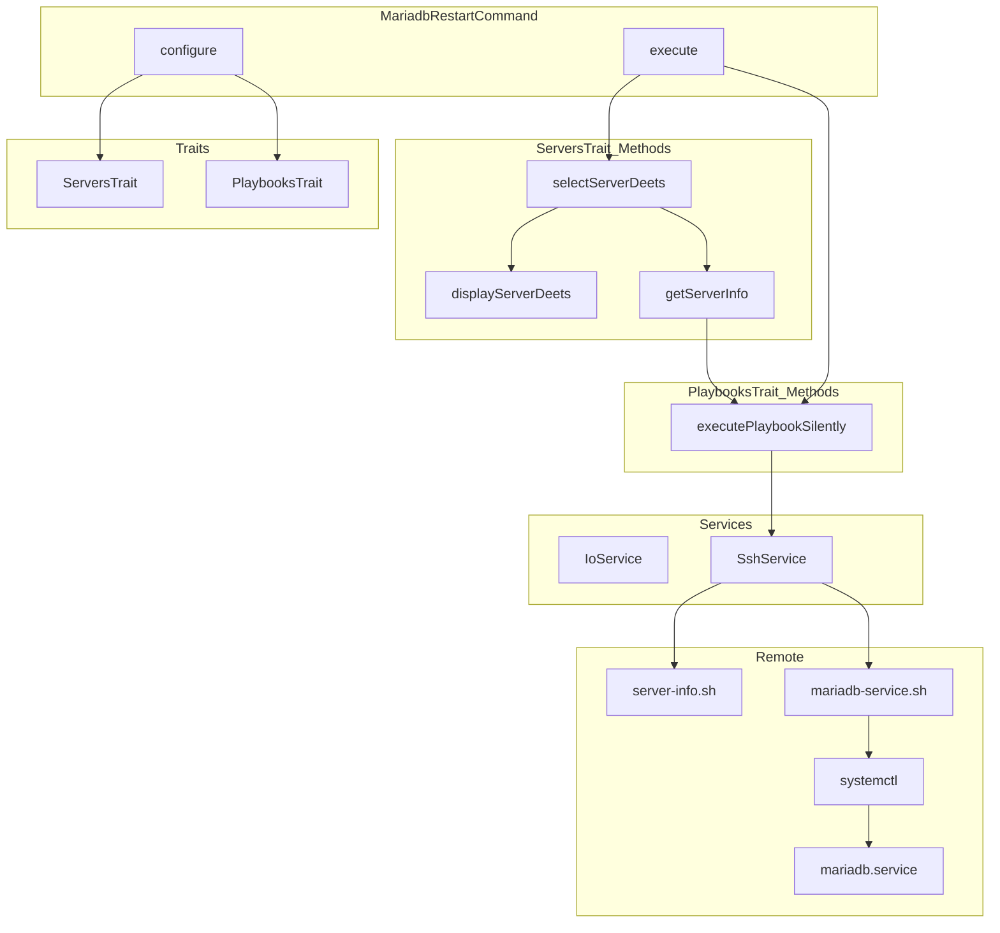
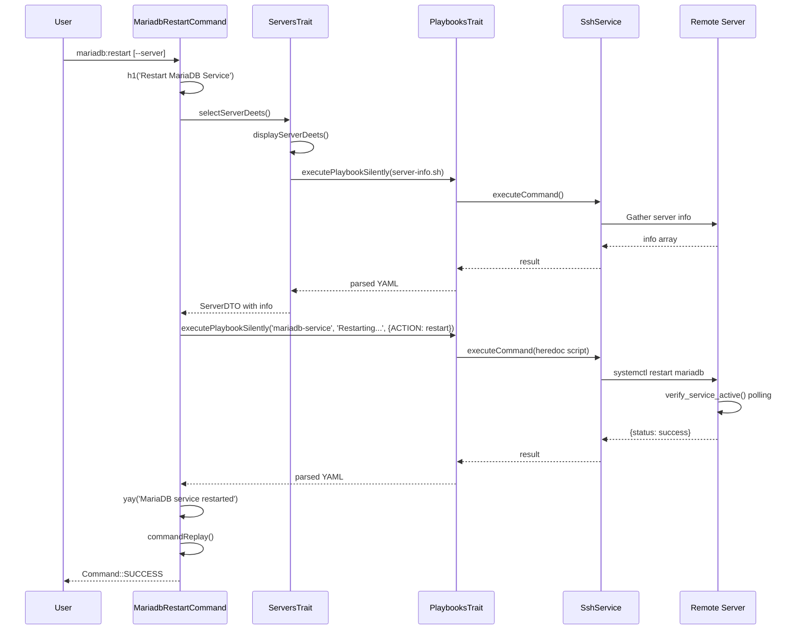

# Schematic: MariadbRestartCommand.php

> Auto-generated schematic. Last updated: 2025-12-19

## Overview

Restarts the MariaDB service on a selected server. Executes the `mariadb-service.sh` playbook with `DEPLOYER_ACTION=restart` to perform a `systemctl restart mariadb` on the remote server and verifies the service becomes active within 10 seconds.

## Logic Flow

### Entry Points

| Method | Description |
|--------|-------------|
| `configure()` | Defines CLI `--server` option |
| `execute()` | Main command execution entry point |

### Execution Flow

```
1. Call parent::execute() for base initialization display

2. Display heading via h1('Restart MariaDB Service')

3. Select server via selectServerDeets() [ServersTrait]
   |-- Validates --server option or prompts interactively
   |-- Retrieves server info via SSH (server-info.sh playbook)
   |-- Returns ServerDTO with info populated OR Command::FAILURE

4. Early exit check: is_int($server) || null === $server->info
   |-- Return FAILURE if server selection or info retrieval failed

5. Execute playbook via executePlaybookSilently() [PlaybooksTrait]
   |-- Playbook: 'mariadb-service'
   |-- Status message: 'Restarting MariaDB service...'
   |-- Environment: DEPLOYER_ACTION=restart
   |-- Returns parsed YAML array or Command::FAILURE

6. Check playbook result: is_int($result)
   |-- True: Display error via nay(), return FAILURE
   |-- False: Continue

7. Display success via yay('MariaDB service restarted')

8. Display command replay via commandReplay()

9. Return Command::SUCCESS
```

### Decision Points

| Location | Condition | True Branch | False Branch |
|----------|-----------|-------------|--------------|
| Line 54 | `is_int($server)` | Return FAILURE | Continue |
| Line 54 | `null === $server->info` | Return FAILURE | Continue |
| Line 71 | `is_int($result)` | Display error, return FAILURE | Continue |

### Exit Conditions

| Condition | Return Value | Description |
|-----------|--------------|-------------|
| Server selection failed | `Command::FAILURE` | User cancelled or no servers available |
| Server info retrieval failed | `Command::FAILURE` | SSH/permission issues |
| Playbook execution failed | `Command::FAILURE` | systemctl restart failed or verification timeout |
| Success | `Command::SUCCESS` | Service restarted and verified active |

## Interaction Diagram





## Dependencies

### Direct Imports

| File/Class | Usage |
|------------|-------|
| `Deployer\Contracts\BaseCommand` | Parent class providing DI, output methods |
| `Deployer\Traits\PlaybooksTrait` | Provides `executePlaybookSilently()` |
| `Deployer\Traits\ServersTrait` | Server selection, display, info retrieval |
| `Symfony\Component\Console\Attribute\AsCommand` | Command registration attribute |
| `Symfony\Component\Console\Command\Command` | Return code constants |
| `Symfony\Component\Console\Input\InputInterface` | CLI input handling |
| `Symfony\Component\Console\Input\InputOption` | Option definition |
| `Symfony\Component\Console\Output\OutputInterface` | CLI output handling |

### Coupled Files

| File | Coupling Type | Description |
|------|---------------|-------------|
| `playbooks/mariadb-service.sh` | Config | Remote execution script for service control |
| `playbooks/helpers.sh` | Config | Shared bash helpers inlined into playbook |
| `playbooks/server-info.sh` | Config | Server info retrieval via ServersTrait |
| `app/Repositories/ServerRepository.php` | Data | Server inventory access |
| `app/DTOs/ServerDTO.php` | Data | Server connection details |
| `app/Services/SshService.php` | API | Remote command execution |
| `~/.deployer/deployer.yml` | Data | Server inventory file |

## Data Flow

### Inputs

| Source | Data | Type |
|--------|------|------|
| CLI `--server` | Server name to target | `?string` |
| Interactive prompt | Server selection when CLI omitted | `string` |
| ServerRepository | Available servers | `array<ServerDTO>` |

### Outputs

| Destination | Data | Type |
|-------------|------|------|
| Console | Heading "Restart MariaDB Service" | formatted text |
| Console | Server details display | formatted text |
| Console | Success/error messages | formatted text |
| Console | Command replay | string |
| Remote server | MariaDB service restart command | SSH |

### Side Effects

| Effect | Description |
|--------|-------------|
| Service restart | Restarts MariaDB daemon on remote server via systemctl |
| Database reconnections | All database connections are terminated and clients must reconnect |
| SSH connections | Two connections: server-info.sh, mariadb-service.sh |
| Console output | Multiple sections written to stdout |

## CLI Options

| Option | Short | Type | Default | Description |
|--------|-------|------|---------|-------------|
| `--server` | - | VALUE_REQUIRED | - | Server name from inventory |

## Environment Variables Passed to Playbook

| Variable | Value | Description |
|----------|-------|-------------|
| `DEPLOYER_OUTPUT_FILE` | Generated path | Temp file for YAML output |
| `DEPLOYER_SERVER_NAME` | Server name | From ServerDTO |
| `DEPLOYER_SSH_PORT` | SSH port | From ServerDTO |
| `DEPLOYER_DISTRO` | Distribution | ubuntu or debian |
| `DEPLOYER_PERMS` | Permissions | root, sudo, or none |
| `DEPLOYER_ACTION` | `restart` | Service action to perform |

## Playbook Behavior

The `mariadb-service.sh` playbook with `DEPLOYER_ACTION=restart`:

1. Validates required environment variables
2. Executes `run_cmd systemctl restart mariadb`
3. Calls `verify_service_active()` to poll until service is active
4. Polling: up to 10 seconds, 1-second intervals
5. Writes `status: success` to output file on success
6. Exits with code 1 on any failure (systemctl error or verification timeout)

## Command Replay Example

```bash
vendor/bin/deployer mariadb:restart \
  --server='production'
```

## Related Commands

| Command | Similarity |
|---------|------------|
| `mysql:restart` | Identical pattern for MySQL service |
| `mariadb:start` | Same server selection, `DEPLOYER_ACTION=start` |
| `mariadb:stop` | Same server selection, `DEPLOYER_ACTION=stop` |
| `mariadb:logs` | Same server selection, displays logs instead |
| `mariadb:install` | More complex, installs MariaDB |
| `supervisor:restart` | Same pattern for different service |

## Notes

- Uses `executePlaybookSilently()` - shows spinner during execution, no streaming output
- The playbook verifies service becomes active within 10 seconds after restart
- Restarting MariaDB terminates all active database connections
- Server must have MariaDB installed (via `mariadb:install` command)
- Same command structure as other service lifecycle commands (start, stop, restart)
