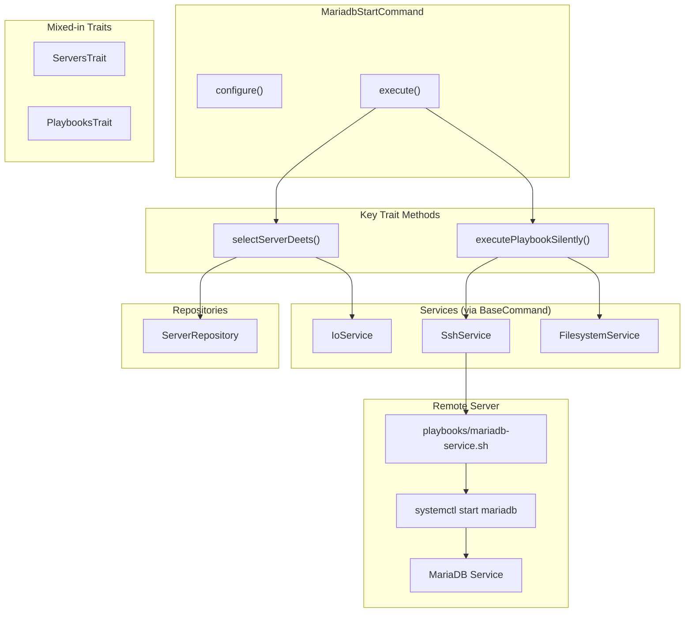
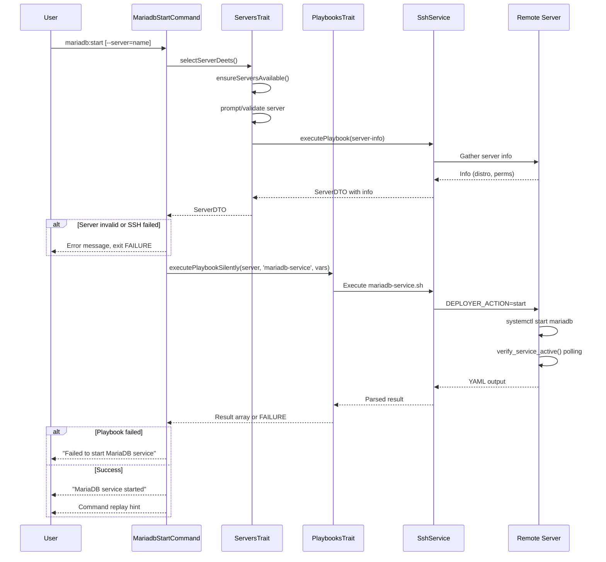

# Schematic: MariadbStartCommand.php

> Auto-generated schematic. Last updated: 2025-12-19

## Overview

MariadbStartCommand is a CLI command that starts the MariaDB database service on a remote server. It orchestrates server selection with validation, then executes the `mariadb-service` playbook with `start` action to bring the service online.

## Logic Flow

### Entry Points

| Method | Purpose |
|--------|---------|
| `configure()` | Adds `--server` option for server selection |
| `execute()` | Main command logic: select server, start MariaDB service |

### Execution Flow

```
1. Parent execute() initialization
   └─ Sets up I/O, loads env/inventory

2. Display heading "Start MariaDB Service"

3. selectServerDeets() [from ServersTrait]
   ├─ ensureServersAvailable() - Check inventory
   ├─ Prompt/validate server selection
   ├─ getServerInfo() - SSH to validate connection
   │   ├─ Distribution check (Debian/Ubuntu only)
   │   └─ Permissions check (root or sudo)
   └─ Return ServerDTO with info populated

4. Validate server selection result
   ├─ is_int(server) → Return FAILURE (selection failed)
   └─ server->info is null → Return FAILURE (SSH failed)

5. executePlaybookSilently() [from PlaybooksTrait]
   ├─ Playbook: 'mariadb-service'
   ├─ Message: 'Starting MariaDB service...'
   ├─ Env var: DEPLOYER_ACTION=start
   ├─ SSH execute with spinner
   ├─ Playbook runs systemctl start mariadb
   └─ Verify service active via polling

6. Check playbook result
   ├─ is_int(result) → Display error, return FAILURE
   └─ Success → Display success message

7. commandReplay() - Output non-interactive command hint

8. Return Command::SUCCESS
```

### Decision Points

| Location | Condition | True Branch | False Branch |
|----------|-----------|-------------|--------------|
| Line 54 | `is_int($server)` | Return FAILURE | Check server info |
| Line 54 | `null === $server->info` | Return FAILURE | Continue to playbook |
| Line 71 | `is_int($result)` | Display error, return FAILURE | Display success |

### Exit Conditions

| Condition | Exit | Return |
|-----------|------|--------|
| No servers in inventory | Early exit | `Command::FAILURE` |
| Server validation fails | Early exit | `Command::FAILURE` |
| SSH connection fails | Early exit | `Command::FAILURE` |
| Unsupported distribution | Early exit | `Command::FAILURE` |
| Insufficient permissions | Early exit | `Command::FAILURE` |
| Playbook execution fails | Early exit | `Command::FAILURE` |
| Service start timeout | Early exit | `Command::FAILURE` |
| Service started successfully | Normal exit | `Command::SUCCESS` |

## Interaction Diagram



### Sequence Diagram



## Dependencies

### Direct Imports

| File/Class | Usage |
|------------|-------|
| `Deployer\Contracts\BaseCommand` | Parent class providing services and output methods |
| `Deployer\Traits\PlaybooksTrait` | `executePlaybookSilently()` for remote script execution |
| `Deployer\Traits\ServersTrait` | `selectServerDeets()` for server selection with validation |
| `Symfony\Component\Console\Attribute\AsCommand` | Command registration metadata |
| `Symfony\Component\Console\Command\Command` | Return constants (SUCCESS, FAILURE) |
| `Symfony\Component\Console\Input\InputInterface` | CLI input handling |
| `Symfony\Component\Console\Input\InputOption` | `--server` option definition |
| `Symfony\Component\Console\Output\OutputInterface` | CLI output handling |

### Coupled Files

| File | Coupling Type | Description |
|------|---------------|-------------|
| `playbooks/mariadb-service.sh` | Playbook | Executed remotely to start MariaDB via systemctl |
| `playbooks/helpers.sh` | Playbook | Auto-inlined helpers (run_cmd, etc.) |
| `playbooks/server-info.sh` | Playbook | Called by ServersTrait to validate server |
| `app/Contracts/BaseCommand.php` | Inheritance | Provides `h1()`, `yay()`, `nay()`, `commandReplay()` |
| `app/Traits/ServersTrait.php` | Trait | Provides `selectServerDeets()` |
| `app/Traits/PlaybooksTrait.php` | Trait | Provides `executePlaybookSilently()` |
| `~/.deployer/inventory.yml` | Data | Server inventory read via ServerRepository |

## Data Flow

### Inputs

| Source | Data | Description |
|--------|------|-------------|
| CLI `--server` | Server name | Optional; prompts if omitted |
| ServerRepository | Server list | For selection validation |
| Remote server | Server info | Distribution, permissions |

### Outputs

| Destination | Data | Description |
|-------------|------|-------------|
| Console | Heading | "Start MariaDB Service" |
| Console | Server details | Via `displayServerDeets()` in ServersTrait |
| Console | Spinner | "Starting MariaDB service..." |
| Console | Success/Error | "MariaDB service started" or failure message |
| Console | Command replay | Non-interactive command for automation |

### Environment Variables Sent to Playbook

| Variable | Value | Description |
|----------|-------|-------------|
| `DEPLOYER_OUTPUT_FILE` | `/tmp/deployer-output-*.yml` | Temp file for YAML response |
| `DEPLOYER_SERVER_NAME` | Server name | From ServerDTO |
| `DEPLOYER_SSH_PORT` | SSH port | From ServerDTO |
| `DEPLOYER_DISTRO` | `ubuntu\|debian` | From server info |
| `DEPLOYER_PERMS` | `root\|sudo\|none` | From server info |
| `DEPLOYER_ACTION` | `start` | Action for mariadb-service.sh |

### Side Effects

| Effect | Description |
|--------|-------------|
| MariaDB service started | Remote server MariaDB daemon brought online |
| SSH connection | Established to remote server for playbook execution |
| Temp file creation/deletion | `/tmp/deployer-output-*.yml` on remote server |

## CLI Interface

### Options

| Option | Type | Description |
|--------|------|-------------|
| `--server` | VALUE_REQUIRED | Server name from inventory |

### Examples

```bash
# Interactive - prompts for server selection
deployer mariadb:start

# Non-interactive - uses specified server
deployer mariadb:start --server=production
```

### Command Replay Output

```
$> vendor/bin/deployer mariadb:start \
     --server='production'
```

## Notes

- **Trait Composition**: Uses two traits - ServersTrait for server selection and PlaybooksTrait for remote script execution.

- **Simple Command Pattern**: This is a straightforward service control command. No site context, no credentials, no complex validation beyond server selection.

- **Parallel Commands**: MariadbStopCommand and MariadbRestartCommand share identical structure, differing only in `DEPLOYER_ACTION` value and messages.

- **Idempotent Operation**: Starting an already-running service succeeds (systemctl is idempotent). The playbook verifies the service is active after the operation.

- **10-Second Timeout**: The `mariadb-service.sh` playbook polls for up to 10 seconds waiting for the service to become active. If the service doesn't start within this window, the command fails.
