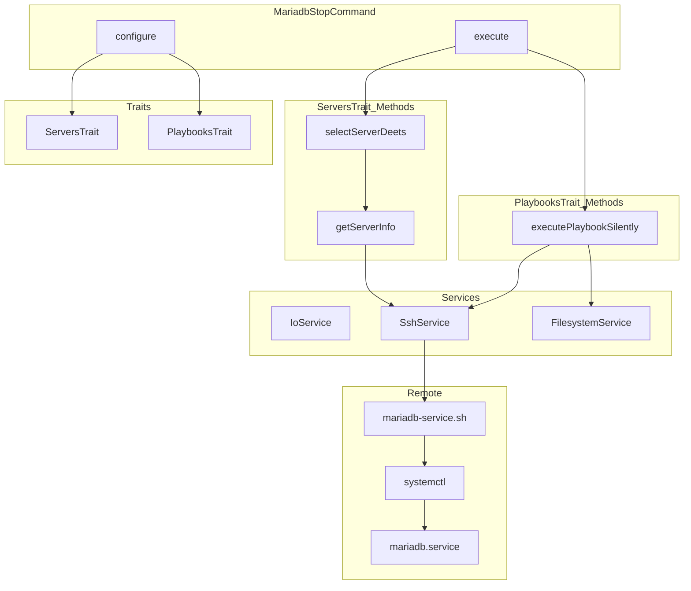
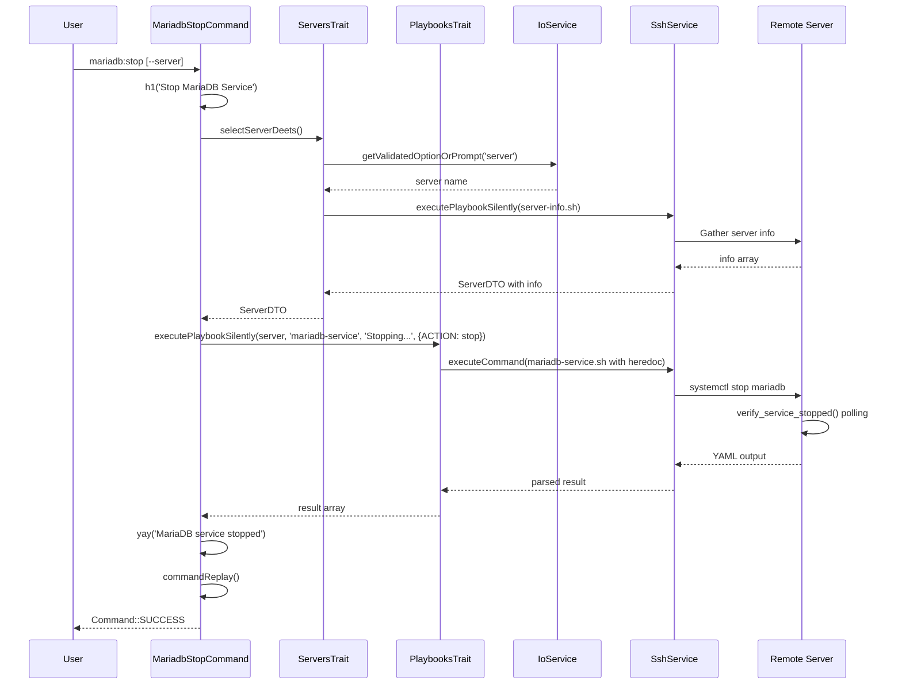

# Schematic: MariadbStopCommand.php

> Auto-generated schematic. Last updated: 2025-12-19 (updated)

## Overview

`MariadbStopCommand` stops the MariaDB service on a remote server. It prompts for server selection, validates server connectivity and permissions, then executes the `mariadb-service` playbook with `DEPLOYER_ACTION=stop`. The command follows the same pattern as other MariaDB service control commands (`start`, `restart`).

## Logic Flow

### Entry Points

| Method | Visibility | Purpose |
|--------|------------|---------|
| `configure()` | protected | Registers `--server` option |
| `execute()` | protected | Main execution flow |

### Execution Flow

```
1. Call parent::execute() for base initialization display

2. Display heading via h1('Stop MariaDB Service')

3. Select server via selectServerDeets() [ServersTrait]
   |-- Validates --server option or prompts interactively
   |-- Retrieves server info via SSH (server-info.sh playbook)
   |-- Returns ServerDTO with info populated OR Command::FAILURE

4. Early exit check: is_int($server) || null === $server->info
   |-- Return FAILURE if server selection or info retrieval failed

5. Execute mariadb-service playbook via executePlaybookSilently() [PlaybooksTrait]
   |-- Playbook: 'mariadb-service'
   |-- Status message: 'Stopping MariaDB service...'
   |-- Environment: DEPLOYER_ACTION=stop
   |-- Returns parsed YAML result or Command::FAILURE

6. Check playbook result: is_int($result)
   |-- True: Display error via nay(), return FAILURE
   |-- False: Continue

7. Display success via yay('MariaDB service stopped')

8. Display command replay via commandReplay()

9. Return Command::SUCCESS
```

### Decision Points

| Location | Condition | True Branch | False Branch |
|----------|-----------|-------------|--------------|
| Line 54 | `is_int($server)` | Return FAILURE | Continue |
| Line 54 | `null === $server->info` | Return FAILURE | Continue |
| Line 71 | `is_int($result)` | Display error, return FAILURE | Continue to success |

### Exit Conditions

| Condition | Return Value | Description |
|-----------|--------------|-------------|
| Server selection failed | `Command::FAILURE` | User cancelled or no servers available |
| Server info retrieval failed | `Command::FAILURE` | SSH/permission issues |
| Playbook execution failed | `Command::FAILURE` | SSH error, systemctl failure, or verification timeout |
| Success | `Command::SUCCESS` | MariaDB service stopped and verified |

## Interaction Diagram





## Dependencies

### Direct Imports

| File/Class | Usage |
|------------|-------|
| `Deployer\Contracts\BaseCommand` | Parent class providing services and output methods |
| `Deployer\Traits\PlaybooksTrait` | Provides `executePlaybookSilently()` |
| `Deployer\Traits\ServersTrait` | Provides `selectServerDeets()` |
| `Symfony\Component\Console\Attribute\AsCommand` | Command registration attribute |
| `Symfony\Component\Console\Command\Command` | Return code constants |
| `Symfony\Component\Console\Input\InputInterface` | Execute method parameter |
| `Symfony\Component\Console\Input\InputOption` | Option type constants |
| `Symfony\Component\Console\Output\OutputInterface` | Execute method parameter |

### Coupled Files

| File | Coupling Type | Description |
|------|---------------|-------------|
| `app/Contracts/BaseCommand.php` | Inheritance | Provides `$this->io`, output methods, `commandReplay()` |
| `app/Traits/ServersTrait.php` | Trait | Server selection and info retrieval |
| `app/Traits/PlaybooksTrait.php` | Trait | Remote playbook execution |
| `app/Services/IoService.php` | Service | Input/output via `$this->io` |
| `app/Services/SshService.php` | Service | Remote command execution |
| `app/Services/FilesystemService.php` | Service | Reading playbook files |
| `app/DTOs/ServerDTO.php` | Data | Server connection and info data |
| `playbooks/mariadb-service.sh` | Playbook | Service control with verification |
| `playbooks/server-info.sh` | Playbook | Retrieves server info via ServersTrait |
| `playbooks/helpers.sh` | Playbook | Inlined helper functions |
| `~/.deployer/deployer.yml` | Data | Server inventory |

## Data Flow

### Inputs

| Source | Data | Type |
|--------|------|------|
| CLI option `--server` | Server name | `?string` |
| Interactive prompt | Server selection | `string` |
| ServerRepository | Available servers | `array<ServerDTO>` |
| Remote server | Server info | `array` |

### Outputs

| Destination | Data | Description |
|-------------|------|-------------|
| Console | Heading | "Stop MariaDB Service" |
| Console | Server details | Name, host, port, user, key path |
| Console | Spinner | "Stopping MariaDB service..." |
| Console | Success message | "MariaDB service stopped" |
| Console | Command replay | Non-interactive equivalent command |

### Side Effects

| Effect | Description |
|--------|-------------|
| SSH connections | Two connections: server-info.sh, mariadb-service.sh |
| Service state change | MariaDB service stopped via systemctl |
| Console output | Multiple sections written to stdout |

## CLI Options

| Option | Short | Type | Default | Description |
|--------|-------|------|---------|-------------|
| `--server` | - | VALUE_REQUIRED | - | Server name from inventory |

## Validation

| Input | Validator | Rules |
|-------|-----------|-------|
| `--server` | `validateServerSelection()` | Must exist in inventory |

## Playbook Execution

The command executes `mariadb-service.sh` with:

```php
$this->executePlaybookSilently(
    $server,
    'mariadb-service',
    'Stopping MariaDB service...',
    [
        'DEPLOYER_ACTION' => 'stop',
    ],
);
```

The playbook:

1. Executes `systemctl stop mariadb`
2. Polls `systemctl is-active --quiet mariadb` every 1 second
3. Succeeds when service reports inactive (non-zero exit)
4. Times out after 10 seconds if service doesn't stop

## Command Replay Example

```bash
vendor/bin/deployer mariadb:stop \
  --server='production'
```

## Related Commands

| Command | Similarity |
|---------|------------|
| `mysql:stop` | Identical pattern, different service (mysqld) |
| `mariadb:start` | Same structure, DEPLOYER_ACTION=start |
| `mariadb:restart` | Same structure, DEPLOYER_ACTION=restart |
| `mariadb:logs` | Same server selection, shows logs instead |
| `mariadb:install` | Same server selection, installs MariaDB |

## Notes

- Uses `selectServerDeets()` which combines server selection and info retrieval in one call
- Server info validation ensures SSH connectivity and sudo permissions before service control
- The playbook uses `run_cmd` helper which handles root vs sudo execution based on `DEPLOYER_PERMS`
- Service state verification provides reliable confirmation that MariaDB actually stopped
- Idempotent: stopping an already-stopped service succeeds (systemctl handles this gracefully)
