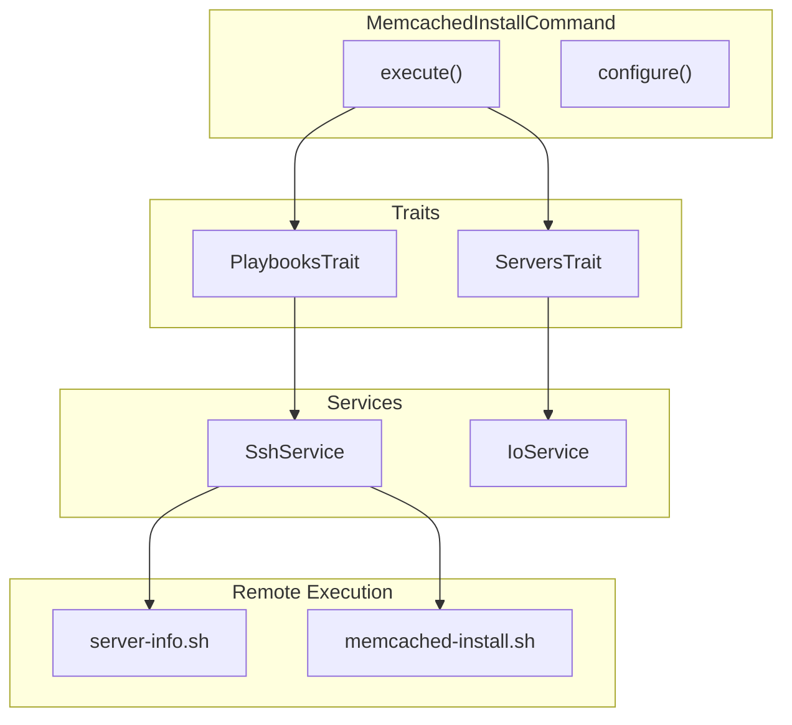

# Schematic: MemcachedInstallCommand.php

> Auto-generated schematic. Last updated: 2025-12-19

## Overview

`MemcachedInstallCommand` installs Memcached server on a remote server. It executes the `memcached-install` playbook which installs packages, configures localhost-only access, and sets up logrotate. The command handles both fresh installs and already-installed scenarios gracefully.

## Logic Flow

### Entry Points

| Method | Visibility | Description |
|--------|------------|-------------|
| `configure()` | protected | Registers `--server` CLI option |
| `execute()` | protected | Main execution - selects server, runs playbook, displays result |

### Execution Flow

```
1. execute()
   |
   +-- Display heading "Install Memcached"
   |
   +-- selectServerDeets() [ServersTrait]
   |   |-- ensureServersAvailable()
   |   |-- Prompt/validate server selection
   |   +-- getServerInfo() -> runs server-info playbook
   |
   +-- Check: is_int($server) || null === $server->info
   |   |-- True: return FAILURE
   |
   +-- executePlaybook(server, 'memcached-install', 'Installing Memcached...')
   |   |-- SSH to server, execute playbook
   |   |-- Parse YAML output
   |
   +-- Check: is_int($result)
   |   |-- True: return $result (FAILURE)
   |
   +-- Check: $result['already_installed'] ?? false
   |   |-- True: info("Memcached is already installed on this server")
   |   |-- False: yay("Memcached installation completed successfully")
   |
   +-- commandReplay('memcached:install', ['server' => $server->name])
   |
   +-- return SUCCESS
```

### Decision Points

| Location | Condition | True Branch | False Branch |
|----------|-----------|-------------|--------------|
| Line 52 | `is_int($server) \|\| null === $server->info` | Return FAILURE | Continue |
| Line 66 | `is_int($result)` | Return playbook failure code | Continue |
| Line 74 | `$result['already_installed'] ?? false` | Display info message | Display success message |

### Exit Conditions

| Exit Point | Condition | Return Value |
|------------|-----------|--------------|
| Line 53 | Server selection failed or no info | `Command::FAILURE` |
| Line 67 | Playbook execution failed | `Command::FAILURE` (via $result) |
| Line 88 | Success | `Command::SUCCESS` |

## Interaction Diagram



## Dependencies

### Direct Imports

| File/Class | Usage |
|------------|-------|
| `Deployer\Contracts\BaseCommand` | Parent class providing DI, output methods |
| `Deployer\Traits\PlaybooksTrait` | Provides `executePlaybook()` for remote execution |
| `Deployer\Traits\ServersTrait` | Provides `selectServerDeets()` for server selection |
| `Symfony\Component\Console\Attribute\AsCommand` | Command metadata attribute |
| `Symfony\Component\Console\Command\Command` | Constants `SUCCESS`, `FAILURE` |
| `Symfony\Component\Console\Input\InputInterface` | CLI input handling |
| `Symfony\Component\Console\Input\InputOption` | Option definition constants |
| `Symfony\Component\Console\Output\OutputInterface` | CLI output handling |

### Coupled Files

| File | Coupling Type | Description |
|------|---------------|-------------|
| `playbooks/memcached-install.sh` | Playbook | Remote installation script |
| `playbooks/server-info.sh` | Playbook | Server info gathering (via ServersTrait) |
| `app/Repositories/ServerRepository.php` | Repository | Server lookup for selection |
| `app/Services/SshService.php` | Service | SSH connection for playbook execution |

## Data Flow

### Inputs

| Source | Data | Processing |
|--------|------|------------|
| CLI `--server` | Server name string | Validated against inventory |

### Outputs

| Destination | Data | Format |
|-------------|------|--------|
| Console | Success/already-installed message | Text via `yay()`/`info()` |
| Console | Command replay | CLI command string |

### Side Effects

| Effect | Location | Trigger |
|--------|----------|---------|
| Memcached installed | Remote server | Fresh installation |
| Memcached service started | Remote server | Fresh installation |
| Logrotate configured | Remote server | Fresh installation |

## Notes

### Playbook Output

The `memcached-install` playbook returns:

- `status: success` - Always on success
- `already_installed: true` - When Memcached was already running

### Idempotency

The command is fully idempotent:

- If Memcached is already installed and running, returns gracefully with info message
- If not installed, performs full installation

### Pattern Consistency

Follows same pattern as `MysqlInstallCommand` and `MariadbInstallCommand`:

1. Select server with info
2. Execute install playbook
3. Handle already-installed case
4. Show command replay
