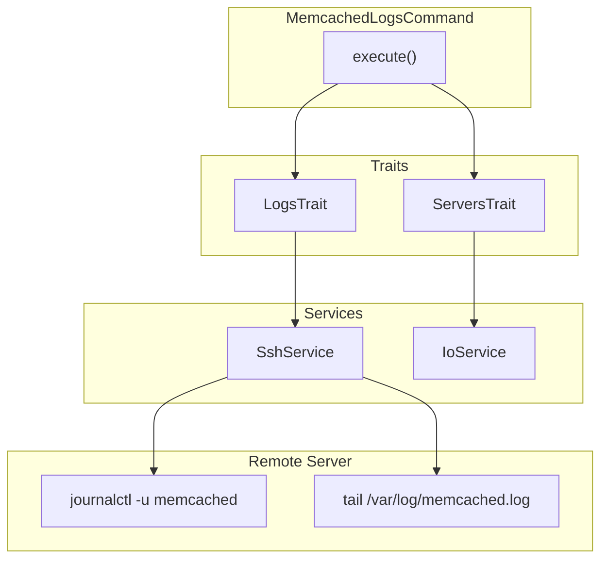

# Schematic: MemcachedLogsCommand.php

> Auto-generated schematic. Last updated: 2025-12-19

## Overview

`MemcachedLogsCommand` displays Memcached service status and logs from a remote server. Unlike other service commands, it retrieves both journalctl service logs AND file-based logs from `/var/log/memcached.log`, providing comprehensive visibility into Memcached operation.

## Logic Flow

### Entry Points

| Method | Visibility | Description |
|--------|------------|-------------|
| `configure()` | protected | Registers `--server` and `--lines` CLI options |
| `execute()` | protected | Main execution - selects server, retrieves logs |

### Execution Flow

```
1. execute()
   |
   +-- Display heading "Memcached Service Status"
   |
   +-- selectServerDeets() [ServersTrait]
   |   |-- ensureServersAvailable()
   |   |-- Prompt/validate server selection
   |   +-- getServerInfo() -> runs server-info playbook
   |
   +-- Check: is_int($server) || null === $server->info
   |   |-- True: return FAILURE
   |
   +-- try {
   |       getValidatedOptionOrPrompt('lines', promptText(default: '50'), validateLineCount)
   |   } catch (ValidationException) -> nay(), return FAILURE
   |
   +-- retrieveJournalLogs(server, 'Memcached Service', 'memcached', lineCount)
   |   |-- SSH: journalctl -u memcached -n {lines}
   |   |-- Display with error highlighting
   |
   +-- retrieveFileLogs(server, 'Memcached Log', '/var/log/memcached.log', lineCount)
   |   |-- SSH: tail -n {lines} /var/log/memcached.log
   |   |-- Display with error highlighting
   |
   +-- commandReplay('memcached:logs', ['server' => $server->name, 'lines' => $lines])
   |
   +-- return SUCCESS
```

### Decision Points

| Location | Condition | True Branch | False Branch |
|----------|-----------|-------------|--------------|
| Line 56 | `is_int($server) \|\| null === $server->info` | Return FAILURE | Continue |
| Line 75 | `ValidationException` caught | Display error, return FAILURE | Continue |

### Exit Conditions

| Exit Point | Condition | Return Value |
|------------|-----------|--------------|
| Line 57 | Server selection failed or no info | `Command::FAILURE` |
| Line 78 | Line count validation failed | `Command::FAILURE` |
| Line 104 | Success | `Command::SUCCESS` |

## Interaction Diagram



## Dependencies

### Direct Imports

| File/Class | Usage |
|------------|-------|
| `Deployer\Contracts\BaseCommand` | Parent class |
| `Deployer\Exceptions\ValidationException` | Thrown when CLI validation fails |
| `Deployer\Traits\LogsTrait` | Provides `retrieveJournalLogs()`, `retrieveFileLogs()`, `validateLineCount()` |
| `Deployer\Traits\ServersTrait` | Provides `selectServerDeets()` |
| `Symfony\Component\Console\Attribute\AsCommand` | Command metadata |
| `Symfony\Component\Console\Command\Command` | Constants |
| `Symfony\Component\Console\Input\InputInterface` | CLI input |
| `Symfony\Component\Console\Input\InputOption` | Option constants |
| `Symfony\Component\Console\Output\OutputInterface` | CLI output |

### Coupled Files

| File | Coupling Type | Description |
|------|---------------|-------------|
| `app/Traits/LogsTrait.php` | Trait | Log retrieval and validation methods |
| `app/Services/SshService.php` | Service | SSH connection for log retrieval |
| `/var/log/memcached.log` | Log | Remote Memcached log file |

## Data Flow

### Inputs

| Source | Data | Processing |
|--------|------|------------|
| CLI `--server` | Server name | Validated against inventory |
| CLI `--lines` | Number of lines | Validated as positive integer <= 1000 |

### Outputs

| Destination | Data | Format |
|-------------|------|--------|
| Console | Journal logs | Text with error highlighting |
| Console | File logs | Text with error highlighting |
| Console | Command replay | CLI command string |

### Side Effects

None - read-only command.

## Notes

### Dual Log Sources

Unlike simpler status commands (MySQL, MariaDB), this command retrieves from two sources:

1. **Journal logs** - systemd service logs via `journalctl -u memcached`
2. **File logs** - Application logs from `/var/log/memcached.log`

This matches the `type: 'both'` configuration in `ServerLogsCommand::PORT_SOURCES`.

### Validation Pattern

Uses `getValidatedOptionOrPrompt()` with `validateLineCount()` from `LogsTrait`:

- Must be numeric and positive
- Cannot exceed 1000 lines

### Pattern Consistency

Follows same pattern as `MysqlLogsCommand`, `MariadbLogsCommand`:

1. Select server
2. Validate line count
3. Retrieve and display logs
4. Show command replay

### Log File Location

The log file path `/var/log/memcached.log` is configured during installation via `memcached-install.sh` which also sets up logrotate for this file.
