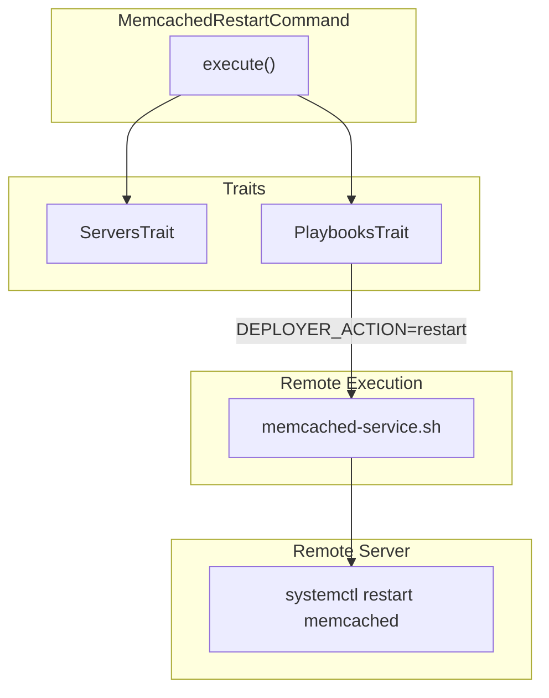

# Schematic: MemcachedRestartCommand.php

> Auto-generated schematic. Last updated: 2025-12-19

## Overview

`MemcachedRestartCommand` restarts the Memcached service on a remote server. It executes the `memcached-service` playbook with `DEPLOYER_ACTION=restart`, then verifies the service is running before reporting success.

## Logic Flow

### Entry Points

| Method | Visibility | Description |
|--------|------------|-------------|
| `configure()` | protected | Registers `--server` CLI option |
| `execute()` | protected | Main execution - selects server, restarts service |

### Execution Flow

```
1. execute()
   |
   +-- Display heading "Restart Memcached Service"
   |
   +-- selectServerDeets() [ServersTrait]
   |
   +-- Check: is_int($server) || null === $server->info
   |   |-- True: return FAILURE
   |
   +-- executePlaybookSilently(server, 'memcached-service', 'Restarting...', {DEPLOYER_ACTION: 'restart'})
   |
   +-- Check: is_int($result)
   |   |-- True: nay("Failed to restart Memcached service"), return FAILURE
   |
   +-- yay("Memcached service restarted")
   |
   +-- commandReplay('memcached:restart', ['server' => $server->name])
   |
   +-- return SUCCESS
```

### Decision Points

| Location | Condition | True Branch | False Branch |
|----------|-----------|-------------|--------------|
| Line 52 | `is_int($server) \|\| null === $server->info` | Return FAILURE | Continue |
| Line 69 | `is_int($result)` | Display error, return FAILURE | Continue with success |

### Exit Conditions

| Exit Point | Condition | Return Value |
|------------|-----------|--------------|
| Line 53 | Server selection failed or no info | `Command::FAILURE` |
| Line 72 | Playbook execution failed | `Command::FAILURE` |
| Line 85 | Success | `Command::SUCCESS` |

## Interaction Diagram



## Dependencies

### Direct Imports

| File/Class | Usage |
|------------|-------|
| `Deployer\Contracts\BaseCommand` | Parent class |
| `Deployer\Traits\PlaybooksTrait` | Provides `executePlaybookSilently()` |
| `Deployer\Traits\ServersTrait` | Provides `selectServerDeets()` |
| `Symfony\Component\Console\Attribute\AsCommand` | Command metadata |
| `Symfony\Component\Console\Command\Command` | Constants |
| `Symfony\Component\Console\Input\InputInterface` | CLI input |
| `Symfony\Component\Console\Input\InputOption` | Option constants |
| `Symfony\Component\Console\Output\OutputInterface` | CLI output |

### Coupled Files

| File | Coupling Type | Description |
|------|---------------|-------------|
| `playbooks/memcached-service.sh` | Playbook | Service control script |
| `app/Repositories/ServerRepository.php` | Repository | Server lookup |
| `app/Services/SshService.php` | Service | SSH connection |

## Data Flow

### Inputs

| Source | Data | Processing |
|--------|------|------------|
| CLI `--server` | Server name | Validated against inventory |

### Outputs

| Destination | Data | Format |
|-------------|------|--------|
| Console | Success/failure message | Text via `yay()`/`nay()` |
| Console | Command replay | CLI command string |

### Side Effects

| Effect | Location | Trigger |
|--------|----------|---------|
| Memcached service restarted | Remote server | Successful execution |

## Notes

### Service Verification

The `memcached-service.sh` playbook reuses `verify_service_active()` for restart action, confirming service is running after restart.

### Pattern Consistency

Matches structure of `MysqlRestartCommand`, `MariadbRestartCommand`.
