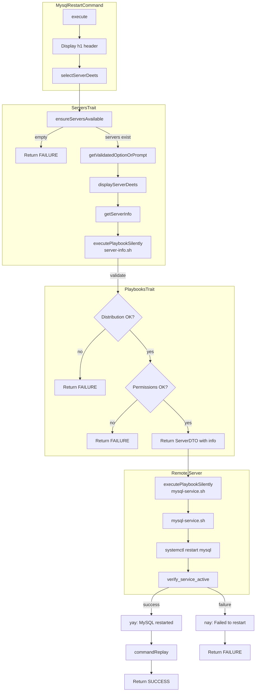

# Schematic: MysqlRestartCommand.php

> Auto-generated schematic. Last updated: 2025-12-19

## Overview

`MysqlRestartCommand` is a Symfony Console command that restarts the MySQL service on a remote server. It prompts for server selection, validates SSH connectivity and permissions, then executes the `mysql-service.sh` playbook with the `restart` action to restart MySQL via systemctl.

## Logic Flow

### Entry Points

| Method | Visibility | Purpose |
|--------|------------|---------|
| `configure()` | protected | Registers `--server` option for non-interactive server selection |
| `execute()` | protected | Main command execution - orchestrates server selection and MySQL restart |

### Execution Flow

1. **Initialization** (via `BaseCommand::initialize()`)
   - Initialize IoService with command context
   - Load environment file (`.env`)
   - Load inventory file (`deployer.yml`)
   - Populate ServerRepository and SiteRepository from inventory

2. **Display header**
   - Call `parent::execute()` to display env/inventory status
   - Display `h1('Restart MySQL Service')` heading

3. **Server selection** (via `ServersTrait::selectServerDeets()`)
   - Check servers available in inventory (`ensureServersAvailable()`)
   - Prompt for server selection or use `--server` CLI option
   - Display server details (`displayServerDeets()`)
   - Retrieve and validate server info via `server-info.sh` playbook
   - Validate distribution (Debian/Ubuntu only)
   - Validate permissions (root or passwordless sudo required)
   - Return `ServerDTO` with populated `info` array

4. **Validate server info**
   - Check if `selectServerDeets()` returned an integer (failure) or null info
   - Return `Command::FAILURE` if validation failed

5. **Execute MySQL restart** (via `PlaybooksTrait::executePlaybookSilently()`)
   - Execute `mysql-service.sh` playbook with `DEPLOYER_ACTION=restart`
   - Display spinner with "Restarting MySQL service..." message
   - Playbook runs `systemctl restart mysql`
   - Playbook verifies service is active (up to 10 second timeout)
   - Return parsed YAML response or `Command::FAILURE`

6. **Handle result**
   - On failure: display "Failed to restart MySQL service" and return `FAILURE`
   - On success: display "MySQL service restarted" success message

7. **Command replay**
   - Output non-interactive command equivalent for automation

### Decision Points

| Line | Condition | True Branch | False Branch |
|------|-----------|-------------|--------------|
| 54 | `is_int($server) \|\| null === $server->info` | Return `Command::FAILURE` | Continue to restart |
| 71 | `is_int($result)` | Display failure message, return `FAILURE` | Display success, continue |

### Exit Conditions

| Return Code | Condition |
|-------------|-----------|
| `Command::FAILURE` | No servers in inventory |
| `Command::FAILURE` | Server validation fails (CLI option) |
| `Command::FAILURE` | SSH connection fails |
| `Command::FAILURE` | Unsupported distribution |
| `Command::FAILURE` | Insufficient permissions |
| `Command::FAILURE` | MySQL restart fails |
| `Command::SUCCESS` | MySQL restarted successfully |

## Interaction Diagram

## Dependencies

### Direct Imports

| File/Class | Usage |
|------------|-------|
| `Deployer\Contracts\BaseCommand` | Parent class providing shared command infrastructure |
| `Deployer\Traits\PlaybooksTrait` | `executePlaybookSilently()` for running remote scripts |
| `Deployer\Traits\ServersTrait` | `selectServerDeets()` for server selection and validation |
| `Symfony\Component\Console\Attribute\AsCommand` | Command registration attribute |
| `Symfony\Component\Console\Command\Command` | Return code constants |
| `Symfony\Component\Console\Input\InputInterface` | Command input handling |
| `Symfony\Component\Console\Input\InputOption` | CLI option definition |
| `Symfony\Component\Console\Output\OutputInterface` | Command output handling |

### Coupled Files

| File | Coupling Type | Description |
|------|---------------|-------------|
| `playbooks/mysql-service.sh` | Playbook | Remote script that executes `systemctl restart mysql` |
| `playbooks/server-info.sh` | Playbook | Used by `getServerInfo()` to validate SSH and gather server details |
| `playbooks/helpers.sh` | Playbook | Helper functions inlined into playbooks (run_cmd, etc.) |
| `deployer.yml` | Config | Inventory file containing server definitions |
| `.env` | Config | Environment file loaded during initialization |
| `app/DTOs/ServerDTO.php` | Data | Immutable server data object with `info` array |
| `app/Repositories/ServerRepository.php` | Data | Server inventory access |
| `app/Services/SshService.php` | Service | SSH connection and command execution |
| `app/Services/IoService.php` | Service | Console I/O and prompts |

## Data Flow

### Inputs

| Source | Data | Type |
|--------|------|------|
| CLI option `--server` | Server name | `?string` |
| Interactive prompt | Server selection | `string` |
| `deployer.yml` | Server inventory | `array` |
| `.env` | Environment variables | `array` |

### Outputs

| Destination | Data | Type |
|-------------|------|------|
| Console | Status messages | `string` |
| Console | Success/failure indication | `string` |
| Console | Command replay hint | `string` |

### Side Effects

| Effect | Description |
|--------|-------------|
| SSH connection | Establishes SSH connection to selected server |
| MySQL restart | Restarts MySQL service via `systemctl restart mysql` |
| Service verification | Waits up to 10 seconds for MySQL to become active |

## Notes

- The command uses `executePlaybookSilently()` which shows a spinner rather than streaming output
- Server info gathering (`server-info.sh`) happens before the restart to validate:
  - Distribution is Debian or Ubuntu
  - User has root or passwordless sudo access
- The `mysql-service.sh` playbook supports `start`, `stop`, and `restart` actions via `DEPLOYER_ACTION`
- Service verification includes a 10-second timeout with 1-second polling interval
- This command follows the same pattern as `MysqlStartCommand`, `MysqlStopCommand`, and `MysqlLogsCommand`
