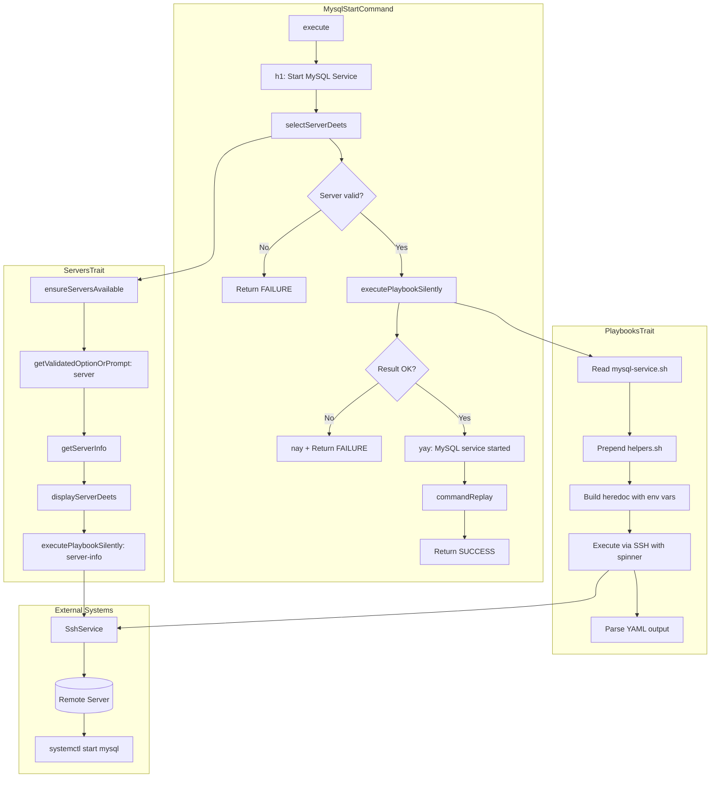
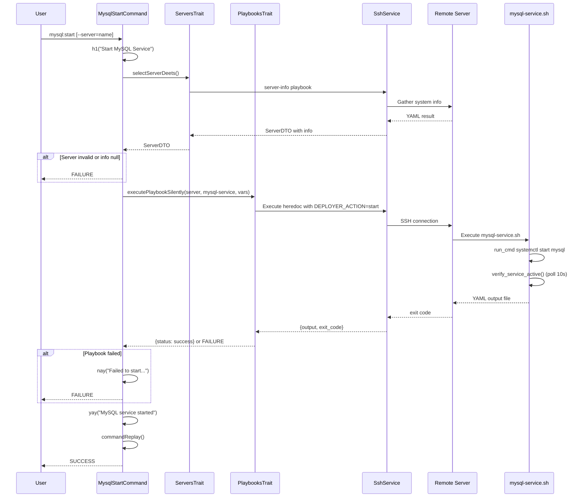

# Schematic: MysqlStartCommand.php

> Auto-generated schematic. Last updated: 2025-12-19

## Overview

CLI command that starts the MySQL service on a remote server. Uses `ServersTrait::selectServerDeets()` for server selection with SSH validation, and `PlaybooksTrait::executePlaybookSilently()` to execute the `mysql-service` playbook with `DEPLOYER_ACTION=start`. The playbook uses systemctl to start the service and verifies it becomes active.

## Logic Flow

### Entry Points

| Method | Visibility | Description |
|--------|------------|-------------|
| `execute()` | protected | Main command entry point via Symfony Console |

### Execution Flow

1. **Display heading** - Output "Start MySQL Service" heading via `h1()`
2. **Server selection** - Call `selectServerDeets()` (ServersTrait) which:
   - Validates servers exist in inventory
   - Prompts for server selection (CLI option or interactive)
   - Displays server details
   - Executes `server-info` playbook to gather system info
   - Validates distribution (Debian/Ubuntu) and permissions (root/sudo)
   - Returns `ServerDTO` with populated `info` array
3. **Early exit check** - Return `FAILURE` if server selection failed or `info` is null
4. **Execute playbook** - Call `executePlaybookSilently()` (PlaybooksTrait) with:
   - Server context for SSH connection
   - Playbook name: `mysql-service`
   - Status message: "Starting MySQL service..."
   - Environment variable: `DEPLOYER_ACTION=start`
5. **Result check** - If playbook returns integer (failure), display error and return `FAILURE`
6. **Success message** - Display "MySQL service started" via `yay()`
7. **Command replay** - Output non-interactive command for automation
8. **Return success** - Return `Command::SUCCESS`

### Decision Points

| Location | Condition | Branch |
|----------|-----------|--------|
| Line 54 | `is_int($server) \|\| null === $server->info` | Return `FAILURE` (server selection or info retrieval failed) |
| Line 71 | `is_int($result)` | Display error message, return `FAILURE` (playbook execution failed) |

### Exit Conditions

| Condition | Return Value |
|-----------|--------------|
| No servers in inventory | `Command::FAILURE` |
| Invalid server selection | `Command::FAILURE` |
| SSH connection failure | `Command::FAILURE` |
| Unsupported distribution | `Command::FAILURE` |
| Insufficient permissions | `Command::FAILURE` |
| Playbook execution failure | `Command::FAILURE` |
| Service verification timeout (10s) | `Command::FAILURE` |
| Successful service start | `Command::SUCCESS` |

## Interaction Diagram

## Sequence Diagram

## Dependencies

### Direct Imports

| File/Class | Usage |
|------------|-------|
| `Deployer\Contracts\BaseCommand` | Parent class providing DI, output methods, command infrastructure |
| `Deployer\Traits\PlaybooksTrait` | Provides `executePlaybookSilently()` for remote script execution |
| `Deployer\Traits\ServersTrait` | Provides `selectServerDeets()` for server selection flow |
| `Symfony\Component\Console\Attribute\AsCommand` | Command registration attribute |
| `Symfony\Component\Console\Command\Command` | Return code constants |
| `Symfony\Component\Console\Input\InputInterface` | Command input handling |
| `Symfony\Component\Console\Input\InputOption` | CLI option definitions |
| `Symfony\Component\Console\Output\OutputInterface` | Command output handling |

### Coupled Files

| File | Coupling Type | Description |
|------|---------------|-------------|
| `playbooks/mysql-service.sh` | Playbook | Executed with `DEPLOYER_ACTION=start` to start MySQL |
| `playbooks/helpers.sh` | Playbook | Auto-inlined by PlaybooksTrait for `run_cmd` function |
| `playbooks/server-info.sh` | Playbook | Executed via ServersTrait to validate server |
| `app/Services/SshService.php` | Service | Executes remote commands via SSH |
| `app/Services/IoService.php` | Service | Provides spinner and output methods |
| `app/Repositories/ServerRepository.php` | Data | Server inventory access |
| `app/DTOs/ServerDTO.php` | Data | Server connection details and info |
| `deployer.yml` | Config | Server inventory source |

## Data Flow

### Inputs

| Source | Data | Type |
|--------|------|------|
| CLI option `--server` | Server name | `string` (optional) |
| Interactive prompt | Server selection | `string` |
| Server inventory | Available servers | `ServerDTO[]` |
| Server info playbook | Distribution, permissions | `array` |

### Outputs

| Destination | Data | Type |
|-------------|------|------|
| Console | Start MySQL Service heading | Formatted text |
| Console | Server details | Formatted key-value pairs |
| Console | Spinner during execution | "Starting MySQL service..." |
| Console | Success message | "MySQL service started" |
| Console | Error message (on failure) | "Failed to start MySQL service" |
| Console | Command replay hint | Formatted command string |

### Side Effects

| Effect | Description |
|--------|-------------|
| SSH connection | Establishes SSH connection to remote server |
| Remote playbook | Executes `server-info.sh` playbook for server validation |
| Remote playbook | Executes `mysql-service.sh` playbook with `DEPLOYER_ACTION=start` |
| Service state change | Starts MySQL systemd service on remote server |
| Temp file | Creates and cleans up `/tmp/deployer-output-*.yml` on remote server |

## Environment Variables

Injected into `mysql-service.sh` via PlaybooksTrait:

| Variable | Value | Description |
|----------|-------|-------------|
| `DEPLOYER_OUTPUT_FILE` | `/tmp/deployer-output-{ts}-{hex}.yml` | Unique temp file for YAML output |
| `DEPLOYER_SERVER_NAME` | `$server->name` | Server name from inventory |
| `DEPLOYER_SSH_PORT` | `$server->port` | SSH port number |
| `DEPLOYER_DISTRO` | `$server->info['distro']` | Distribution (ubuntu\|debian) |
| `DEPLOYER_PERMS` | `$server->info['permissions']` | Permission level (root\|sudo) |
| `DEPLOYER_ACTION` | `start` | Action for mysql-service.sh |

## Notes

### Architectural Notes

- **Trait Composition**: Uses two traits (`PlaybooksTrait`, `ServersTrait`) for server selection and playbook execution
- **Silent Execution**: Uses `executePlaybookSilently()` which displays a spinner rather than streaming output
- **Service Layer**: All SSH operations go through `SshService`, maintaining layer separation
- **No ValidationException**: Unlike other commands, this one has no user input validation (only server selection)

### Playbook Behavior

The `mysql-service.sh` playbook:

1. Validates required environment variables
2. Calls `systemctl start mysql` via `run_cmd` (permission-aware)
3. Polls `systemctl is-active mysql` for up to 10 seconds
4. Returns `{status: success}` on success, exits with code 1 on failure

### Related Commands

- `mysql:stop` - Identical structure, uses `DEPLOYER_ACTION=stop`
- `mysql:restart` - Identical structure, uses `DEPLOYER_ACTION=restart`
- `mysql:logs` - Different pattern, uses `LogsTrait` for log retrieval
- `mysql:install` - Different playbook (`mysql-install`), more complex flow
- `mariadb:start` - Identical structure for MariaDB service
