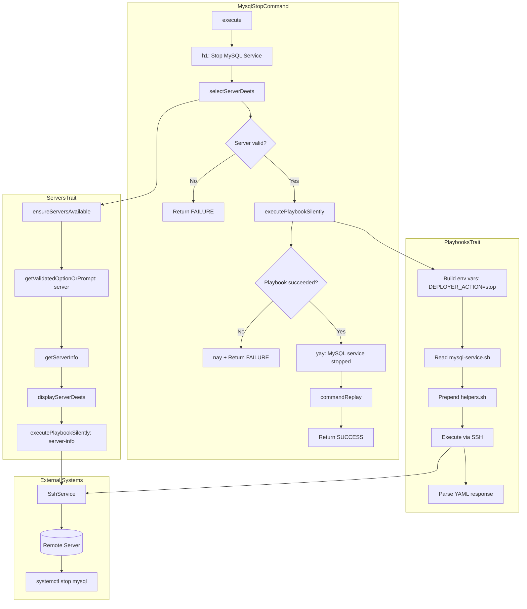
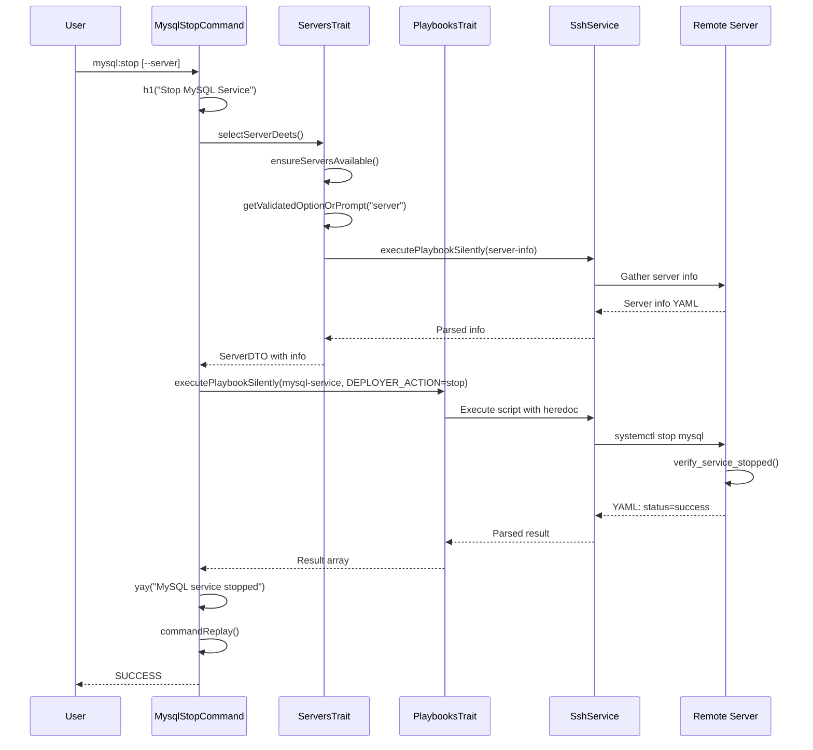

# Schematic: MysqlStopCommand.php

> Auto-generated schematic. Last updated: 2025-12-19

## Overview

CLI command that stops the MySQL service on a remote server. Uses `ServersTrait::selectServerDeets()` for server selection with SSH validation, then executes the `mysql-service` playbook with `DEPLOYER_ACTION=stop` to stop the MySQL systemd service. Part of the MySQL service control command family (start, stop, restart, status, install).

## Logic Flow

### Entry Points

| Method | Visibility | Description |
|--------|------------|-------------|
| `execute()` | protected | Main command entry point via Symfony Console |

### Execution Flow

1. **Display heading** - Output "Stop MySQL Service" heading via `h1()`
2. **Server selection** - Call `selectServerDeets()` (ServersTrait) which:
   - Validates servers exist in inventory
   - Prompts for server selection (CLI option or interactive)
   - Displays server details
   - Executes `server-info` playbook to gather system info
   - Validates distribution (Debian/Ubuntu) and permissions (root/sudo)
   - Returns `ServerDTO` with populated `info` array
3. **Early exit check** - Return `FAILURE` if server selection failed or `info` is null
4. **Execute playbook** - Call `executePlaybookSilently()` (PlaybooksTrait) with:
   - Server context for SSH connection
   - Playbook name: `mysql-service`
   - Status message: "Stopping MySQL service..."
   - Environment variable: `DEPLOYER_ACTION=stop`
5. **Handle playbook result** - Check if result is failure:
   - Failure: Display error via `nay()`, return `FAILURE`
   - Success: Display success via `yay()`
6. **Command replay** - Output non-interactive command for automation
7. **Return success** - Return `Command::SUCCESS`

### Decision Points

| Location | Condition | Branch |
|----------|-----------|--------|
| Line 54 | `is_int($server) \|\| null === $server->info` | Return `FAILURE` (server selection or info retrieval failed) |
| Line 71 | `is_int($result)` | Display error, return `FAILURE` (playbook execution failed) |

### Exit Conditions

| Condition | Return Value |
|-----------|--------------|
| No servers in inventory | `Command::FAILURE` |
| Invalid server selection | `Command::FAILURE` |
| SSH connection failure | `Command::FAILURE` |
| Unsupported distribution | `Command::FAILURE` |
| Insufficient permissions | `Command::FAILURE` |
| Playbook execution failed | `Command::FAILURE` |
| Service stop failed | `Command::FAILURE` |
| Service verification timeout | `Command::FAILURE` |
| Successful service stop | `Command::SUCCESS` |

## Interaction Diagram

## Dependencies

### Direct Imports

| File/Class | Usage |
|------------|-------|
| `Deployer\Contracts\BaseCommand` | Parent class providing DI, output methods, command infrastructure |
| `Deployer\Traits\PlaybooksTrait` | Provides `executePlaybookSilently()` for remote script execution |
| `Deployer\Traits\ServersTrait` | Provides `selectServerDeets()` for server selection flow |
| `Symfony\Component\Console\Attribute\AsCommand` | Command registration attribute |
| `Symfony\Component\Console\Command\Command` | Return code constants |
| `Symfony\Component\Console\Input\InputInterface` | Command input handling |
| `Symfony\Component\Console\Input\InputOption` | CLI option definitions |
| `Symfony\Component\Console\Output\OutputInterface` | Command output handling |

### Coupled Files

| File | Coupling Type | Description |
|------|---------------|-------------|
| `playbooks/mysql-service.sh` | Playbook | Executed via PlaybooksTrait with `DEPLOYER_ACTION=stop` |
| `playbooks/helpers.sh` | Playbook | Auto-prepended by PlaybooksTrait, provides `run_cmd()` |
| `playbooks/server-info.sh` | Playbook | Executed via ServersTrait to gather server info |
| `app/Services/SshService.php` | Service | Executes playbooks via SSH |
| `app/Services/IoService.php` | Service | Input validation and prompting |
| `app/Repositories/ServerRepository.php` | Data | Server inventory access |
| `app/DTOs/ServerDTO.php` | Data | Server connection details and info |
| `deployer.yml` | Config | Server inventory source |

## Data Flow

### Inputs

| Source | Data | Type |
|--------|------|------|
| CLI option `--server` | Server name | `string` (optional) |
| Interactive prompt | Server selection | `string` |
| Server inventory | Available servers | `ServerDTO[]` |

### Outputs

| Destination | Data | Type |
|-------------|------|------|
| Console | "Stop MySQL Service" heading | Formatted text |
| Console | Server details | Formatted key-value pairs |
| Console | Success/failure message | Colored text |
| Console | Command replay hint | Formatted command string |

### Side Effects

| Effect | Description |
|--------|-------------|
| SSH connection | Establishes SSH connection to remote server |
| Server info playbook | Executes `server-info.sh` for server validation |
| Service state change | Stops MySQL systemd service via `systemctl stop mysql` |
| Temp file creation | Creates `/tmp/deployer-output-*.yml` on remote server (cleaned up automatically) |

## Notes

### Related Commands

This command is part of the MySQL service control family:

| Command | Action | Playbook Variable |
|---------|--------|-------------------|
| `mysql:start` | Start service | `DEPLOYER_ACTION=start` |
| `mysql:stop` | Stop service | `DEPLOYER_ACTION=stop` |
| `mysql:restart` | Restart service | `DEPLOYER_ACTION=restart` |
| `mysql:logs` | View logs | Uses `LogsTrait` instead |
| `mysql:install` | Install MySQL | Uses `mysql-install` playbook |

### Playbook Behavior

The `mysql-service.sh` playbook with `DEPLOYER_ACTION=stop`:

1. Validates required environment variables
2. Executes `systemctl stop mysql` via `run_cmd`
3. Calls `verify_service_stopped()` which polls `systemctl is-active` for up to 10 seconds
4. Returns `status: success` on verification, exits with code 1 on timeout or failure

### Architectural Notes

- **Trait Composition**: Uses `PlaybooksTrait` (directly) and `ServersTrait` (which internally uses `PlaybooksTrait`)
- **Idempotency**: Safe to run on already-stopped service; `verify_service_stopped()` succeeds immediately
- **Permission Requirements**: Server must have root access or passwordless sudo

### Sister Commands

- `mariadb:stop` - Identical implementation using `mariadb-service.sh` playbook
