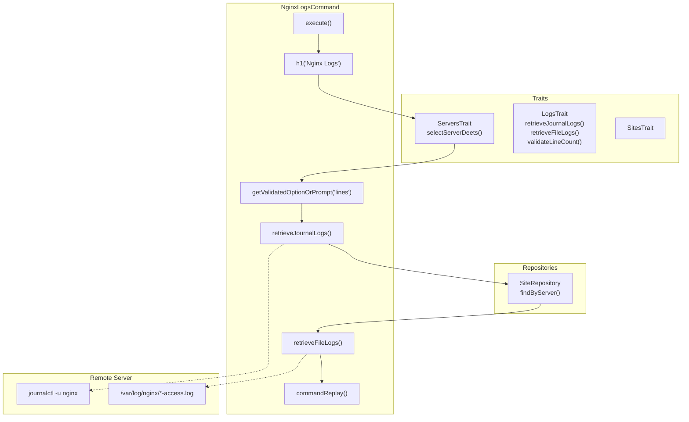

# Schematic: NginxLogsCommand.php

> Auto-generated schematic. Last updated: 2025-12-27

## Overview

NginxLogsCommand retrieves and displays Nginx service logs via journalctl and per-site access logs from `/var/log/nginx/`. It prompts for server selection and line count, then displays both the systemd journal logs for the Nginx service and file-based access logs for each site deployed on the server.

## Logic Flow

### Entry Points

| Method | Purpose |
|--------|---------|
| `execute()` | Main command execution entry point |

### Execution Flow

```
1. Display header "Nginx Logs"

2. selectServerDeets() [from ServersTrait]
   |- Failure: Return Command::FAILURE
   +- Success: Continue with ServerDTO

3. Prompt for line count
   |- getValidatedOptionOrPrompt('lines', ...)
   |- validateLineCount() validation
   +- Catch ValidationException -> Return FAILURE

4. retrieveJournalLogs() [from LogsTrait]
   |- Service: 'nginx'
   +- Displays journalctl output

5. Get sites for this server
   |- sites->findByServer(server->name)

6. For each site:
   |- retrieveFileLogs() [from LogsTrait]
   |- Path: /var/log/nginx/{domain}-access.log
   +- Displays file tail output

7. commandReplay() - Show non-interactive command

8. Return Command::SUCCESS
```

### Decision Points

| Location | Condition | True Branch | False Branch |
|----------|-----------|-------------|--------------|
| After server selection | `is_int($server) \|\| null === $server->info` | Return FAILURE | Continue |
| After line validation | `ValidationException` caught | Display error, return FAILURE | Continue |

### Exit Conditions

| Condition | Return Value |
|-----------|--------------|
| Server selection fails | `Command::FAILURE` |
| Line count validation fails | `Command::FAILURE` |
| Success | `Command::SUCCESS` |

## Interaction Diagram



## Dependencies

### Direct Imports

| File/Class | Usage |
|------------|-------|
| `DeployerPHP\Contracts\BaseCommand` | Parent class providing command infrastructure |
| `DeployerPHP\Exceptions\ValidationException` | Caught for line count validation errors |
| `DeployerPHP\Traits\LogsTrait` | `retrieveJournalLogs()`, `retrieveFileLogs()`, `validateLineCount()` |
| `DeployerPHP\Traits\PlaybooksTrait` | Required for playbook execution |
| `DeployerPHP\Traits\ServersTrait` | `selectServerDeets()` for server selection |
| `DeployerPHP\Traits\SitesTrait` | Site repository access |
| `Symfony\Component\Console\Attribute\AsCommand` | Command registration |
| `Symfony\Component\Console\Command\Command` | Return constants |

### Coupled Files

| File | Coupling Type | Description |
|------|---------------|-------------|
| `/var/log/nginx/{domain}-access.log` | Log | Per-site Nginx access logs (created by site-create.sh) |
| `playbooks/site-create.sh` | Config | Creates Nginx vhost with log path convention |
| `app/Repositories/SiteRepository.php` | Data | Provides `findByServer()` for site discovery |

## Data Flow

### Inputs

| Source | Data | Method |
|--------|------|--------|
| CLI `--server` option | Server name | `selectServerDeets()` |
| CLI `--lines` option | Line count string | `getValidatedOptionOrPrompt()` |
| Interactive prompt | Line count (default: 50) | `getValidatedOptionOrPrompt()` |

### Outputs

| Destination | Data | Method |
|-------------|------|--------|
| Console | Nginx service journal logs | `retrieveJournalLogs()` |
| Console | Per-site access log tails | `retrieveFileLogs()` |
| Console | Command replay string | `commandReplay()` |

### Side Effects

| Method | Side Effect |
|--------|-------------|
| `retrieveJournalLogs()` | SSH connection to execute journalctl |
| `retrieveFileLogs()` | SSH connection to execute tail on log files |

## Notes

- Uses journalctl for Nginx service logs (systemd-managed service)
- Access logs stored at `/var/log/nginx/{domain}-access.log` per Nginx vhost configuration
- Iterates over all sites on the selected server to display their access logs
- Default line count is 50 (set in prompt, not hardcoded)
