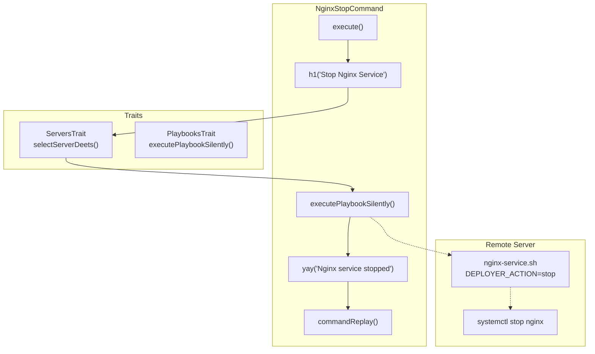

# Schematic: NginxStopCommand.php

> Auto-generated schematic. Last updated: 2025-12-27

## Overview

NginxStopCommand stops the Nginx service on a remote server via the nginx-service.sh playbook. It prompts for server selection, executes the playbook with `DEPLOYER_ACTION=stop`, and reports success or failure.

## Logic Flow

### Entry Points

| Method | Purpose |
|--------|---------|
| `execute()` | Main command execution entry point |

### Execution Flow

```
1. Display header "Stop Nginx Service"

2. selectServerDeets() [from ServersTrait]
   |- Failure: Return Command::FAILURE
   +- Success: Continue with ServerDTO

3. executePlaybookSilently() [from PlaybooksTrait]
   |- Playbook: 'nginx-service'
   |- Message: 'Stopping Nginx service...'
   |- Env: DEPLOYER_ACTION=stop
   |- Failure: Display error, return FAILURE
   +- Success: Continue

4. yay('Nginx service stopped')

5. commandReplay() - Show non-interactive command

6. Return Command::SUCCESS
```

### Decision Points

| Location | Condition | True Branch | False Branch |
|----------|-----------|-------------|--------------|
| After server selection | `is_int($server) \|\| null === $server->info` | Return FAILURE | Continue |
| After playbook execution | `is_int($result)` | Display error, return FAILURE | Continue |

### Exit Conditions

| Condition | Return Value |
|-----------|--------------|
| Server selection fails | `Command::FAILURE` |
| Playbook execution fails | `Command::FAILURE` |
| Success | `Command::SUCCESS` |

## Interaction Diagram



## Dependencies

### Direct Imports

| File/Class | Usage |
|------------|-------|
| `DeployerPHP\Contracts\BaseCommand` | Parent class providing command infrastructure |
| `DeployerPHP\Traits\PlaybooksTrait` | `executePlaybookSilently()` for remote execution |
| `DeployerPHP\Traits\ServersTrait` | `selectServerDeets()` for server selection |
| `Symfony\Component\Console\Attribute\AsCommand` | Command registration |
| `Symfony\Component\Console\Command\Command` | Return constants |

### Coupled Files

| File | Coupling Type | Description |
|------|---------------|-------------|
| `playbooks/nginx-service.sh` | Playbook | Executes systemctl commands for Nginx |

## Data Flow

### Inputs

| Source | Data | Method |
|--------|------|--------|
| CLI `--server` option | Server name | `selectServerDeets()` |
| Interactive prompt | Server selection | `selectServerDeets()` |

### Outputs

| Destination | Data | Method |
|-------------|------|--------|
| Console | Success message | `yay()` |
| Console | Error message | `nay()` |
| Console | Command replay string | `commandReplay()` |

### Side Effects

| Method | Side Effect |
|--------|-------------|
| `executePlaybookSilently()` | SSH connection to execute playbook |
| Playbook | Stops Nginx service via systemctl |

## Notes

- Uses nginx-service.sh playbook with `DEPLOYER_ACTION=stop`
- Playbook verifies Nginx is stopped after stop command (up to 10 second timeout)
- Simple command structure: server selection -> playbook execution -> result display
