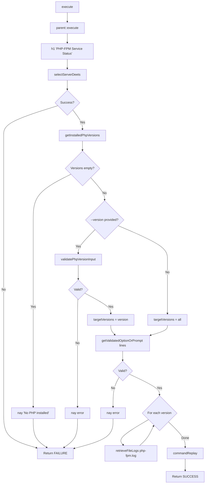
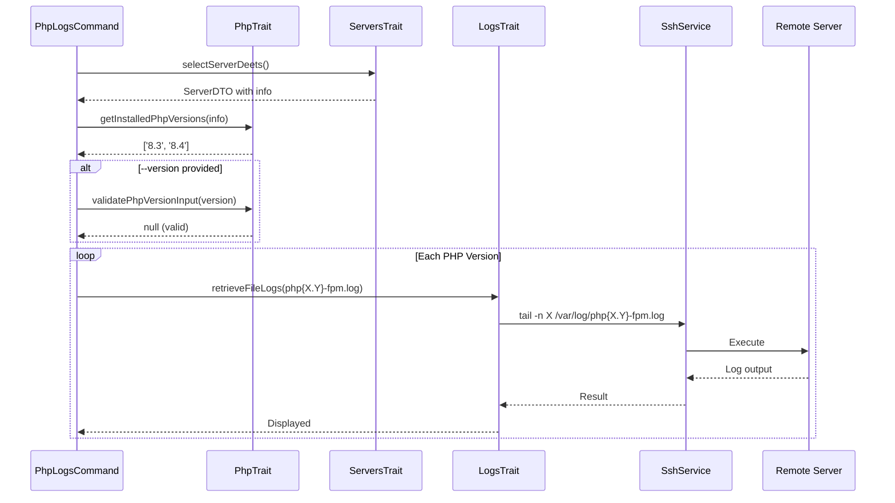

# Schematic: PhpLogsCommand.php

> Auto-generated schematic. Last updated: 2025-12-19

## Overview

PhpLogsCommand displays PHP-FPM service status and logs. It retrieves file-based logs for each PHP-FPM version installed on the server, optionally filtered to a specific version.

## Logic Flow

### Entry Points

| Method | Purpose |
|--------|---------|
| `execute()` | Main command execution - view PHP-FPM status and logs |

### Execution Flow

1. Call `parent::execute()` to display env/inventory status
2. Display heading "PHP-FPM Service Status"
3. Call `selectServerDeets()` (from ServersTrait) to select and validate server
4. Extract installed PHP versions from server info via `getInstalledPhpVersions()` (PhpTrait)
5. Check if any PHP versions are installed (fail if none)
6. Determine target versions:
   - If `--version` provided: validate and use single version
   - If omitted: use all installed versions
7. Prompt for number of log lines (default: 50)
8. For each target version, retrieve logs via `retrieveFileLogs()` (LogsTrait)
9. Output command replay for automation

### Decision Points

| Condition | Branch |
|-----------|--------|
| `selectServerDeets()` returns int | Return FAILURE |
| `server->info` is null | Return FAILURE |
| No PHP versions installed | Display error, return FAILURE |
| `--version` provided but invalid | Display error, return FAILURE |
| `--version` provided and valid | Show single version logs |
| `--version` omitted | Show all versions logs |
| Lines validation fails | Display error, return FAILURE |

### Exit Conditions

| Exit Code | Condition |
|-----------|-----------|
| `Command::FAILURE` | Server selection failed |
| `Command::FAILURE` | Server info retrieval failed |
| `Command::FAILURE` | No PHP installed |
| `Command::FAILURE` | Invalid version specified |
| `Command::FAILURE` | Lines validation failed |
| `Command::SUCCESS` | Logs displayed successfully |

## Interaction Diagram

## Dependencies

### Direct Imports

| File/Class | Usage |
|------------|-------|
| `Deployer\Contracts\BaseCommand` | Parent class with shared functionality |
| `Deployer\Exceptions\ValidationException` | Lines input validation exception |
| `Deployer\Traits\LogsTrait` | Log retrieval methods |
| `Deployer\Traits\PhpTrait` | PHP version helpers |
| `Deployer\Traits\ServersTrait` | Server selection |
| `Symfony\Component\Console\Attribute\AsCommand` | Command registration |
| `Symfony\Component\Console\Command\Command` | Return code constants |
| `Symfony\Component\Console\Input\InputOption` | CLI option definition |

### Coupled Files

| File | Coupling Type | Description |
|------|---------------|-------------|
| `app/Repositories/ServerRepository.php` | Data | Server inventory access |
| `app/Services/SshService.php` | Service | Remote command execution |
| `app/DTOs/ServerDTO.php` | Data | Server data structure |
| `app/Traits/PhpTrait.php` | Trait | Version extraction and validation |
| `/var/log/php{X.Y}-fpm.log` | Log | Remote PHP-FPM log files |

## Data Flow

### Inputs

| Source | Data |
|--------|------|
| CLI `--server` option | Optional server name |
| CLI `--version` option | Optional PHP version (e.g., `8.4`) |
| CLI `--lines` / `-n` option | Number of log lines (optional) |
| Interactive prompt | Server selection if option not provided |
| Interactive prompt | Lines count with default 50 if option not provided |
| Server info | Installed PHP versions from `php.versions` |

### Outputs

| Destination | Data |
|-------------|------|
| Console | PHP-FPM logs for each target version |
| Console | Command replay for automation |

### Side Effects

None - read-only operation.

## Notes

- Uses file-based logs at `/var/log/php{X.Y}-fpm.log`
- If `--version` is omitted, logs for ALL installed PHP versions are shown
- Error lines are highlighted in red via `highlightErrors()` from LogsTrait
- Maximum 1000 lines can be retrieved (validated by `validateLineCount()`)
- System package provides default logrotate config for PHP-FPM
