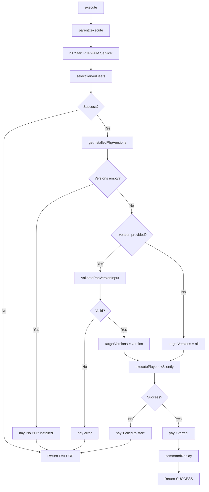
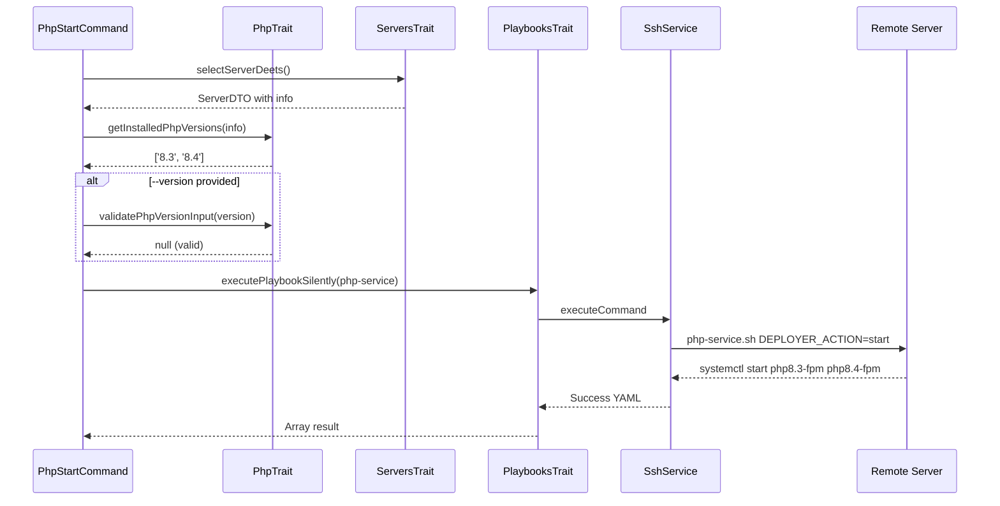

# Schematic: PhpStartCommand.php

> Auto-generated schematic. Last updated: 2025-12-19

## Overview

PhpStartCommand starts PHP-FPM service(s) on a remote server. It can start a specific PHP version or all installed versions. Uses the `php-service.sh` playbook with `start` action.

## Logic Flow

### Entry Points

| Method | Purpose |
|--------|---------|
| `execute()` | Main command execution - start PHP-FPM service(s) |

### Execution Flow

1. Call `parent::execute()` to display env/inventory status
2. Display heading "Start PHP-FPM Service"
3. Call `selectServerDeets()` (from ServersTrait) to select and validate server
4. Extract installed PHP versions from server info via `getInstalledPhpVersions()` (PhpTrait)
5. Check if any PHP versions are installed (fail if none)
6. Determine target versions:
   - If `--version` provided: validate and use single version
   - If omitted: use all installed versions
7. Execute `php-service` playbook silently with:
   - `DEPLOYER_ACTION=start`
   - `DEPLOYER_PHP_VERSIONS=` comma-separated list
8. Display success or failure message
9. Output command replay for automation

### Decision Points

| Condition | Branch |
|-----------|--------|
| `selectServerDeets()` returns int | Return FAILURE |
| `server->info` is null | Return FAILURE |
| No PHP versions installed | Display error, return FAILURE |
| `--version` provided but invalid | Display error, return FAILURE |
| `--version` provided and valid | Start single version |
| `--version` omitted | Start all versions |
| Playbook execution fails | Display error, return FAILURE |

### Exit Conditions

| Exit Code | Condition |
|-----------|-----------|
| `Command::FAILURE` | Server selection failed |
| `Command::FAILURE` | Server info retrieval failed |
| `Command::FAILURE` | No PHP installed |
| `Command::FAILURE` | Invalid version specified |
| `Command::FAILURE` | Playbook execution failed |
| `Command::SUCCESS` | PHP-FPM started successfully |

## Interaction Diagram

## Dependencies

### Direct Imports

| File/Class | Usage |
|------------|-------|
| `Deployer\Contracts\BaseCommand` | Parent class with shared functionality |
| `Deployer\Traits\PhpTrait` | PHP version helpers |
| `Deployer\Traits\PlaybooksTrait` | Playbook execution |
| `Deployer\Traits\ServersTrait` | Server selection |
| `Symfony\Component\Console\Attribute\AsCommand` | Command registration |
| `Symfony\Component\Console\Command\Command` | Return code constants |
| `Symfony\Component\Console\Input\InputOption` | CLI option definition |

### Coupled Files

| File | Coupling Type | Description |
|------|---------------|-------------|
| `playbooks/php-service.sh` | Playbook | Executed remotely for service control |
| `app/Repositories/ServerRepository.php` | Data | Server inventory access |
| `app/Services/SshService.php` | Service | Remote command execution |
| `app/DTOs/ServerDTO.php` | Data | Server data structure |
| `app/Traits/PhpTrait.php` | Trait | Version extraction and validation |

## Data Flow

### Inputs

| Source | Data |
|--------|------|
| CLI `--server` option | Optional server name |
| CLI `--version` option | Optional PHP version (e.g., `8.4`) |
| Interactive prompt | Server selection if option not provided |
| Server info | Installed PHP versions from `php.versions` |

### Outputs

| Destination | Data |
|-------------|------|
| Console | Status messages (success/failure) |
| Console | Command replay for automation |

### Side Effects

| Effect | Description |
|--------|-------------|
| Remote | Starts PHP-FPM service(s) via `systemctl start php{X.Y}-fpm` |

## Notes

- If `--version` is omitted, ALL installed PHP versions are started
- Version display adapts: "PHP 8.4-FPM" for single, "PHP-FPM (8.3, 8.4)" for multiple
- Playbook verifies each service is active after start with 10-second timeout
- Version validation ensures format matches `X.Y` pattern (e.g., `8.4`, not `8.4.1`)
