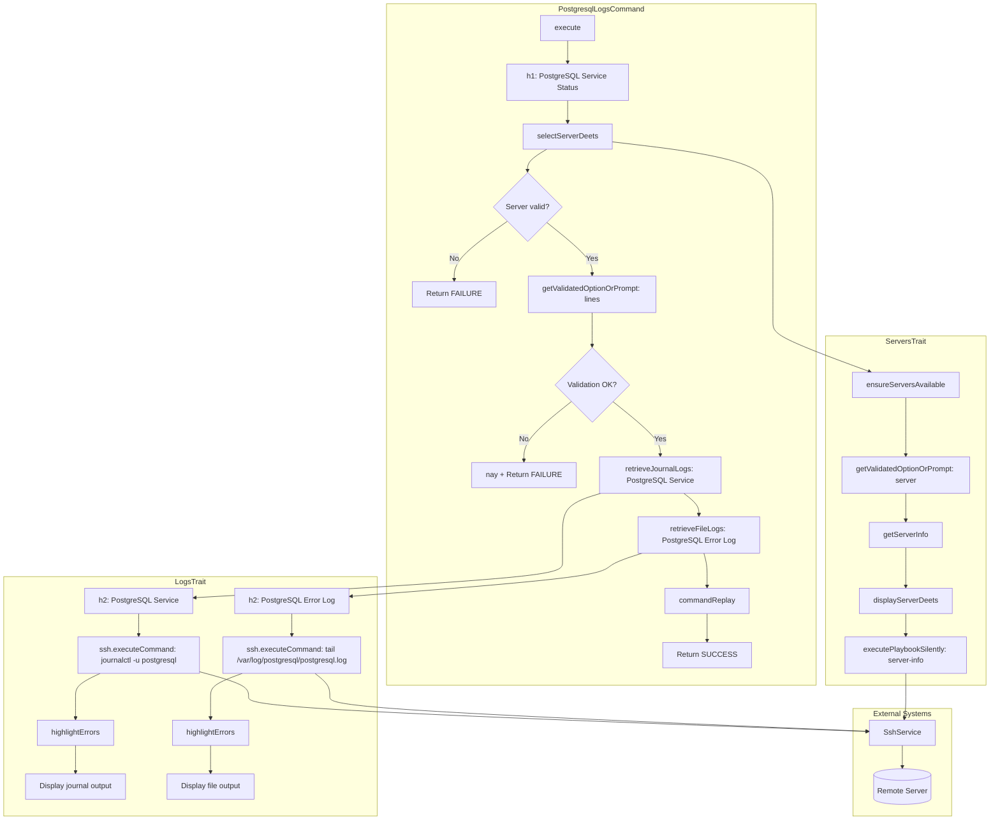

# Schematic: PostgresqlLogsCommand.php

> Auto-generated schematic. Last updated: 2025-12-19 (updated comment documentation)

## Overview

CLI command that retrieves and displays PostgreSQL service status by fetching logs from two sources: systemd journal logs for the PostgreSQL service and the PostgreSQL error log file. Uses `LogsTrait::retrieveJournalLogs()` and `LogsTrait::retrieveFileLogs()` for log retrieval with error highlighting, and `ServersTrait::selectServerDeets()` for server selection with SSH validation.

## Logic Flow

### Entry Points

| Method | Visibility | Description |
|--------|------------|-------------|
| `execute()` | protected | Main command entry point via Symfony Console |

### Execution Flow

1. **Display heading** - Output "PostgreSQL Service Status" heading via `h1()`
2. **Server selection** - Call `selectServerDeets()` (ServersTrait) which:
   - Validates servers exist in inventory
   - Prompts for server selection (CLI option or interactive)
   - Displays server details
   - Executes `server-info` playbook to gather system info
   - Validates distribution (Debian/Ubuntu) and permissions (root/sudo)
   - Returns `ServerDTO` with populated `info` array
3. **Early exit check** - Return `FAILURE` if server selection failed or `info` is null
4. **Line count input** - Get number of log lines via `getValidatedOptionOrPrompt()`:
   - CLI: `--lines` or `-n` option (no default - omitting triggers prompt)
   - Interactive: Text prompt with default "50"
   - Validator: `validateLineCount()` from LogsTrait (1-1000 range)
5. **Service log retrieval** - Call `retrieveJournalLogs()` (LogsTrait) with:
   - Server context for SSH connection
   - Title "PostgreSQL Service" for output heading
   - Unit name "postgresql" for systemd journal filtering
   - Line count as integer
6. **Error log retrieval** - Call `retrieveFileLogs()` (LogsTrait) with:
   - Server context for SSH connection
   - Title "PostgreSQL Error Log" for output heading
   - Path `/var/log/postgresql/postgresql.log`
   - Line count as integer
7. **Command replay** - Output non-interactive command for automation
8. **Return success** - Return `Command::SUCCESS`

### Decision Points

| Location | Condition | Branch |
|----------|-----------|--------|
| Line 54 | `is_int($server) \|\| null === $server->info` | Return `FAILURE` (server selection or info retrieval failed) |
| Line 73 | `ValidationException` caught | Display error, return `FAILURE` |

### Exit Conditions

| Condition | Return Value |
|-----------|--------------|
| No servers in inventory | `Command::FAILURE` |
| Invalid server selection | `Command::FAILURE` |
| SSH connection failure | `Command::FAILURE` |
| Unsupported distribution | `Command::FAILURE` |
| Insufficient permissions | `Command::FAILURE` |
| Invalid line count (non-numeric, <=0, >1000) | `Command::FAILURE` |
| Successful log retrieval | `Command::SUCCESS` |

## Interaction Diagram

## Dependencies

### Direct Imports

| File/Class | Usage |
|------------|-------|
| `Deployer\Contracts\BaseCommand` | Parent class providing DI, output methods, command infrastructure |
| `Deployer\Exceptions\ValidationException` | Caught when CLI option validation fails |
| `Deployer\Traits\LogsTrait` | Provides `retrieveJournalLogs()`, `retrieveFileLogs()`, and `validateLineCount()` |
| `Deployer\Traits\ServersTrait` | Provides `selectServerDeets()` for server selection flow |
| `Symfony\Component\Console\Attribute\AsCommand` | Command registration attribute |
| `Symfony\Component\Console\Command\Command` | Return code constants |
| `Symfony\Component\Console\Input\InputInterface` | Command input handling |
| `Symfony\Component\Console\Input\InputOption` | CLI option definitions |
| `Symfony\Component\Console\Output\OutputInterface` | Command output handling |

### Coupled Files

| File | Coupling Type | Description |
|------|---------------|-------------|
| `app/Services/SshService.php` | Service | Executes `journalctl` and `tail` commands via SSH (through LogsTrait) |
| `app/Services/IoService.php` | Service | Input validation and prompting |
| `app/Repositories/ServerRepository.php` | Data | Server inventory access |
| `app/DTOs/ServerDTO.php` | Data | Server connection details and info |
| `playbooks/server-info.sh` | Playbook | Executed via ServersTrait to gather server info |
| `deployer.yml` | Config | Server inventory source |

## Data Flow

### Inputs

| Source | Data | Type |
|--------|------|------|
| CLI option `--server` | Server name | `string` (optional) |
| CLI option `--lines` / `-n` | Number of log lines | `string` (no default; prompt default: "50") |
| Interactive prompt | Server selection | `string` |
| Interactive prompt | Line count | `string` |
| Server inventory | Available servers | `ServerDTO[]` |
| Remote server | PostgreSQL service journal logs | `string` (via SSH) |
| Remote server | PostgreSQL error log file | `string` (via SSH) |

### Outputs

| Destination | Data | Type |
|-------------|------|------|
| Console | PostgreSQL Service Status heading | Formatted text |
| Console | Server details | Formatted key-value pairs |
| Console | PostgreSQL Service journal logs (error-highlighted) | Colored text |
| Console | PostgreSQL Error Log contents (error-highlighted) | Colored text |
| Console | Command replay hint | Formatted command string |

### Side Effects

| Effect | Description |
|--------|-------------|
| SSH connection | Establishes SSH connection to remote server |
| Remote command | Executes `journalctl -u postgresql -n {lines} --no-pager` on server |
| Remote command | Executes `tail -n {lines} /var/log/postgresql/postgresql.log` on server |
| Remote playbook | Executes `server-info.sh` playbook for server validation |

## Notes

### PostgreSQL Log Locations

PostgreSQL on Debian/Ubuntu typically logs to:

- **Systemd journal**: Service-level events via `journalctl -u postgresql`
- **Error log file**: `/var/log/postgresql/postgresql.log` (may vary by version and configuration)

The command retrieves from both sources to provide comprehensive diagnostic information.

### Architectural Notes

- **Trait Composition**: Uses two traits (`LogsTrait`, `ServersTrait`) where `ServersTrait` internally uses `PlaybooksTrait`
- **Validation Pattern**: Uses `getValidatedOptionOrPrompt()` with `validateLineCount()` validator from `LogsTrait`
- **Service Layer**: All SSH operations go through `SshService`, maintaining layer separation
- **Error Handling**: `ValidationException` is caught at command level; SSH errors propagate through trait methods

### Option Design

- **`--lines` has no default**: Intentionally omits CLI default so that when the option is not provided, the interactive prompt displays with its own default value ("50"). This follows the non-interactive design pattern where options replace prompts rather than having duplicate default logic.

### Related Commands

- `mysql:logs` - Identical structure for MySQL service
- `mariadb:logs` - Identical structure for MariaDB service
- `server:logs` - Uses same `LogsTrait` for general server logs
