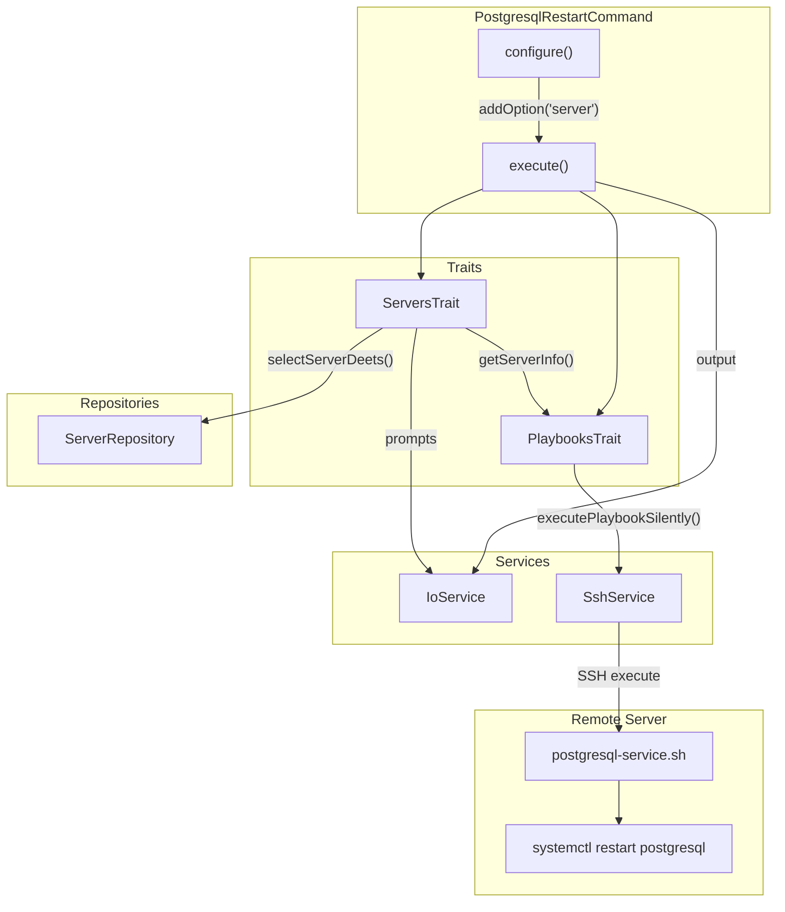

# Schematic: PostgresqlRestartCommand.php

> Auto-generated schematic. Last updated: 2025-12-19

## Overview

Symfony Console command that restarts the PostgreSQL service on a remote server. Uses `ServersTrait` for server selection and validation, and `PlaybooksTrait` for remote playbook execution. Follows the same pattern as other database service control commands (MySQL, MariaDB).

## Logic Flow

### Entry Points

| Method | Visibility | Purpose |
|--------|-----------|---------|
| `configure()` | protected | Register `--server` CLI option |
| `execute()` | protected | Main execution orchestration |

### Execution Flow

```
execute()
    |
    +-- parent::execute()
    |       Display env/inventory status
    |
    +-- h1('Restart PostgreSQL Service')
    |       Display command heading
    |
    +-- selectServerDeets()  [ServersTrait]
    |       |
    |       +-- ensureServersAvailable()
    |       |       Check inventory has servers
    |       |
    |       +-- getValidatedOptionOrPrompt('server')
    |       |       CLI option or interactive selection
    |       |
    |       +-- getServerInfo()
    |               Display server details
    |               Execute server-info playbook
    |               Validate distribution (Debian/Ubuntu)
    |               Validate permissions (root/sudo)
    |
    +-- executePlaybookSilently()  [PlaybooksTrait]
    |       Execute postgresql-service.sh with DEPLOYER_ACTION=restart
    |       Display spinner during execution
    |
    +-- Display success/failure message
    |
    +-- commandReplay()
            Output non-interactive command hint
```

### Decision Points

| Location | Condition | True Path | False Path |
|----------|-----------|-----------|------------|
| Line 52 | `is_int($server) \|\| null === $server->info` | Return FAILURE | Continue |
| Line 69 | `is_int($result)` | Display error, return FAILURE | Display success |

### Exit Conditions

| Condition | Return Value | Trigger |
|-----------|--------------|---------|
| No servers in inventory | `Command::FAILURE` | `ensureServersAvailable()` fails |
| Server validation fails | `Command::FAILURE` | CLI `--server` option invalid |
| SSH connection fails | `Command::FAILURE` | `getServerInfo()` cannot connect |
| Distribution unsupported | `Command::FAILURE` | Not Debian/Ubuntu |
| Permissions insufficient | `Command::FAILURE` | No root/sudo access |
| Playbook execution fails | `Command::FAILURE` | `executePlaybookSilently()` returns int |
| Success | `Command::SUCCESS` | PostgreSQL restarted successfully |

## Interaction Diagram



## Dependencies

### Direct Imports

| File/Class | Usage |
|------------|-------|
| `Deployer\Contracts\BaseCommand` | Parent class providing services, I/O methods |
| `Deployer\Traits\PlaybooksTrait` | Remote playbook execution via `executePlaybookSilently()` |
| `Deployer\Traits\ServersTrait` | Server selection via `selectServerDeets()` |
| `Symfony\Component\Console\Attribute\AsCommand` | Command registration attribute |
| `Symfony\Component\Console\Command\Command` | Return constants (SUCCESS, FAILURE) |
| `Symfony\Component\Console\Input\InputInterface` | Input handling |
| `Symfony\Component\Console\Input\InputOption` | Option definition (VALUE_REQUIRED) |
| `Symfony\Component\Console\Output\OutputInterface` | Output handling |

### Coupled Files

| File | Coupling Type | Description |
|------|---------------|-------------|
| `playbooks/postgresql-service.sh` | Playbook | Remote bash script that executes `systemctl restart postgresql` |
| `playbooks/server-info.sh` | Playbook | Used by `getServerInfo()` to validate server connectivity and permissions |
| `app/DTOs/ServerDTO.php` | Data | Server data structure returned by `selectServerDeets()` |
| `app/Repositories/ServerRepository.php` | Data | Server inventory access via `$this->servers` |
| `app/Services/SshService.php` | API | SSH command execution for playbooks |
| `app/Services/IoService.php` | API | Console I/O and prompts |
| `deployer.yml` | Config | Inventory file containing server definitions |

## Data Flow

### Inputs

| Source | Data | Type |
|--------|------|------|
| CLI option | `--server` | `string\|null` |
| Interactive prompt | Server selection | `string` |
| Inventory file | Server list | `ServerDTO[]` |

### Outputs

| Destination | Data | Format |
|-------------|------|--------|
| Console | Heading, status messages | Text via `h1()`, `yay()`, `nay()` |
| Console | Command replay hint | Text via `commandReplay()` |
| Remote server | Playbook execution | SSH command |

### Side Effects

| Effect | Location | Description |
|--------|----------|-------------|
| PostgreSQL restart | Remote server | `systemctl restart postgresql` via playbook |
| SSH connection | Remote server | Establishes SSH session for playbook execution |

## Notes

- This command mirrors the pattern used by `MysqlRestartCommand` exactly, substituting MySQL references with PostgreSQL
- The playbook `postgresql-service.sh` handles start, stop, and restart actions based on `DEPLOYER_ACTION` environment variable
- Playbook verifies service state after restart with up to 10-second wait for service to become active
- No confirmation prompt required - restart is a non-destructive operation
- Server must have PostgreSQL installed; command does not verify PostgreSQL presence before attempting restart
