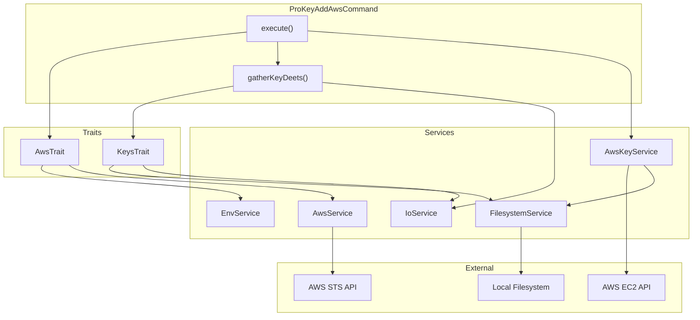

# Schematic: ProKeyAddAwsCommand.php

> Auto-generated schematic. Last updated: 2025-12-25

## Overview

This command imports a local SSH public key to AWS EC2 as a key pair. It handles AWS API initialization, public key path resolution (with fallback to default locations), and key pair naming. The imported key can then be used when provisioning EC2 instances.

## Logic Flow

### Entry Points

| Method | Access | Description |
|--------|--------|-------------|
| `execute()` | protected | Main command execution (Symfony Console) |

### Execution Flow

1. **Display Header**
   - Output "Add SSH Key to AWS" heading via `$this->h1()`

2. **Initialize AWS API** (via `AwsTrait::initializeAwsAPI()`)
   - Retrieve credentials from environment: `AWS_ACCESS_KEY_ID`, `AWS_SECRET_ACCESS_KEY`
   - Retrieve region from environment: `AWS_DEFAULT_REGION` or `AWS_REGION`
   - Initialize AWS SDK and verify authentication via STS
   - Return `FAILURE` if credentials missing or authentication fails

3. **Gather Key Details** (via `gatherKeyDeets()`)
   - Prompt/validate public key path (allows empty for default resolution)
   - Resolve path to actual file: `~/.ssh/id_ed25519.pub` or `~/.ssh/id_rsa.pub`
   - Prompt/validate key pair name (default: `deployer-key`)
   - Return `FAILURE` if validation fails

4. **Import Key Pair**
   - Call `AwsKeyService::importKeyPair()` with spinner
   - Display success message with fingerprint details
   - Handle duplicate key errors with clear message

5. **Command Replay**
   - Output non-interactive command equivalent

### Decision Points

| Location | Condition | True Branch | False Branch |
|----------|-----------|-------------|--------------|
| L53 | `initializeAwsAPI() === FAILURE` | Return FAILURE | Continue |
| L63 | `is_int($deets)` | Return FAILURE | Destructure results |
| L133 | `null === $publicKeyPath` | Throw ValidationException | Continue |

### Exit Conditions

| Condition | Return Value | Message |
|-----------|--------------|---------|
| AWS credentials missing | `Command::FAILURE` | "AWS credentials not found in environment" |
| AWS authentication fails | `Command::FAILURE` | Error from AWS API |
| Public key not found | `Command::FAILURE` | "SSH public key not found" |
| Key name validation fails | `Command::FAILURE` | Validation error message |
| Key pair already exists | `Command::FAILURE` | "Key pair '{name}' already exists in this region" |
| Import succeeds | `Command::SUCCESS` | "Key pair imported successfully" |

## Interaction Diagram

## Dependencies

### Direct Imports

| File/Class | Usage |
|------------|-------|
| `Deployer\Contracts\BaseCommand` | Parent class providing DI, output methods, command replay |
| `Deployer\Exceptions\ValidationException` | Thrown on CLI validation failures |
| `Deployer\Traits\AwsTrait` | AWS API initialization and credential handling |
| `Deployer\Traits\KeysTrait` | Public key path resolution and validation |
| `Symfony\Component\Console\Attribute\AsCommand` | Command registration attribute |
| `Symfony\Component\Console\Command\Command` | Return code constants |
| `Symfony\Component\Console\Input\InputInterface` | CLI input handling |
| `Symfony\Component\Console\Input\InputOption` | Option definition constants |
| `Symfony\Component\Console\Output\OutputInterface` | CLI output handling |

### Coupled Files

| File | Coupling Type | Description |
|------|---------------|-------------|
| `.env` | Environment | AWS credentials (`AWS_ACCESS_KEY_ID`, `AWS_SECRET_ACCESS_KEY`, `AWS_DEFAULT_REGION`/`AWS_REGION`) |
| `~/.ssh/id_ed25519.pub` | Data | Default SSH public key location (primary fallback) |
| `~/.ssh/id_rsa.pub` | Data | Default SSH public key location (secondary fallback) |
| `app/Services/Aws/AwsKeyService.php` | API | Performs actual AWS EC2 key pair import |
| `app/Services/AwsService.php` | API | AWS SDK facade and initialization |
| `app/Services/EnvService.php` | Config | Environment variable retrieval |
| `app/Services/FilesystemService.php` | State | File existence and content reading |
| `app/Services/IoService.php` | State | Prompt handling and validation |

## Data Flow

### Inputs

| Source | Data | Type |
|--------|------|------|
| CLI `--public-key-path` | Path to SSH public key file | `string` (optional) |
| CLI `--name` | Key pair name in AWS | `string` (optional) |
| Environment | AWS credentials and region | `string` |
| Interactive prompt | Public key path (if CLI not provided) | `string` |
| Interactive prompt | Key pair name (if CLI not provided) | `string` |

### Outputs

| Destination | Data | Type |
|-------------|------|------|
| Console | Status messages and key fingerprint | Text |
| AWS EC2 | Imported SSH public key as key pair | API call |

### Side Effects

| Effect | Description |
|--------|-------------|
| AWS EC2 Key Pair Created | New key pair registered in AWS account for specified region |

## CLI Options

| Option | Type | Required | Default | Description |
|--------|------|----------|---------|-------------|
| `--name` | `VALUE_REQUIRED` | No | `deployer-key` | Key pair name in AWS |
| `--public-key-path` | `VALUE_REQUIRED` | No | Auto-resolved | SSH public key path |

## Validation Rules

### Public Key Path (`validateKeyPathInput`)
- Must be string
- Empty allowed (triggers default resolution)
- If provided, file must exist
- Must be valid SSH public key format (ed25519, ecdsa, rsa)
- DSA keys rejected as obsolete

### Key Name (`validateKeyNameInput`)
- Must be string
- Cannot be empty
- Only alphanumeric, hyphens, underscores allowed

## Notes

- The command uses `gatherKeyDeets()` to encapsulate input collection, returning either an associative array or `Command::FAILURE` integer
- Key path resolution follows priority: provided path > `~/.ssh/id_ed25519.pub` > `~/.ssh/id_rsa.pub`
- AWS region is displayed in success output to clarify where the key was imported
- Duplicate key errors from AWS are caught and re-thrown with clearer messaging
- The command does not validate whether the key already exists in AWS before attempting import (AWS API handles this)
