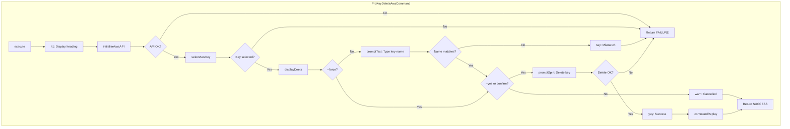
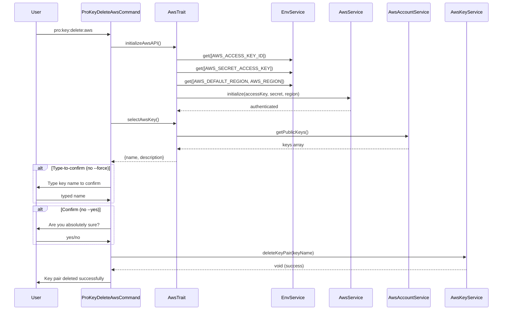

# Schematic: ProKeyDeleteAwsCommand.php

> Auto-generated schematic. Last updated: 2025-12-25

## Overview

Command that deletes an SSH key pair from AWS EC2. Provides a two-step confirmation process (type-to-confirm + yes/no) to prevent accidental deletion of important key pairs. Supports both interactive and non-interactive execution modes.

## Logic Flow

### Entry Points

| Method | Access | Description |
|--------|--------|-------------|
| `configure()` | protected | Defines CLI options: `--key`, `--force`, `--yes` |
| `execute()` | protected | Main command execution entry point |

### Execution Flow

```
1. Display heading "Delete a Key Pair from AWS"
2. Initialize AWS API via AwsTrait::initializeAwsAPI()
   - Loads credentials from environment (AWS_ACCESS_KEY_ID, AWS_SECRET_ACCESS_KEY)
   - Loads region from environment (AWS_DEFAULT_REGION or AWS_REGION)
   - Verifies authentication via STS
3. Select key pair via AwsTrait::selectAwsKey()
   - Fetches available keys from AwsAccountService::getPublicKeys()
   - Validates --key option or prompts for selection
   - Returns key name and description
4. Display key details (name, description, region)
5. Type-to-confirm step (unless --force)
   - User must type exact key name to proceed
   - Mismatch aborts deletion
6. Yes/No confirmation (unless --yes)
   - User must confirm final deletion
   - Decline gracefully exits with SUCCESS
7. Delete key pair via AwsKeyService::deleteKeyPair()
   - Wrapped in spinner for visual feedback
8. Display success message and command replay
```

### Decision Points

| Line | Condition | True Branch | False Branch |
|------|-----------|-------------|--------------|
| 51 | `initializeAwsAPI() === FAILURE` | Return FAILURE | Continue |
| 61 | `selectAwsKey()` returns int | Return FAILURE | Destructure key data |
| 86 | `!$forceSkip` | Prompt for type-to-confirm | Skip to yes/no |
| 92 | `$typedKeyName !== $keyName` | Return FAILURE with error | Continue |
| 107 | `!$confirmed` | Return SUCCESS with warning | Delete key |

### Exit Conditions

| Condition | Return Code | Message |
|-----------|-------------|---------|
| AWS API initialization fails | FAILURE | Credentials or authentication error |
| No keys available | FAILURE | "No EC2 key pairs found..." |
| Key selection validation fails | FAILURE | Validation error message |
| Type-to-confirm mismatch | FAILURE | "Key pair name does not match. Deletion cancelled." |
| User declines confirmation | SUCCESS | "Cancelled deleting key pair" |
| Deletion API call fails | FAILURE | RuntimeException message |
| Successful deletion | SUCCESS | "Key pair deleted successfully" |

## Interaction Diagram





## Dependencies

### Direct Imports

| File/Class | Usage |
|------------|-------|
| `Deployer\Contracts\BaseCommand` | Parent class providing DI, output methods, command infrastructure |
| `Deployer\Traits\AwsTrait` | Provides `initializeAwsAPI()`, `selectAwsKey()` methods |
| `Symfony\Component\Console\Attribute\AsCommand` | Command registration attribute |
| `Symfony\Component\Console\Command\Command` | Return code constants (SUCCESS, FAILURE) |
| `Symfony\Component\Console\Input\InputInterface` | CLI input handling |
| `Symfony\Component\Console\Input\InputOption` | Option definition constants |
| `Symfony\Component\Console\Output\OutputInterface` | CLI output handling |

### Coupled Files

| File | Coupling Type | Description |
|------|---------------|-------------|
| `app/Traits/AwsTrait.php` | Trait | AWS API initialization and key selection logic |
| `app/Services/AwsService.php` | Service | Facade for AWS sub-services, accessed via `$this->aws` |
| `app/Services/Aws/AwsAccountService.php` | Service | Provides `getPublicKeys()` for key listing |
| `app/Services/Aws/AwsKeyService.php` | Service | Provides `deleteKeyPair()` for deletion |
| `app/Services/EnvService.php` | Service | AWS credential retrieval from environment |
| `app/Services/IoService.php` | Service | Prompt methods (`promptText`, `promptConfirm`, etc.) |
| `.env` | Environment | AWS_ACCESS_KEY_ID, AWS_SECRET_ACCESS_KEY, AWS_DEFAULT_REGION |

## Data Flow

### Inputs

| Source | Data | Type |
|--------|------|------|
| CLI option `--key` | Key pair name to delete | string |
| CLI option `--force` | Skip type-to-confirm | bool |
| CLI option `--yes` | Skip yes/no confirmation | bool |
| Environment | AWS credentials and region | string |
| AWS API | Available key pairs | array<string, string> |

### Outputs

| Destination | Data | Type |
|-------------|------|------|
| Console | Status messages (yay, nay, warn) | string |
| Console | Key details display | formatted text |
| Console | Command replay hint | string |
| AWS EC2 | Key pair deletion request | API call |

### Side Effects

| Effect | Description |
|--------|-------------|
| AWS EC2 Key Pair Deletion | Permanently removes the SSH key pair from AWS account in the configured region |

## Notes

### Confirmation Pattern

This command implements a two-step confirmation for destructive operations:
1. **Type-to-confirm** (`--force` to skip): User must type the exact key name
2. **Yes/No confirmation** (`--yes` to skip): Final confirmation before deletion

This pattern prevents accidental deletion more effectively than a single confirmation.

### Idempotent Deletion

The underlying `AwsKeyService::deleteKeyPair()` is idempotent - it silently succeeds if the key pair doesn't exist. However, the `selectAwsKey()` method validates that the key exists before attempting deletion.

### Region Scope

Key pairs in AWS EC2 are region-specific. The command operates on the region specified by `AWS_DEFAULT_REGION` or `AWS_REGION` environment variable.
