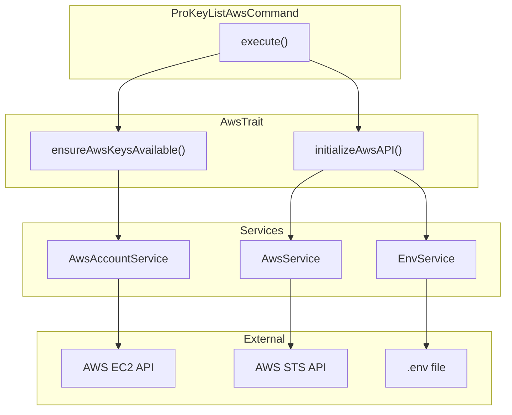

# Schematic: ProKeyListAwsCommand.php

> Auto-generated schematic. Last updated: 2025-12-25

## Overview

Command that lists EC2 key pairs from the user's AWS account. It initializes the AWS API using environment credentials, fetches available key pairs from the configured region, and displays them with their fingerprints. Uses `AwsTrait` for AWS API initialization and key retrieval.

## Logic Flow

### Entry Points

| Method | Visibility | Description |
|--------|------------|-------------|
| `execute()` | protected | Main command execution entry point |

### Execution Flow

1. Call `parent::execute()` to display env/inventory status
2. Display heading "List EC2 Key Pairs in AWS"
3. Initialize AWS API via `initializeAwsAPI()` (from AwsTrait)
   - Reads `AWS_ACCESS_KEY_ID`, `AWS_SECRET_ACCESS_KEY`, `AWS_DEFAULT_REGION` from environment
   - Authenticates with AWS STS
   - Returns `Command::FAILURE` if credentials missing or invalid
4. Fetch keys via `ensureAwsKeysAvailable()` (from AwsTrait)
   - Calls `$this->aws->account->getPublicKeys()`
   - Returns `Command::FAILURE` if no keys found or API error
5. Display current region via `$this->info()`
6. Display key list via `$this->displayDeets()`
7. Output command replay for non-interactive documentation
8. Return `Command::SUCCESS`

### Decision Points

| Line | Condition | True Branch | False Branch |
|------|-----------|-------------|--------------|
| 36-38 | `initializeAwsAPI() === FAILURE` | Return FAILURE | Continue |
| 46-48 | `is_int($keys)` (no keys/error) | Return FAILURE | Continue to display |

### Exit Conditions

| Condition | Return Value | Cause |
|-----------|--------------|-------|
| AWS credentials missing | `Command::FAILURE` | Environment variables not set |
| AWS authentication fails | `Command::FAILURE` | Invalid or expired credentials |
| No key pairs found | `Command::FAILURE` | Empty key list in region |
| API error fetching keys | `Command::FAILURE` | AWS EC2 API failure |
| Success | `Command::SUCCESS` | Keys displayed successfully |

## Interaction Diagram

## Dependencies

### Direct Imports

| File/Class | Usage |
|------------|-------|
| `Deployer\Contracts\BaseCommand` | Parent class providing I/O helpers and service injection |
| `Deployer\Traits\AwsTrait` | Provides `initializeAwsAPI()` and `ensureAwsKeysAvailable()` |
| `Symfony\Component\Console\Attribute\AsCommand` | Command registration attribute |
| `Symfony\Component\Console\Command\Command` | Provides `SUCCESS`/`FAILURE` constants |
| `Symfony\Component\Console\Input\InputInterface` | Command input handling |
| `Symfony\Component\Console\Output\OutputInterface` | Command output handling |

### Coupled Files

| File | Coupling Type | Description |
|------|---------------|-------------|
| `app/Traits/AwsTrait.php` | Trait | Provides AWS initialization and key retrieval methods |
| `app/Services/Aws/AwsService.php` | Service | AWS API wrapper, injected via BaseCommand |
| `app/Services/Aws/AwsAccountService.php` | Service | Called via `$this->aws->account->getPublicKeys()` |
| `app/Services/EnvService.php` | Service | Reads AWS credentials from environment |
| `.env` | Environment | Must contain `AWS_ACCESS_KEY_ID`, `AWS_SECRET_ACCESS_KEY`, `AWS_DEFAULT_REGION` |

## Data Flow

### Inputs

| Source | Data | Format |
|--------|------|--------|
| Environment (.env) | AWS credentials | `AWS_ACCESS_KEY_ID`, `AWS_SECRET_ACCESS_KEY`, `AWS_DEFAULT_REGION` strings |

### Outputs

| Destination | Data | Format |
|-------------|------|--------|
| Console | Region info | "Region: {region}" |
| Console | Key pairs list | Key name with truncated fingerprint |
| Console | Command replay | Non-interactive command syntax |

### Side Effects

None. This command is read-only and does not modify any state.

## Notes

- No command options defined beyond inherited `--env` and `--inventory` from BaseCommand
- Uses `displayDeets()` for formatted key-value output
- Key fingerprints are truncated to first 20 characters for display
- Recently updated to include `commandReplay()` call for non-interactive documentation
- The empty options array in `commandReplay()` is intentional as this command has no options
