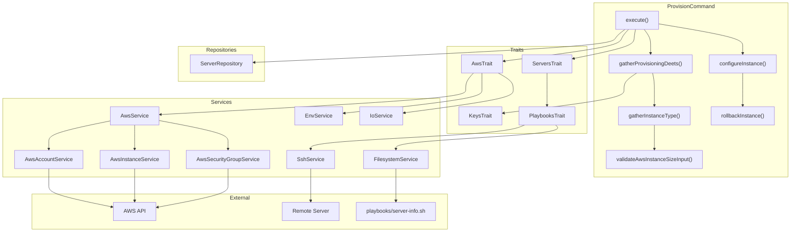
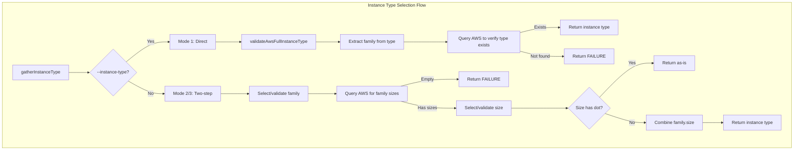

# Schematic: ProvisionCommand.php

> Auto-generated schematic. Last updated: 2025-12-26
>
> Recent update: Removed `--disk-type` option - now always uses gp3 SSD when disk size is specified.

## Overview

Provisions a new AWS EC2 instance through the AWS API, automatically assigns an Elastic IP, and adds the server to the local inventory. Handles the complete lifecycle from credential validation through instance creation, Elastic IP allocation, SSH verification, and automatic rollback on failure. Supports three instance type selection modes: direct `--instance-type`, `--instance-family` + `--instance-size`, or interactive two-step prompts.

## Logic Flow

### Entry Points

| Method | Description |
|--------|-------------|
| `execute()` | Main command entry point via Symfony Console |
| `gatherProvisioningDeets()` | Collects all provisioning parameters from CLI options or interactive prompts |
| `gatherInstanceType()` | Two-step instance type selection (or direct type validation) |

### Execution Flow

1. **Initialize AWS API** (line 64)
   - Calls `AwsTrait::initializeAwsAPI()` to load credentials from environment
   - Verifies authentication via STS GetCallerIdentity
   - Returns FAILURE if credentials missing or invalid

2. **Display Region** (line 68)
   - Shows the AWS region being used

3. **Retrieve AWS Account Data** (line 70-74)
   - Fetches: instance families, valid family names, SSH keys, AMIs, VPCs
   - Displays spinner during API calls
   - Catches RuntimeException for API errors

4. **Validate Keys Available** (line 76-80)
   - Calls `AwsTrait::ensureAwsKeysAvailable()`
   - Returns FAILURE if no EC2 key pairs exist in region
   - Suggests running `pro:aws:key:add` to add keys

5. **Gather Provisioning Details** (line 82-86)
   - Validates account data arrays are non-empty
   - Collects: name, instance type (via gatherInstanceType), AMI, key pair, private key path, VPC, subnet, disk size, monitoring
   - Each input validated via `getValidatedOptionOrPrompt()`
   - Subnets fetched dynamically after VPC selection

6. **Create Security Group** (line 88-92)
   - Ensures "deployer" security group exists in selected VPC
   - Creates group with SSH (22), HTTP (80), HTTPS (443) rules if missing

7. **Provision Instance** (line 94-98)
   - Calls `AwsInstanceService::createInstance()` with disk configuration
   - Instance created without auto-assigned public IP
   - Stores instance ID for potential rollback

8. **Configure Instance with Elastic IP and Rollback** (line 100-104)
   - Waits for instance "running" state
   - Allocates new Elastic IP address
   - Associates Elastic IP with instance
   - Determines default username from AMI name
   - Creates ServerDTO with Elastic IP as host
   - Validates SSH connection via `ServersTrait::getServerInfo()`
   - Adds server to inventory on success
   - **Automatic Rollback**: On any failure, releases Elastic IP and terminates instance

9. **Command Replay** (line 106-118)
   - Outputs non-interactive command equivalent with all options including `--instance-type`

### Instance Type Selection (gatherInstanceType)

Supports three modes:

**Mode 1: Direct `--instance-type` (backwards compatible)**
1. Check if `--instance-type` option provided
2. Validate format and family via `validateAwsFullInstanceType()`
3. Extract family from type (e.g., "t3.large" -> "t3")
4. Query AWS to verify specific type exists
5. Return full instance type

**Mode 2: CLI `--instance-family` + `--instance-size`**
1. Validate `--instance-family` option against `instanceFamilies`
2. Query AWS for available sizes in that family
3. Validate `--instance-size` option (handles both "large" and "t3.large" formats)
4. Combine family + size if size-only provided

**Mode 3: Interactive two-step prompts**
1. Prompt user to select instance family from `instanceFamilies`
2. Query AWS for available sizes in selected family
3. Prompt user to select specific size
4. Return combined instance type

### Decision Points

| Location | Condition | True Branch | False Branch |
|----------|-----------|-------------|--------------|
| Line 64 | AWS API init fails | Return FAILURE | Continue |
| Line 78-80 | Keys is int (FAILURE) | Return FAILURE | Continue with keys |
| Line 84-86 | Deets is int (FAILURE) | Return FAILURE | Continue |
| Line 90-92 | Security group fails | Return FAILURE | Continue |
| Line 96-98 | Instance creation fails | Return FAILURE | Continue |
| Line 102-104 | Configure fails | Return FAILURE | Return SUCCESS |
| Line 256 | `!is_int($server)` | Add to inventory, set success | Skip add, keep success=false |
| Line 272-275 | `!$provisionSuccess` | Rollback and return FAILURE | Return SUCCESS |
| Lines 356-367 | Empty account data arrays | Throw ValidationException | Continue gathering |
| Line 458 | `--instance-type` provided | Mode 1: direct validation | Mode 2/3: two-step |
| Line 510 | Empty availableTypes | Return FAILURE | Continue to size selection |
| Line 533 | Size doesn't contain "." | Combine with family | Use as-is |
| Line 607-609 | Empty subnets | Throw ValidationException | Continue with subnet selection |

### Exit Conditions

| Condition | Return Value | Cleanup |
|-----------|--------------|---------|
| AWS credentials missing | FAILURE | None |
| AWS authentication failed | FAILURE | None |
| No EC2 key pairs available | FAILURE | None |
| Account data validation fails | FAILURE | None |
| Instance type validation fails | FAILURE | None |
| No instance sizes available | FAILURE | None |
| Security group creation fails | FAILURE | None |
| Instance creation fails | FAILURE | None |
| Instance ready timeout | FAILURE | Release Elastic IP, terminate instance |
| Elastic IP allocation fails | FAILURE | Terminate instance |
| SSH connection fails | FAILURE | Release Elastic IP, terminate instance |
| Distribution not supported | FAILURE | Release Elastic IP, terminate instance |
| Success | SUCCESS | None |

## Interaction Diagram

## Dependencies

### Direct Imports

| File/Class | Usage |
|------------|-------|
| `Deployer\Contracts\BaseCommand` | Parent class providing services and output methods |
| `Deployer\DTOs\ServerDTO` | Server data structure created for new instance |
| `Deployer\Exceptions\ValidationException` | Thrown when validation fails (empty arrays, invalid inputs) |
| `Deployer\Traits\AwsTrait` | AWS API initialization, key validation, input validators, disk validators |
| `Deployer\Traits\KeysTrait` | SSH private key path prompting and validation |
| `Deployer\Traits\PlaybooksTrait` | Executes server-info playbook for SSH/system validation |
| `Deployer\Traits\ServersTrait` | Server selection, info gathering, name validation |
| `Symfony\Component\Console\Attribute\AsCommand` | Command registration |
| `Symfony\Component\Console\Command\Command` | Return codes (SUCCESS, FAILURE) |
| `Symfony\Component\Console\Input\InputInterface` | CLI input handling |
| `Symfony\Component\Console\Input\InputOption` | Option definitions |
| `Symfony\Component\Console\Output\OutputInterface` | Console output |

### Coupled Files

| File | Coupling Type | Description |
|------|---------------|-------------|
| `playbooks/server-info.sh` | Playbook | Executed via SSH to detect OS, permissions, installed services |
| `playbooks/helpers.sh` | Playbook | Prepended to playbook for utility functions |
| `.env` | Config | AWS credentials (AWS_ACCESS_KEY_ID, AWS_SECRET_ACCESS_KEY, AWS_DEFAULT_REGION) |
| `deployer.yml` | Data | Inventory file where new server is persisted |
| `~/.ssh/id_ed25519` | Config | Default SSH private key path (fallback) |
| `~/.ssh/id_rsa` | Config | Secondary SSH private key path (fallback) |

## Data Flow

### Inputs

| Source | Data | Validation |
|--------|------|------------|
| Environment | AWS_ACCESS_KEY_ID, AWS_SECRET_ACCESS_KEY, AWS_DEFAULT_REGION | Required, validated by STS |
| CLI --name | Server name for inventory | Alphanumeric, hyphens, underscores, max 64 chars, unique |
| CLI --instance-type | Full EC2 instance type (e.g., t3.large) | Format + family validated, then verified via AWS API |
| CLI --instance-family | Instance family (e.g., t3, m6i, c7g) | Must exist in instanceFamilies |
| CLI --instance-size | Instance size (e.g., large, xlarge) | Must exist in AWS for selected family |
| CLI --ami | AMI ID | Must exist in available images |
| CLI --key-pair | EC2 key pair name | Must exist in account |
| CLI --private-key-path | Local SSH private key | File must exist, valid PEM format |
| CLI --vpc | VPC ID | Must match `vpc-*` format, exist in region |
| CLI --subnet | Subnet ID | Must match `subnet-*` format, exist in VPC |
| CLI --disk-size | Root disk size in GB | 8-16384 GB range |
| CLI --monitoring | Enable CloudWatch | Boolean/negatable |
| AWS API | Instance families, instance sizes, keys, images, VPCs, subnets | Fetched dynamically |

### Outputs

| Destination | Data | Format |
|-------------|------|--------|
| Console | Status messages, errors, command replay | Text with formatting |
| `deployer.yml` | New server entry | YAML via InventoryService |
| AWS | EC2 instance | Created via API |
| AWS | Elastic IP | Allocated and associated via API |
| AWS | Security group | Created if missing |

### Side Effects

| Action | Condition | Reversible |
|--------|-----------|------------|
| EC2 instance creation | Always on success path | Yes (terminated on failure) |
| Elastic IP allocation | After instance running | Yes (released on failure) |
| Elastic IP association | After allocation | Yes (disassociated on termination) |
| Security group creation | If "deployer" group missing in VPC | No |
| Inventory modification | On successful SSH validation | Manual deletion required |
| SSH connection test | Before inventory add | No side effect |

## CLI Options

| Option | Description | Mode |
|--------|-------------|------|
| `--instance-type` | Full instance type (e.g., t3.large) | Backwards compatible, skips family/size prompts |
| `--instance-family` | Instance family (e.g., t3, m6i) | Two-step: first selection |
| `--instance-size` | Instance size (e.g., large) or full type | Two-step: second selection |

**Precedence:**
1. If `--instance-type` provided: Use directly (Mode 1)
2. If `--instance-family` provided: Use two-step CLI (Mode 2)
3. Otherwise: Interactive two-step prompts (Mode 3)

## Notes

- **Three Instance Type Modes**: Supports backwards-compatible `--instance-type`, explicit `--instance-family` + `--instance-size`, or interactive two-step prompts
- **Flexible Size Input**: `--instance-size` accepts both "large" (size-only) and "t3.large" (full type) formats
- **Dynamic Instance Types**: Instead of a static list, queries AWS for available sizes within the selected family
- **Instance Type Verification**: Even with `--instance-type`, verifies the specific type exists in AWS before provisioning
- **Automatic Elastic IP**: Every provisioned instance gets a dedicated Elastic IP for stable addressing
- **Rollback Order**: On failure, Elastic IP is released before instance termination to avoid orphaned resources
- **Disk Configuration**: Optional `--disk-size` (GB) customizes root EBS volume size; always uses gp3 SSD
- **No Auto Public IP**: Instances created without auto-assigned public IP since Elastic IP provides static address
- **Empty Array Validation**: Checks for empty `instanceFamilies`, `images`, and `vpcs` arrays with explicit region in error messages
- **Subnet Dynamic Fetch**: Subnets are fetched after VPC selection, enabling proper VPC-scoped subnet listing
- **AMI Username Detection**: Username (ubuntu, admin) determined from AMI name via `AwsInstanceService::getDefaultUsername()`
- **PlaybooksTrait**: Used by ServersTrait for server info gathering - required for SSH/distribution/permissions validation
- **Security Group**: Uses hardcoded "deployer" group name with SSH/HTTP/HTTPS rules
- **Instance Wait**: Polls instance status until "running" state before allocating Elastic IP
- **Command Replay**: Uses `--instance-type` in replay output for reproducibility (full type, not family/size)
