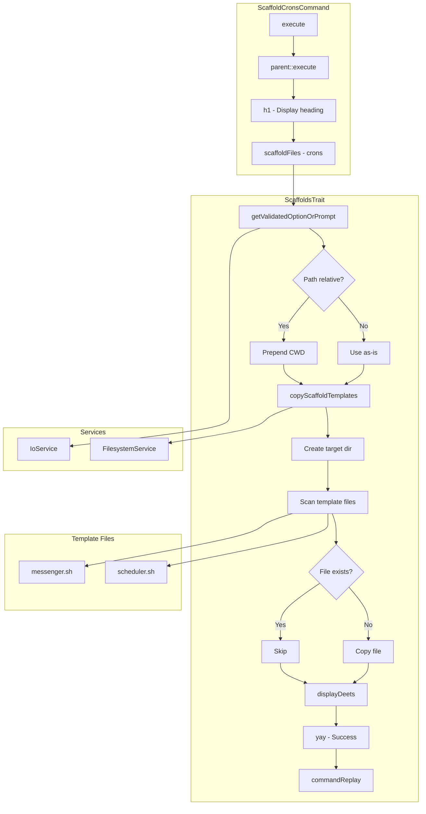

# Schematic: ScaffoldCronsCommand.php

> Auto-generated schematic. Last updated: 2025-12-19

## Overview

This command scaffolds cron job shell script templates into a project's `.deployer/crons/` directory. It copies template files from the package's `scaffolds/crons/` directory, allowing users to customize cron scripts for their deployment workflow.

## Logic Flow

### Entry Points

| Method | Access | Description |
|--------|--------|-------------|
| `execute()` | protected | Main command execution handler |

### Execution Flow

1. **Initialization** (inherited from `BaseCommand`)
   - `initialize()` sets up IoService, loads env file, loads inventory file
   - Repositories populated with server/site data

2. **Parent Execute** (line 37)
   - Calls `parent::execute()` which displays env and inventory status messages

3. **Display Heading** (line 39)
   - Outputs "Scaffold Cron Scripts" as h1 heading

4. **Delegate to Trait** (line 41)
   - Calls `$this->scaffoldFiles('crons')` from `ScaffoldsTrait`
   - Returns the result directly (SUCCESS or FAILURE)

### ScaffoldsTrait::scaffoldFiles() Flow

1. **Get Destination Directory**
   - Uses `getValidatedOptionOrPrompt()` for `--destination` option
   - Defaults to current working directory
   - Validates path is non-empty string

2. **Normalize Path**
   - Converts relative paths to absolute by prepending CWD
   - Appends `/.deployer/crons` to form target directory

3. **Copy Templates**
   - Calls `copyScaffoldTemplates('crons', $targetDir)`
   - Creates target directory if missing
   - Reads from `{package_root}/scaffolds/crons/`
   - For each template file:
     - Skip if file already exists at destination
     - Otherwise, copy file contents
   - Displays status (created/skipped) for each file

4. **Output Results**
   - Success message: "Finished scaffolding crons"
   - Command replay hint for automation

### Decision Points

| Location | Condition | Outcome |
|----------|-----------|---------|
| ScaffoldsTrait:62-64 | `!str_starts_with($destinationDir, '/')` | Prepend CWD to make absolute |
| ScaffoldsTrait:93 | `!is_dir($destination)` | Create directory or throw |
| ScaffoldsTrait:98-100 | `!is_dir($scaffoldsPath)` | Throw if templates missing |
| ScaffoldsTrait:114 | `!file_exists($target) && !is_link($target)` | Copy file vs skip |

### Exit Conditions

| Return | Condition |
|--------|-----------|
| `Command::SUCCESS` | Templates copied successfully |
| `Command::FAILURE` | Directory creation fails, templates not found, file operations fail |

## Interaction Diagram

## Dependencies

### Direct Imports

| File/Class | Usage |
|------------|-------|
| `Deployer\Contracts\BaseCommand` | Parent class providing services, output methods, initialization |
| `Deployer\Traits\ScaffoldsTrait` | Provides `scaffoldFiles()` and related helpers |
| `Symfony\Component\Console\Attribute\AsCommand` | Command metadata attribute |
| `Symfony\Component\Console\Input\InputInterface` | Console input handling |
| `Symfony\Component\Console\Output\OutputInterface` | Console output handling |

### Coupled Files

| File | Coupling Type | Description |
|------|---------------|-------------|
| `scaffolds/crons/messenger.sh` | Data | Template file copied to destination |
| `scaffolds/crons/scheduler.sh` | Data | Template file copied to destination |
| `app/Traits/ScaffoldsTrait.php` | Trait | Core scaffolding logic (shared with other scaffold commands) |
| `app/Services/IoService.php` | Service | Input prompting and validation |
| `app/Services/FilesystemService.php` | Service | File read/write operations |
| `app/Console/ScaffoldHooksCommand.php` | Pattern | Sibling command using same trait pattern |
| `app/Console/ScaffoldSupervisorsCommand.php` | Pattern | Sibling command using same trait pattern |

## Data Flow

### Inputs

| Source | Data | Processing |
|--------|------|------------|
| CLI option `--destination` | Target directory path | Validated, normalized to absolute |
| Interactive prompt | Target directory path | Same as CLI option |
| `scaffolds/crons/*.sh` | Template file contents | Read via FilesystemService |

### Outputs

| Destination | Data | Condition |
|-------------|------|-----------|
| `{destination}/.deployer/crons/` | Directory | Created if missing |
| `{destination}/.deployer/crons/*.sh` | Copied template files | Only if not already present |
| Console | Status per file (created/skipped) | Always |
| Console | Command replay hint | On success |

### Side Effects

| Effect | Description |
|--------|-------------|
| Directory creation | Creates `.deployer/crons/` in target directory |
| File writes | Copies template files to target directory |

## Notes

- **Non-destructive**: Existing files are never overwritten (skipped with status message)
- **Minimal delegation**: Command is a thin wrapper; all logic lives in `ScaffoldsTrait`
- **Shared pattern**: Identical structure to `ScaffoldHooksCommand` and `ScaffoldSupervisorsCommand`
- **Template location**: Templates resolved relative to package root (`dirname(__DIR__, 2)/scaffolds/`)
- **No validation exception handling**: `scaffoldFiles()` does not wrap input in try-catch; `ValidationException` propagates to Symfony Console's default handler
