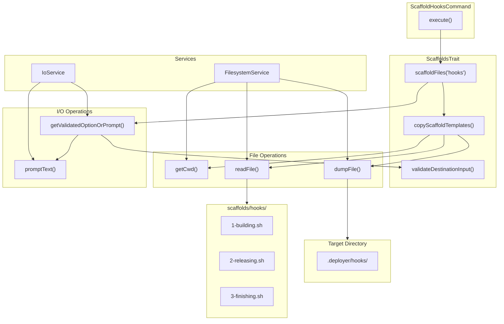

# Schematic: ScaffoldHooksCommand.php

> Auto-generated schematic. Last updated: 2025-12-19

## Overview

Scaffolds deployment hook scripts from templates to a project's `.deployer/hooks/` directory. This command copies pre-defined hook shell scripts (1-building.sh, 2-releasing.sh, 3-finishing.sh) that are executed during site deployments. Existing files are skipped to preserve customizations.

## Logic Flow

### Entry Points

| Method | Access | Description |
|--------|--------|-------------|
| `execute()` | protected | Main command execution via Symfony Console |

### Execution Flow

1. **Parent initialization** - `BaseCommand::execute()` displays env/inventory status
2. **Display heading** - Shows "Scaffold Deployment Hooks" header
3. **Delegate to trait** - Calls `scaffoldFiles('hooks')` from `ScaffoldsTrait`

The trait method performs:

1. **Get destination** - Prompt or use `--destination` CLI option (validates non-empty path)
2. **Normalize path** - Convert relative paths to absolute using current working directory
3. **Build target path** - Append `/.deployer/hooks` to destination
4. **Copy templates** - Copy files from `scaffolds/hooks/` to target directory
5. **Display results** - Show created/skipped status for each file
6. **Command replay** - Output non-interactive command equivalent

### Decision Points

| Location | Condition | True Branch | False Branch |
|----------|-----------|-------------|--------------|
| ScaffoldsTrait:62-64 | Path is relative (no leading `/`) | Prepend cwd | Use path as-is |
| ScaffoldsTrait:93 | Target directory doesn't exist | Create with mkdir | Continue |
| ScaffoldsTrait:114 | Target file doesn't exist | Copy file | Skip file |

### Exit Conditions

| Code | Condition |
|------|-----------|
| `Command::SUCCESS` | All files processed (created or skipped) |
| `Command::FAILURE` | Destination directory creation fails |
| `Command::FAILURE` | Templates directory not found |
| `Command::FAILURE` | ValidationException thrown (invalid CLI option) |

## Interaction Diagram

## Dependencies

### Direct Imports

| File/Class | Usage |
|------------|-------|
| `Deployer\Contracts\BaseCommand` | Parent class providing services, output methods, and command lifecycle |
| `Deployer\Traits\ScaffoldsTrait` | Provides `scaffoldFiles()`, `configureScaffoldOptions()`, and validation |
| `Symfony\Component\Console\Attribute\AsCommand` | Command registration via PHP 8 attribute |
| `Symfony\Component\Console\Input\InputInterface` | Console input abstraction |
| `Symfony\Component\Console\Output\OutputInterface` | Console output abstraction |

### Coupled Files

| File | Coupling Type | Description |
|------|---------------|-------------|
| `scaffolds/hooks/1-building.sh` | Data | Template copied during build phase |
| `scaffolds/hooks/2-releasing.sh` | Data | Template copied during release phase |
| `scaffolds/hooks/3-finishing.sh` | Data | Template copied during finish phase |
| `app/Traits/ScaffoldsTrait.php` | Code | Contains all scaffolding logic |
| `app/Services/FilesystemService.php` | Service | File read/write operations |
| `app/Services/IoService.php` | Service | User prompts and validated input |
| `.deployer/hooks/` | Output | Target directory in user's project |

## Data Flow

### Inputs

| Source | Data | Type |
|--------|------|------|
| CLI option `--destination` | Project root path | string (optional) |
| Interactive prompt | Project root path | string |
| `scaffolds/hooks/*.sh` | Template file contents | string |

### Outputs

| Destination | Data | Type |
|-------------|------|------|
| `.deployer/hooks/*.sh` | Copied hook scripts | files |
| Console | Created/skipped status per file | text |
| Console | Command replay hint | text |

### Side Effects

| Effect | Description |
|--------|-------------|
| Directory creation | Creates `.deployer/hooks/` if it doesn't exist |
| File creation | Writes template files to target directory |
| No overwrites | Existing files are preserved (skipped) |

## Notes

- **Non-destructive**: Existing hook files are never overwritten, protecting user customizations
- **Relative path support**: Relative paths are resolved against the current working directory
- **Shared trait**: Uses the same `ScaffoldsTrait` as `ScaffoldCronsCommand` and `ScaffoldSupervisorsCommand`
- **Template location**: Templates are stored in `scaffolds/hooks/` relative to the package root (two directories up from the trait)
- **Hook execution order**: Files are numbered (1-, 2-, 3-) to enforce execution order during deployments
- **ValidationException handling**: The trait throws `ValidationException` for invalid CLI input; however, this command does not wrap the call in try-catch, meaning validation errors may propagate uncaught
