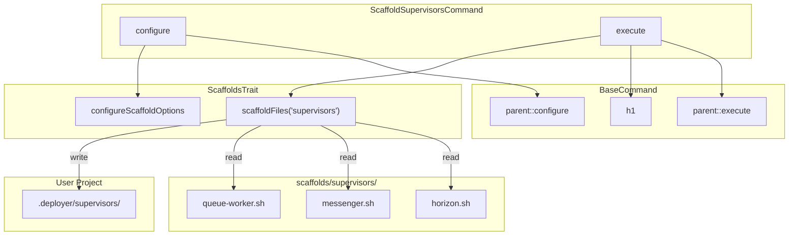

# Schematic: ScaffoldSupervisorsCommand.php

> Auto-generated schematic. Last updated: 2025-12-19

## Overview

ScaffoldSupervisorsCommand copies supervisor program template scripts from `scaffolds/supervisors/` to a user-specified destination directory. It is a thin wrapper around `ScaffoldsTrait::scaffoldFiles()`, providing the command definition and invoking the trait with type `'supervisors'`.

## Logic Flow

### Entry Points

| Method | Visibility | Purpose |
|--------|------------|---------|
| `configure()` | protected | Registers command options via `ScaffoldsTrait::configureScaffoldOptions()` |
| `execute()` | protected | Main execution, delegates to `ScaffoldsTrait::scaffoldFiles('supervisors')` |

### Execution Flow

```
1. configure()
   └─> parent::configure()  (BaseCommand adds --env, --inventory)
   └─> configureScaffoldOptions()  (adds --destination option)

2. execute()
   └─> parent::execute()  (displays env/inventory status)
   └─> h1('Scaffold Supervisor Scripts')  (output heading)
   └─> scaffoldFiles('supervisors')  (delegates all work to trait)
       ├─> Prompt/validate destination directory
       ├─> Copy templates from scaffolds/supervisors/
       ├─> Display status (created/skipped per file)
       └─> Return SUCCESS or FAILURE
```

### Decision Points

All decision logic is delegated to `ScaffoldsTrait::scaffoldFiles()`. See `.claude/schematics/app/Traits/ScaffoldsTrait.php.md` for details.

### Exit Conditions

| Return Value | Condition |
|--------------|-----------|
| `Command::SUCCESS` | Files scaffolded successfully |
| `Command::FAILURE` | Directory creation failed or templates not found |
| Throws `ValidationException` | Destination path validation fails (CLI mode, uncaught) |

## Interaction Diagram



## Dependencies

### Direct Imports

| File/Class | Usage |
|------------|-------|
| `Deployer\Contracts\BaseCommand` | Parent class providing services, output methods |
| `Deployer\Traits\ScaffoldsTrait` | Core scaffolding logic via `use` statement |
| `Symfony\Component\Console\Attribute\AsCommand` | Command registration attribute |
| `Symfony\Component\Console\Input\InputInterface` | Execute method parameter |
| `Symfony\Component\Console\Output\OutputInterface` | Execute method parameter |

### Coupled Files

| File | Coupling Type | Description |
|------|---------------|-------------|
| `app/Traits/ScaffoldsTrait.php` | Trait | Provides `configureScaffoldOptions()`, `scaffoldFiles()` |
| `app/Contracts/BaseCommand.php` | Parent | Provides `$this->io`, `$this->fs`, `h1()`, etc. |
| `scaffolds/supervisors/*.sh` | Data | Template source files copied to destination |
| `app/Services/IoService.php` | State | Used by trait for prompts and validation |
| `app/Services/FilesystemService.php` | State | Used by trait for file operations |

## Data Flow

### Inputs

| Source | Data | Method |
|--------|------|--------|
| CLI Option | `--destination` path | Via `IoService::getValidatedOptionOrPrompt()` in trait |
| Interactive Prompt | Destination directory | Via `IoService::promptText()` in trait |

### Outputs

| Destination | Data | Method |
|-------------|------|--------|
| User Project | `{dest}/.deployer/supervisors/*.sh` | Via `FilesystemService::dumpFile()` in trait |
| Console | Heading "Scaffold Supervisor Scripts" | Via `h1()` |
| Console | Status table (filename => created/skipped) | Via `displayDeets()` in trait |
| Console | Success message | Via `yay()` in trait |
| Console | Command replay | Via `commandReplay()` in trait |

### Side Effects

| Effect | Location | Description |
|--------|----------|-------------|
| Directory creation | ScaffoldsTrait | Creates `{dest}/.deployer/supervisors/` if missing |
| File creation | ScaffoldsTrait | Copies template files that don't exist at destination |

## Notes

**Minimal command:** This command contains almost no logic of its own. It exists solely to:

1. Register the `scaffold:supervisors` console command
2. Display a heading
3. Delegate to `ScaffoldsTrait::scaffoldFiles('supervisors')`

**Template files:** Currently includes three supervisor program templates:

- `horizon.sh` - Laravel Horizon queue manager
- `messenger.sh` - Symfony Messenger consumer
- `queue-worker.sh` - Laravel queue worker

**ValidationException:** The command does NOT catch `ValidationException` from the trait. If CLI validation fails, the exception propagates and Symfony Console displays it as an error.

**Scaffold destination:** Files are copied to `{destination}/.deployer/supervisors/`. The `.deployer` directory is a convention for deployer-specific project configuration.
