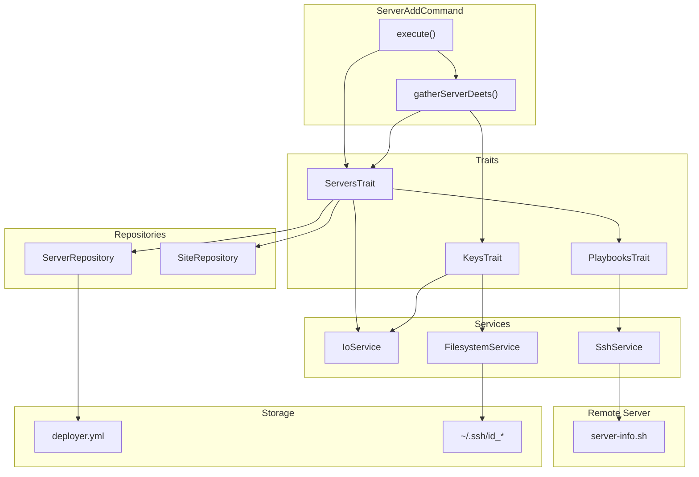
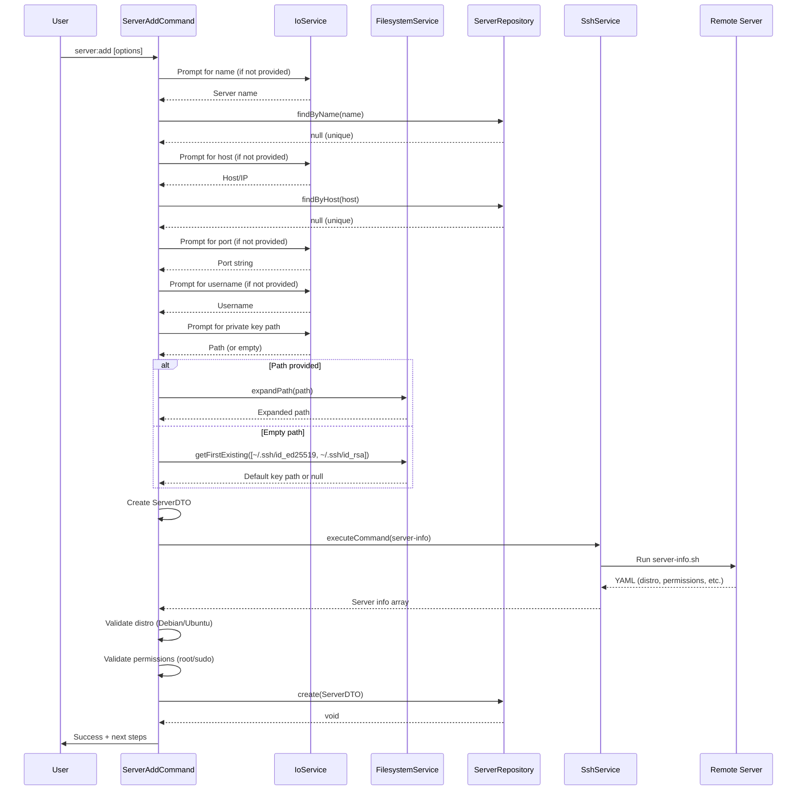

# Schematic: ServerAddCommand.php

> Auto-generated schematic. Last updated: 2025-12-18

## Overview

The `ServerAddCommand` orchestrates adding an existing server to the local inventory. It collects SSH connection details (name, host, port, username, private key), validates server accessibility and permissions via the `server-info` playbook, then persists the server entry to `deployer.yml`.

## Logic Flow

### Entry Points

| Method | Access | Description |
|--------|--------|-------------|
| `configure()` | protected | Registers CLI options: `--name`, `--host`, `--port`, `--private-key-path`, `--username` |
| `execute()` | protected | Main execution flow - orchestrates server addition to inventory |

### Execution Flow

```
1. execute()
   |
   +-- Display heading "Add New Server"
   |
   +-- gatherServerDeets()
   |   |-- Prompt/validate server name (unique, alphanumeric)
   |   |-- Prompt/validate host (IP or domain, unique)
   |   |-- Prompt/validate SSH port (1-65535)
   |   |-- Prompt/validate username (format check)
   |   +-- promptPrivateKeyPath() [KeysTrait]
   |       |-- Prompt for path (optional, allows empty for defaults)
   |       |-- Resolve to existing key or default (~/.ssh/id_ed25519 or ~/.ssh/id_rsa)
   |       +-- Throw ValidationException if no key found
   |
   +-- Create initial ServerDTO (no info yet)
   |
   +-- getServerInfo() [ServersTrait]
   |   |-- displayServerDeets()
   |   |-- executePlaybookSilently(server-info)
   |   |-- Validate distribution (Debian/Ubuntu only)
   |   |-- Validate permissions (root or sudo required)
   |   +-- Return ServerDTO.withInfo()
   |
   +-- servers->create() [ServerRepository]
   |   +-- Persist to deployer.yml inventory
   |
   +-- Display success + next steps hints
   |
   +-- commandReplay() - Show non-interactive command
```

### Decision Points

| Location | Condition | True Branch | False Branch |
|----------|-----------|-------------|--------------|
| L61-63 | `is_int($deets)` | Return FAILURE (validation failed) | Continue with gathered details |
| L82-84 | `is_int($server)` | Return FAILURE (server info failed) | Continue |
| L92-96 | `RuntimeException` from `servers->create()` | Display error, return FAILURE | Continue |

### Exit Conditions

| Exit Point | Condition | Return Value |
|------------|-----------|--------------|
| L63 | `gatherServerDeets()` returned FAILURE | `Command::FAILURE` |
| L84 | `getServerInfo()` returned FAILURE | `Command::FAILURE` |
| L95 | `servers->create()` threw RuntimeException | `Command::FAILURE` |
| L117 | Success | `Command::SUCCESS` |

## Interaction Diagram



## Dependencies

### Direct Imports

| File/Class | Usage |
|------------|-------|
| `Deployer\Contracts\BaseCommand` | Parent class providing DI, output methods, and command infrastructure |
| `Deployer\DTOs\ServerDTO` | Immutable data object representing a server |
| `Deployer\Exceptions\ValidationException` | Thrown when CLI option validation fails |
| `Deployer\Traits\KeysTrait` | Provides `promptPrivateKeyPath()`, `resolvePrivateKeyPath()`, key validation |
| `Deployer\Traits\PlaybooksTrait` | Provides `executePlaybookSilently()` for remote script execution (via ServersTrait) |
| `Deployer\Traits\ServersTrait` | Provides `getServerInfo()`, `displayServerDeets()`, server validators |
| `Symfony\Component\Console\Attribute\AsCommand` | Command metadata attribute |
| `Symfony\Component\Console\Command\Command` | Constants `Command::SUCCESS`, `Command::FAILURE` |
| `Symfony\Component\Console\Input\InputInterface` | CLI input handling |
| `Symfony\Component\Console\Input\InputOption` | Option definition constants |
| `Symfony\Component\Console\Output\OutputInterface` | CLI output handling |

### Coupled Files

| File | Coupling Type | Description |
|------|---------------|-------------|
| `playbooks/server-info.sh` | Playbook | Remote script that gathers server info (distro, permissions, PHP, Caddy) |
| `playbooks/helpers.sh` | Playbook | Inlined into playbooks for `run_cmd` and other helpers |
| `deployer.yml` | Data | Inventory file where servers are persisted via `ServerRepository` |
| `~/.ssh/id_ed25519` | Config | Default SSH private key (fallback 1) |
| `~/.ssh/id_rsa` | Config | Default SSH private key (fallback 2) |
| `app/Services/IoService.php` | Service | Handles all user input prompts and validation |
| `app/Services/SshService.php` | Service | Executes playbooks on remote servers |
| `app/Services/FilesystemService.php` | Service | Path expansion and file existence checks for SSH keys |
| `app/Repositories/ServerRepository.php` | Repository | CRUD operations for server inventory |

## Data Flow

### Inputs

| Source | Data | Processing |
|--------|------|------------|
| CLI `--name` | Server name string | Validated format (alphanumeric, hyphens, underscores), uniqueness in inventory |
| CLI `--host` | Host/IP string | Validated as IP or domain, uniqueness in inventory |
| CLI `--port` | SSH port string | Validated as integer 1-65535, converted to int |
| CLI `--username` | SSH username string | Validated format (starts with letter/underscore) |
| CLI `--private-key-path` | Path string | Expanded, validated file exists, validated PEM format, or resolved to defaults |
| `server-info` playbook | Server state YAML | Distribution, permissions, hardware info |

### Outputs

| Destination | Data | Format |
|-------------|------|--------|
| Console | Status messages | Text via `h1()`, `yay()`, `nay()`, `info()`, `ul()` |
| Console | Server details | Key-value via `displayServerDeets()` |
| Console | Command replay | CLI command string via `commandReplay()` |
| `deployer.yml` | Server entry | YAML via `ServerRepository::create()` |

### Side Effects

| Effect | Location | Trigger |
|--------|----------|---------|
| Inventory modification | `deployer.yml` | `ServerRepository::create()` |
| SSH connection test | Remote server | `server-info.sh` playbook validates connectivity |

## Sequence Diagram



## Notes

### Validation Strategy

The command uses a comprehensive validation approach organized in `gatherServerDeets()`:

1. **Name validation** (`validateServerName` in ServersTrait): Alphanumeric plus hyphens/underscores, max 64 chars, unique in inventory
2. **Host validation** (`validateServerHost` in ServersTrait): Valid IP or domain format, unique in inventory
3. **Port validation** (`validateServerPort` in ServersTrait): Numeric string, range 1-65535
4. **Username validation** (`validateUsernameInput` in ServersTrait): Must start with letter or underscore, non-empty
5. **Private key validation** (`validatePrivateKeyPathInputAllowEmpty` in KeysTrait): Either empty (triggers default resolution) or valid PEM file

All validated inputs are wrapped in a single try-catch for `ValidationException` in `gatherServerDeets()`.

### Private Key Resolution

The `promptPrivateKeyPath()` method from `KeysTrait` has fallback behavior:

- If user provides a path: expand `~` and validate file exists with valid PEM format
- If empty: resolve to first existing from `~/.ssh/id_ed25519`, `~/.ssh/id_rsa`
- Throws `ValidationException` if no key found in either case

### Server Info Validation

The `getServerInfo()` method from `ServersTrait` performs critical validation:

- Runs `server-info.sh` playbook via SSH (validates connectivity)
- Checks `distro` is `ubuntu` or `debian` (only supported distributions)
- Checks `permissions` is `root` or `sudo` (passwordless sudo required)
- Returns enriched `ServerDTO` with info array for subsequent commands

### Trait Dependencies

The command uses three traits with a dependency chain:

- `ServersTrait` internally uses `PlaybooksTrait`
- `KeysTrait` requires `FilesystemService` and `IoService`
- Both `ServersTrait` and `KeysTrait` use `IoService` for validated prompts

### Next Steps Guidance

After successful addition, the command displays helpful hints:

- Run `server:info` to view detailed server information
- Run `server:install` to provision the server with required software

### Inventory Persistence

The `ServerRepository::create()` method:

- Validates name uniqueness (throws if exists)
- Validates host uniqueness (throws if exists)
- Converts `ServerDTO` to array and appends to `servers` list
- Writes to `deployer.yml` via `InventoryService`
