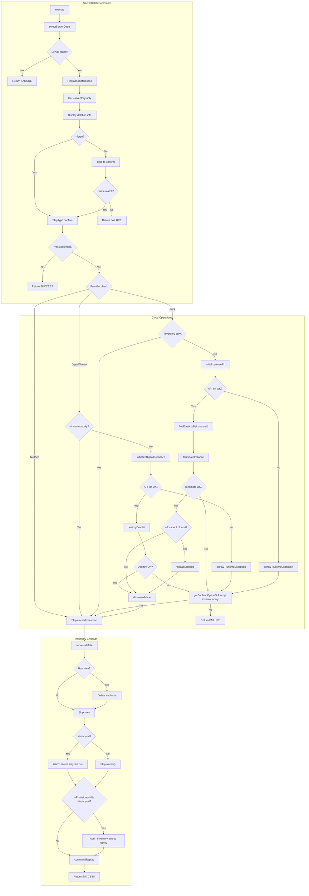
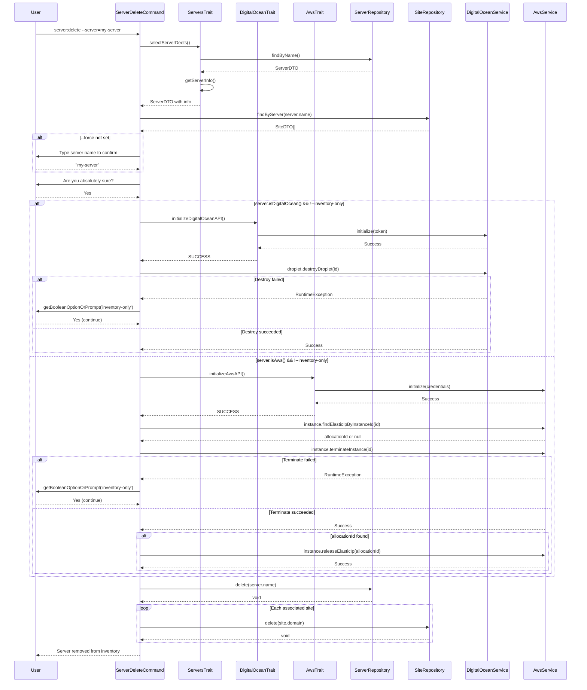

# Schematic: ServerDeleteCommand.php

> Auto-generated schematic. Last updated: 2025-12-26
>
> Recent update: Added Elastic IP lookup and release during AWS server deletion. The command now finds any Elastic IP associated with the instance before termination, then releases it after the instance is terminated.

## Overview

`ServerDeleteCommand` is a Symfony Console command that handles the deletion of servers from both cloud providers (DigitalOcean and AWS) and the local inventory. It implements a multi-stage deletion process with safety confirmations (type-to-confirm and yes/no prompts), optionally destroys cloud resources for provisioned servers (skippable via `--inventory-only`), and cascades deletion to associated sites.

## Logic Flow

### Entry Points

| Method | Access | Purpose |
|--------|--------|---------|
| `configure()` | protected | Defines command options (`--server`, `--force`, `--yes`, `--inventory-only`) |
| `execute()` | protected | Main execution entry point, orchestrates the deletion flow |

### Execution Flow

```
1. Initialize I/O and display heading
   └── h1('Delete Server')

2. Server Selection Phase
   ├── selectServerDeets() → ServerDTO|int
   │   ├── ensureServersAvailable() - checks inventory has servers
   │   ├── Prompt for server selection (or use --server)
   │   ├── getServerInfo() - validates SSH and retrieves server info
   │   └── Return ServerDTO or Command::FAILURE
   └── Find associated sites via sites->findByServer()

3. Display Deletion Info
   ├── Get inventoryOnly flag from --inventory-only option
   ├── Build list of actions to perform:
   │   ├── "Remove the server from inventory"
   │   ├── "Delete N associated site(s): domain1, domain2" (if sites exist)
   │   ├── "Destroy the droplet on DigitalOcean (ID: X)" (if server->isDigitalOcean() && !inventoryOnly)
   │   └── "Terminate the EC2 instance on AWS (ID: X)" (if server->isAws() && !inventoryOnly)
   └── Display with info() + ul()

4. Safety Confirmation Phase
   ├── Type-to-confirm (unless --force)
   │   ├── Prompt user to type exact server name
   │   └── Compare input with server.name
   │       └── Mismatch → Command::FAILURE
   └── Yes/No confirmation (unless --yes)
       └── Cancelled → Command::SUCCESS

5. Cloud Provider Destruction Phase (mutually exclusive)
   ├── DigitalOcean Path (server->isDigitalOcean() && !inventoryOnly):
   │   ├── initializeDigitalOceanAPI()
   │   │   └── Failed → throw RuntimeException
   │   └── digitalOcean->droplet->destroyDroplet(dropletId)
   │       ├── Success → destroyed = true
   │       └── Failure → getBooleanOptionOrPrompt('inventory-only', "Remove from inventory anyway?")
   │           └── No → Command::FAILURE
   └── AWS Path (server->isAws() && !inventoryOnly):
       ├── initializeAwsAPI()
       │   └── Failed → throw RuntimeException
       ├── aws->instance->findElasticIpByInstanceId(instanceId)
       │   └── Returns allocationId or null
       ├── aws->instance->terminateInstance(instanceId)
       │   └── Success → "Instance terminated"
       ├── If allocationId found:
       │   └── aws->instance->releaseElasticIp(allocationId)
       │       └── Success → "Elastic IP released"
       ├── destroyed = true
       └── Failure → getBooleanOptionOrPrompt('inventory-only', "Remove from inventory anyway?")
           └── No → Command::FAILURE

6. Inventory Deletion Phase
   ├── servers->delete($server->name)
   └── yay("Server removed from inventory")

7. Associated Sites Deletion Phase
   ├── Loop through sites->findByServer()
   │   └── sites->delete($site->domain) for each
   └── yay("Deleted N associated sites")

8. Warning for Non-Destroyed Servers
   └── If !destroyed: warn about server potentially still running

9. Completion Phase
   ├── If server->isProvisioned() && !destroyed: add --inventory-only to replay options
   └── commandReplay() - show non-interactive command
```

### Decision Points

| Line | Condition | True Branch | False Branch |
|------|-----------|-------------|--------------|
| 60-62 | `is_int($server)` | Return early (no servers/SSH failed) | Continue with ServerDTO |
| 85 | `$server->isDigitalOcean() && !$inventoryOnly` | Add droplet destruction to info | Skip droplet info |
| 89-92 | `$server->isAws() && !$inventoryOnly` | Add instance termination + Elastic IP release to info | Skip AWS info |
| 107-118 | `!$forceSkip` | Type-to-confirm prompt | Skip confirmation |
| 113-117 | `$typedName !== $server->name` | FAILURE | Continue |
| 128-132 | `!$confirmed` | SUCCESS (cancelled) | Continue |
| 140-171 | `$server->isDigitalOcean() && !$inventoryOnly` | Destroy droplet | Check AWS |
| 142-144 | `initializeDigitalOceanAPI() === FAILURE` | Throw RuntimeException | Continue |
| 173-227 | `$server->isAws() && !$inventoryOnly` | Look up EIP, terminate instance, release EIP | Skip cloud destruction |
| 175-177 | `initializeAwsAPI() === FAILURE` | Throw RuntimeException | Continue |
| 203-210 | `elasticIpAllocationId !== null` | Release Elastic IP | Skip EIP release |
| 242-248 | `count($serverSites) > 0` | Delete associated sites | Skip |
| 251-255 | `!$destroyed` | Warn about running server | Skip warning |
| 269 | `$server->isProvisioned() && !$destroyed` | Add --inventory-only to replay | Skip |

### Exit Conditions

| Condition | Return Value | Message |
|-----------|--------------|---------|
| No servers in inventory | `FAILURE` | "No servers found in your inventory" |
| SSH connection failed | `FAILURE` | SSH error message |
| Invalid server option | `FAILURE` | ValidationException message |
| Type-to-confirm mismatch | `FAILURE` | "Server name does not match. Deletion cancelled." |
| User cancels confirmation | `SUCCESS` | "Cancelled deleting server" |
| DO API failure + user declines inventory removal | `FAILURE` | (No additional message) |
| AWS API failure + user declines inventory removal | `FAILURE` | (No additional message) |
| Successful deletion | `SUCCESS` | "Server '{name}' removed from inventory" |

## Interaction Diagram





## Dependencies

### Direct Imports

| Import | Usage |
|--------|-------|
| `Deployer\Contracts\BaseCommand` | Parent class providing I/O helpers, services, repositories |
| `Deployer\Traits\AwsTrait` | `initializeAwsAPI()` for AWS authentication |
| `Deployer\Traits\DigitalOceanTrait` | `initializeDigitalOceanAPI()` for DO authentication |
| `Deployer\Traits\PlaybooksTrait` | Indirectly used via ServersTrait for playbook execution |
| `Deployer\Traits\ServersTrait` | `selectServerDeets()` for server selection with validation |
| `Deployer\DTOs\ServerDTO` | Server data object with `isDigitalOcean()`, `isAws()`, and `isProvisioned()` methods |
| `Symfony\Component\Console\Attribute\AsCommand` | Command registration attribute |
| `Symfony\Component\Console\Command\Command` | Return constants (SUCCESS, FAILURE) |
| `Symfony\Component\Console\Input\InputInterface` | CLI input handling |
| `Symfony\Component\Console\Input\InputOption` | Option definitions |
| `Symfony\Component\Console\Output\OutputInterface` | CLI output handling |

### Coupled Files

| File | Coupling Type | Description |
|------|---------------|-------------|
| `app/Traits/ServersTrait.php` | Trait | Provides `selectServerDeets()`, `ensureServersAvailable()`, `getServerInfo()`, `displayServerDeets()` |
| `app/Traits/DigitalOceanTrait.php` | Trait | Provides `initializeDigitalOceanAPI()` for DO API authentication |
| `app/Traits/AwsTrait.php` | Trait | Provides `initializeAwsAPI()` for AWS API authentication |
| `app/Traits/PlaybooksTrait.php` | Trait | Indirectly used via ServersTrait for `server-info` playbook |
| `playbooks/server-info.sh` | Playbook | Used indirectly via `getServerInfo()` to verify SSH |
| `deployer.yml` | Data | Inventory file where servers and sites are stored/removed |
| `.env` | Environment | Contains `DIGITALOCEAN_API_TOKEN`/`DO_API_TOKEN` or `AWS_ACCESS_KEY_ID`/`AWS_SECRET_ACCESS_KEY`/`AWS_DEFAULT_REGION` |
| `app/Services/DigitalOceanService.php` | Service | Droplet destruction via `droplet->destroyDroplet()` |
| `app/Services/Aws/AwsService.php` | Service | Elastic IP lookup via `instance->findElasticIpByInstanceId()`, instance termination via `instance->terminateInstance()`, and Elastic IP release via `instance->releaseElasticIp()` |
| `app/DTOs/ServerDTO.php` | DTO | Server type detection via `isDigitalOcean()`, `isAws()`, and `isProvisioned()` methods |
| `app/Repositories/ServerRepository.php` | Repository | Server CRUD operations |
| `app/Repositories/SiteRepository.php` | Repository | Site lookup and deletion for cascading |

## Data Flow

### Inputs

| Source | Data | Via |
|--------|------|-----|
| CLI Option | `--server` | `InputInterface::getOption()` via ServersTrait |
| CLI Flag | `--force` | `InputInterface::getOption()` |
| CLI Flag | `--yes` | `IoService::getBooleanOptionOrPrompt()` |
| CLI Flag | `--inventory-only` | `InputInterface::getOption()` and `IoService::getBooleanOptionOrPrompt()` |
| Interactive | Server selection | `ServersTrait::selectServerDeets()` |
| Interactive | Type-to-confirm | `IoService::promptText()` |
| Interactive | Yes/No confirm | `IoService::promptConfirm()` |
| Interactive | Remove from inventory anyway? | `IoService::getBooleanOptionOrPrompt('inventory-only')` |
| Inventory | Server list | `ServerRepository::all()` |
| Inventory | Site list | `SiteRepository::findByServer()` |
| Environment | DO API token | `EnvService::get()` |
| Environment | AWS credentials | `EnvService::get()` |

### Outputs

| Destination | Data | Via |
|-------------|------|-----|
| Console | Server details display | `displayServerDeets()` |
| Console | Deletion info list | `info()`, `ul()` |
| Console | Status messages | `h1()`, `yay()`, `nay()`, `warn()` |
| Console | Command replay | `commandReplay()` |
| DigitalOcean API | Droplet destruction | `DigitalOceanService::droplet->destroyDroplet()` |
| AWS API | Elastic IP lookup | `AwsService::instance->findElasticIpByInstanceId()` |
| AWS API | Instance termination | `AwsService::instance->terminateInstance()` |
| AWS API | Elastic IP release | `AwsService::instance->releaseElasticIp()` |
| Inventory | Server removal | `ServerRepository::delete()` |
| Inventory | Site removal | `SiteRepository::delete()` |

### Side Effects

| Effect | Description |
|--------|-------------|
| **Cloud: Droplet destruction** | Destroys DigitalOcean droplet via API (irreversible) |
| **Cloud: Instance termination** | Terminates AWS EC2 instance via API (irreversible) |
| **Cloud: Elastic IP release** | Releases associated Elastic IP back to AWS pool |
| **Local: Server removal** | Removes server entry from `deployer.yml` |
| **Local: Site removal** | Removes all associated site entries from `deployer.yml` |

## Notes

### Safety Mechanisms

1. **Type-to-confirm** (default): User must type exact server name to proceed
2. **Secondary confirmation**: Even after type-to-confirm, requires explicit yes/no
3. **Graceful degradation**: Cloud API failure does not block inventory cleanup
4. **User choice on failure**: When cloud destruction fails, user decides whether to clean inventory

### Cascading Deletion

Sites are deleted from inventory only - no remote server operations are performed for sites during server deletion. The remote site files remain on the server until the instance/droplet is destroyed.

### Non-Interactive Operation

Fully non-interactive via:

```bash
# Normal deletion (destroys cloud resources if applicable)
vendor/bin/deployer server:delete --server='my-server' --force --yes

# Skip cloud provider destruction (inventory only)
vendor/bin/deployer server:delete --server='my-server' --force --yes --inventory-only
```

### Elastic IP Cleanup (AWS)

For AWS servers, the command performs Elastic IP cleanup:

1. **Lookup before termination**: Finds associated Elastic IP while association still exists
2. **Terminate instance**: Disassociates the Elastic IP automatically
3. **Release Elastic IP**: Releases the IP back to AWS pool to avoid charges

This ordering is critical because the Elastic IP association is lost once the instance terminates.

### Error Handling Strategy

The command follows a "best effort" approach for cloud operations:

- API not configured: Catches `InvalidArgumentException`, displays helpful message
- API authentication failed: Catches `RuntimeException`, offers inventory cleanup via `getBooleanOptionOrPrompt('inventory-only')`
- Cloud destruction failed: Catches `RuntimeException`, offers inventory cleanup via `getBooleanOptionOrPrompt('inventory-only')`
- Elastic IP lookup/release failed: Included in the same try-catch as instance termination
- Hard failures: Invalid server selection, type-to-confirm mismatch

The `--inventory-only` option serves dual purpose:

1. Proactive: Skip cloud destruction entirely when provided upfront
2. Recovery: When cloud destruction fails, the recovery prompt uses the same option for non-interactive scenarios

### Cloud Provider Detection

Server provider detection uses `ServerDTO` methods:

- `isDigitalOcean()`: Returns `true` when `provider === 'digitalocean'` AND `dropletId !== null`
- `isAws()`: Returns `true` when `provider === 'aws'` AND `instanceId !== null`
- `isProvisioned()`: Returns `true` when either `isDigitalOcean()` OR `isAws()` is true

This allows servers manually added (without cloud provisioning) to be deleted without API interaction.

### Trait Dependencies

```
ServerDeleteCommand
├── AwsTrait
│   └── initializeAwsAPI()
├── DigitalOceanTrait
│   └── initializeDigitalOceanAPI()
└── ServersTrait
    ├── selectServerDeets()
    │   ├── ensureServersAvailable()
    │   ├── validateServerSelection()
    │   └── getServerInfo()
    ├── displayServerDeets()
    └── PlaybooksTrait (via ServersTrait)
        └── executePlaybookSilently('server-info')
```
