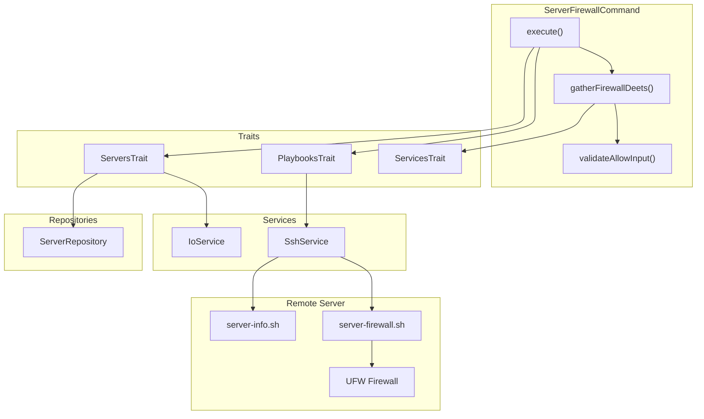
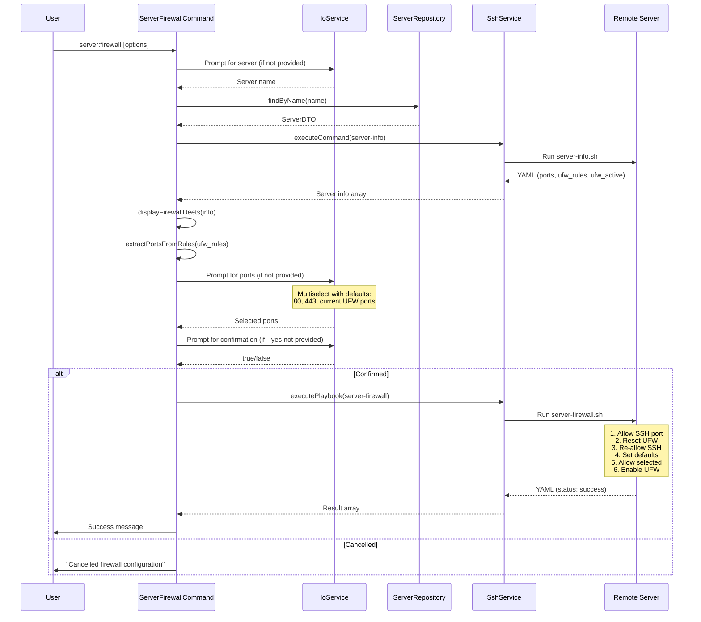

# Schematic: ServerFirewallCommand.php

> Auto-generated schematic. Last updated: 2025-12-18

## Overview

The `ServerFirewallCommand` manages UFW firewall rules on a remote server. It retrieves current server state (open ports and UFW rules), prompts the user to select which ports to allow through the firewall, and executes the `server-firewall.sh` playbook to apply the configuration. SSH port is always protected and cannot be deselected.

## Logic Flow

### Entry Points

| Method | Access | Description |
|--------|--------|-------------|
| `configure()` | protected | Registers CLI options: `--server`, `--allow`, `--yes` |
| `execute()` | protected | Main execution flow - orchestrates firewall configuration |

### Execution Flow

```
1. execute()
   |
   +-- Display heading "Server Firewall"
   |
   +-- selectServerDeets() [ServersTrait]
   |   |-- ensureServersAvailable()
   |   |-- Prompt/validate server selection
   |   +-- getServerInfo() -> runs server-info playbook
   |
   +-- Validate server selection result
   |   +-- Return FAILURE if is_int($server) or null === $server->info
   |
   +-- displayFirewallDeets() [ServersTrait]
   |   +-- Show current UFW status and allowed ports
   |
   +-- Extract ports from server info
   |   |-- Get UFW rules array from info['ufw_rules']
   |   |-- extractPortsFromRules() -> parse "port/proto" format
   |   |-- Get listening ports from info['ports']
   |   +-- Remove SSH port from selectable options
   |
   +-- Check if any selectable ports exist
   |   +-- Return SUCCESS with warning if no additional services
   |
   +-- gatherFirewallDeets()
   |   |-- Build default selections (80, 443 + current UFW ports)
   |   |-- Build options array with formatPortService()
   |   |-- try: getValidatedOptionOrPrompt('allow', ...)
   |   |   |-- Prompt for port selection via multiselect
   |   |   +-- Normalize string to array (CLI vs prompt)
   |   |-- catch ValidationException: nay() + return FAILURE
   |   +-- getBooleanOptionOrPrompt('yes', ...) for confirmation
   |
   +-- Check confirmation
   |   +-- Return SUCCESS with "Cancelled" warning if not confirmed
   |
   +-- executePlaybook() [PlaybooksTrait]
   |   |-- Run server-firewall.sh
   |   +-- Pass DEPLOYER_ALLOWED_PORTS (comma-separated)
   |
   +-- Display success message
   |
   +-- commandReplay() - Show non-interactive command
```

### Decision Points

| Location | Condition | True Branch | False Branch |
|----------|-----------|-------------|--------------|
| L57-59 | `is_int($server) \|\| null === $server->info` | Return FAILURE | Continue |
| L76-79 | `[] === $selectablePorts` | Return SUCCESS with warning | Continue |
| L87-89 | `is_int($ufwDeets)` | Return FAILURE | Continue |
| L96-100 | `!$confirmed` | Return SUCCESS (cancelled) | Continue |
| L115-117 | `is_int($result)` | Return FAILURE | Continue |
| L183-186 | `ValidationException` caught | Return FAILURE | Continue |

### Exit Conditions

| Exit Point | Condition | Return Value |
|------------|-----------|--------------|
| L58 | Server selection failed or no info | `Command::FAILURE` |
| L78 | No additional services besides SSH | `Command::SUCCESS` |
| L88 | Firewall details gathering failed (validation) | `Command::FAILURE` |
| L99 | User cancelled confirmation | `Command::SUCCESS` |
| L116 | Playbook execution failed | `Command::FAILURE` |
| L131 | Success | `Command::SUCCESS` |
| L185 | ValidationException in gatherFirewallDeets | `Command::FAILURE` |

## Interaction Diagram



## Dependencies

### Direct Imports

| File/Class | Usage |
|------------|-------|
| `Deployer\Contracts\BaseCommand` | Parent class providing DI, output methods, and command infrastructure |
| `Deployer\Exceptions\ValidationException` | Thrown when CLI option validation fails |
| `Deployer\Traits\PlaybooksTrait` | Provides `executePlaybook()` for remote script execution |
| `Deployer\Traits\ServersTrait` | Provides `selectServerDeets()`, `displayFirewallDeets()`, `extractPortsFromRules()` |
| `Deployer\Traits\ServicesTrait` | Provides `formatPortService()` for display labels |
| `Symfony\Component\Console\Attribute\AsCommand` | Command metadata attribute |
| `Symfony\Component\Console\Command\Command` | Constants `Command::SUCCESS`, `Command::FAILURE` |
| `Symfony\Component\Console\Input\InputInterface` | CLI input handling |
| `Symfony\Component\Console\Input\InputOption` | Option definition constants |
| `Symfony\Component\Console\Output\OutputInterface` | CLI output handling |

### Coupled Files

| File | Coupling Type | Description |
|------|---------------|-------------|
| `playbooks/server-firewall.sh` | Playbook | Remote script that configures UFW rules |
| `playbooks/server-info.sh` | Playbook | Called via `getServerInfo()` to retrieve server state including ports and UFW rules |
| `playbooks/helpers.sh` | Playbook | Inlined into playbooks for `run_cmd` and other helpers |
| `app/Services/IoService.php` | Service | Handles all user input prompts and validation |
| `app/Services/SshService.php` | Service | Executes playbooks on remote servers |
| `app/Repositories/ServerRepository.php` | Repository | Server lookup for selection |

## Data Flow

### Inputs

| Source | Data | Processing |
|--------|------|------------|
| CLI `--server` | Server name string | Validated against inventory via `validateServerSelection()` |
| CLI `--allow` | Comma-separated ports | Parsed, validated against listening ports via `validateAllowInput()` |
| CLI `--yes` | Skip confirmation flag | Boolean, bypasses confirmation prompt |
| `server-info` playbook | Server state YAML | Extracts `ports` (listening), `ufw_rules` (allowed), `ufw_installed`, `ufw_active` |

### Outputs

| Destination | Data | Format |
|-------------|------|--------|
| Console | Status messages | Text via `h1()`, `yay()`, `nay()`, `warn()` |
| Console | Firewall details | Key-value via `displayFirewallDeets()` |
| Console | Command replay | CLI command string via `commandReplay()` |
| Remote server | UFW rules | Applied via `ufw allow` commands in playbook |

### Side Effects

| Effect | Location | Trigger |
|--------|----------|---------|
| UFW reset | Remote server | `server-firewall.sh` calls `ufw --force reset` |
| SSH port protection | Remote server | SSH port always allowed before/after reset |
| Default policies set | Remote server | Deny incoming, allow outgoing |
| Selected ports allowed | Remote server | `ufw allow {port}/tcp` for each selected port |
| UFW enabled | Remote server | `ufw --force enable` |

## Sequence Diagram



## Input Validation

### Validation Pattern

Uses `getValidatedOptionOrPrompt()` with `validateAllowInput()` validator. The validator returns `?string` (error message or null for valid). When CLI option validation fails, `ValidationException` is thrown and caught in `gatherFirewallDeets()`.

### validateAllowInput() [L211-247]

Validates the `--allow` CLI option or multiselect prompt result:

| Check | Error Message |
|-------|---------------|
| Type check | "Ports must be a comma-separated string or array" |
| Empty selection | "At least one port must be selected" |
| Port range (1-65535) | "Invalid port number: {port}" |
| Port listening | "Ports not listening: {ports}. Available: {available}" |

```php
// Input normalization (handles both CLI string and prompt array)
$ports = is_string($value)
    ? array_filter(array_map(fn ($p) => (int) trim($p), explode(',', $value)))
    : $value;
```

## Error Handling Paths

### ValidationException Flow

The `gatherFirewallDeets()` method wraps `getValidatedOptionOrPrompt()` in a try-catch block to handle CLI validation failures:

```
gatherFirewallDeets() [L145-200]
    |
    +-- try { [L147]
    |       getValidatedOptionOrPrompt('allow', ...) [L161-172]
    |       |-- CLI option provided: validateAllowInput() runs
    |       |   +-- Returns ?string error or null
    |       |   +-- Throws ValidationException on error
    |       +-- Interactive: promptMultiselect with validate callback
    |   }
    +-- catch (ValidationException $e) [L183]
    |       $this->nay($e->getMessage()) [L184]
    |       return Command::FAILURE [L185]
    |
    +-- getBooleanOptionOrPrompt('yes', ...) [L188-194]
        +-- No exception: returns bool directly
```

### Playbook Failure Flow

```
executePlaybook() returns int
    |
    +-- is_int($result)?
        |
        +-- Yes: return Command::FAILURE
            (Playbook already displayed error via PlaybooksTrait)
```

## Notes

### SSH Port Protection

The command explicitly protects the SSH port from being deselectable:

```php
$selectablePorts = $openPorts;
unset($selectablePorts[$server->port]); // Can't select the SSH port
```

The playbook also implements a safety sequence:

1. Allow SSH before reset (prevents lockout if UFW is active)
2. Reset UFW
3. Re-allow SSH immediately after reset
4. Continue with user-selected ports

### Default Port Selection

The `gatherFirewallDeets()` method pre-selects common HTTP/HTTPS ports plus any currently allowed UFW ports:

```php
$defaultPorts = array_values(array_unique(array_filter(
    [80, 443, ...$ufwPorts],
    fn (int $port): bool => isset($selectablePorts[$port])
)));
```

### Port Display Format

Uses `ServicesTrait::formatPortService()` to display ports with service labels:

```
80 (Caddy)
443 (Caddy)
3306 (MySQL)
5432 (PostgreSQL)
```

### CLI vs Interactive Input

The `--allow` option accepts comma-separated ports while the interactive prompt returns an array:

```php
// Normalize: CLI gives comma-string, prompt gives array
if (is_string($selectedPorts)) {
    $selectedPorts = array_values(array_filter(array_map(
        fn (string $p): int => (int) trim($p),
        explode(',', $selectedPorts)
    )));
}
```

### Playbook Environment Variables

The `server-firewall.sh` playbook receives:

- `DEPLOYER_OUTPUT_FILE` - Temp file for YAML output
- `DEPLOYER_PERMS` - Permission level (root/sudo)
- `DEPLOYER_SSH_PORT` - SSH port to protect
- `DEPLOYER_ALLOWED_PORTS` - Comma-separated list of ports to allow
