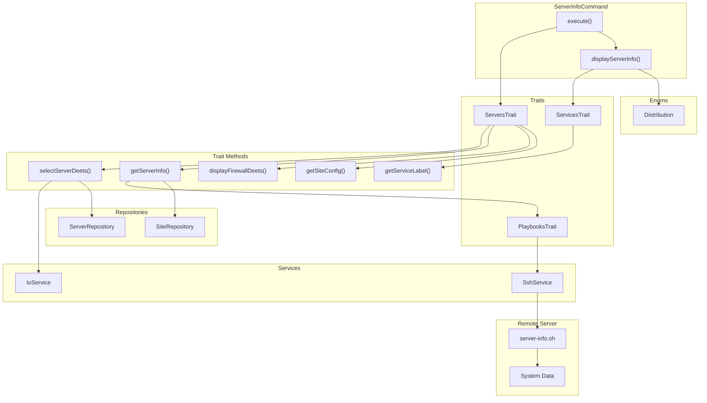

# Schematic: ServerInfoCommand.php

> Auto-generated schematic. Last updated: 2025-12-27

## Recent Changes

- **2025-12-27**: Migrated from Caddy to Nginx - now displays Nginx metrics (version, active connections, total requests, reading/writing/waiting) instead of Caddy metrics

## Overview

The `ServerInfoCommand` displays comprehensive server information including distribution, hardware specs, installed services, firewall status, PHP/Nginx metrics, and site configurations. It connects to a remote server via SSH, executes the `server-info.sh` playbook, and formats the returned YAML data into a human-readable display.

## Logic Flow

### Entry Points

| Method | Access | Description |
|--------|--------|-------------|
| `configure()` | protected | Registers CLI option: `--server` |
| `execute()` | protected | Main execution flow - orchestrates server selection and info display |

### Execution Flow

```
1. execute()
   |
   +-- Display heading "Server Information"
   |
   +-- selectServerDeets() [ServersTrait]
   |   |-- ensureServersAvailable()
   |   |   +-- Check if any servers in inventory
   |   |-- getValidatedOptionOrPrompt('server')
   |   |   |-- CLI option provided: validateServerSelection()
   |   |   |   +-- Throws ValidationException on failure
   |   |   +-- Interactive: promptSelect() with validation
   |   |-- Catch ValidationException -> nay() + return FAILURE
   |   +-- getServerInfo()
   |       |-- displayServerDeets() - Show server connection info
   |       |-- executePlaybookSilently() - Run server-info.sh
   |       |-- Validate distribution (Ubuntu/Debian only)
   |       +-- Validate permissions (root/sudo required)
   |
   +-- Check for failure (is_int or null info)
   |
   +-- displayServerInfo()
   |   |-- Display distro & permissions
   |   |-- Display hardware (CPU, RAM, disk)
   |   |-- Display ports/services
   |   |-- displayFirewallDeets() [ServersTrait]
   |   |-- Display Nginx metrics (if available)
   |   |-- Display PHP versions & extensions
   |   |-- Display PHP-FPM metrics (per version)
   |   +-- Display sites configuration
   |
   +-- commandReplay() - Show non-interactive command
```

### Decision Points

| Location | Condition | True Branch | False Branch |
|----------|-----------|-------------|--------------|
| L55-57 | `is_int($server) \|\| null === $server->info` | Return FAILURE | Continue to display |
| L102-103 | `isset($info['hardware']) && is_array(...)` | Display hardware section | Skip hardware |
| L127-129 | `count($hardwareItems) > 0` | Output hardware details | Skip |
| L135 | `isset($info['ports']) && is_array(...) && count(...) > 0` | Build ports list | Skip |
| L148-152 | `[] === $services` | Display "None detected" | Display services list |
| L157 | `isset($info['nginx']) && ... && $info['nginx']['available'] === true` | Display Nginx metrics | Skip Nginx section |
| L204 | `isset($info['php']) && ... && isset($info['php']['versions'])` | Display PHP versions | Skip PHP section |
| L232 | `isset($info['php_fpm']) && ... && count(...) > 0` | Display PHP-FPM metrics | Skip FPM section |
| L313 | `isset($info['sites_config']) && ... && count(...) > 0` | Display sites configuration | Skip sites section |

### Exit Conditions

| Exit Point | Condition | Return Value |
|------------|-----------|--------------|
| L56 | Server selection failed or no info | `Command::FAILURE` |
| L69 | Success after displaying info | `Command::SUCCESS` |

## Interaction Diagram



## Dependencies

### Direct Imports

| File/Class | Usage |
|------------|-------|
| `DeployerPHP\Contracts\BaseCommand` | Parent class providing DI, output methods, and command infrastructure |
| `DeployerPHP\Enums\Distribution` | Maps distro slug to display name via `tryFrom()` and `displayName()` |
| `DeployerPHP\Traits\PlaybooksTrait` | Provides `executePlaybookSilently()` for remote script execution |
| `DeployerPHP\Traits\ServersTrait` | Provides `selectServerDeets()`, `displayFirewallDeets()`, `getSiteConfig()` |
| `DeployerPHP\Traits\ServicesTrait` | Provides `getServiceLabel()` for port/process display |
| `Symfony\Component\Console\Attribute\AsCommand` | Command metadata attribute |
| `Symfony\Component\Console\Command\Command` | Constants `Command::SUCCESS`, `Command::FAILURE` |
| `Symfony\Component\Console\Input\InputInterface` | CLI input handling |
| `Symfony\Component\Console\Input\InputOption` | Option definition constants |
| `Symfony\Component\Console\Output\OutputInterface` | CLI output handling |

### Coupled Files

| File | Coupling Type | Description |
|------|---------------|-------------|
| `playbooks/server-info.sh` | Playbook | Remote script that gathers all server information including Nginx metrics |
| `playbooks/helpers.sh` | Playbook | Inlined into playbook for `run_cmd` and other helpers |
| `deployer.yml` | Data | Inventory file containing server connection details |
| `app/Services/IoService.php` | Service | Handles user input prompts and `getValidatedOptionOrPrompt()` |
| `app/Services/SshService.php` | Service | Executes playbooks on remote servers |
| `app/Repositories/ServerRepository.php` | Repository | Server lookup from inventory |
| `app/Repositories/SiteRepository.php` | Repository | Site lookup for server details display |
| `app/Exceptions/ValidationException.php` | Exception | Thrown by `getValidatedOptionOrPrompt()` on CLI validation failure |
| `/etc/nginx/sites-available/*` | Config | Read by playbook to detect site configurations |

## Data Flow

### Inputs

| Source | Data | Processing |
|--------|------|------------|
| CLI `--server` | Server name string | Validated via `getValidatedOptionOrPrompt()` with `validateServerSelection()` |
| Interactive prompt | Server selection | `promptSelect()` with same validator, re-prompts until valid |
| `server-info.sh` playbook | YAML response | Parsed into associative array with distro, hardware, services, etc. |

### Outputs

| Destination | Data | Format |
|-------------|------|--------|
| Console | Server details | Key-value via `displayDeets()` |
| Console | Hardware specs | Formatted (e.g., "4 cores", "8 GB") |
| Console | Services/ports | Port number with service label |
| Console | Firewall status | Active/Inactive with open ports |
| Console | Nginx metrics | Version, active connections, total requests, reading/writing/waiting |
| Console | PHP versions | Version with extensions list |
| Console | PHP-FPM stats | Pool, processes, queue, requests |
| Console | Sites config | Domain with HTTPS status and PHP version |
| Console | Command replay | CLI command string via `commandReplay()` |

### Side Effects

| Effect | Location | Trigger |
|--------|----------|---------|
| SSH connection | Remote server | `executePlaybookSilently()` establishes connection |
| Temp file creation | Remote `/tmp/` | Playbook writes YAML output file |
| Temp file cleanup | Remote `/tmp/` | PlaybooksTrait reads and deletes output file |

## Information Display Structure

The `displayServerInfo()` method outputs data in this order:

```
1. Distro & User permissions
2. Hardware (CPU cores, RAM, Disk type)
3. Services (listening ports with process names)
4. Firewall (UFW status, open ports)
5. Nginx (version, active connections, total requests, reading/writing/waiting)
6. PHP (versions with extensions)
7. PHP-FPM (per-version: pool, processes, queue)
8. Sites (domain, HTTPS status, PHP version)
```

## Nginx Metrics

The command now displays Nginx metrics instead of Caddy:

| Metric | Description |
|--------|-------------|
| Version | Nginx version (e.g., "1.24.0") |
| Active Conn | Current active connections |
| Total Req | Total requests handled since start |
| Reading | Connections reading request header |
| Writing | Connections writing response |
| Waiting | Keep-alive connections waiting |

Metrics are obtained via Nginx's stub_status module at `http://127.0.0.1:8080/nginx_status`.

## Helper Methods

### getServiceLabel(string $process): string (from ServicesTrait)

Maps process names to display labels:

| Process | Label |
|---------|-------|
| `nginx` | Nginx |
| `mysqld` | MySQL |
| `mariadb` | MariaDB |
| `sshd` | SSH |
| `redis-server` | Redis |
| `postgres` | PostgreSQL |
| `valkey-server` | Valkey |
| `memcached` | Memcached |
| (other) | ucfirst($process) |

## Notes

### Display Formatting

- Hardware RAM is converted from MB to GB when >= 1GB
- CPU cores shows singular "core" vs plural "cores"
- Disk type is displayed uppercase (SSD/HDD)
- Sites show color-coded HTTPS status (green for https://, yellow for http://)
- PHP-FPM metrics highlight warnings (max_children_reached, slow_requests)

### Server Info Array Structure

The playbook returns a nested YAML structure with these top-level keys:

- `distro` - Distribution slug (ubuntu, debian, etc.)
- `permissions` - User permission level (root, sudo, none)
- `hardware` - CPU, RAM, disk info
- `php` - Installed versions with extensions
- `php_fpm` - Per-version FPM metrics
- `nginx` - Web server metrics (available, version, active_connections, total_requests, reading, writing, waiting)
- `ports` - Listening ports with process names
- `ufw_installed`, `ufw_active`, `ufw_rules` - Firewall status
- `sites_config` - Per-domain configuration details

### Validation Flow

The command relies on `selectServerDeets()` from ServersTrait which:

1. Ensures servers exist in inventory (returns FAILURE if empty)
2. Uses `getValidatedOptionOrPrompt('server')` for input handling:
   - CLI mode: Validates `--server` option, throws `ValidationException` on failure
   - Interactive mode: Shows `promptSelect()` with validation, re-prompts until valid
3. Catches `ValidationException` -> displays error via `nay()` -> returns FAILURE
4. Runs `server-info.sh` to gather live data
5. Validates distribution is supported (Ubuntu/Debian)
6. Validates permissions (root or passwordless sudo required)
