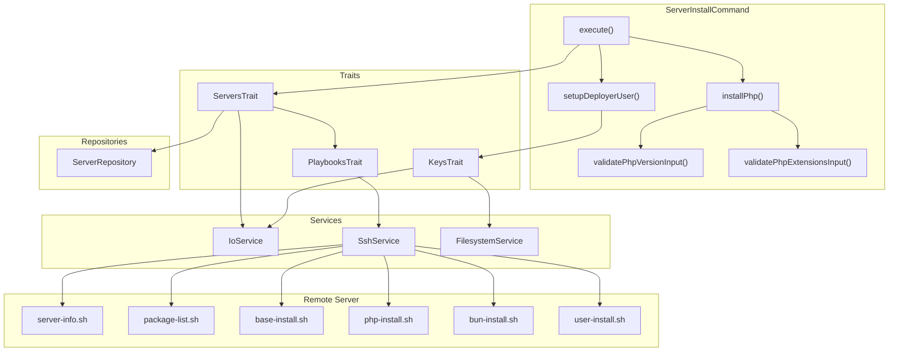
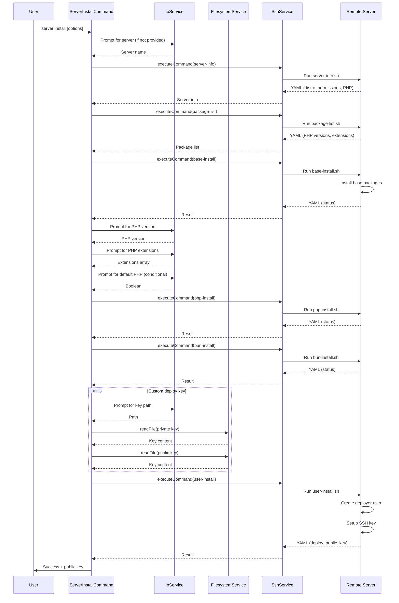

# Schematic: ServerInstallCommand.php

> Auto-generated schematic. Last updated: 2025-12-18 (updated)

## Overview

The `ServerInstallCommand` provisions a server for PHP application hosting. It orchestrates base package installation, PHP setup with extensions, Bun installation, and deployer user creation with SSH deploy keys via sequential playbook executions.

## Logic Flow

### Entry Points

| Method | Access | Description |
|--------|--------|-------------|
| `configure()` | protected | Registers CLI options: `--server`, `--generate-deploy-key`, `--custom-deploy-key`, `--php-version`, `--php-default`, `--php-extensions` |
| `execute()` | protected | Main execution flow - orchestrates multi-stage server installation |

### Execution Flow

```
1. execute()
   |
   +-- Display heading "Install Server"
   |
   +-- selectServerDeets() [ServersTrait]
   |   |-- ensureServersAvailable()
   |   |-- Prompt/validate server selection
   |   +-- getServerInfo() -> runs server-info playbook
   |
   +-- executePlaybook('package-list')
   |   +-- Gather available PHP versions and extensions
   |
   +-- executePlaybook('base-install')
   |   +-- Install base system packages
   |
   +-- installPhp()
   |   |-- Extract available PHP versions from package-list
   |   |-- Prompt/validate PHP version selection
   |   |-- Prompt/validate PHP extensions multiselect
   |   |-- Determine if setting as default PHP
   |   +-- executePlaybook('php-install')
   |
   +-- executePlaybook('bun-install')
   |   +-- Install Bun JavaScript runtime
   |
   +-- setupDeployerUser()
   |   |-- Resolve deploy key method (generate vs custom)
   |   |-- Read custom key files if provided
   |   +-- executePlaybook('user-install')
   |
   +-- Display success + public key for Git provider
   |
   +-- commandReplay() - Show non-interactive command
```

### Decision Points

| Location | Condition | True Branch | False Branch |
|----------|-----------|-------------|--------------|
| L61-63 | `is_int($server) \|\| null === $server->info` | Return FAILURE | Continue |
| L78-80 | `is_int($packageList)` | Return FAILURE | Continue |
| L92-94 | `is_int($result)` (base-install) | Return FAILURE | Continue |
| L102-104 | `is_int($phpResult)` | Return FAILURE | Continue |
| L122-124 | `is_int($bunResult)` | Return FAILURE | Continue |
| L132-134 | `is_int($deployKeyResult)` | Return FAILURE | Continue |
| L163-167 | `$deployKeyPath !== null` | Add `--custom-deploy-key` to replay | Add `--generate-deploy-key` |
| L169-171 | `$phpDefaultPrompted` | Include `--php-default` in replay | Omit |
| L201-205 | Both `--generate-deploy-key` and `--custom-deploy-key` | Error + FAILURE | Continue |
| L212-230 | Deploy key method | `--generate-deploy-key`: null path, `--custom-deploy-key`: validate path, interactive: prompt choice |
| L244-257 | `$deployKeyPath !== null` | Read and base64 encode key files | Skip (server generates) |
| L324-328 | `[] === $phpPackages` | Error + FAILURE | Continue |
| L336-340 | `[] === $phpVersions` (no PHP 8.x) | Error + FAILURE | Continue |
| L402-406 | `empty($availableExtensions)` | Error + FAILURE | Continue |
| L445-469 | PHP already installed? | First install: auto-default, Already default: skip prompt, Otherwise: prompt |

### Exit Conditions

| Exit Point | Condition | Return Value |
|------------|-----------|--------------|
| L62 | Server selection failed or no info | `Command::FAILURE` |
| L79 | Package list playbook failed | `Command::FAILURE` |
| L93 | Base install playbook failed | `Command::FAILURE` |
| L103 | PHP installation failed | `Command::FAILURE` |
| L123 | Bun installation failed | `Command::FAILURE` |
| L133 | Deployer user setup failed | `Command::FAILURE` |
| L175 | Success | `Command::SUCCESS` |
| L204 | Conflicting deploy key options | `Command::FAILURE` |
| L235 | ValidationException on deploy key path | `Command::FAILURE` |
| L252 | RuntimeException reading key files | `Command::FAILURE` |
| L271 | User-install playbook failed | `Command::FAILURE` |
| L279 | No deploy public key in result | `Command::FAILURE` |
| L327 | No PHP packages available | `Command::FAILURE` |
| L338 | No PHP 8.x versions available | `Command::FAILURE` |
| L380 | ValidationException on PHP version | `Command::FAILURE` |
| L404 | No extensions for selected PHP | `Command::FAILURE` |
| L425 | ValidationException on extensions | `Command::FAILURE` |
| L486-488 | PHP install playbook failed | Returns playbook result (int) |

## Interaction Diagram



## Dependencies

### Direct Imports

| File/Class | Usage |
|------------|-------|
| `Deployer\Contracts\BaseCommand` | Parent class providing DI, output methods, and command infrastructure |
| `Deployer\DTOs\ServerDTO` | Immutable data object representing a server with info |
| `Deployer\Exceptions\ValidationException` | Thrown when CLI option validation fails |
| `Deployer\Traits\KeysTrait` | Provides `promptDeployKeyPairPath()`, key validation |
| `Deployer\Traits\PlaybooksTrait` | Provides `executePlaybook()` for remote script execution |
| `Deployer\Traits\ServersTrait` | Provides `selectServerDeets()`, server validation |
| `Symfony\Component\Console\Attribute\AsCommand` | Command metadata attribute |
| `Symfony\Component\Console\Command\Command` | Constants `Command::SUCCESS`, `Command::FAILURE` |
| `Symfony\Component\Console\Input\InputInterface` | CLI input handling |
| `Symfony\Component\Console\Input\InputOption` | Option definition constants |
| `Symfony\Component\Console\Output\OutputInterface` | CLI output handling |

### Coupled Files

| File | Coupling Type | Description |
|------|---------------|-------------|
| `playbooks/server-info.sh` | Playbook | Retrieves server state, PHP versions, distribution info |
| `playbooks/package-list.sh` | Playbook | Gathers available PHP versions and extensions from apt |
| `playbooks/base-install.sh` | Playbook | Installs core system packages (git, curl, ufw, etc.) |
| `playbooks/php-install.sh` | Playbook | Installs PHP version with selected extensions |
| `playbooks/bun-install.sh` | Playbook | Installs Bun JavaScript runtime |
| `playbooks/user-install.sh` | Playbook | Creates deployer user with SSH key |
| `playbooks/helpers.sh` | Playbook | Inlined into all playbooks for utility functions |
| `deployer.yml` | Data | Inventory file for server lookup via `ServerRepository` |
| `app/Services/IoService.php` | Service | Handles prompts and validation |
| `app/Services/SshService.php` | Service | Executes playbooks on remote servers |
| `app/Services/FilesystemService.php` | Service | Reads local deploy key files |
| `app/Repositories/ServerRepository.php` | Repository | Server lookup for selection |

## Data Flow

### Inputs

| Source | Data | Processing |
|--------|------|------------|
| CLI `--server` | Server name string | Validated against inventory via `validateServerSelection()` |
| CLI `--generate-deploy-key` | Boolean flag | Mutually exclusive with `--custom-deploy-key` |
| CLI `--custom-deploy-key` | Private key path | Validated via `validateDeployKeyPairInput()`, both private and .pub |
| CLI `--php-version` | PHP version string | Validated against available versions from `package-list` |
| CLI `--php-default` | Negatable flag | `--php-default` / `--no-php-default` / null (prompt) |
| CLI `--php-extensions` | Comma-separated | Validated against available extensions, normalized to array |
| `package-list` playbook | Available PHP data | PHP versions and extensions per version |
| `server-info` playbook | Server state | Distribution, permissions, installed PHP versions |

### Outputs

| Destination | Data | Format |
|-------------|------|--------|
| Console | Status messages | Text via `h1()`, `yay()`, `nay()`, `out()` |
| Console | Deploy public key | Yellow-highlighted SSH public key for Git provider |
| Console | Command replay | CLI command string via `commandReplay()` |
| Remote server | Base packages | Installed via `base-install.sh` |
| Remote server | PHP + extensions | Installed via `php-install.sh` |
| Remote server | Bun runtime | Installed via `bun-install.sh` |
| Remote server | Deployer user | Created via `user-install.sh` |
| Remote server | SSH key pair | Generated or uploaded via `user-install.sh` |

### Side Effects

| Effect | Location | Trigger |
|--------|----------|---------|
| Package installation | Remote server | `base-install.sh`, `php-install.sh`, `bun-install.sh` |
| User creation | `/home/deployer` | `user-install.sh` |
| SSH key creation | `/home/deployer/.ssh/` | `user-install.sh` (generated or uploaded) |
| Sudoers entry | `/etc/sudoers.d/deployer` | `user-install.sh` |
| PHP-FPM pool | `/etc/php/{version}/fpm/pool.d/` | `php-install.sh` |
| UFW rules | Firewall config | Various playbooks |

## Sequence Diagram



## Notes

### Installation Order

The playbooks execute in a specific order:

1. `server-info` - Validates SSH and gets server state
2. `package-list` - Discovers available PHP versions before prompting
3. `base-install` - Installs prerequisites for PHP/Bun
4. `php-install` - Installs PHP after base packages
5. `bun-install` - Installs Bun runtime
6. `user-install` - Creates deployer user last (depends on base packages)

### Deploy Key Handling

Three deploy key paths are supported:

1. **`--generate-deploy-key`**: Server generates key pair, public key returned in output
2. **`--custom-deploy-key`**: User provides path to private key, expects `.pub` at same path
3. **Interactive**: User chooses between generate and custom via prompt

Custom keys are base64-encoded and passed as environment variables to `user-install.sh`. Server-generated keys are created by the playbook and returned in the YAML output.

### PHP Version Selection

- Filters to PHP 8.x versions only (`str_starts_with($v, '8.')`)
- Sorts in reverse natural order (newest first)
- Defaults to 8.5 if available, otherwise newest 8.x
- First PHP install automatically sets as default (no prompt)
- Subsequent installs prompt for default unless already the default version

### PHP Extensions

Default extensions pre-selected:

```
bcmath, cli, common, curl, fpm, gd, gmp, igbinary, imagick, imap, intl,
mbstring, memcached, msgpack, mysql, opcache, pgsql, readline, redis,
soap, sqlite3, swoole, xml, zip
```

Extensions are filtered against available extensions for the selected PHP version.

### Input Validation Pattern

Uses `getValidatedOptionOrPrompt()` with try-catch for `ValidationException`:

- `validatePhpVersionInput()` - Validates against available versions
- `validatePhpExtensionsInput()` - Validates against available extensions, handles comma-separated CLI input

### Replay Command

The replay command includes all user choices for non-interactive re-execution:

- Server name
- PHP version and extensions
- Deploy key method (`--generate-deploy-key` or `--custom-deploy-key=path`)
- PHP default flag (only if prompted)

## Recent Changes

**2025-12-18:**

- Removed redundant empty extensions check after normalization (L439-443) - validator already catches empty selection via `validatePhpExtensionsInput()`
- Changed PHP install playbook failure handling to return result directly instead of duplicate `nay()` call (pattern consistency with other playbook calls)
