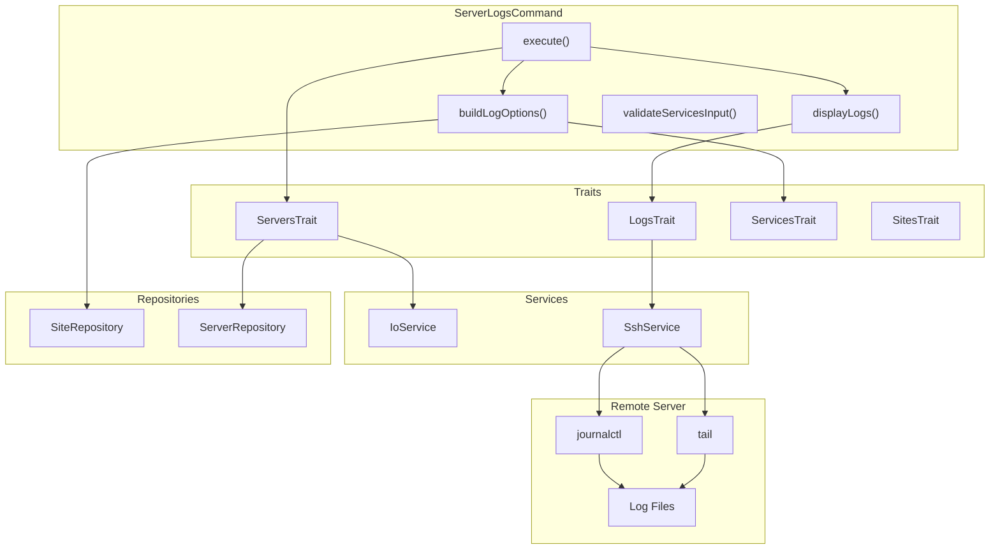

# Schematic: ServerLogsCommand.php

> Auto-generated schematic. Last updated: 2026-01-04

## Overview

The `ServerLogsCommand` retrieves and displays logs from multiple sources on a remote server. It dynamically builds a list of available log sources based on server state (installed services, PHP versions, configured sites, crons, and supervisors), then retrieves logs via SSH using either journalctl or tail commands.

## Logic Flow

### Entry Points

| Method | Access | Description |
|--------|--------|-------------|
| `configure()` | protected | Registers CLI options: `--server`, `--lines`, `--service` |
| `execute()` | protected | Main execution flow - orchestrates server selection, log source building, and log retrieval |
| `buildLogOptions()` | protected | Builds dynamic list of available log sources from server info |
| `displayLogs()` | protected | Retrieves and displays logs for selected services |
| `validateServicesInput()` | protected | Validates service selection against allowed options |

### Execution Flow

```
1. execute()
   |
   +-- Display heading "Server Logs"
   |
   +-- selectServerDeets() [ServersTrait]
   |   |-- ensureServersAvailable()
   |   |-- Prompt/validate server selection
   |   +-- getServerInfo() -> runs server-info playbook
   |
   +-- buildLogOptions(server)
   |   |-- Add static sources (system, supervisor, cron)
   |   |-- Add port-detected services (nginx, sshd, mysqld, mariadb, memcached, postgres, redis, valkey)
   |   |-- Add PHP-FPM versions from server info
   |   |-- Add sites from server info (Nginx access logs)
   |   +-- Add per-site crons and supervisors from inventory
   |
   +-- try {
   |       getValidatedOptionOrPrompt('service', multiselect, validateServicesInput)
   |       getValidatedOptionOrPrompt('lines', text, validateLineCount)
   |   } catch (ValidationException) -> FAILURE
   |
   +-- Normalize services input (string -> array)
   |
   +-- displayLogs(server, serviceKeys, lines)
   |   |-- For each selected service:
   |   |   |-- Static source? -> retrieveJournalLogs()
   |   |   |-- Port source (both)? -> retrieveJournalLogs() + retrieveFileLogs()
   |   |   |-- Port source (journalctl)? -> retrieveJournalLogs()
   |   |   |-- Port source (file)? -> retrieveFileLogs()
   |   |   |-- PHP-FPM? -> retrieveFileLogs(/var/log/php{version}-fpm.log)
   |   |   |-- Cron script? -> retrieveFileLogs(/var/log/cron/{domain}-{script}.log)
   |   |   |-- Supervisor? -> retrieveFileLogs(/var/log/supervisor/{domain}-{program}.log)
   |   |   +-- Site domain? -> retrieveFileLogs(/var/log/nginx/{domain}-access.log)
   |
   +-- commandReplay() - Show non-interactive command
```

### Decision Points

| Location | Condition | True Branch | False Branch |
|----------|-----------|-------------|--------------|
| execute() | `is_int($server) \|\| null === $server->info` | Return FAILURE | Continue |
| execute() | `ValidationException` caught | Return FAILURE | Continue |
| execute() | `is_string($services)` | Split comma-separated string | Use array as-is |
| displayLogs() | `isset(STATIC_SOURCES[$key])` | Use journalctl | Check next source type |
| displayLogs() | `isset(PORT_SOURCES[$key])` | Match source type (journalctl/file/both) | Check next source type |
| displayLogs() | `str_starts_with($key, 'php') && str_ends_with($key, '-fpm')` | Use file log | Check next source type |
| displayLogs() | `str_starts_with($key, 'cron:')` | Parse and retrieve cron log file | Check next source type |
| displayLogs() | `str_starts_with($key, 'supervisor:')` | Parse and retrieve supervisor log file | Check next source type |
| displayLogs() | `in_array($key, $sites, true)` | Retrieve site access log | Skip (unknown key) |

### Exit Conditions

| Exit Point | Condition | Return Value |
|------------|-----------|--------------|
| execute() | Server selection failed or no info | `Command::FAILURE` |
| execute() | ValidationException caught | `Command::FAILURE` |
| execute() | Success | `Command::SUCCESS` |

## Interaction Diagram



## Dependencies

### Direct Imports

| File/Class | Usage |
|------------|-------|
| `Deployer\Contracts\BaseCommand` | Parent class providing DI, output methods, and command infrastructure |
| `Deployer\DTOs\ServerDTO` | Immutable data object representing a server |
| `Deployer\Exceptions\ValidationException` | Thrown when CLI option validation fails |
| `Deployer\Traits\LogsTrait` | Provides `retrieveJournalLogs()`, `retrieveFileLogs()`, `validateLineCount()` |
| `Deployer\Traits\ServersTrait` | Provides `selectServerDeets()` |
| `Deployer\Traits\ServicesTrait` | Provides `getServiceLabel()` for display names |
| `Deployer\Traits\SitesTrait` | Provides access to `$this->sites` repository |
| `Symfony\Component\Console\Attribute\AsCommand` | Command metadata attribute |
| `Symfony\Component\Console\Command\Command` | Constants `Command::SUCCESS`, `Command::FAILURE` |
| `Symfony\Component\Console\Input\InputInterface` | CLI input handling |
| `Symfony\Component\Console\Input\InputOption` | Option definition constants |
| `Symfony\Component\Console\Output\OutputInterface` | CLI output handling |

### Coupled Files

| File | Coupling Type | Description |
|------|---------------|-------------|
| `playbooks/server-info.sh` | Playbook | Called via `getServerInfo()` to retrieve server state |
| `playbooks/helpers.sh` | Playbook | Inlined into playbooks for common functions |
| `deployer.yml` | Data | Inventory file providing site/cron/supervisor data |
| `app/Services/IoService.php` | Service | Handles user input prompts and validation |
| `app/Services/SshService.php` | Service | Executes log retrieval commands on remote server |
| `app/Repositories/SiteRepository.php` | Repository | Provides site data including crons and supervisors |
| `app/Repositories/ServerRepository.php` | Repository | Server lookup for selection |
| `/var/log/mysql/error.log` | Log | MySQL/MariaDB error logs on remote server |
| `/var/log/memcached.log` | Log | Memcached logs on remote server |
| `/var/log/postgresql/postgresql.log` | Log | PostgreSQL logs on remote server |
| `/var/log/redis/redis-server.log` | Log | Redis logs on remote server |
| `/var/log/valkey/valkey-server.log` | Log | Valkey logs on remote server |
| `/var/log/php{version}-fpm.log` | Log | PHP-FPM logs on remote server |
| `/var/log/nginx/{domain}-access.log` | Log | Per-site Nginx access logs on remote server |
| `/var/log/cron/{domain}-{script}.log` | Log | Per-site cron script logs on remote server |
| `/var/log/supervisor/{domain}-{program}.log` | Log | Per-site supervisor program logs on remote server |

## Data Flow

### Inputs

| Source | Data | Processing |
|--------|------|------------|
| CLI `--server` | Server name string | Validated against inventory via `validateServerSelection()` |
| CLI `--service` | Comma-separated service keys | Validated against dynamic options via `validateServicesInput()` |
| CLI `--lines` | Number of lines | Validated as positive integer <= 1000 via `validateLineCount()` |
| `server-info` playbook | Server state array | Provides ports, PHP versions, sites_config |
| Inventory | Site/cron/supervisor data | Retrieved from `SiteRepository` |

### Outputs

| Destination | Data | Format |
|-------------|------|--------|
| Console | Log content | Text with error highlighting via `highlightErrors()` |
| Console | Status messages | Text via `h2()`, `warn()`, `nay()` |
| Console | Command replay | CLI command string via `commandReplay()` |

### Side Effects

| Effect | Location | Trigger |
|--------|----------|---------|
| SSH connection | Remote server | Log retrieval commands |
| None persistent | N/A | Read-only command |

## Log Source Configuration

### Static Sources (STATIC_SOURCES)

Always available on provisioned servers:

| Key | Label | Type | Unit/Path |
|-----|-------|------|-----------|
| `system` | System logs | journalctl | null (all logs) |
| `supervisor` | Supervisor | journalctl | `supervisor` |
| `cron` | Cron | journalctl | `cron` |

### Port-Detected Sources (PORT_SOURCES)

Dynamically added based on `server->info['ports']`:

| Key | Type | Unit | Path |
|-----|------|------|------|
| `nginx` | journalctl | `nginx` | - |
| `mariadb` | both | `mariadb` | `/var/log/mysql/error.log` |
| `memcached` | both | `memcached` | `/var/log/memcached.log` |
| `mysqld` | both | `mysql` | `/var/log/mysql/error.log` |
| `postgres` | both | `postgresql` | `/var/log/postgresql/postgresql.log` |
| `redis-server` | both | `redis-server` | `/var/log/redis/redis-server.log` |
| `sshd` | journalctl | `ssh` | - |
| `valkey-server` | both | `valkey-server` | `/var/log/valkey/valkey-server.log` |

**Type `both`:** Shows journalctl service logs AND file-based error logs. Labels use "{$label} Service" for journalctl and "{$label} Error Log" for the file.

### Dynamic Sources

Built from server info and inventory:

| Source Type | Key Format | Log Path |
|-------------|------------|----------|
| PHP-FPM | `php{version}-fpm` | `/var/log/php{version}-fpm.log` |
| Site access | `{domain}` | `/var/log/nginx/{domain}-access.log` |
| Cron script | `cron:{domain}/{script}` | `/var/log/cron/{domain}-{scriptBase}.log` |
| Supervisor | `supervisor:{domain}/{program}` | `/var/log/supervisor/{domain}-{program}.log` |

## Notes

### Validation Strategy

The command uses `getValidatedOptionOrPrompt()` for both `--service` and `--lines` options, wrapped in a single try-catch for `ValidationException`.

### Service Key Normalization

CLI `--service` option accepts comma-separated values (e.g., `--service=system,nginx,php8.2-fpm`), while the interactive prompt returns an array. The command normalizes both to an array before processing.

### Log Retrieval Methods

Two methods from `LogsTrait` handle log retrieval:

| Method | Command | Use Case |
|--------|---------|----------|
| `retrieveJournalLogs()` | `journalctl -u {unit} -n {lines}` | Systemd services |
| `retrieveFileLogs()` | `tail -n {lines} {path}` | File-based logs |

### Recent Changes

**2025-12-19**: Added `memcached` entry to `PORT_SOURCES` with type `both` to support Memcached service logs from both journalctl and `/var/log/memcached.log`.
