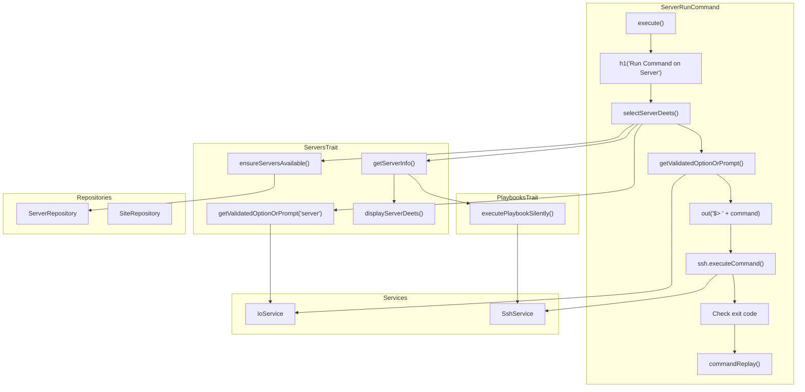
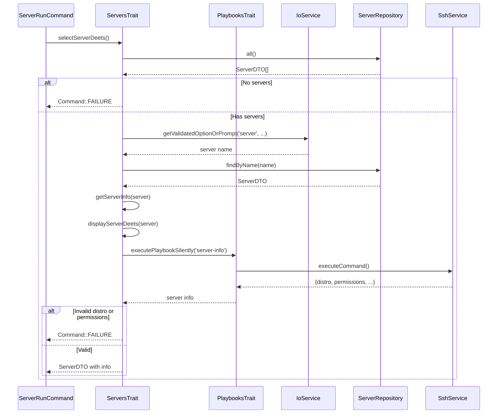
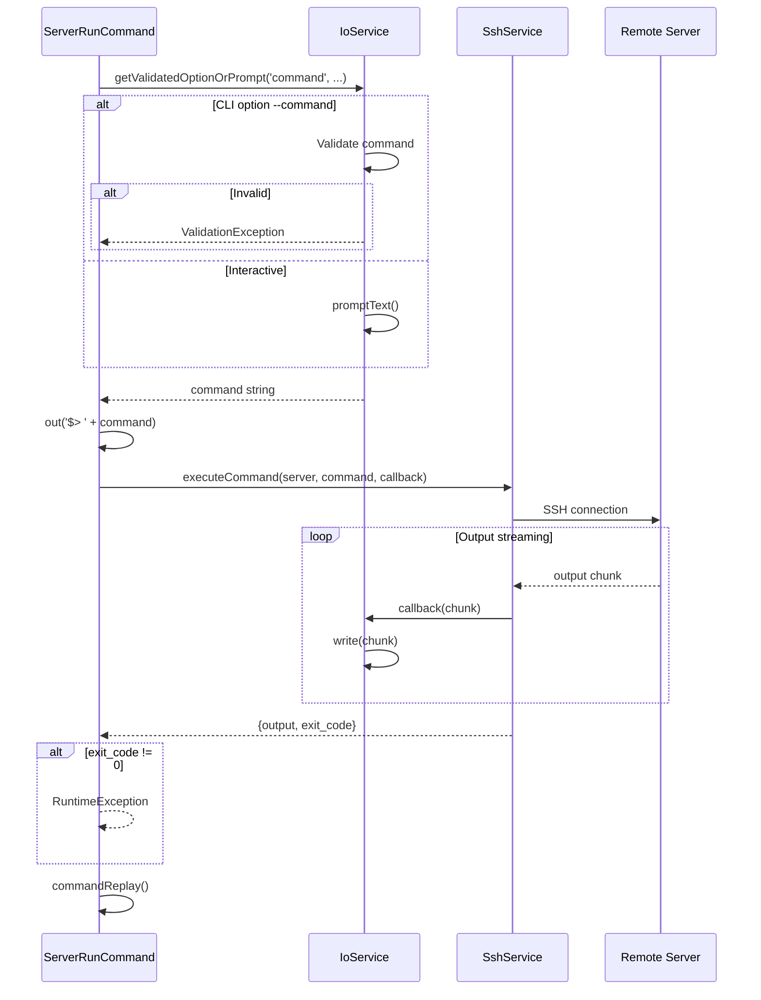

# Schematic: ServerRunCommand.php

> Auto-generated schematic. Last updated: 2025-12-18 (validation refactor)

## Overview

`ServerRunCommand` executes arbitrary shell commands on a remote server via SSH with real-time output streaming. It selects a server from inventory, validates the command input, executes remotely using `SshService::executeCommand()`, and displays output as it arrives via a streaming callback.

## Logic Flow

### Entry Points

| Method | Type | Description |
|--------|------|-------------|
| `execute()` | protected | Main command execution entry point |

### Execution Flow

```
1. Call parent::execute() - displays env/inventory status
2. Display heading "Run Command on Server"
3. Select server via ServersTrait::selectServerDeets()
   - Validates SSH connection and retrieves server info
   - Returns ServerDTO with info or Command::FAILURE
4. Gather command input via getValidatedOptionOrPrompt()
   - CLI: --command option with validation
   - Interactive: text prompt with placeholder "ls -la"
5. Display command being executed: "$> {command}"
6. Execute command via SshService::executeCommand()
   - Real-time streaming via output callback
   - Callback writes chunks directly to console
7. Display separator line "---"
8. Check exit code - throw RuntimeException if non-zero
9. Display command replay hint
10. Return Command::SUCCESS
```

### Decision Points

| Location | Condition | True Branch | False Branch |
|----------|-----------|-------------|--------------|
| Line 53-55 | `is_int($server)` | Return failure code | Continue with ServerDTO |
| Line 73-77 | ValidationException caught | Display error, return FAILURE | Continue |
| Line 94-96 | `0 !== $result['exit_code']` | Throw RuntimeException | Continue |
| Line 97-111 | SshTimeoutException caught | Display timeout guidance, return FAILURE | Continue |
| Line 112-116 | RuntimeException caught | Display error, return FAILURE | Continue |

### Exit Conditions

| Condition | Return Value | Description |
|-----------|--------------|-------------|
| No servers in inventory | `Command::FAILURE` | Via selectServerDeets() |
| Server selection validation fails | `Command::FAILURE` | Invalid --server CLI option |
| SSH connection fails | `Command::FAILURE` | Via getServerInfo() in selectServerDeets() |
| Distribution unsupported | `Command::FAILURE` | Via getServerInfo() validation |
| Permissions insufficient | `Command::FAILURE` | Requires root or passwordless sudo |
| Command validation fails | `Command::FAILURE` | Empty or non-string command |
| SSH execution fails | `Command::FAILURE` | Connection or authentication error |
| SSH timeout | `Command::FAILURE` | Command exceeded timeout threshold |
| Command exits non-zero | `Command::FAILURE` | Remote command failed |
| Success | `Command::SUCCESS` | Command executed successfully |

## Interaction Diagram



### Server Selection and Info Flow



### Command Execution Flow



## Dependencies

### Direct Imports

| Import | Usage |
|--------|-------|
| `Deployer\Contracts\BaseCommand` | Base class providing DI, output methods, initialization |
| `Deployer\Exceptions\SshTimeoutException` | Thrown when SSH command exceeds timeout threshold |
| `Deployer\Exceptions\ValidationException` | Thrown when CLI option validation fails |
| `Deployer\Traits\ServersTrait` | Server selection via `selectServerDeets()` |
| `Symfony\Component\Console\Attribute\AsCommand` | Command registration attribute |
| `Symfony\Component\Console\Command\Command` | Return constants (SUCCESS, FAILURE) |
| `Symfony\Component\Console\Input\InputInterface` | CLI input handling |
| `Symfony\Component\Console\Input\InputOption` | Option definition constants |
| `Symfony\Component\Console\Output\OutputInterface` | Console output |

### Trait Dependencies

| Trait | Provides | Required Properties |
|-------|----------|---------------------|
| `ServersTrait` | `selectServerDeets()`, server validation methods | `$servers`, `$sites`, `$io`, `$ssh` |
| `PlaybooksTrait` | `executePlaybookSilently()` (via ServersTrait) | `$container`, `$fs`, `$io`, `$ssh` |

### Service Dependencies

| Service | Usage |
|---------|-------|
| `IoService` | Input validation, prompts, console output |
| `SshService` | Remote command execution with streaming |
| `ServerRepository` | Server inventory access |
| `SiteRepository` | Site inventory (required by ServersTrait) |
| `FilesystemService` | File operations (via BaseCommand) |

### Coupled Files

| File | Coupling Type | Description |
|------|---------------|-------------|
| `deployer.yml` | Data | Inventory file containing server configuration |
| `~/.ssh/*` | Config | SSH private keys referenced by ServerDTO |
| `playbooks/server-info.sh` | Playbook | Validates SSH, retrieves distro/permissions |
| `playbooks/helpers.sh` | Playbook | Helper functions prepended to playbooks |

## Data Flow

### Inputs

| Source | Data | Type |
|--------|------|------|
| CLI option `--server` | Server name | `string` (optional) |
| CLI option `--command` | Command to execute | `string` (optional) |
| Interactive prompt | Server selection | `string` |
| Interactive prompt | Command input | `string` |
| `deployer.yml` | Server configuration | `ServerDTO` |
| Remote server | Command output | `string` (streamed) |
| Remote server | Exit code | `int` |

### Outputs

| Destination | Data | Description |
|-------------|------|-------------|
| Console | Server details | Name, host, port, user, key |
| Console | Server info spinner | "Retrieving server information..." |
| Console | Command echo | "$> {command}" |
| Console | Command output | Real-time streamed output |
| Console | Separator | "---" |
| Console | Command replay | Non-interactive equivalent command |
| Console | Error messages | Validation/execution failures |

### Side Effects

| Effect | Description |
|--------|-------------|
| SSH connection | Establishes connection to remote server |
| Remote command execution | Runs arbitrary command on server |
| Server state changes | Command may modify remote server state |

## Command Configuration

### Options

| Option | Type | Description |
|--------|------|-------------|
| `--server` | `VALUE_REQUIRED` | Server name from inventory |
| `--command` | `VALUE_REQUIRED` | Command to execute on server |

### Inherited Options (from BaseCommand)

| Option | Type | Description |
|--------|------|-------------|
| `--env` | `VALUE_OPTIONAL` | Custom .env file path |
| `--inventory` | `VALUE_OPTIONAL` | Custom deployer.yml path |

## Input Validation

### Command Validation (`validateCommandInput`)

```php
private function validateCommandInput(mixed $value): ?string
{
    if (!is_string($value)) {
        return 'Command must be a string';
    }
    if ('' === trim($value)) {
        return 'Command cannot be empty';
    }
    return null;
}
```

### Server Validation (via ServersTrait)

- `validateServerSelection()`: Checks server exists in inventory
- Server info validation: Checks supported distribution (Debian/Ubuntu)
- Permissions validation: Requires root or passwordless sudo

## Error Handling Paths

| Error Source | Exception Type | Handler | User Message |
|--------------|----------------|---------|--------------|
| Server selection | `ValidationException` | selectServerDeets() | "Server '{name}' not found in inventory" |
| Command validation | `ValidationException` | execute() try-catch | "Command must be a string" / "Command cannot be empty" |
| SSH connection | `RuntimeException` | getServerInfo() | SSH error message |
| Unsupported distro | N/A | getServerInfo() | "Deployer only supports Debian and Ubuntu" |
| Insufficient permissions | N/A | getServerInfo() | Passwordless sudo setup instructions |
| SSH timeout | `SshTimeoutException` | execute() try-catch | Timeout message + guidance (slow connection, heavy load, retry suggestions) |
| Command execution | `RuntimeException` | execute() try-catch | SSH/connection error |
| Non-zero exit | `RuntimeException` | execute() | "Command failed with exit code {code}" |

## Notes

- Real-time output streaming uses callback: `fn (string $chunk) => $this->io->write($chunk)`
- Output is not buffered - each chunk is written immediately as received from SSH
- The command is echoed before execution with "$>" prefix for visibility
- Server info is gathered via `server-info.sh` playbook before command execution
- Server info validates distribution (Debian/Ubuntu only) and permissions (root/sudo)
- `commandReplay()` shows the non-interactive equivalent for automation/documentation
- Exit code 0 is required for success; any non-zero code causes FAILURE return
- SSH timeout handling provides user-friendly guidance with possible causes (slow network, heavy load) and recovery suggestions (retry, check with `server:info`)
