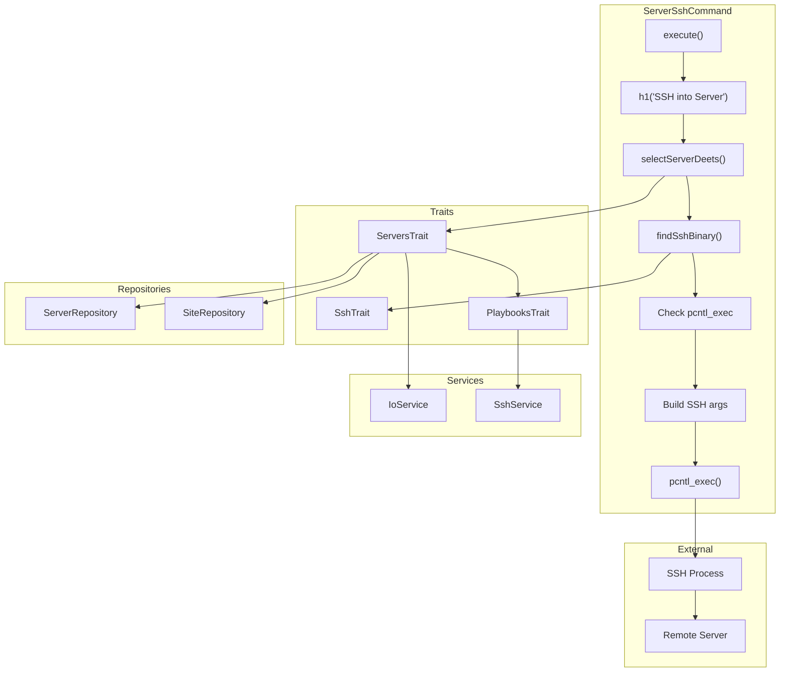
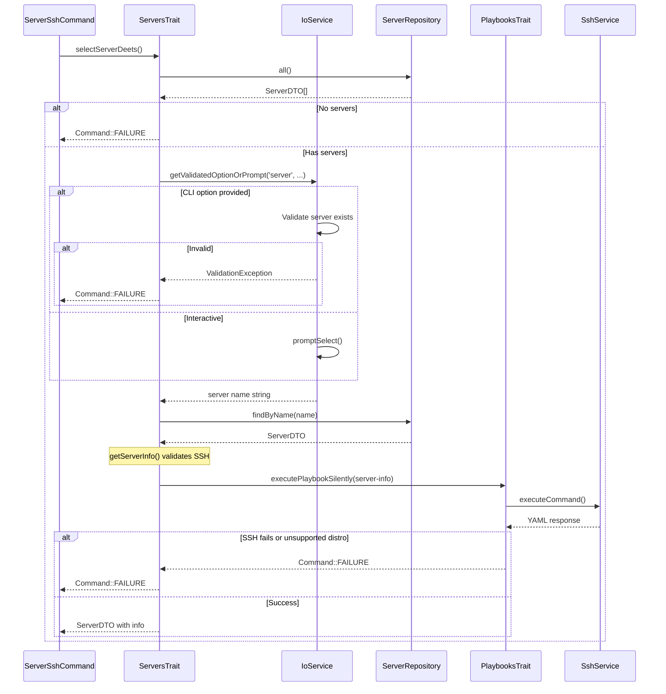

# Schematic: ServerSshCommand.php

> Auto-generated schematic. Last updated: 2025-12-18

## Overview

`ServerSshCommand` provides an interactive SSH connection to a server in the inventory. It validates the server selection, verifies SSH connectivity and permissions, then replaces the PHP process with an SSH session using `pcntl_exec`. Unlike `SiteSshCommand`, this command connects to the server's home directory rather than a specific site directory.

## Logic Flow

### Entry Points

| Method | Type | Description |
|--------|------|-------------|
| `execute()` | protected | Main command execution entry point |

### Execution Flow

```
1. Display heading "SSH into Server"
2. Select server via ServersTrait::selectServerDeets()
   - Ensures servers exist in inventory
   - Validates CLI option or prompts for selection
   - Retrieves server info via SSH (validates connectivity, distro, permissions)
   - Returns ServerDTO with info or Command::FAILURE
3. Find SSH binary via SshTrait::findSshBinary()
   - Uses Symfony ExecutableFinder
   - Returns path or null
4. Build SSH command arguments:
   - StrictHostKeyChecking=accept-new
   - Port from server config
   - TTY allocation (-t)
   - Private key if configured:
     a. Validate key file exists and is readable
     b. Add -i flag with key path
   - User@host connection string
5. Verify pcntl extension is available
6. Replace PHP process with SSH via pcntl_exec()
   - On failure: retrieve error code via pcntl_get_last_error()
```

### Decision Points

| Location | Condition | True Branch | False Branch |
|----------|-----------|-------------|--------------|
| Line 52-54 | `is_int($server)` | Return failure code | Continue |
| Line 62-66 | `null === $sshBinary` | Display error, return FAILURE | Continue |
| Line 74-83 | `null !== $server->privateKeyPath` | Validate key exists/readable, then add -i flag | Skip |
| Line 75-79 | Key not found or not readable | Display error, return FAILURE | Continue |
| Line 91-95 | `!function_exists('pcntl_exec')` | Display error, return FAILURE | Continue |

### Exit Conditions

| Condition | Return Value | Description |
|-----------|--------------|-------------|
| No servers available | `Command::FAILURE` | Empty inventory, user guided to add server |
| Server selection validation fails | `Command::FAILURE` | Invalid server via CLI option |
| Server info retrieval fails | `Command::FAILURE` | SSH connectivity, unsupported distro, or permission issues |
| SSH binary not found | `Command::FAILURE` | `ssh` not in PATH |
| SSH key not found/readable | `Command::FAILURE` | Configured private key missing or unreadable |
| pcntl extension missing | `Command::FAILURE` | PHP not compiled with pcntl |
| `pcntl_exec` succeeds | N/A | Process replaced, no return |
| `pcntl_exec` fails | `Command::FAILURE` | Error executing SSH with pcntl error details |

## Interaction Diagram



### Server Selection Flow



## Dependencies

### Direct Imports

| Import | Usage |
|--------|-------|
| `Deployer\Contracts\BaseCommand` | Base class providing DI, output methods, and initialization |
| `Deployer\Traits\ServersTrait` | Server selection via `selectServerDeets()`, server info retrieval |
| `Deployer\Traits\SshTrait` | SSH binary location via `findSshBinary()` |
| `Symfony\Component\Console\Attribute\AsCommand` | Command registration attribute |
| `Symfony\Component\Console\Command\Command` | Return constants (SUCCESS, FAILURE) |
| `Symfony\Component\Console\Input\InputInterface` | CLI input handling |
| `Symfony\Component\Console\Input\InputOption` | Option definition |
| `Symfony\Component\Console\Output\OutputInterface` | Console output |

### Trait Dependencies

| Trait | Provides | Required Properties |
|-------|----------|---------------------|
| `ServersTrait` | `selectServerDeets()`, `getServerInfo()`, `displayServerDeets()`, `ensureServersAvailable()` | `$io`, `$servers`, `$sites`, `$ssh` |
| `SshTrait` | `findSshBinary()` | None (uses Symfony ExecutableFinder) |
| `PlaybooksTrait` (via ServersTrait) | `executePlaybookSilently()` | `$container`, `$fs`, `$io`, `$ssh` |

### Coupled Files

| File | Coupling Type | Description |
|------|---------------|-------------|
| `deployer.yml` | Data | Inventory file containing server configuration |
| `~/.ssh/*` | Config | SSH private keys referenced by `ServerDTO::privateKeyPath` |
| `playbooks/server-info.sh` | Playbook | Remote script for validating SSH and gathering server info |
| `playbooks/helpers.sh` | Playbook | Helper functions prepended to playbook execution |

## Data Flow

### Inputs

| Source | Data | Type |
|--------|------|------|
| CLI option `--server` | Server name | `string` (optional) |
| Interactive prompt | Server selection | `string` |
| `deployer.yml` | Server configuration | `ServerDTO` |
| Remote server | Server info (distro, permissions) | `array<string, mixed>` |

### Outputs

| Destination | Data | Description |
|-------------|------|-------------|
| Console | Server details | Name, host, port, user, key |
| Console | Associated sites | Sites configured for this server |
| Console | Error messages | When validation fails |
| SSH Process | Connection | Replaces PHP process entirely |

### Side Effects

| Effect | Description |
|--------|-------------|
| SSH connection to server | `server-info.sh` playbook validates connectivity |
| Process replacement | `pcntl_exec()` replaces PHP process with SSH |
| SSH known_hosts update | `StrictHostKeyChecking=accept-new` may add host keys |
| Remote shell session | User enters interactive shell on remote server |

## Command Configuration

### Options

| Option | Type | Description |
|--------|------|-------------|
| `--server` | `VALUE_REQUIRED` | Server name to SSH into |

### Inherited Options

| Option | Type | Description |
|--------|------|-------------|
| `--env` | `VALUE_OPTIONAL` | Custom .env file path |
| `--inventory` | `VALUE_OPTIONAL` | Custom deployer.yml path |

## SSH Arguments Built

```bash
ssh \
  -o StrictHostKeyChecking=accept-new \
  -p {port} \
  -t \
  [-i {privateKeyPath}] \
  {username}@{host}
```

## Input Validation

### Server Selection Validation

The `validateServerSelection()` method in `ServersTrait` validates:

1. Value is a string
2. Server exists in inventory (via `ServerRepository::findByName()`)

```php
protected function validateServerSelection(mixed $name): ?string
{
    if (!is_string($name)) {
        return 'Server name must be a string';
    }
    if (null === $this->servers->findByName($name)) {
        return "Server '{$name}' not found in inventory";
    }
    return null;
}
```

### Server Info Validation

The `getServerInfo()` method in `ServersTrait` validates via `server-info.sh`:

1. SSH connectivity works
2. Distribution is supported (Debian/Ubuntu)
3. User has root or passwordless sudo permissions

## Error Handling Paths

| Error Condition | Handler | User Feedback |
|-----------------|---------|---------------|
| No servers in inventory | `ensureServersAvailable()` | Info message with guidance to add server |
| Invalid server name (CLI) | `ValidationException` | "Server 'name' not found in inventory" |
| SSH connection fails | `executePlaybookSilently()` | SSH error message from SshService |
| Unsupported distribution | `getServerInfo()` | "Deployer only supports Debian and Ubuntu" |
| Insufficient permissions | `getServerInfo()` | Numbered list with sudo setup instructions |
| SSH binary not found | Direct check | "Could not find ssh in PATH" |
| SSH key not found/readable | Direct check | "SSH key not found or not readable: {path}" |
| pcntl extension missing | Direct check | "The pcntl extension is required for SSH. Enable it in your php.ini" |
| pcntl_exec fails | `pcntl_get_last_error()` | "Failed to execute SSH: {pcntl_strerror(error)}" |

## Notes

- Uses `pcntl_exec()` which completely replaces the PHP process - no code after this call executes unless it fails
- The `-t` flag forces TTY allocation for interactive shell
- `StrictHostKeyChecking=accept-new` automatically accepts new host keys but warns on changed keys
- Unlike `SiteSshCommand`, this command does not specify a remote directory - user lands in default home
- Server info retrieval via `server-info.sh` also validates SSH connectivity before attempting interactive connection
- No `commandReplay()` call since process replacement prevents reaching that code
- Associated sites are displayed via `displayServerDeets()` to provide context about what's deployed on the server
- Uses `$this->out('')` (BaseCommand method) instead of direct `$this->io->write()` for consistency
- SSH key validation added to prevent cryptic errors from ssh binary when key is missing/unreadable
- pcntl extension check added with user-friendly message guiding to php.ini configuration
