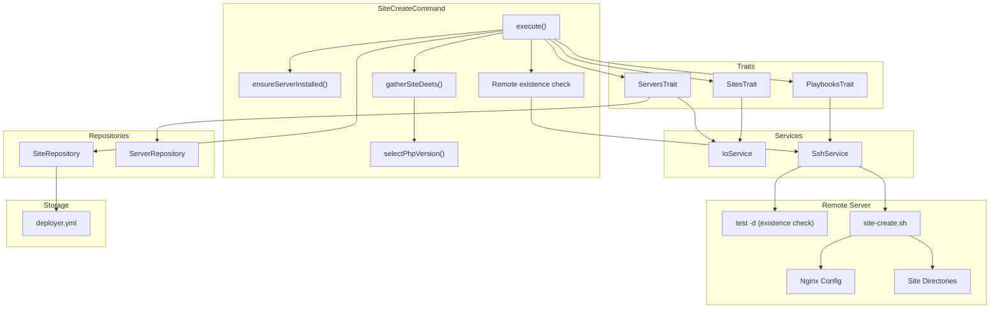

# Schematic: SiteCreateCommand.php

> Auto-generated schematic. Last updated: 2025-12-27

## Recent Changes

- **2025-12-27**: Migrated from Caddy to Nginx - now checks for `info['nginx']['available']` instead of Caddy in `ensureServerInstalled()`

## Overview

The `SiteCreateCommand` orchestrates the creation of a new site on a remote server and registers it in the local inventory. It handles server selection, input validation, PHP version selection, remote existence check, remote directory/Nginx setup via playbook execution, and inventory persistence.

## Logic Flow

### Entry Points

| Method | Access | Description |
|--------|--------|-------------|
| `configure()` | protected | Registers CLI options: `--domain`, `--server`, `--php-version`, `--www-mode` |
| `execute()` | protected | Main execution flow - orchestrates the entire site creation process |

### Execution Flow

```
1. execute()
   |
   +-- Display heading "Create New Site"
   |
   +-- selectServerDeets() [ServersTrait]
   |   |-- ensureServersAvailable()
   |   |-- Prompt/validate server selection
   |   +-- getServerInfo() -> runs server-info playbook
   |
   +-- ensureServerInstalled()
   |   |-- Check Nginx installed (info['nginx']['available'])
   |   +-- Check PHP installed
   |
   +-- gatherSiteDeets()
   |   |-- Prompt/validate domain name
   |   |-- Normalize domain (lowercase, strip www)
   |   |-- Prompt/validate WWW mode
   |   +-- selectPhpVersion()
   |       |-- Get installed PHP versions from server info
   |       +-- Prompt if multiple versions available
   |
   +-- Create SiteDTO (domain, server, phpVersion; repo/branch null)
   |
   +-- displaySiteDeets() [SitesTrait]
   |
   +-- ssh->executeCommand() [Remote existence check]
   |   |-- Run `test -d /home/deployer/sites/{domain}`
   |   +-- If exists (exit_code=0): warn and return FAILURE
   |
   +-- executePlaybookSilently() [PlaybooksTrait]
   |   |-- Run site-create.sh playbook
   |   +-- Passes: DEPLOYER_SITE_DOMAIN, DEPLOYER_PHP_VERSION, DEPLOYER_WWW_MODE
   |
   +-- sites->create() [SiteRepository]
   |   +-- Persist to deployer.yml inventory
   |
   +-- Display success + DNS setup instructions
   |
   +-- commandReplay() - Show non-interactive command
```

### Decision Points

| Location | Condition | True Branch | False Branch |
|----------|-----------|-------------|--------------|
| L60-62 | `is_int($server) \|\| null === $server->info` | Return FAILURE | Continue |
| L66-68 | `is_int($serverInstalled)` | Return validation result | Continue |
| L76-78 | `is_int($siteInfo)` | Return FAILURE | Continue |
| L105-111 | `0 === $checkResult['exit_code']` (site dir exists on remote) | Warn user, return FAILURE | Continue to playbook |
| L128-130 | `is_int($result)` | Return playbook failure | Continue |
| L192-196 | `[] === $versions` | Display error, return FAILURE | Continue |
| L203-205 | `1 === count($installedPhpVersions)` | Auto-select single version | Prompt user |
| L319-328 | Nginx/PHP not installed | Display error + hint, return FAILURE | Return null (success) |

### Exit Conditions

| Exit Point | Condition | Return Value |
|------------|-----------|--------------|
| L61 | Server selection failed or no info | `Command::FAILURE` |
| L67 | Server validation failed (not installed) | `Command::FAILURE` |
| L77 | Site details gathering failed | `Command::FAILURE` |
| L110 | Site directory exists on remote but not in inventory | `Command::FAILURE` |
| L129 | Playbook execution failed | `Command::FAILURE` |
| L141 | Inventory save failed (RuntimeException) | `Command::FAILURE` |
| L170 | Success | `Command::SUCCESS` |

## Interaction Diagram



## Dependencies

### Direct Imports

| File/Class | Usage |
|------------|-------|
| `DeployerPHP\Contracts\BaseCommand` | Parent class providing DI, output methods, and command infrastructure |
| `DeployerPHP\DTOs\SiteDTO` | Immutable data object representing a site |
| `DeployerPHP\DTOs\SiteServerDTO` | Combined site+server for playbook execution |
| `DeployerPHP\Exceptions\ValidationException` | Thrown when CLI option validation fails |
| `DeployerPHP\Traits\PlaybooksTrait` | Provides `executePlaybookSilently()` for remote script execution |
| `DeployerPHP\Traits\ServersTrait` | Provides `selectServerDeets()`, `validateServerSelection()` |
| `DeployerPHP\Traits\SitesTrait` | Provides `displaySiteDeets()`, `normalizeDomain()`, `validateSiteDomain()` |
| `Symfony\Component\Console\Attribute\AsCommand` | Command metadata attribute |
| `Symfony\Component\Console\Command\Command` | Constants `Command::SUCCESS`, `Command::FAILURE` |
| `Symfony\Component\Console\Input\InputInterface` | CLI input handling |
| `Symfony\Component\Console\Input\InputOption` | Option definition constants |
| `Symfony\Component\Console\Output\OutputInterface` | CLI output handling |

### Coupled Files

| File | Coupling Type | Description |
|------|---------------|-------------|
| `playbooks/site-create.sh` | Playbook | Remote script that creates directories and Nginx vhost config |
| `playbooks/server-info.sh` | Playbook | Called via `getServerInfo()` to retrieve server state including PHP versions |
| `playbooks/helpers.sh` | Playbook | Inlined into playbooks for `run_cmd` and other helpers |
| `deployer.yml` | Data | Inventory file where sites are persisted via `SiteRepository` |
| `app/Services/IoService.php` | Service | Handles all user input prompts and validation |
| `app/Services/SshService.php` | Service | Executes playbooks and direct commands on remote servers |
| `app/Repositories/SiteRepository.php` | Repository | CRUD operations for site inventory |
| `app/Repositories/ServerRepository.php` | Repository | Server lookup for validation |
| `/etc/nginx/sites-available/{domain}` | Config | Nginx vhost file created on remote server |
| `/etc/nginx/sites-enabled/{domain}` | Config | Symlink to enable Nginx vhost |
| `/home/deployer/sites/{domain}/` | Data | Site directory structure created on remote server |

## Data Flow

### Inputs

| Source | Data | Processing |
|--------|------|------------|
| CLI `--server` | Server name string | Validated against inventory via `validateServerSelection()` |
| CLI `--domain` | Domain name string | Normalized (lowercase, strip www), validated format and uniqueness |
| CLI `--php-version` | PHP version string | Validated against installed versions from `server-info` |
| CLI `--www-mode` | WWW handling mode | Validated against allowed values: `redirect-to-root`, `redirect-to-www` |
| `server-info` playbook | Server state JSON | PHP versions, Nginx status, permissions |
| Remote `test -d` | Exit code | 0 = directory exists, non-zero = does not exist |

### Outputs

| Destination | Data | Format |
|-------------|------|--------|
| Console | Status messages | Text via `h1()`, `yay()`, `nay()`, `warn()`, `info()`, `ul()` |
| Console | Site details | Key-value via `displaySiteDeets()` |
| Console | Command replay | CLI command string via `commandReplay()` |
| `deployer.yml` | Site entry (includes phpVersion) | YAML via `SiteRepository::create()` |
| Remote server | Site directories | Created at `/home/deployer/sites/{domain}/` |
| Remote server | Nginx config | Written to `/etc/nginx/sites-available/{domain}` |

### Side Effects

| Effect | Location | Trigger |
|--------|----------|---------|
| Directory creation | `/home/deployer/sites/{domain}/` | `site-create.sh` playbook |
| Nginx config creation | `/etc/nginx/sites-available/{domain}` | `site-create.sh` playbook |
| Nginx reload | systemd service | `site-create.sh` playbook |
| PHP-FPM restart | systemd service | `site-create.sh` playbook |
| Inventory modification | `deployer.yml` | `SiteRepository::create()` - persists phpVersion |
| Default index.php creation | `/home/deployer/sites/{domain}/current/public/index.php` | `site-create.sh` playbook |

## Notes

### Nginx Migration

The `ensureServerInstalled()` method now checks for Nginx instead of Caddy:

```php
$nginxInstalled = isset($info['nginx']) && is_array($info['nginx'])
    && true === ($info['nginx']['available'] ?? false);
```

HTTPS is not auto-enabled by Nginx. Users must run `site:https` separately after DNS configuration to obtain Let's Encrypt certificates via Certbot.

### Remote Existence Check

Before executing the `site-create.sh` playbook, the command checks if the site directory already exists on the remote server using `ssh->executeCommand()` with `test -d`:

- If exit code is 0 (directory exists), the site exists on the server but not in inventory
- Command displays a warning and provides guidance:
  - Manually edit inventory to re-add the site
  - Use `site:delete` first to recreate the site
- This prevents overwriting existing site configurations

### Validation Strategy

The command uses a two-phase validation approach:

1. **Server readiness validation** (`ensureServerInstalled`): Checks that Nginx and PHP are installed before allowing site creation
2. **Input validation**: Uses `getValidatedOptionOrPrompt()` with validators for all string inputs, wrapped in try-catch for `ValidationException`

### PHP Version Selection and Persistence

The `selectPhpVersion()` method has smart behavior:

- If only one PHP version is installed, it auto-selects without prompting
- If multiple versions are installed, prompts user with the system default pre-selected
- Sorts versions in reverse natural order (newest first)
- Selected PHP version is stored in `SiteDTO.phpVersion` and persisted to inventory

### Domain Normalization

Domain names are normalized via `normalizeDomain()` from `SitesTrait`:

- Converted to lowercase
- `www.` prefix stripped
- Normalized value used for validation uniqueness check and storage

### Playbook Environment Variables

The `site-create.sh` playbook receives these auto-injected variables:

- `DEPLOYER_OUTPUT_FILE` - Temp file for YAML output
- `DEPLOYER_DISTRO` - Distribution (ubuntu/debian) from server info
- `DEPLOYER_PERMS` - Permission level (root/sudo) from server info
- `DEPLOYER_SITE_DOMAIN` - The domain being created
- `DEPLOYER_PHP_VERSION` - Selected PHP version
- `DEPLOYER_WWW_MODE` - WWW redirect handling mode

### Post-Creation Guidance

After successful creation, the command displays DNS setup instructions:

- Point root (`@`) to server IP
- Point `www` to server IP
- Suggests running `site:https` after DNS propagation (required for HTTPS with Certbot)
- Suggests running `site:deploy` to deploy code
