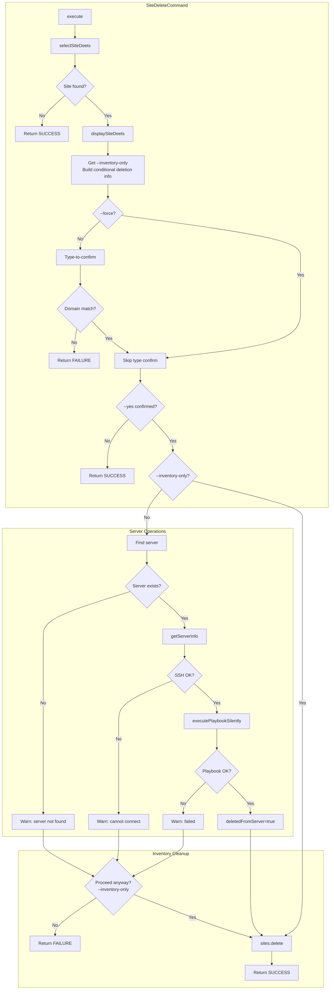
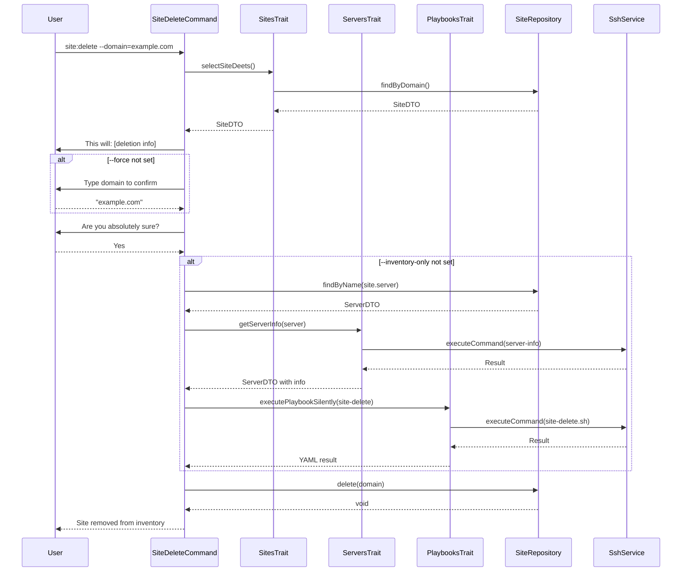

# Schematic: SiteDeleteCommand.php

> Auto-generated schematic. Last updated: 2025-12-19 (updated)

## Overview

`SiteDeleteCommand` is a Symfony Console command that handles the deletion of sites from both remote servers and the local inventory. It implements a multi-stage deletion process with safety confirmations (type-to-confirm and yes/no prompts), graceful degradation when server operations fail, and an `--inventory-only` option to skip remote deletion entirely.

## Recent Changes

- Moved `$inventoryOnly` retrieval earlier to line 68-69 (before deletion info display)
- Deletion info now respects `--inventory-only` flag: conditionally includes "Delete site files from server" only when `!$inventoryOnly`

## Logic Flow

### Entry Points

| Method | Access | Purpose |
|--------|--------|---------|
| `configure()` | protected | Defines command options (`--domain`, `--force`, `--yes`, `--inventory-only`) |
| `execute()` | protected | Main execution entry point, orchestrates the deletion flow |

### Execution Flow

```
1. Initialize I/O and display heading
   └── h1('Delete Site')

2. Site Selection Phase
   ├── selectSiteDeets() → SiteDTO|int
   │   ├── ensureSitesAvailable() - checks inventory has sites
   │   ├── Prompt for domain selection (or use --domain)
   │   └── Return SiteDTO or Command::FAILURE/SUCCESS
   └── displaySiteDeets($site) - show domain, server, repo, branch

3. Deletion Info Display
   ├── Get --inventory-only option (retrieved here for conditional display)
   ├── Build $deletionInfo array (respects --inventory-only)
   │   ├── "Remove the site from inventory" (always)
   │   └── "Delete site files from server '{server}'" (only if !$inventoryOnly)
   ├── info('This will:')
   └── ul($deletionInfo)

4. Safety Confirmation Phase
   ├── Type-to-confirm (unless --force)
   │   ├── Prompt user to type exact domain name
   │   └── Compare input with site.domain
   │       └── Mismatch → Command::FAILURE
   └── Yes/No confirmation (unless --yes)
       └── Cancelled → Command::SUCCESS

5. Server Deletion Phase (skipped if --inventory-only)
   ├── Find server in inventory
   │   └── Not found → warn, skip server deletion
   ├── getServerInfo() - verify SSH connection
   │   └── Failed → warn, continue to inventory prompt
   ├── executePlaybookSilently('site-delete')
   │   ├── Success → deletedFromServer = true
   │   └── Failure → warn, continue to inventory prompt
   └── If !deletedFromServer:
       ├── Prompt: "Remove site from inventory anyway?" (uses --inventory-only option)
       └── No → Command::FAILURE

6. Inventory Deletion Phase
   └── sites->delete($site->domain)

7. Completion Phase
   ├── yay("Site removed from inventory")
   └── commandReplay() - includes --inventory-only if !deletedFromServer
```

### Decision Points

| Line | Condition | True Branch | False Branch |
|------|-----------|-------------|--------------|
| 58-60 | `is_int($site)` | Return early (no sites) | Continue with SiteDTO |
| 75-77 | `!$inventoryOnly` | Add server deletion to info | Only show inventory removal |
| 89-102 | `!$forceSkip` | Type-to-confirm prompt | Skip confirmation |
| 97-101 | `$typedDomain !== $site->domain` | FAILURE | Continue |
| 112-116 | `!$confirmed` | SUCCESS (cancelled) | Continue |
| 124-170 | `!$inventoryOnly` | Attempt server deletion | Skip to inventory deletion |
| 127-128 | `$server === null` | Warn, skip server ops | Attempt server deletion |
| 132-133 | `is_int($server) \|\| $server->info === null` | Warn, skip playbook | Execute playbook |
| 145-149 | `is_int($result)` | Warn, deletedFromServer=false | deletedFromServer=true |
| 157-169 | `!$deletedFromServer` | Prompt for inventory removal (uses `--inventory-only`) | Direct inventory deletion |
| 166-168 | `!$proceedAnyway` | FAILURE | Continue to deletion |
| 192-194 | `!$deletedFromServer` | Add `--inventory-only` to replay | Replay without flag |

### Exit Conditions

| Condition | Return Value | Message |
|-----------|--------------|---------|
| No sites in inventory | `SUCCESS` | "No sites found in inventory" |
| Invalid domain option | `FAILURE` | ValidationException message |
| Type-to-confirm mismatch | `FAILURE` | "Site domain does not match. Deletion cancelled." |
| User cancels confirmation | `SUCCESS` | "Cancelled deleting site" |
| Server deletion failed + user declines inventory removal | `FAILURE` | (No message) |
| Successful deletion | `SUCCESS` | "Site '{domain}' removed from inventory" |

## Interaction Diagram





## Dependencies

### Direct Imports

| Import | Usage |
|--------|-------|
| `Deployer\Contracts\BaseCommand` | Parent class providing I/O helpers, services, repositories |
| `Deployer\Traits\PlaybooksTrait` | `executePlaybookSilently()` for remote script execution |
| `Deployer\Traits\ServersTrait` | `getServerInfo()` for SSH validation and server info retrieval |
| `Deployer\Traits\SitesTrait` | `selectSiteDeets()`, `displaySiteDeets()`, `validateSiteSelection()` |
| `Symfony\Component\Console\Attribute\AsCommand` | Command registration attribute |
| `Symfony\Component\Console\Command\Command` | Return constants (SUCCESS, FAILURE) |
| `Symfony\Component\Console\Input\InputInterface` | CLI input handling |
| `Symfony\Component\Console\Input\InputOption` | Option definitions |
| `Symfony\Component\Console\Output\OutputInterface` | CLI output handling |

### Coupled Files

| File | Coupling Type | Description |
|------|---------------|-------------|
| `playbooks/site-delete.sh` | Playbook | Remote bash script that deletes Caddy config and site files |
| `playbooks/server-info.sh` | Playbook | Used indirectly via `getServerInfo()` to verify SSH |
| `deployer.yml` | Data | Inventory file where sites are stored and removed from |
| `/home/deployer/sites/{domain}/` | Data | Remote directory deleted by playbook |
| `/etc/caddy/conf.d/sites/{domain}.caddy` | Config | Caddy vhost file deleted by playbook |

## Data Flow

### Inputs

| Source | Data | Via |
|--------|------|-----|
| CLI Option | `--domain` | `InputInterface::getOption()` |
| CLI Flag | `--force` | `InputInterface::getOption()` |
| CLI Flag | `--yes` | `InputInterface::getOption()` |
| CLI Flag | `--inventory-only` | `InputInterface::getOption()` |
| Interactive | Domain selection | `SitesTrait::selectSiteDeets()` |
| Interactive | Type-to-confirm | `IoService::promptText()` |
| Interactive | Yes/No confirm | `IoService::getBooleanOptionOrPrompt()` |
| Interactive | Inventory-only confirm | `IoService::getBooleanOptionOrPrompt()` (when server deletion fails) |
| Inventory | Site list | `SiteRepository::all()` |
| Inventory | Server details | `ServerRepository::findByName()` |

### Outputs

| Destination | Data | Via |
|-------------|------|-----|
| Console | Site details display | `displaySiteDeets()` |
| Console | Deletion info preview | `info()`, `ul()` |
| Console | Status messages | `h1()`, `yay()`, `nay()`, `warn()` |
| Console | Command replay | `commandReplay()` |
| Remote Server | Delete command | `executePlaybookSilently()` |
| Inventory | Site removal | `SiteRepository::delete()` |

### Side Effects

| Effect | Description |
|--------|-------------|
| **Remote: Caddy config deletion** | Removes `/etc/caddy/conf.d/sites/{domain}.caddy` (skipped with `--inventory-only`) |
| **Remote: Caddy reload** | Reloads Caddy service to apply config removal (skipped with `--inventory-only`) |
| **Remote: Site files deletion** | Removes `/home/deployer/sites/{domain}/` directory tree (skipped with `--inventory-only`) |
| **Local: Inventory update** | Removes site entry from `deployer.yml` |

## Notes

### Safety Mechanisms

1. **Type-to-confirm** (default): User must type exact domain name to proceed
2. **Secondary confirmation**: Even after type-to-confirm, requires explicit yes/no
3. **Deletion preview**: Shows "This will:" info section before any confirmations
4. **Graceful degradation**: Server unreachable does not block inventory cleanup
5. **User choice on failure**: When server deletion fails, user decides whether to clean inventory

### Non-Interactive Operation

Fully non-interactive via:

```bash
# Full deletion (server + inventory)
vendor/bin/deployer site:delete --domain='example.com' --force --yes

# Inventory-only deletion (skip server)
vendor/bin/deployer site:delete --domain='example.com' --force --yes --inventory-only
```

### Error Handling Strategy

The command follows a "best effort" approach:

- Server not in inventory: Warns but continues
- SSH connection failed: Warns but offers inventory cleanup
- Playbook failed: Warns but offers inventory cleanup
- Only hard failures: Invalid site selection, type-to-confirm mismatch

### Inventory-Only Mode

The `--inventory-only` flag serves three purposes:

1. **Conditional deletion info**: When passed, the "This will:" preview only shows inventory removal (hides "Delete site files from server")
2. **Explicit skip**: User can pass `--inventory-only` to skip server deletion entirely
3. **Fallback prompt**: When server deletion fails, the "Remove site from inventory anyway?" prompt uses this option, so the command replay accurately reflects what happened

### Playbook Environment Variables

When calling `site-delete.sh`:

- `DEPLOYER_OUTPUT_FILE`: Temp file for YAML output
- `DEPLOYER_DISTRO`: Server distribution (ubuntu/debian)
- `DEPLOYER_PERMS`: Permission level (root/sudo)
- `DEPLOYER_SITE_DOMAIN`: Domain being deleted
