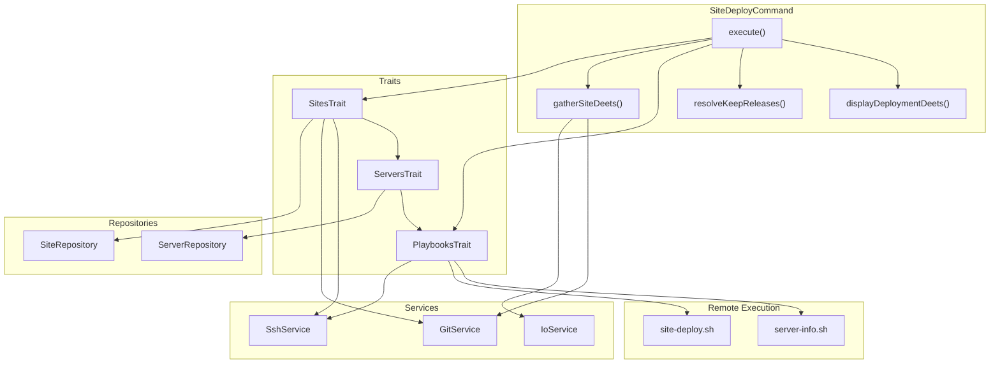
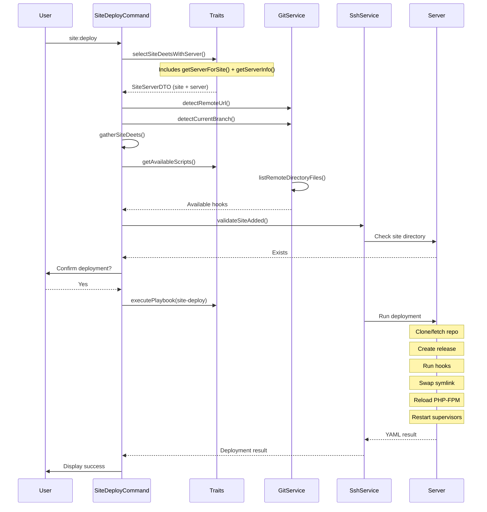

# Schematic: SiteDeployCommand.php

> Auto-generated schematic. Last updated: 2025-12-19

## Overview

`SiteDeployCommand` orchestrates atomic deployments of PHP sites using git-based releases with symlink swapping. It validates site configuration (including PHP version from inventory), checks for required deployment hooks in the remote repository, resolves deployment parameters, then executes the `site-deploy.sh` playbook on the target server.

## Logic Flow

### Entry Points

| Method | Purpose |
|--------|---------|
| `execute()` | Main command entry point, orchestrates the entire deployment workflow |

### Execution Flow

1. **Site and Server Selection** (lines 69-76)
   - Calls `selectSiteDeetsWithServer()` from `SitesTrait`
   - Prompts user or reads `--domain` CLI option
   - Resolves server via `getServerForSite()` and `getServerInfo()` internally
   - Displays site details (handled inside trait method)
   - Returns `SiteServerDTO` containing both `site` and `server`, or exits with status code

2. **Git Configuration Resolution** (lines 82-108)
   - Calls `gatherSiteDeets()` to resolve repo/branch
   - Uses stored values if available, prompts otherwise
   - **CLI overrides validated**: When stored values exist, CLI `--repo`/`--branch` overrides are validated with `validateSiteRepo()`/`validateSiteBranch()` before use
   - Throws `ValidationException` on invalid CLI override (caught by existing try-catch)
   - Detects local git remote URL and branch as defaults
   - Creates updated `SiteDTO` with resolved git info (preserves `phpVersion`, `crons`, `supervisors`)
   - Updates inventory if repo/branch were newly set or overridden (message inside try block)

3. **Hook Validation** (lines 114-130)
   - Calls `getAvailableScripts()` from `SitesTrait`
   - Checks remote repository for `.deployer/hooks/` directory
   - Validates presence of required hooks: `1-building.sh`, `2-releasing.sh`, `3-finishing.sh`
   - Exits with failure if any required hook is missing

4. **Site Validation on Server** (lines 136-140)
   - Calls `validateSiteAdded()` to check site exists on server
   - Validates site directory and Caddy config present

5. **Deployment Parameter Resolution** (lines 146-150)
   - Calls `resolveKeepReleases()` for release retention count
   - PHP version comes from `$site->phpVersion` (validated at repository hydration)

6. **Confirmation** (lines 156-169)
   - Uses `getBooleanOptionOrPrompt()` for `--yes` flag
   - Allows user to cancel deployment

7. **Playbook Execution** (lines 175-196)
   - Calls `executePlaybook()` from `PlaybooksTrait`
   - Executes `site-deploy.sh` with environment variables
   - Passes `$site->phpVersion` directly to playbook
   - Passes supervisor configuration for restart after deployment

8. **Results Display** (lines 202-223)
   - Shows deployment success message
   - Displays release details (branch, paths)
   - Shows next steps hint
   - Outputs command replay for automation

### Decision Points

| Location | Condition | Branch |
|----------|-----------|--------|
| Line 71 | `is_int($siteServer)` | Return early with status code |
| Line 84-85 | `is_int($resolvedGit)` | Return FAILURE (CLI override validation failed) |
| Line 101 | `$needsUpdate` | Update inventory with new repo/branch |
| Line 116, 122 | Missing hooks | Return FAILURE with guidance |
| Line 138 | Site not on server | Return FAILURE |
| Line 148 | Keep releases resolution fails | Return FAILURE |
| Line 164 | User cancels | Return SUCCESS (not an error) |
| Line 194 | Playbook fails | Return FAILURE |

### Exit Conditions

| Return Value | Condition |
|--------------|-----------|
| `Command::SUCCESS` | Deployment completed successfully |
| `Command::SUCCESS` | User cancelled deployment (not an error) |
| `Command::FAILURE` | Site selection failed or empty inventory |
| `Command::FAILURE` | Server resolution failed |
| `Command::FAILURE` | Git repo/branch validation failed (prompt or CLI override) |
| `Command::FAILURE` | Required hooks missing from repository |
| `Command::FAILURE` | Site not created on server |
| `Command::FAILURE` | Keep releases parameter invalid |
| `Command::FAILURE` | Playbook execution failed |

## Interaction Diagram

## Deployment Sequence

## Dependencies

### Direct Imports

| File/Class | Usage |
|------------|-------|
| `Deployer\Contracts\BaseCommand` | Parent class providing DI, output methods, command infrastructure |
| `Deployer\DTOs\SiteDTO` | Immutable site data (domain, repo, branch, server, phpVersion, crons, supervisors) |
| `Deployer\DTOs\SupervisorDTO` | Supervisor program configuration for restart after deploy |
| `Deployer\Exceptions\ValidationException` | Thrown when CLI option validation fails |
| `Deployer\Traits\PlaybooksTrait` | Provides `executePlaybook()` for remote script execution |
| `Deployer\Traits\ServersTrait` | Provides server resolution methods (used internally by `SitesTrait`) |
| `Deployer\Traits\SitesTrait` | Provides `selectSiteDeetsWithServer()`, `getAvailableScripts()`, `validateSiteAdded()`, validation methods |
| `Symfony\Component\Console\Attribute\AsCommand` | Command registration attribute |
| `Symfony\Component\Console\Command\Command` | Return codes (SUCCESS, FAILURE) |
| `Symfony\Component\Console\Input\InputInterface` | CLI input access |
| `Symfony\Component\Console\Input\InputOption` | Option definitions |
| `Symfony\Component\Console\Output\OutputInterface` | Console output |

### Coupled Files

| File | Coupling Type | Description |
|------|---------------|-------------|
| `playbooks/site-deploy.sh` | Playbook | Remote bash script executing the actual deployment |
| `playbooks/server-info.sh` | Playbook | Called via `getServerInfo()` to validate server |
| `playbooks/helpers.sh` | Playbook | Inlined into playbooks for helper functions |
| `deployer.yml` | Config | Inventory file storing site/server data (includes phpVersion) |
| `.deployer/hooks/*.sh` | Data | Required deployment hooks in user's repository |
| `/home/deployer/sites/{domain}/` | State | Remote site directory structure |
| `/etc/caddy/conf.d/sites/{domain}.caddy` | Config | Caddy configuration checked for site existence |

## Data Flow

### Inputs

| Source | Data | Description |
|--------|------|-------------|
| CLI Option `--domain` | string | Site domain to deploy |
| CLI Option `--repo` | string | Git repository URL (overrides stored, validated with `validateSiteRepo()`) |
| CLI Option `--branch` | string | Git branch name (overrides stored, validated with `validateSiteBranch()`) |
| CLI Option `--keep-releases` | int | Number of releases to retain (default: 5) |
| CLI Option `--yes` | bool | Skip confirmation prompt |
| `SiteRepository` | SiteDTO | Site configuration from inventory (includes `phpVersion`) |
| `ServerRepository` | ServerDTO | Server configuration from inventory |
| `GitService` | string | Detected local git remote URL and branch |
| Remote Repository | array | Available hooks in `.deployer/hooks/` |
| Server Info | array | Distribution, permissions |

### Outputs

| Destination | Data | Description |
|-------------|------|-------------|
| Console | string | Status messages, deployment details, command replay |
| `SiteRepository` | SiteDTO | Updated site with repo/branch if newly configured |
| Remote Server | - | Deployed release in `/home/deployer/sites/{domain}/releases/` |
| Remote Server | symlink | Updated `current` symlink pointing to new release |

### Side Effects

| Effect | Location | Description |
|--------|----------|-------------|
| Inventory Update | `deployer.yml` | Stores repo/branch when first configured |
| Git Clone | Remote server | Clones or updates bare repository in `repo/` |
| Release Creation | Remote server | Creates timestamped release directory |
| Hook Execution | Remote server | Runs `1-building.sh`, `2-releasing.sh`, `3-finishing.sh` |
| Symlink Swap | Remote server | Updates `current` symlink atomically |
| PHP-FPM Reload | Remote server | Reloads PHP-FPM service for configured version |
| Supervisor Restart | Remote server | Restarts configured supervisor programs |
| Release Cleanup | Remote server | Removes old releases beyond `keep-releases` limit |
| Runner Script | Remote server | Creates/updates `runner.sh` for cron execution |

## Environment Variables Passed to Playbook

| Variable | Source | Description |
|----------|--------|-------------|
| `DEPLOYER_SITE_DOMAIN` | SiteDTO | Site domain (e.g., example.com) |
| `DEPLOYER_SITE_REPO` | Resolved | Git repository URL |
| `DEPLOYER_SITE_BRANCH` | Resolved | Git branch name |
| `DEPLOYER_PHP_VERSION` | SiteDTO.phpVersion | PHP version from site inventory |
| `DEPLOYER_KEEP_RELEASES` | CLI/Default | Number of releases to keep |
| `DEPLOYER_SUPERVISORS` | SiteDTO | JSON array of supervisor programs to restart |
| `DEPLOYER_SERVER_NAME` | ServerDTO | Server name (auto-injected) |
| `DEPLOYER_SSH_PORT` | ServerDTO | SSH port (auto-injected) |
| `DEPLOYER_DISTRO` | ServerDTO.info | Distribution: ubuntu/debian (auto-injected) |
| `DEPLOYER_PERMS` | ServerDTO.info | Permissions: root/sudo (auto-injected) |

## Notes

### PHP Version Source

PHP version is read from `$site->phpVersion`, which is set during `site:create` and validated at the repository level during hydration. This eliminates the need for any runtime PHP version validation in the command - the DTO is guaranteed to have a valid `phpVersion` by the time it reaches this command.

### Required Hooks

The command enforces presence of three deployment hooks in the repository's `.deployer/hooks/` directory:

- `1-building.sh` - Runs after code export, before shared linking (install dependencies)
- `2-releasing.sh` - Runs after shared linking, before activation (migrations, cache)
- `3-finishing.sh` - Runs after symlink activation (notifications, cleanup)

Missing hooks cause deployment failure with guidance to run `scaffold:hooks`.

### Atomic Deployment Strategy

The deployment uses the "releases" pattern:

1. Code is exported from bare repo to timestamped release directory
2. Shared resources (storage, .env) are symlinked into release
3. Hooks run with full context
4. `current` symlink is atomically updated
5. Old releases are pruned based on `keep-releases`

### Supervisor Integration

Supervisor programs configured for the site are automatically restarted after deployment. The playbook receives the supervisor list as JSON and restarts each program after the release is activated.

## Recent Changes

- **Replaced separate server resolution calls with `selectSiteDeetsWithServer()`** - Now uses single trait method that combines `selectSiteDeets()`, `getServerForSite()`, `getServerInfo()`, and `displaySiteDeets()` internally
- **Server resolved earlier in flow** - Server resolution now happens before `gatherSiteDeets()` (repo/branch gathering) instead of after hook validation
- **Removed explicit `displaySiteDeets()` call** - Site details display now handled inside `selectSiteDeetsWithServer()`
- **Moved inventory update message inside try block** - "Repository info added to inventory" message now inside the try block for the `sites->update()` call (lines 102-108)
- **Simplified flow order** - Now: selectSiteDeetsWithServer -> gatherSiteDeets -> hook check -> validateSiteAdded
- **File reduced from 392 to 372 lines** - Consolidation of server resolution logic
