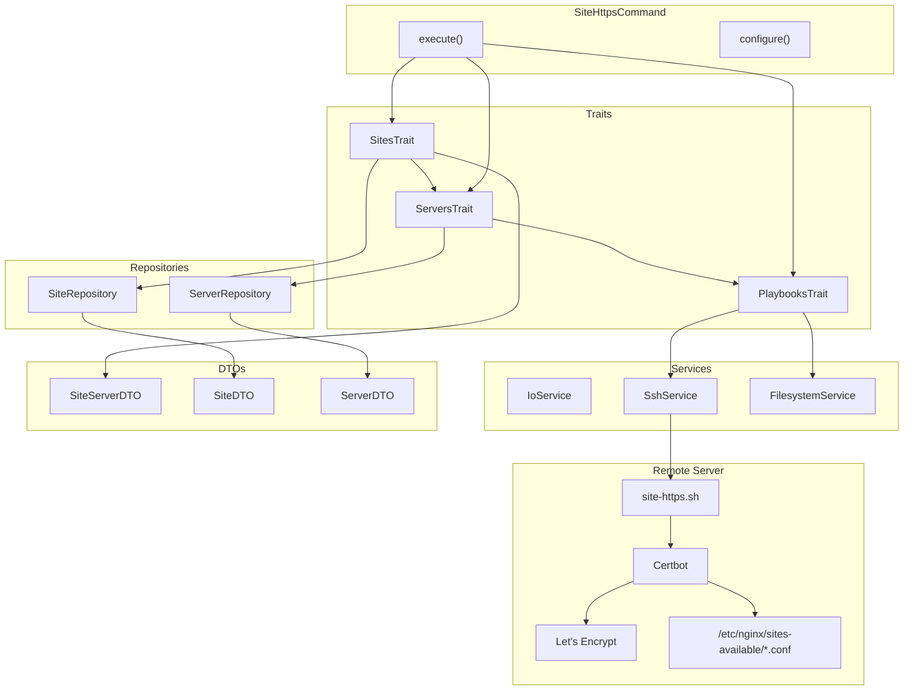

# Schematic: SiteHttpsCommand.php

> Auto-generated schematic. Last updated: 2025-12-27

## Recent Changes

- **2025-12-27**: Migrated from Caddy to Nginx+Certbot - now uses Certbot with Nginx plugin for SSL certificates instead of Caddy's built-in ACME

## Overview

This command enables HTTPS for a site using Certbot with Let's Encrypt (HTTP-01 challenge). It selects a site from inventory, retrieves its configuration from the server, and executes the `site-https.sh` playbook that runs Certbot to obtain and configure SSL certificates. Certbot automatically modifies the Nginx configuration to add SSL and redirects.

## Logic Flow

### Entry Points

| Method | Visibility | Description |
|--------|------------|-------------|
| `execute()` | protected | Main command execution (Symfony Console entry point) |
| `configure()` | protected | Defines CLI options |

### Execution Flow

1. **Initialization** (via `BaseCommand::initialize()`)
   - IoService initialized with command context
   - Environment and inventory files loaded
   - Server and site repositories populated

2. **Display Heading**
   - Outputs "Enable HTTPS" as h1 heading

3. **Site Selection** (via `SitesTrait::selectSiteDeetsWithServer()`)
   - Validates sites exist in inventory
   - Prompts for domain selection (or uses `--domain` option)
   - Displays site details (domain, server, repo, branch)
   - Resolves associated server from inventory
   - Retrieves server info via `server-info` playbook (validates SSH, distro, permissions)
   - Returns `SiteServerDTO` containing both site and server with info

4. **Site Existence Validation** (via `SitesTrait::ensureSiteExists()`)
   - Verifies site has been created on server (not just in inventory)
   - Checks `/home/deployer/sites/{domain}` directory exists
   - Checks `/etc/nginx/sites-available/{domain}` config exists
   - Returns `Command::FAILURE` with error message if site doesn't exist on server

5. **Configuration Retrieval** (via `ServersTrait::getSiteConfig()`)
   - Extracts site configuration from server info
   - Gets `php_version`, `www_mode`, and `https_enabled` status
   - Validates site has been created (not "unknown" PHP version)

6. **HTTPS Already Enabled Check**
   - If `$config['https_enabled']` is `true`, shows info message
   - Outputs command replay and returns SUCCESS early
   - Skips playbook execution when HTTPS already active

7. **Playbook Execution** (via `PlaybooksTrait::executePlaybookSilently()`)
   - Executes `site-https.sh` playbook on remote server
   - Passes `DEPLOYER_WWW_MODE` environment variable
   - Playbook runs Certbot with Nginx plugin to obtain SSL certificate
   - Certbot automatically modifies Nginx config for SSL

8. **Success Output**
   - Displays success message
   - Shows command replay hint for non-interactive usage

### Decision Points

| Line | Condition | True Branch | False Branch |
|------|-----------|-------------|--------------|
| 54 | `is_int($siteServer)` | Return failure code | Continue |
| 60 | `is_int($validationResult)` | Return failure code (site doesn't exist on server) | Continue |
| 72 | Site config is null or PHP unknown | Display error, return FAILURE | Continue |
| 82 | `true === $config['https_enabled']` | Show info, commandReplay, return SUCCESS | Continue to playbook |
| 105 | `is_int($result)` | Return failure code | Continue |

### Exit Conditions

| Return Value | Condition |
|--------------|-----------|
| `Command::SUCCESS` | No sites in inventory (via `selectSiteDeetsWithServer`) |
| `Command::FAILURE` | Site selection failed (validation error) |
| `Command::FAILURE` | Server not found for site |
| `Command::FAILURE` | Server info retrieval failed |
| `Command::FAILURE` | Site doesn't exist on server (via `ensureSiteExists`) |
| `Command::FAILURE` | Site not configured (PHP version unknown) |
| `Command::SUCCESS` | HTTPS already enabled (early return with info message) |
| `Command::FAILURE` | Playbook execution failed |
| `Command::SUCCESS` | HTTPS enabled successfully |

## Interaction Diagram

## Dependencies

### Direct Imports

| File/Class | Usage |
|------------|-------|
| `DeployerPHP\Contracts\BaseCommand` | Parent class providing shared command infrastructure |
| `DeployerPHP\Traits\PlaybooksTrait` | Remote playbook execution via SSH |
| `DeployerPHP\Traits\ServersTrait` | Server selection and info retrieval |
| `DeployerPHP\Traits\SitesTrait` | Site selection and validation |
| `Symfony\Component\Console\Attribute\AsCommand` | Command registration attribute |
| `Symfony\Component\Console\Command\Command` | Return codes (SUCCESS, FAILURE) |
| `Symfony\Component\Console\Input\InputInterface` | CLI input handling |
| `Symfony\Component\Console\Input\InputOption` | Option definition |
| `Symfony\Component\Console\Output\OutputInterface` | CLI output handling |

### Coupled Files

| File | Coupling Type | Description |
|------|---------------|-------------|
| `playbooks/site-https.sh` | Playbook | Remote script that runs Certbot for SSL certificates |
| `playbooks/server-info.sh` | Playbook | Retrieves server info including site configurations |
| `playbooks/helpers.sh` | Playbook | Helper functions auto-inlined into playbooks |
| `deployer.yml` | Data | Inventory file containing sites and servers |
| `.env` | Config | Environment configuration file |
| `/etc/nginx/sites-available/{domain}` | Remote Config | Nginx vhost configuration file (modified by Certbot) |
| `/etc/letsencrypt/live/{domain}/` | Remote Config | SSL certificate storage location |

## Data Flow

### Inputs

| Source | Data | Type |
|--------|------|------|
| CLI Option | `--domain` | string (optional) |
| Interactive Prompt | Domain selection | string |
| `deployer.yml` | Site inventory | array of SiteDTO |
| `deployer.yml` | Server inventory | array of ServerDTO |
| Remote Server | Server info with sites_config | array |

### Outputs

| Destination | Data | Description |
|-------------|------|-------------|
| Console | Status messages | Progress and success/error output |
| Console | Command replay | Non-interactive command hint |
| Remote Server | SSL certificate | Let's Encrypt certificate files |
| Remote Server | Updated Nginx config | SSL-enabled vhost configuration |

### Side Effects

| Effect | Description |
|--------|-------------|
| Remote File Write | Updates `/etc/nginx/sites-available/{domain}` with SSL configuration |
| SSL Certificate | Obtains and stores Let's Encrypt certificate in `/etc/letsencrypt/` |
| Service Reload | Reloads Nginx service to apply SSL configuration |
| Timer Enable | Enables certbot.timer for automatic certificate renewal |

## Notes

### Certbot with Nginx Plugin

The playbook uses Certbot with the `--nginx` plugin which:

1. Validates domain ownership via HTTP-01 challenge
2. Obtains Let's Encrypt certificate
3. Automatically modifies Nginx configuration to:
   - Add SSL certificate paths
   - Configure HTTPS server block on port 443
   - Add HTTP to HTTPS redirect
4. Reloads Nginx to apply changes

### WWW Mode Handling

The playbook configures certificates based on `www_mode`:

- `redirect-to-root`: Primary domain is root, www redirects to root
- `redirect-to-www`: Primary domain is www, root redirects to www

Both root and www domains are included in the certificate.

### Prerequisites

- Site must exist in inventory (`site:create`)
- Site must have Nginx configuration on server
- Server must be accessible via SSH
- DNS must point to server (for HTTP-01 challenge)
- Port 80 must be accessible from internet

### Certificate Renewal

Certbot automatically configures renewal via `certbot.timer` systemd timer. The playbook ensures this timer is enabled and started.
