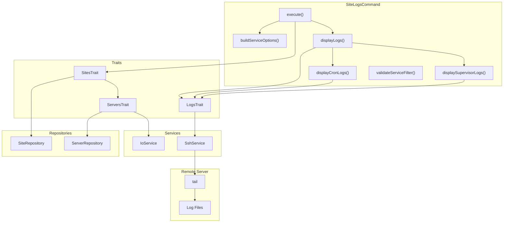

# Schematic: SiteLogsCommand.php

> Auto-generated schematic. Last updated: 2025-12-27

## Recent Changes

- **2025-12-27**: Migrated from Caddy to Nginx - access logs now at `/var/log/nginx/{domain}-access.log` instead of `/var/log/caddy/{domain}-access.log`

## Overview

The `SiteLogsCommand` retrieves and displays logs for a specific site from a remote server. It supports three log types: Nginx access logs, cron job logs, and supervisor program logs. The command dynamically builds available log options based on the site's configured crons and supervisors, then retrieves logs via SSH using the tail command.

## Logic Flow

### Entry Points

| Method | Access | Description |
|--------|--------|-------------|
| `configure()` | protected | Registers CLI options: `--domain`, `--lines`, `--service` |
| `execute()` | protected | Main execution flow - orchestrates site selection, log source building, and log retrieval |
| `buildServiceOptions()` | protected | Builds dynamic list of available log sources based on site configuration |
| `displayLogs()` | protected | Retrieves and displays logs for selected services |
| `displayCronLogs()` | protected | Retrieves logs for all cron scripts associated with the site |
| `displaySupervisorLogs()` | protected | Retrieves logs for all supervisor programs associated with the site |
| `validateServiceFilter()` | protected | Validates service selection against allowed options |

### Execution Flow

```
1. execute()
   |
   +-- Display heading "Site Logs"
   |
   +-- selectSiteDeetsWithServer() [SitesTrait]
   |   |-- selectSiteDeets() - Select site from inventory
   |   |-- getServerForSite() - Resolve associated server
   |   +-- getServerInfo() - Validate SSH, distribution, permissions
   |
   +-- buildServiceOptions(site)
   |   |-- Always add 'access' (Nginx access logs)
   |   |-- Add 'crons' if site.crons is not empty
   |   +-- Add 'supervisors' if site.supervisors is not empty
   |
   +-- try {
   |       getValidatedOptionOrPrompt('lines', text, validateLineCount)
   |   } catch (ValidationException) -> FAILURE
   |
   +-- Check --service CLI option
   |   |-- If provided: validateServiceFilter(), parse comma-separated values
   |   +-- If omitted: Use all available service keys
   |
   +-- displayLogs(server, site, serviceKeys, lines)
   |   |-- For each selected service:
   |   |   |-- 'access' -> retrieveFileLogs(/var/log/nginx/{domain}-access.log)
   |   |   |-- 'crons' -> displayCronLogs() for each cron
   |   |   |-- 'supervisors' -> displaySupervisorLogs() for each supervisor
   |   |   +-- default -> warn("Unknown service: {key}")
   |
   +-- commandReplay() - Show non-interactive command
```

### Decision Points

| Location | Condition | True Branch | False Branch |
|----------|-----------|-------------|--------------|
| execute() | `is_int($siteServer)` | Return failure code | Continue with site and server |
| execute() | `ValidationException` caught | Return FAILURE | Continue |
| execute() | `null !== $serviceOption` | Validate and parse CLI option | Use all available services |
| buildServiceOptions() | `[] !== $site->crons` | Add 'crons' option | Skip |
| buildServiceOptions() | `[] !== $site->supervisors` | Add 'supervisors' option | Skip |
| displayLogs() | Match on service key | Execute corresponding log retrieval | Warn unknown service |

### Exit Conditions

| Exit Point | Condition | Return Value |
|------------|-----------|--------------|
| execute() | Site/server selection failed | `Command::FAILURE` or `Command::SUCCESS` |
| execute() | ValidationException caught | `Command::FAILURE` |
| execute() | Service filter validation failed | `Command::FAILURE` |
| execute() | Success | `Command::SUCCESS` |

## Interaction Diagram



## Dependencies

### Direct Imports

| File/Class | Usage |
|------------|-------|
| `DeployerPHP\Contracts\BaseCommand` | Parent class providing DI, output methods, and command infrastructure |
| `DeployerPHP\DTOs\ServerDTO` | Immutable data object representing a server |
| `DeployerPHP\DTOs\SiteDTO` | Immutable data object representing a site with crons/supervisors |
| `DeployerPHP\Exceptions\ValidationException` | Thrown when CLI option validation fails |
| `DeployerPHP\Traits\LogsTrait` | Provides `retrieveFileLogs()`, `highlightErrors()`, `validateLineCount()` |
| `DeployerPHP\Traits\ServersTrait` | Provides server selection and info retrieval (via SitesTrait) |
| `DeployerPHP\Traits\SitesTrait` | Provides `selectSiteDeetsWithServer()` |
| `Symfony\Component\Console\Attribute\AsCommand` | Command metadata attribute |
| `Symfony\Component\Console\Command\Command` | Constants `Command::SUCCESS`, `Command::FAILURE` |
| `Symfony\Component\Console\Input\InputInterface` | CLI input handling |
| `Symfony\Component\Console\Input\InputOption` | Option definition constants |
| `Symfony\Component\Console\Output\OutputInterface` | CLI output handling |

### Coupled Files

| File | Coupling Type | Description |
|------|---------------|-------------|
| `playbooks/server-info.sh` | Playbook | Called via `getServerInfo()` to validate server connection |
| `deployer.yml` | Data | Inventory file providing site/cron/supervisor data |
| `app/Services/IoService.php` | Service | Handles user input prompts and validation |
| `app/Services/SshService.php` | Service | Executes log retrieval commands on remote server |
| `app/Repositories/SiteRepository.php` | Repository | Provides site data including crons and supervisors |
| `app/Repositories/ServerRepository.php` | Repository | Server lookup for site association |
| `/var/log/nginx/{domain}-access.log` | Log | Per-site Nginx access logs on remote server |
| `/var/log/cron/{domain}-{script}.log` | Log | Per-site cron script logs on remote server |
| `/var/log/supervisor/{domain}-{program}.log` | Log | Per-site supervisor program logs on remote server |

## Data Flow

### Inputs

| Source | Data | Processing |
|--------|------|------------|
| CLI `--domain` | Site domain string | Validated against inventory via `validateSiteSelection()` |
| CLI `--service` | Comma-separated service keys | Validated against dynamic options via `validateServiceFilter()` |
| CLI `--lines` | Number of lines | Validated as positive integer <= 1000 via `validateLineCount()` |
| `SiteDTO.crons` | Array of CronDTO | Used to build log options and retrieve cron logs |
| `SiteDTO.supervisors` | Array of SupervisorDTO | Used to build log options and retrieve supervisor logs |

### Outputs

| Destination | Data | Format |
|-------------|------|--------|
| Console | Log content | Text with error highlighting via `highlightErrors()` |
| Console | Status messages | Text via `h2()`, `warn()`, `nay()` |
| Console | Command replay | CLI command string via `commandReplay()` |

### Side Effects

| Effect | Location | Trigger |
|--------|----------|---------|
| SSH connection | Remote server | Log retrieval commands |
| None persistent | N/A | Read-only command |

## Log Source Configuration

### Static Source

| Key | Label | Log Path |
|-----|-------|----------|
| `access` | Access Logs | `/var/log/nginx/{domain}-access.log` |

### Dynamic Sources (based on site configuration)

| Key | Condition | Log Path Pattern |
|-----|-----------|------------------|
| `crons` | `site.crons` not empty | `/var/log/cron/{domain}-{scriptBase}.log` per cron |
| `supervisors` | `site.supervisors` not empty | `/var/log/supervisor/{domain}-{program}.log` per supervisor |

## Notes

### Nginx Log Path

Access logs are now stored at `/var/log/nginx/{domain}-access.log` (migrated from `/var/log/caddy/`). This path is created by the `site-create.sh` playbook when configuring the Nginx vhost.

### Validation Strategy

The command uses `getValidatedOptionOrPrompt()` for the `--lines` option, wrapped in try-catch for `ValidationException`. The `--service` option is validated separately using `validateServiceFilter()` since it's optional (defaults to all services when omitted).

### Service Key Normalization

CLI `--service` option accepts comma-separated values (e.g., `--service=access,crons`). When omitted, all available services are shown. The command normalizes the input to an array of strings before processing.

### Log Path Conventions

All log paths follow the deployer conventions:
- Access logs: `/var/log/nginx/{domain}-access.log`
- Cron logs: `/var/log/cron/{domain}-{scriptBase}.log` (scriptBase = filename without extension)
- Supervisor logs: `/var/log/supervisor/{domain}-{program}.log`

### Trait Composition

Uses four traits:
- `LogsTrait` - Provides `retrieveFileLogs()` for SSH-based log retrieval and `validateLineCount()`
- `SitesTrait` - Provides `selectSiteDeetsWithServer()` for combined site/server selection
- `ServersTrait` - Used indirectly via SitesTrait for server validation
- `PlaybooksTrait` - Required trait for playbook infrastructure

### File-Only Log Retrieval

Unlike `NginxLogsCommand` which uses both `retrieveJournalLogs()` and `retrieveFileLogs()`, this command only uses `retrieveFileLogs()` since all site-related logs are file-based.
