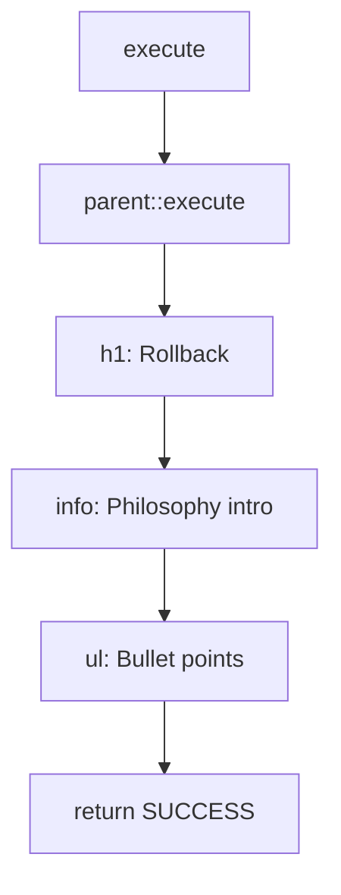

# Schematic: SiteRollbackCommand.php

> Auto-generated schematic. Last updated: 2025-12-27

## Overview

Educational command that explains DeployerPHP's forward-only deployment philosophy. Does not perform any actual rollback operations. Instead, it outputs information about why rollbacks are discouraged in favor of forward fixes.

## Logic Flow

### Entry Points

| Method      | Visibility | Description                              |
| ----------- | ---------- | ---------------------------------------- |
| `execute()` | protected  | Display rollback philosophy information  |

### Execution Flow

```
execute()
  |
  +-> parent::execute()      # Initialize I/O, display env/inventory status
  |
  +-> h1('Rollback')         # Display heading
  |
  +-> info(...)              # Display philosophy intro
  |
  +-> ul([...])              # Display bullet list of reasons
  |
  +-> return SUCCESS         # Always succeeds
```

### Decision Points

None. This command has a linear execution path with no conditionals.

### Exit Conditions

| Condition      | Return Value      |
| -------------- | ----------------- |
| Always         | `Command::SUCCESS`|

## Interaction Diagram



## Dependencies

### Direct Imports

| File/Class                              | Usage                           |
| --------------------------------------- | ------------------------------- |
| `DeployerPHP\Contracts\BaseCommand`     | Parent class, provides I/O methods |
| `Symfony\Component\Console\Attribute\AsCommand` | Command registration attribute |
| `Symfony\Component\Console\Command\Command` | SUCCESS constant              |
| `Symfony\Component\Console\Input\InputInterface` | Execute signature           |
| `Symfony\Component\Console\Output\OutputInterface` | Execute signature         |

### Coupled Files

| File                                    | Coupling Type | Description                     |
| --------------------------------------- | ------------- | ------------------------------- |
| `app/Contracts/BaseCommand.php`         | API           | Inherits I/O methods (`h1`, `info`, `ul`) |

## Data Flow

### Inputs

None. This command accepts no arguments or custom options beyond the base `--env` and `--inventory` options.

### Outputs

| Output Type  | Description                                      |
| ------------ | ------------------------------------------------ |
| Console text | Educational message about forward-only deployments |

### Side Effects

None. This is a read-only informational command.

## Notes

- This is an intentionally minimal command that serves as documentation rather than functionality
- No configuration options beyond inherited base options
- No service dependencies used (though inherited via BaseCommand)
- No external I/O (SSH, filesystem, network)
- The command name `site:rollback` is intentionally suggestive - users expecting rollback functionality are instead educated about the forward-only philosophy
