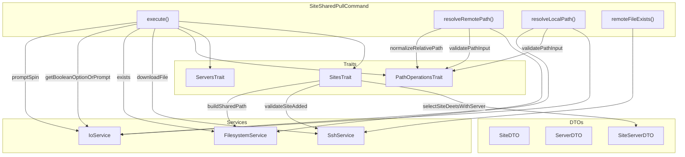
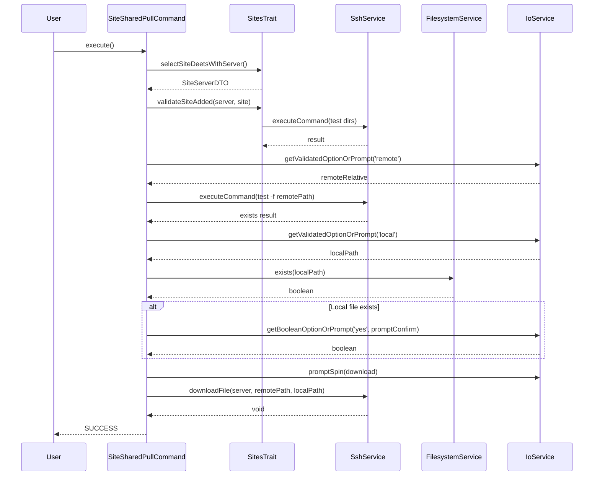

# Schematic: SiteSharedPullCommand.php

> Auto-generated schematic. Last updated: 2025-12-21

## Overview

Downloads a file from a site's `shared/` directory on a remote server to the local filesystem. This command is the counterpart to `SiteSharedPushCommand` and enables retrieving configuration files (like `.env`) or other shared assets from deployed sites via SFTP.

## Logic Flow

### Entry Points

| Method | Visibility | Description |
|--------|------------|-------------|
| `execute()` | protected | Main command execution entry point |

### Execution Flow

```
1. Display heading "Download Shared File"
2. Select site and server (via SitesTrait::selectSiteDeetsWithServer)
   - Prompt user to select site from inventory
   - Display site details (domain, server, repo, branch)
   - Resolve associated server
   - Validate SSH connection and retrieve server info
3. Validate site is added on server
   - Check site directory exists at /home/deployer/sites/{domain}
   - Check Caddy config exists at /etc/caddy/conf.d/sites/{domain}.caddy
4. Resolve paths
   - Get remote path (relative to shared/)
   - Build full remote path: /home/deployer/sites/{domain}/shared/{relative}
   - Verify remote file exists via SSH test command
   - Get local destination path
5. Check local file overwrite
   - If local file exists, check --yes option or prompt for confirmation
   - Cancel gracefully if user declines
6. Download file via SFTP
   - Use spinner during download operation
7. Display success message
8. Show command replay for non-interactive usage (includes yes: true)
```

### Decision Points

| Line | Condition | True Branch | False Branch |
|------|-----------|-------------|--------------|
| 59-61 | `is_int($result)` | Return failure code | Continue with site/server |
| 72-74 | `is_int($validationResult)` | Return failure code | Continue execution |
| 88-92 | Remote file does not exist | Display error, return FAILURE | Continue with download |
| 105-119 | Local file exists | Check `--yes` option or prompt for overwrite confirmation | Proceed to download |
| 114-118 | User declines overwrite | Return SUCCESS (cancelled) | Proceed to download |

### Exit Conditions

| Return Value | Condition |
|--------------|-----------|
| `Command::FAILURE` | No sites in inventory |
| `Command::FAILURE` | Server not found for site |
| `Command::FAILURE` | SSH connection/info retrieval failed |
| `Command::FAILURE` | Site not created on server |
| `Command::FAILURE` | ValidationException during path resolution |
| `Command::FAILURE` | Remote file does not exist |
| `Command::FAILURE` | SFTP download failed |
| `Command::SUCCESS` | User cancelled overwrite |
| `Command::SUCCESS` | File downloaded successfully |

## Interaction Diagram



## Sequence Diagram



## Dependencies

### Direct Imports

| File/Class | Usage |
|------------|-------|
| `Deployer\Contracts\BaseCommand` | Parent class providing core infrastructure |
| `Deployer\DTOs\ServerDTO` | Server connection details for SSH operations |
| `Deployer\Exceptions\ValidationException` | Thrown on CLI option validation failure |
| `Deployer\Traits\PathOperationsTrait` | Path validation and normalization methods |
| `Deployer\Traits\ServersTrait` | Server selection and validation methods |
| `Deployer\Traits\SitesTrait` | Site selection, server resolution, and shared path building methods |
| `Symfony\Component\Console\Attribute\AsCommand` | Command registration attribute |
| `Symfony\Component\Console\Command\Command` | Return constants (SUCCESS, FAILURE) |
| `Symfony\Component\Console\Input\InputInterface` | CLI input handling |
| `Symfony\Component\Console\Input\InputOption` | Option definition constants |
| `Symfony\Component\Console\Output\OutputInterface` | CLI output handling |

### Inherited from BaseCommand

| Service | Property | Usage |
|---------|----------|-------|
| `IoService` | `$this->io` | Prompts, validation, spinner display |
| `SshService` | `$this->ssh` | Remote command execution, SFTP downloads |
| `FilesystemService` | `$this->fs` | Local file existence checks, path expansion |
| `SiteRepository` | `$this->sites` | Site inventory access |
| `ServerRepository` | `$this->servers` | Server inventory access |

### Coupled Files

| File | Coupling Type | Description |
|------|---------------|-------------|
| `app/Console/Site/SiteSharedPushCommand.php` | Functional | Inverse operation (push vs pull), shares same traits |
| `app/Traits/PathOperationsTrait.php` | Trait | Path validation and normalization (`validatePathInput()`, `normalizeRelativePath()`) |
| `app/Traits/SitesTrait.php` | Trait | Site selection, validation, and `buildSharedPath()` method |
| `app/Traits/ServersTrait.php` | Trait | Server info retrieval (via PlaybooksTrait) |
| `app/Traits/PlaybooksTrait.php` | Trait | Included via ServersTrait for server-info playbook |
| `playbooks/server-info.sh` | Playbook | Used by getServerInfo() to validate server |
| `deployer.yml` | Config | Inventory file with sites and servers |

## Data Flow

### Inputs

| Source | Data | Type |
|--------|------|------|
| CLI Option `--domain` | Site domain to select | `string` |
| CLI Option `--remote` | Remote path relative to shared/ | `string` |
| CLI Option `--local` | Local destination path | `string` |
| CLI Option `--yes` | Skip overwrite confirmation | `bool` |
| Interactive Prompt | Site selection | `string` |
| Interactive Prompt | Remote filename | `string` |
| Interactive Prompt | Local path | `string` |
| Interactive Prompt | Overwrite confirmation | `bool` |
| Inventory | Site and server details | `SiteDTO`, `ServerDTO` |

### Outputs

| Destination | Data | Type |
|-------------|------|------|
| Local filesystem | Downloaded file | File |
| Console | Status messages | Text |
| Console | Command replay hint | Text |

### Side Effects

| Effect | Location | Description |
|--------|----------|-------------|
| File write | Local filesystem | Downloaded file written to local path |
| File overwrite | Local filesystem | Existing file replaced if user confirms |
| SSH connection | Remote server | Temporary connection for file check and download |

## CLI Options

| Option | Alias | Type | Required | Description |
|--------|-------|------|----------|-------------|
| `--domain` | - | VALUE_REQUIRED | No | Site domain (prompts if not provided) |
| `--remote` | - | VALUE_REQUIRED | No | Remote filename relative to shared/ |
| `--local` | - | VALUE_REQUIRED | No | Local destination file path |
| `--yes` | `-y` | VALUE_NONE | No | Skip overwrite confirmation |

## Remote Paths

The command operates on the site's shared directory structure:

```
/home/deployer/sites/{domain}/
    shared/           <-- SitesTrait::buildSharedPath()
        .env          <-- Example file
        storage/      <-- Nested directories supported
```

## Notes

- **Path Traversal Protection**: The `normalizeRelativePath()` method in `PathOperationsTrait` rejects paths containing `..` to prevent directory traversal attacks.

- **Graceful Cancellation**: When the user declines to overwrite an existing local file, the command returns `SUCCESS` rather than `FAILURE`, as this is a user-initiated cancellation, not an error.

- **SSH File Check**: Uses `test -f` command to verify remote file existence before attempting download. Exit code 0 means file exists, 1 means not found, other codes indicate errors.

- **SFTP vs SCP**: Downloads use SFTP (via phpseclib3) rather than SCP for better cross-platform compatibility and error handling.

- **Companion Command**: Works in tandem with `site:shared:push` for bidirectional file transfer to/from the shared directory.

- **Validation Consolidation**: The `validatePathInput()` method is provided by `PathOperationsTrait`, shared with `SiteSharedPushCommand` for consistent path validation.
