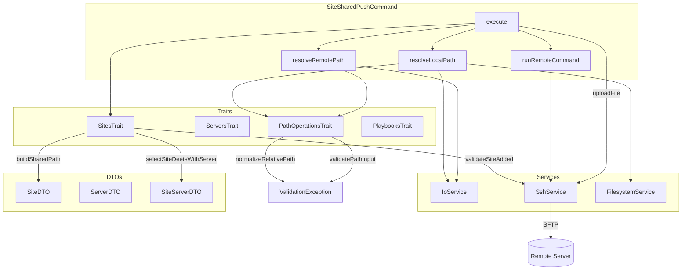
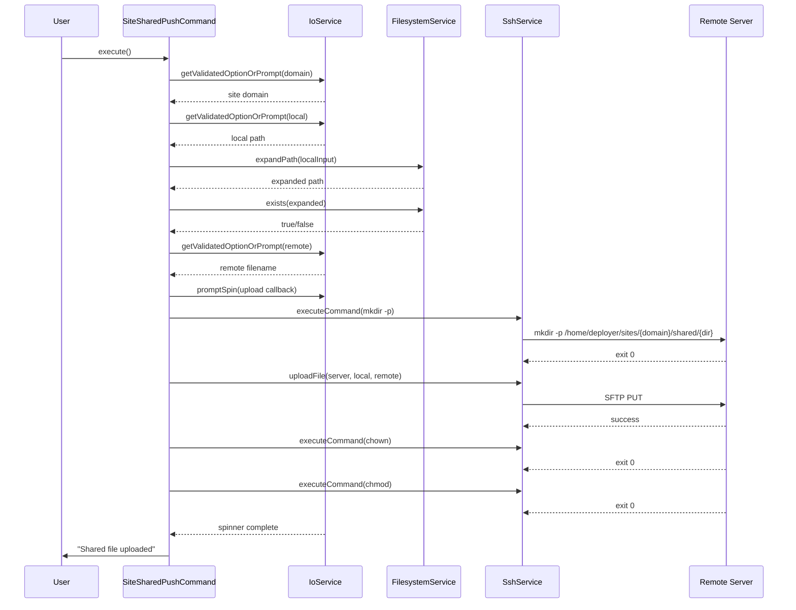

# Schematic: SiteSharedPushCommand.php

> Auto-generated schematic. Last updated: 2025-12-21

## Overview

Console command that uploads a local file to a site's shared directory on a remote server via SFTP. The shared directory (`/home/deployer/sites/{domain}/shared/`) stores persistent files that survive deployments and are symlinked into releases.

## Logic Flow

### Entry Points

| Method | Visibility | Description |
|--------|------------|-------------|
| `execute()` | protected | Main command entry point, orchestrates the upload workflow |

### Execution Flow

```
1. Display heading "Upload Shared File"
2. Select site and resolve server
   a. selectSiteDeetsWithServer() - prompts for domain, displays site info, resolves server
   b. Returns SiteServerDTO or failure code
3. Validate site exists on server
   a. validateSiteAdded() - checks /home/deployer/sites/{domain} and Caddy config exist
4. Resolve file paths
   a. resolveLocalPath() - get/prompt local file path, validate exists
   b. resolveRemotePath() - get/prompt remote filename, normalize path
   c. buildSharedPath() - construct full remote path
5. Upload file via SFTP
   a. Create remote directory if needed (mkdir -p)
   b. Upload file via SshService::uploadFile()
   c. Set ownership (chown deployer:deployer)
   d. Set permissions (chmod 640)
6. Display success message and command replay
```

### Decision Points

| Line | Condition | True Branch | False Branch |
|------|-----------|-------------|--------------|
| 59-61 | `is_int($result)` | Return failure code | Continue with site/server |
| 72-74 | `is_int($validationResult)` | Return failure code | Continue with validation passed |
| 151 | File not found after expansion | Throw ValidationException | Return expanded path |

### Exit Conditions

| Condition | Return Value | Message |
|-----------|--------------|---------|
| No sites in inventory | `Command::SUCCESS` | "No sites found" |
| Site not found in inventory | `Command::FAILURE` | "Site not found" |
| Server not found | `Command::FAILURE` | "Server not found" |
| Site not added on server | `Command::FAILURE` | "Site has not been created on the server" |
| Local file not found | `Command::FAILURE` | "Local file not found: {path}" |
| Invalid path input | `Command::FAILURE` | Validation error message |
| Remote command fails | `Command::FAILURE` | Error message |
| Upload fails | `Command::FAILURE` | Error message |
| Success | `Command::SUCCESS` | "Shared file uploaded" |

## Interaction Diagram



### Upload Sequence



## Dependencies

### Direct Imports

| File/Class | Usage |
|------------|-------|
| `Deployer\Contracts\BaseCommand` | Parent class providing DI and output methods |
| `Deployer\DTOs\ServerDTO` | Server connection details for SSH operations |
| `Deployer\Exceptions\ValidationException` | Thrown on CLI option validation failure |
| `Deployer\Traits\PathOperationsTrait` | Path validation and normalization (`validatePathInput`, `normalizeRelativePath`) |
| `Deployer\Traits\PlaybooksTrait` | Remote playbook execution helpers |
| `Deployer\Traits\ServersTrait` | Server selection and info retrieval |
| `Deployer\Traits\SitesTrait` | Site selection, validation, and shared path building (`buildSharedPath`) |
| `Symfony\Component\Console\Attribute\AsCommand` | Command registration attribute |
| `Symfony\Component\Console\Command\Command` | Return codes (SUCCESS, FAILURE) |
| `Symfony\Component\Console\Input\InputInterface` | CLI input handling |
| `Symfony\Component\Console\Input\InputOption` | Option definition constants |
| `Symfony\Component\Console\Output\OutputInterface` | Console output |

### Coupled Files

| File | Coupling Type | Description |
|------|---------------|-------------|
| `app/Services/SshService.php` | Service | SFTP upload and remote command execution |
| `app/Services/IoService.php` | Service | User prompts and validated input |
| `app/Services/FilesystemService.php` | Service | Local file existence and path expansion |
| `app/Repositories/SiteRepository.php` | Data | Site lookup by domain |
| `app/Repositories/ServerRepository.php` | Data | Server lookup by name |
| `deployer.yml` | Config | Inventory file containing sites and servers |
| `/home/deployer/sites/{domain}/shared/` | Remote Path | Target directory on server |
| `/etc/caddy/conf.d/sites/{domain}.caddy` | Remote Config | Checked to verify site exists on server |

## Data Flow

### Inputs

| Source | Type | Description |
|--------|------|-------------|
| `--domain` option | string | Site domain to target |
| `--local` option | string | Local file path to upload |
| `--remote` option | string | Remote filename (relative to shared/) |
| Interactive prompts | string | Fallback when options not provided |

### Outputs

| Destination | Type | Description |
|-------------|------|-------------|
| Console | text | Status messages, command replay |
| Remote server | file | Uploaded file at `/home/deployer/sites/{domain}/shared/{remote}` |

### Side Effects

| Effect | Description |
|--------|-------------|
| Remote directory creation | Creates parent directories if they don't exist (`mkdir -p`) |
| File upload | Copies local file content to remote server via SFTP |
| Ownership change | Sets file owner to `deployer:deployer` |
| Permission change | Sets file permissions to `640` (owner read/write, group read) |

## CLI Options

| Option | Type | Required | Description |
|--------|------|----------|-------------|
| `--domain` | VALUE_REQUIRED | Yes | Site domain (from inventory) |
| `--local` | VALUE_REQUIRED | Yes | Local file path to upload |
| `--remote` | VALUE_REQUIRED | Yes | Remote filename relative to shared/ |

### Example Usage

```bash
# Interactive mode
vendor/bin/deployer site:shared:push

# Non-interactive mode
vendor/bin/deployer site:shared:push \
  --domain='example.com' \
  --local='.env.production' \
  --remote='.env'

# Upload to subdirectory
vendor/bin/deployer site:shared:push \
  --domain='example.com' \
  --local='./storage/oauth-keys/private.key' \
  --remote='storage/oauth-private.key'
```

## Notes

- The command requires the site to be created on the server first (checks for site directory and Caddy config)
- Path normalization prevents directory traversal attacks by rejecting paths containing `..`
- Tilde expansion is supported for local paths (e.g., `~/projects/file.env`)
- Files are uploaded with restrictive permissions (640) for security
- After upload, a redeployment is needed to symlink the shared file into the current release
- Companion command `site:shared:pull` downloads files from the shared directory
