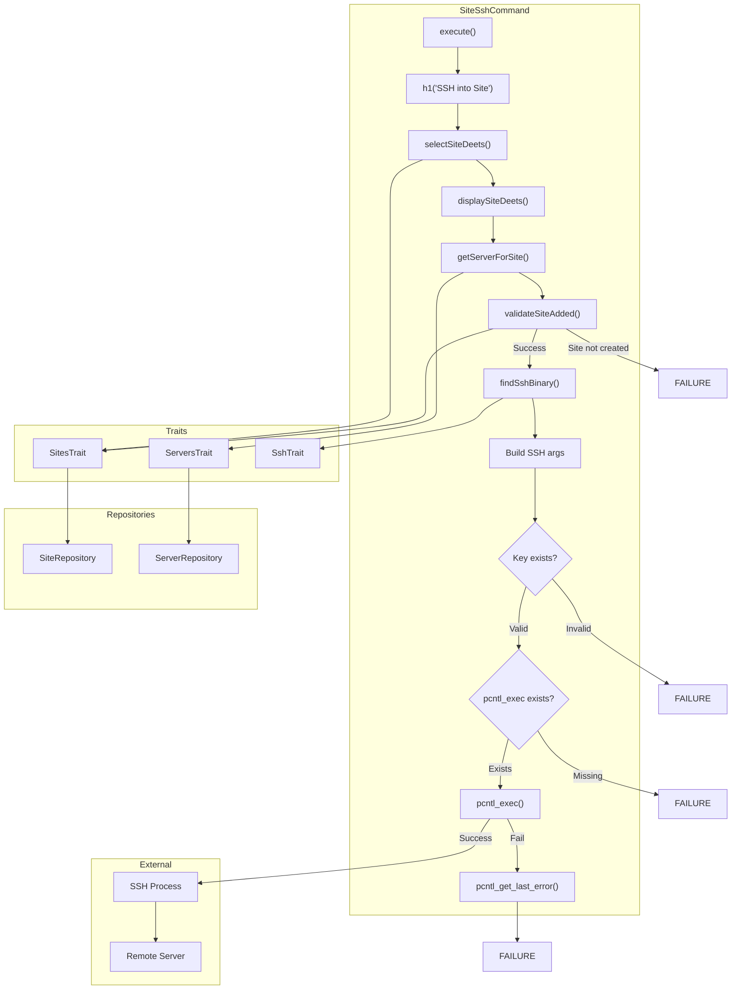
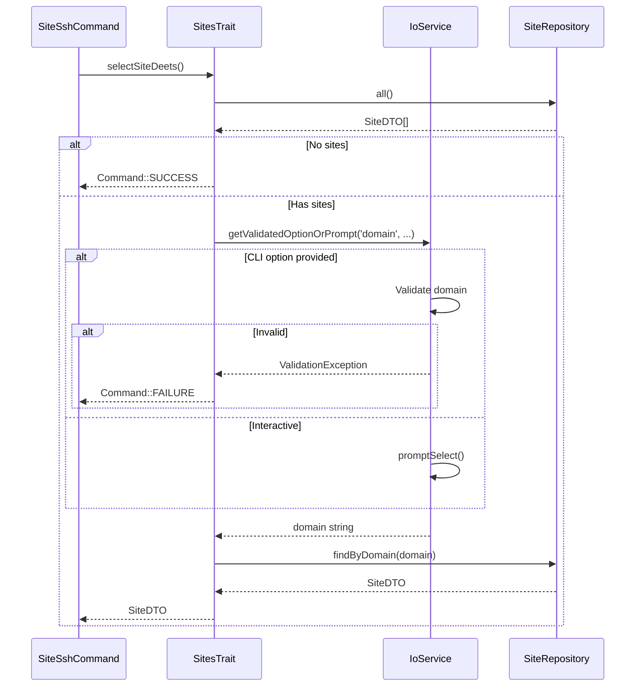
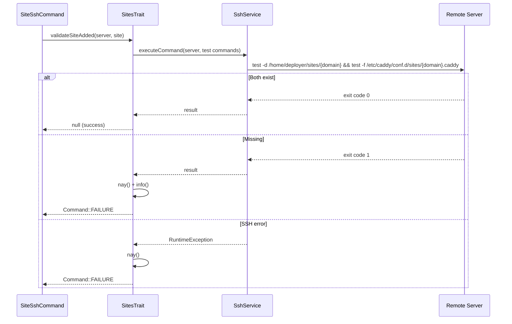

# Schematic: SiteSshCommand.php

> Auto-generated schematic. Last updated: 2025-12-19

## Overview

`SiteSshCommand` provides an interactive SSH connection directly into a site's root directory on the remote server. It replaces the PHP process with an SSH session using `pcntl_exec`, allowing the user to work directly in the site's deployment directory (`/home/deployer/sites/{domain}`).

## Logic Flow

### Entry Points

| Method | Type | Description |
|--------|------|-------------|
| `execute()` | protected | Main command execution entry point |

### Execution Flow

```
1. Display heading "SSH into Site"
2. Select site via SitesTrait::selectSiteDeets()
   - Returns SiteDTO or Command::FAILURE/SUCCESS
3. Display site details (domain, server, repo, branch)
4. Resolve server for site via ServersTrait::getServerForSite()
   - Returns ServerDTO or Command::FAILURE
5. Validate site exists on server via SitesTrait::validateSiteAdded()
   - Checks site directory at /home/deployer/sites/{domain}
   - Checks Caddy config at /etc/caddy/conf.d/sites/{domain}.caddy
   - Returns null (success) or Command::FAILURE
6. Find SSH binary via SshTrait::findSshBinary()
   - Uses Symfony ExecutableFinder
   - Returns path or null
7. Build SSH command arguments:
   - StrictHostKeyChecking=accept-new
   - Port from server config
   - TTY allocation (-t)
   - Private key if configured (with existence/readability check)
   - User@host connection string
   - Remote command: cd to site root + exec login shell
8. Check pcntl_exec function availability
9. Replace PHP process with SSH via pcntl_exec()
10. If pcntl_exec fails, get detailed error via pcntl_get_last_error()/pcntl_strerror()
```

### Decision Points

| Location | Condition | True Branch | False Branch |
|----------|-----------|-------------|--------------|
| Line 54-56 | `is_int($site)` | Return failure code | Continue |
| Line 66-68 | `is_int($server)` | Return failure code | Continue |
| Line 74-78 | `is_int($validationResult)` | Return failure code | Continue |
| Line 86-90 | `null === $sshBinary` | Display error, return FAILURE | Continue |
| Line 104-113 | `null !== $server->privateKeyPath` | Validate key exists/readable, add -i flag | Skip key validation |
| Line 105-109 | Key not found or not readable | Display error, return FAILURE | Continue with key |
| Line 122-126 | `!function_exists('pcntl_exec')` | Display error about pcntl extension, return FAILURE | Continue to exec |

### Exit Conditions

| Condition | Return Value | Description |
|-----------|--------------|-------------|
| No sites available | `Command::SUCCESS` | Empty inventory, user guided to create site |
| Site selection validation fails | `Command::FAILURE` | Invalid domain via CLI option |
| Server not found | `Command::FAILURE` | Site's server missing from inventory |
| Site not created on server | `Command::FAILURE` | Site directory or Caddy config missing |
| SSH binary not found | `Command::FAILURE` | `ssh` not in PATH |
| SSH key not found/readable | `Command::FAILURE` | Private key path invalid or inaccessible |
| pcntl extension missing | `Command::FAILURE` | `pcntl_exec` function not available |
| `pcntl_exec` succeeds | N/A | Process replaced, no return |
| `pcntl_exec` fails | `Command::FAILURE` | Detailed error via `pcntl_strerror()` |

## Interaction Diagram



### Site Selection Flow



### Site Validation Flow



## Dependencies

### Direct Imports

| Import | Usage |
|--------|-------|
| `Deployer\Contracts\BaseCommand` | Base class providing DI, output methods, and initialization |
| `Deployer\Traits\ServersTrait` | Server resolution via `getServerForSite()` |
| `Deployer\Traits\SitesTrait` | Site selection via `selectSiteDeets()`, validation via `validateSiteAdded()`, path helpers |
| `Deployer\Traits\SshTrait` | SSH binary location via `findSshBinary()` |
| `Symfony\Component\Console\Attribute\AsCommand` | Command registration attribute |
| `Symfony\Component\Console\Command\Command` | Return constants (SUCCESS, FAILURE) |
| `Symfony\Component\Console\Input\InputInterface` | CLI input handling |
| `Symfony\Component\Console\Input\InputOption` | Option definition |
| `Symfony\Component\Console\Output\OutputInterface` | Console output |

### Trait Dependencies

| Trait | Provides | Required Properties |
|-------|----------|---------------------|
| `ServersTrait` | `getServerForSite()`, `displayServerDeets()` | `$servers`, `$sites`, `$io`, `$ssh` |
| `SitesTrait` | `selectSiteDeets()`, `displaySiteDeets()`, `getSiteRootPath()`, `validateSiteAdded()` | `$io`, `$sites`, `$servers`, `$ssh`, `$git`, `$proc` |
| `SshTrait` | `findSshBinary()` | None (uses Symfony ExecutableFinder) |

### Coupled Files

| File | Coupling Type | Description |
|------|---------------|-------------|
| `deployer.yml` | Data | Inventory file containing sites and servers configuration |
| `~/.ssh/*` | Config | SSH private keys referenced by `ServerDTO::privateKeyPath` |
| `/home/deployer/sites/{domain}` | Remote State | Target directory on remote server (validated before SSH) |
| `/etc/caddy/conf.d/sites/{domain}.caddy` | Remote State | Caddy config file (validated before SSH) |

## Data Flow

### Inputs

| Source | Data | Type |
|--------|------|------|
| CLI option `--domain` | Site domain | `string` (optional) |
| Interactive prompt | Site selection | `string` |
| `deployer.yml` | Site configuration | `SiteDTO` |
| `deployer.yml` | Server configuration | `ServerDTO` |

### Outputs

| Destination | Data | Description |
|-------------|------|-------------|
| Console | Site details | Domain, server, repo, branch |
| Console | Error messages | When validation fails |
| SSH Process | Connection | Replaces PHP process entirely |

### Side Effects

| Effect | Description |
|--------|-------------|
| Remote SSH command | `validateSiteAdded()` runs test commands on server |
| Process replacement | `pcntl_exec()` replaces PHP process with SSH |
| SSH known_hosts update | `StrictHostKeyChecking=accept-new` may add host keys |
| Remote shell session | User enters interactive shell on remote server |

## Command Configuration

### Options

| Option | Type | Description |
|--------|------|-------------|
| `--domain` | `VALUE_REQUIRED` | Site domain to SSH into |

### Inherited Options

| Option | Type | Description |
|--------|------|-------------|
| `--env` | `VALUE_OPTIONAL` | Custom .env file path |
| `--inventory` | `VALUE_OPTIONAL` | Custom deployer.yml path |

## SSH Arguments Built

```bash
ssh \
  -o StrictHostKeyChecking=accept-new \
  -p {port} \
  -t \
  [-i {privateKeyPath}] \
  {username}@{host} \
  'cd /home/deployer/sites/{domain} && exec $SHELL -l'
```

## Notes

- Uses `pcntl_exec()` which completely replaces the PHP process - no code after this call executes unless it fails
- The `-t` flag forces TTY allocation for interactive shell
- `StrictHostKeyChecking=accept-new` automatically accepts new host keys but warns on changed keys
- The remote command `exec $SHELL -l` starts a login shell, ensuring proper environment loading
- Site root path is hardcoded to `/home/deployer/sites/{domain}` via `SitesTrait::getSiteRootPath()`
- No `commandReplay()` call since process replacement prevents reaching that code
- SSH key file is validated for existence and readability before use
- pcntl extension availability is checked before attempting exec
- On pcntl_exec failure, detailed error provided via `pcntl_get_last_error()` and `pcntl_strerror()`
- Output uses `$this->out('')` for consistency with other SSH commands
- `validateSiteAdded()` makes an SSH connection to verify remote state before attempting to SSH into the site

## Recent Changes

**2025-12-19:** Added `validateSiteAdded()` call:

- Added validation step after getting server, before SSH binary resolution
- Validates site directory exists at `/home/deployer/sites/{domain}`
- Validates Caddy config exists at `/etc/caddy/conf.d/sites/{domain}.caddy`
- Returns `Command::FAILURE` with helpful message if site not created on server
- Guides user to run `site:create` first if validation fails
- Added "Site Validation Flow" sequence diagram
- Updated execution flow, decision points, and exit conditions
