# Schematic: SupervisorCreateCommand.php

> Auto-generated schematic. Last updated: 2025-12-19

## Overview

Creates a new supervisor program configuration for a site in the local inventory. The command collects program details (script, name, autostart, autorestart, stopwaitsecs, numprocs) from user input or CLI options, validates for duplicates, and stores the configuration. Actual server deployment requires running `supervisor:sync` afterward.

## Logic Flow

### Entry Points

| Method | Description |
|--------|-------------|
| `execute()` | Main command execution entry point |
| `configure()` | Defines CLI options |

### Execution Flow

1. **Display heading** - Show "Create Supervisor Program" header
2. **Select site** - Use `selectSiteDeets()` from SitesTrait to choose target site
3. **Display site details** - Show selected site information
4. **Verify site deployed** - Ensure site has repo/branch configured via `ensureSiteDeployed()`
5. **Get available scripts** - Fetch supervisor scripts from `.deployer/supervisors/` in remote repo via `getAvailableScripts()`
6. **Gather supervisor details** - Collect program configuration via `gatherSupervisorDeets()`:
   - Script selection from available scripts (validated against duplicates)
   - Program name (unique identifier, validated for format and duplicates)
   - Autostart flag (start on supervisord start)
   - Autorestart flag (restart on exit)
   - Stopwaitsecs (seconds to wait for stop)
   - Numprocs (number of process instances)
7. **Create SupervisorDTO** - Instantiate immutable data object with collected values
8. **Display supervisor details** - Show configuration summary
9. **Add to inventory** - Persist supervisor via `SiteRepository::addSupervisor()`
10. **Show success message** - Confirm addition and hint about `supervisor:sync`
11. **Command replay** - Output equivalent non-interactive command

### Decision Points

| Condition | Branch |
|-----------|--------|
| Site selection fails | Return failure code |
| Site not deployed | Show warning, return failure |
| No scripts available | Show warning with `scaffold:supervisors` hint, return failure |
| Script already configured | Show error, return failure |
| Program name already exists | Show error, return failure |
| Validation exception | Show error message, return failure |
| Repository add fails | Show error, return failure |

### Exit Conditions

| Condition | Return |
|-----------|--------|
| No sites in inventory | `Command::SUCCESS` |
| Site selection fails | `Command::FAILURE` |
| Site not deployed | `Command::FAILURE` |
| No supervisor scripts | `Command::FAILURE` |
| Validation fails | `Command::FAILURE` |
| Duplicate script/program | `Command::FAILURE` |
| Repository error | `Command::FAILURE` |
| Success | `Command::SUCCESS` |

## Interaction Diagram

```mermaid
flowchart TD
    subgraph Command["SupervisorCreateCommand"]
        Execute[execute]
        Gather[gatherSupervisorDeets]
        ValidateScript[validateSupervisorScript]
        ValidateProgram[validateSupervisorProgram]
    end

    subgraph SitesTrait["SitesTrait"]
        SelectSite[selectSiteDeets]
        DisplaySite[displaySiteDeets]
        EnsureDeployed[ensureSiteDeployed]
        GetScripts[getAvailableScripts]
    end

    subgraph SupervisorsTrait["SupervisorsTrait"]
        DisplaySuper[displaySupervisorDeets]
        ValidateScriptInput[validateSupervisorScriptInput]
        ValidateProgramInput[validateProgramInput]
        ValidateStopWait[validateStopWaitSecsInput]
        ValidateNumprocs[validateNumprocsInput]
    end

    subgraph IoService["IoService"]
        GetValidated[getValidatedOptionOrPrompt]
        GetBoolean[getBooleanOptionOrPrompt]
        PromptSelect[promptSelect]
        PromptText[promptText]
        PromptConfirm[promptConfirm]
    end

    subgraph SiteRepository["SiteRepository"]
        FindByDomain[findByDomain]
        AddSupervisor[addSupervisor]
    end

    subgraph GitService["GitService"]
        ListRemote[listRemoteDirectoryFiles]
    end

    subgraph DTOs["DTOs"]
        SupervisorDTO[SupervisorDTO]
    end

    Execute --> SelectSite
    Execute --> DisplaySite
    Execute --> EnsureDeployed
    Execute --> GetScripts
    GetScripts --> ListRemote
    Execute --> Gather
    Gather --> GetValidated
    Gather --> GetBoolean
    GetValidated --> PromptSelect
    GetValidated --> PromptText
    GetBoolean --> PromptConfirm
    Gather --> ValidateScriptInput
    Gather --> ValidateProgramInput
    Gather --> ValidateStopWait
    Gather --> ValidateNumprocs
    Execute --> ValidateScript
    Execute --> ValidateProgram
    ValidateScript --> FindByDomain
    ValidateProgram --> FindByDomain
    Execute --> SupervisorDTO
    Execute --> DisplaySuper
    Execute --> AddSupervisor
```

## Dependencies

### Direct Imports

| File/Class | Usage |
|------------|-------|
| `Deployer\Contracts\BaseCommand` | Base class providing DI, output methods |
| `Deployer\DTOs\SupervisorDTO` | Immutable supervisor configuration object |
| `Deployer\Exceptions\ValidationException` | Thrown on CLI validation failure |
| `Deployer\Traits\PlaybooksTrait` | Provides playbook execution (unused directly) |
| `Deployer\Traits\ServersTrait` | Server selection and info (via SitesTrait) |
| `Deployer\Traits\SitesTrait` | Site selection, display, remote file listing |
| `Deployer\Traits\SupervisorsTrait` | Supervisor display and input validation |
| `Symfony\Component\Console\Attribute\AsCommand` | Command registration attribute |
| `Symfony\Component\Console\Command\Command` | Return code constants |
| `Symfony\Component\Console\Input\InputInterface` | CLI input handling |
| `Symfony\Component\Console\Input\InputOption` | Option definition |
| `Symfony\Component\Console\Output\OutputInterface` | CLI output handling |

### Coupled Files

| File | Coupling Type | Description |
|------|---------------|-------------|
| `app/Repositories/SiteRepository.php` | Data | Reads/writes supervisor configs to site inventory |
| `app/DTOs/SiteDTO.php` | Data | Site contains supervisors array |
| `app/Services/GitService.php` | API | Lists remote repo files for script discovery |
| `app/Services/IoService.php` | State | Manages validated input collection |
| `.deployer/supervisors/*.sh` | Config | User scripts in remote repo |
| `~/.deployer/sites.json` | Data | Inventory file where supervisors are stored |

## Data Flow

### Inputs

| Source | Data | Type |
|--------|------|------|
| CLI `--domain` | Site domain to add supervisor to | string |
| CLI `--program` | Unique program identifier | string |
| CLI `--script` | Script filename from `.deployer/supervisors/` | string |
| CLI `--autostart` | Start on supervisord start | bool (negatable) |
| CLI `--autorestart` | Restart on exit | bool (negatable) |
| CLI `--stopwaitsecs` | Seconds to wait for stop | int |
| CLI `--numprocs` | Number of process instances | int |
| Interactive prompts | Same data when CLI options omitted | mixed |

### Outputs

| Destination | Data | Type |
|-------------|------|------|
| Console | Success/error messages | string |
| Console | Supervisor details display | formatted text |
| Console | Command replay | string |
| `SiteRepository` | SupervisorDTO added to site | object |

### Side Effects

| Effect | Description |
|--------|-------------|
| Inventory modification | Adds supervisor to site's supervisors array in `sites.json` |

## Notes

- This command only modifies local inventory; server deployment requires `supervisor:sync`
- Script must exist in site's remote repository under `.deployer/supervisors/`
- Program names are scoped per-site (same program name allowed across different sites)
- Scripts cannot be reused within the same site (one script per supervisor)
- Validation uses two patterns: input validators (`?string`) for prompts and business validators (`?string`) for duplicate checks
- The `gatherSupervisorDeets()` helper method consolidates all input collection with a single try-catch for ValidationException
