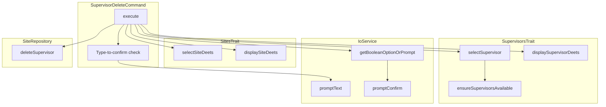

# Schematic: SupervisorDeleteCommand.php

> Auto-generated schematic. Last updated: 2025-12-19

## Overview

Deletes a supervisor program configuration from a site in the local inventory. The command requires explicit confirmation (type program name to confirm) before deletion. Actual server removal requires running `supervisor:sync` afterward.

## Logic Flow

### Entry Points

| Method | Description |
|--------|-------------|
| `execute()` | Main command execution entry point |
| `configure()` | Defines CLI options |

### Execution Flow

1. **Display heading** - Show "Delete Supervisor Program" header
2. **Select site** - Use `selectSiteDeets()` from SitesTrait to choose target site
3. **Display site details** - Show selected site information
4. **Select supervisor** - Use `selectSupervisor()` from SupervisorsTrait to choose program
5. **Display supervisor details** - Show selected supervisor configuration
6. **Type-to-confirm** - Require user to type program name (unless `--force`)
7. **Final confirmation** - Yes/No prompt (unless `--yes`)
8. **Delete from inventory** - Remove supervisor via `SiteRepository::deleteSupervisor()`
9. **Show success message** - Confirm removal and hint about `supervisor:sync`
10. **Command replay** - Output equivalent non-interactive command

### Decision Points

| Condition | Branch |
|-----------|--------|
| Site selection fails | Return failure code |
| No supervisors configured | Show warning with `supervisor:create` hint, return success |
| Supervisor selection fails | Return failure code |
| `--force` not provided | Require type-to-confirm |
| Typed name doesn't match | Show error, return failure |
| `--yes` not provided | Show confirmation prompt |
| Confirmation declined | Show warning, return success (cancelled) |
| Repository delete fails | Show error, return failure |

### Exit Conditions

| Condition | Return |
|-----------|--------|
| No sites in inventory | `Command::SUCCESS` |
| Site selection fails | `Command::FAILURE` |
| No supervisors for site | `Command::SUCCESS` |
| Supervisor selection fails | `Command::FAILURE` |
| Type-to-confirm mismatch | `Command::FAILURE` |
| User cancels | `Command::SUCCESS` |
| Repository error | `Command::FAILURE` |
| Success | `Command::SUCCESS` |

## Interaction Diagram

## Dependencies

### Direct Imports

| File/Class | Usage |
|------------|-------|
| `Deployer\Contracts\BaseCommand` | Base class providing DI, output methods |
| `Deployer\Traits\PlaybooksTrait` | Provides playbook execution (unused directly) |
| `Deployer\Traits\ServersTrait` | Server selection and info (via SitesTrait) |
| `Deployer\Traits\SitesTrait` | Site selection and display |
| `Deployer\Traits\SupervisorsTrait` | Supervisor selection and display |
| `Symfony\Component\Console\Attribute\AsCommand` | Command registration attribute |
| `Symfony\Component\Console\Command\Command` | Return code constants |
| `Symfony\Component\Console\Input\InputInterface` | CLI input handling |
| `Symfony\Component\Console\Input\InputOption` | Option definition |
| `Symfony\Component\Console\Output\OutputInterface` | CLI output handling |

### Coupled Files

| File | Coupling Type | Description |
|------|---------------|-------------|
| `app/Repositories/SiteRepository.php` | Data | Deletes supervisor from site inventory |
| `app/DTOs/SiteDTO.php` | Data | Site contains supervisors array |
| `app/DTOs/SupervisorDTO.php` | Data | Supervisor configuration being deleted |
| `app/Services/IoService.php` | State | Manages input collection |
| `~/.deployer/sites.json` | Data | Inventory file where supervisors are stored |

## Data Flow

### Inputs

| Source | Data | Type |
|--------|------|------|
| CLI `--domain` | Site domain containing supervisor | string |
| CLI `--program` | Program name to delete | string |
| CLI `--force` / `-f` | Skip type-to-confirm | bool |
| CLI `--yes` / `-y` | Skip final confirmation | bool |
| Interactive prompts | Same data when CLI options omitted | mixed |

### Outputs

| Destination | Data | Type |
|-------------|------|------|
| Console | Success/error/warning messages | string |
| Console | Site and supervisor details | formatted text |
| Console | Command replay | string |
| `SiteRepository` | Supervisor removed from site | void |

### Side Effects

| Effect | Description |
|--------|-------------|
| Inventory modification | Removes supervisor from site's supervisors array in `sites.json` |

## Notes

- This command only modifies local inventory; server removal requires `supervisor:sync`
- Two-step confirmation pattern: type-to-confirm (`--force` skips) followed by yes/no (`--yes` skips)
- When user cancels, returns SUCCESS (not FAILURE) - cancellation is a valid outcome
- The `--force` flag skips the type-to-confirm step but NOT the yes/no confirmation
- Both `--force` and `--yes` are needed for fully non-interactive deletion
- Uses SupervisorsTrait's `selectSupervisor()` which handles empty supervisors gracefully
