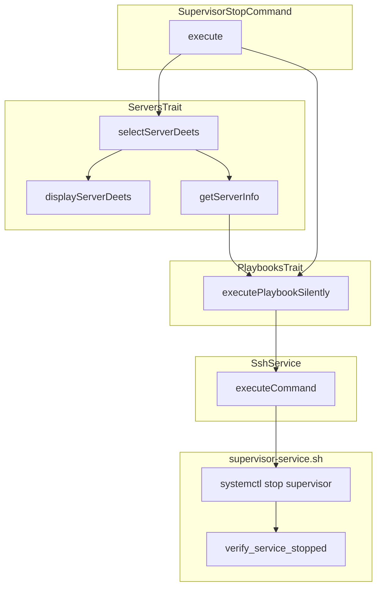

# Schematic: SupervisorStopCommand.php

> Auto-generated schematic. Last updated: 2025-12-19

## Overview

Stops the supervisord service on a selected server. Executes the `supervisor-service.sh` playbook with `DEPLOYER_ACTION=stop` to perform a `systemctl stop supervisor` on the remote server and verifies the service becomes inactive.

## Logic Flow

### Entry Points

| Method | Description |
|--------|-------------|
| `execute()` | Main command execution entry point |
| `configure()` | Defines CLI options |

### Execution Flow

1. **Display heading** - Show "Stop Supervisord Service" header
2. **Select server** - Use `selectServerDeets()` from ServersTrait to choose target server
3. **Validate server info** - Ensure server has info (SSH connection verified)
4. **Execute playbook** - Run `supervisor-service.sh` with `DEPLOYER_ACTION=stop` via `executePlaybookSilently()`
5. **Verify result** - Check playbook execution succeeded
6. **Show success message** - Confirm service stopped
7. **Command replay** - Output equivalent non-interactive command

### Decision Points

| Condition | Branch |
|-----------|--------|
| No servers in inventory | Show info, return failure |
| Server selection fails | Return failure code |
| Server info is null | Return failure (SSH/detection failed) |
| Playbook execution fails | Show error, return failure |

### Exit Conditions

| Condition | Return |
|-----------|--------|
| No servers available | `Command::FAILURE` |
| Server selection fails | `Command::FAILURE` |
| Server info missing | `Command::FAILURE` |
| Playbook fails | `Command::FAILURE` |
| Success | `Command::SUCCESS` |

## Interaction Diagram

## Dependencies

### Direct Imports

| File/Class | Usage |
|------------|-------|
| `Deployer\Contracts\BaseCommand` | Base class providing DI, output methods |
| `Deployer\Traits\PlaybooksTrait` | Provides `executePlaybookSilently()` |
| `Deployer\Traits\ServersTrait` | Server selection, display, info retrieval |
| `Deployer\Traits\SitesTrait` | Required by ServersTrait |
| `Symfony\Component\Console\Attribute\AsCommand` | Command registration attribute |
| `Symfony\Component\Console\Command\Command` | Return code constants |
| `Symfony\Component\Console\Input\InputInterface` | CLI input handling |
| `Symfony\Component\Console\Input\InputOption` | Option definition |
| `Symfony\Component\Console\Output\OutputInterface` | CLI output handling |

### Coupled Files

| File | Coupling Type | Description |
|------|---------------|-------------|
| `playbooks/supervisor-service.sh` | Config | Remote execution script for service control |
| `playbooks/helpers.sh` | Config | Shared bash helpers inlined into playbook |
| `app/Repositories/ServerRepository.php` | Data | Server inventory access |
| `app/DTOs/ServerDTO.php` | Data | Server connection details |
| `app/Services/SshService.php` | API | Remote command execution |

## Data Flow

### Inputs

| Source | Data | Type |
|--------|------|------|
| CLI `--server` | Server name to target | string |
| Interactive prompt | Server selection when CLI omitted | string |

### Outputs

| Destination | Data | Type |
|-------------|------|------|
| Console | Success/error messages | string |
| Console | Server details display | formatted text |
| Console | Command replay | string |
| Remote server | Supervisor service stop command | SSH |

### Side Effects

| Effect | Description |
|--------|-------------|
| Service stop | Stops supervisord service on remote server |
| Process termination | All supervised programs are stopped |

## Notes

- Uses `executePlaybookSilently()` - shows spinner during execution, no streaming output
- The playbook verifies service becomes inactive within 10 seconds after stop
- Stopping supervisord terminates all supervised programs managed by it
- Same command structure as `supervisor:start` and `supervisor:restart` (service lifecycle commands)
- Server must have supervisor installed (part of base server provisioning)
- If service is already stopped, systemctl stop is idempotent (no error)
- Programs configured with autorestart will NOT restart until supervisord is started again
