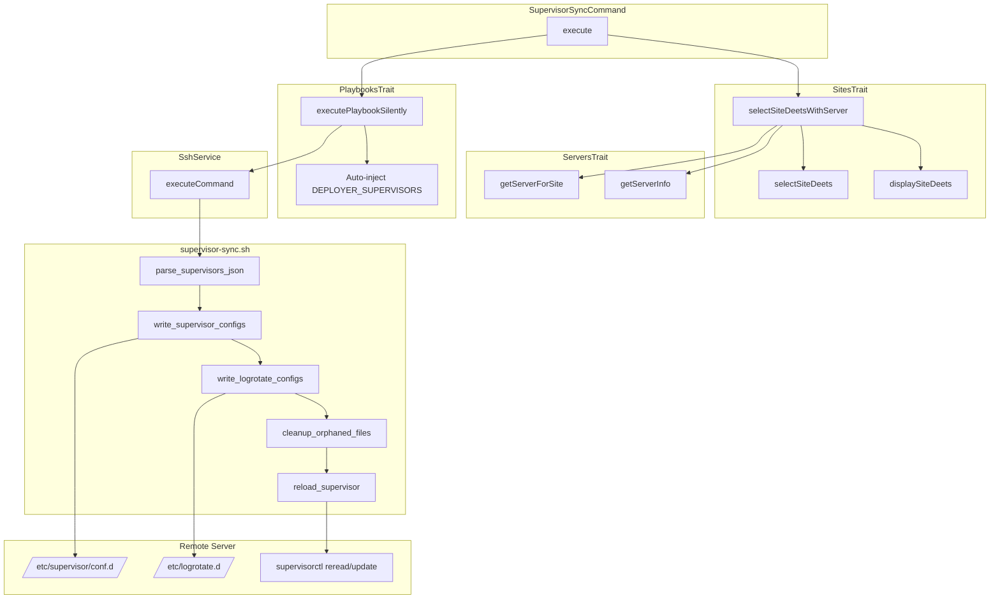

# Schematic: SupervisorSyncCommand.php

> Auto-generated schematic. Last updated: 2025-12-19

## Overview

Synchronizes supervisor program configurations from local inventory to a remote server. Executes the `supervisor-sync.sh` playbook which writes supervisor config files, creates logrotate configs, removes orphaned configs, and reloads supervisord to apply changes.

## Logic Flow

### Entry Points

| Method | Description |
|--------|-------------|
| `execute()` | Main command execution entry point |
| `configure()` | Defines CLI options |

### Execution Flow

1. **Display heading** - Show "Sync Supervisor Programs" header
2. **Select site with server** - Use `selectSiteDeetsWithServer()` to choose site and resolve its server
3. **Execute playbook** - Run `supervisor-sync.sh` with site context via `executePlaybookSilently()`
4. **Verify result** - Check playbook execution succeeded
5. **Show success message** - Confirm configuration synced
6. **Command replay** - Output equivalent non-interactive command

### Decision Points

| Condition | Branch |
|-----------|--------|
| No sites in inventory | Show info with `site:create` hint, return success |
| Site selection fails | Return failure code |
| Server not found for site | Show error, return failure |
| Server info is null | Return failure (SSH/detection failed) |
| Playbook execution fails | Show error, return failure |

### Exit Conditions

| Condition | Return |
|-----------|--------|
| No sites available | `Command::SUCCESS` |
| Site selection fails | `Command::FAILURE` |
| Server resolution fails | `Command::FAILURE` |
| Server info missing | `Command::FAILURE` |
| Playbook fails | `Command::FAILURE` |
| Success | `Command::SUCCESS` |

## Interaction Diagram

## Dependencies

### Direct Imports

| File/Class | Usage |
|------------|-------|
| `Deployer\Contracts\BaseCommand` | Base class providing DI, output methods |
| `Deployer\Traits\PlaybooksTrait` | Provides `executePlaybookSilently()` |
| `Deployer\Traits\ServersTrait` | Server info retrieval |
| `Deployer\Traits\SitesTrait` | Combined site+server selection |
| `Deployer\Traits\SupervisorsTrait` | Supervisor-related helpers |
| `Symfony\Component\Console\Attribute\AsCommand` | Command registration attribute |
| `Symfony\Component\Console\Command\Command` | Return code constants |
| `Symfony\Component\Console\Input\InputInterface` | CLI input handling |
| `Symfony\Component\Console\Input\InputOption` | Option definition |
| `Symfony\Component\Console\Output\OutputInterface` | CLI output handling |

### Coupled Files

| File | Coupling Type | Description |
|------|---------------|-------------|
| `playbooks/supervisor-sync.sh` | Config | Remote execution script for sync operation |
| `playbooks/helpers.sh` | Config | Shared bash helpers inlined into playbook |
| `app/Repositories/SiteRepository.php` | Data | Site inventory with supervisors array |
| `app/Repositories/ServerRepository.php` | Data | Server inventory access |
| `app/DTOs/SiteDTO.php` | Data | Site containing supervisors configuration |
| `app/DTOs/SiteServerDTO.php` | Data | Combined site+server context |
| `app/DTOs/SupervisorDTO.php` | Data | Supervisor configuration |
| `app/Services/SshService.php` | API | Remote command execution |
| `/etc/supervisor/conf.d/` | Config | Remote supervisor config directory |
| `/etc/logrotate.d/` | Config | Remote logrotate config directory |
| `/var/log/supervisor/` | Log | Remote log directory for programs |
| `~/.deployer/sites.json` | Data | Local inventory file |

## Data Flow

### Inputs

| Source | Data | Type |
|--------|------|------|
| CLI `--domain` | Site domain to sync | string |
| Interactive prompt | Site selection when CLI omitted | string |
| Local inventory | Site's supervisors array | SupervisorDTO[] |

### Outputs

| Destination | Data | Type |
|-------------|------|------|
| Console | Success/error messages | string |
| Console | Site details display | formatted text |
| Console | Command replay | string |
| Remote `/etc/supervisor/conf.d/` | Supervisor program configs | `.conf` files |
| Remote `/etc/logrotate.d/` | Logrotate configs | `.conf` files |

### Side Effects

| Effect | Description |
|--------|-------------|
| Config file creation | Creates/updates supervisor configs in `/etc/supervisor/conf.d/{domain}-{program}.conf` |
| Config file deletion | Removes orphaned supervisor configs for deleted programs |
| Logrotate creation | Creates logrotate configs in `/etc/logrotate.d/supervisor-{domain}-{program}.conf` |
| Logrotate deletion | Removes orphaned logrotate configs |
| Supervisor reload | Executes `supervisorctl reread` and `supervisorctl update` |
| Process changes | New programs start, removed programs stop, updated programs restart |

## Notes

- PlaybooksTrait auto-injects `DEPLOYER_SUPERVISORS` as JSON array when context is SiteServerDTO
- Each supervisor config uses `runner.sh` to execute scripts in correct environment
- Program names are prefixed with domain: `{domain}-{program}` (e.g., `example.com-horizon`)
- Log files are written to `/var/log/supervisor/{domain}-{program}.log`
- Orphan cleanup removes configs for programs no longer in inventory
- Sync is bidirectional: adds new, updates existing, removes deleted
- This is the deployment step - `supervisor:create` and `supervisor:delete` only modify local inventory
- The playbook is idempotent - safe to run multiple times
- Uses `selectSiteDeetsWithServer()` which combines site selection, server resolution, and info gathering
